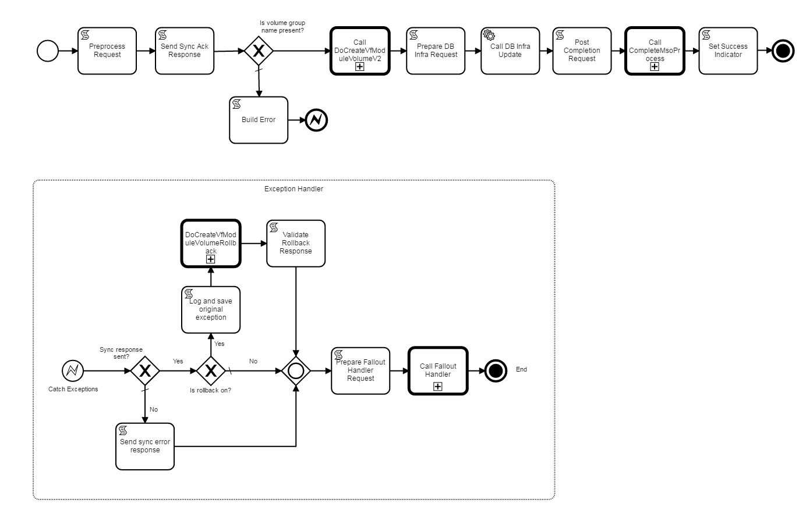

.. This work is licensed under a Creative Commons Attribution 4.0 International License.
.. http://creativecommons.org/licenses/by/4.0
.. Copyright 2017 Huawei Technologies Co., Ltd.

BPMN Main Process Flows
========================

Characteristics
----------------

**Invoked by an API Handler**

  The BPMN application (war) exposes a REST endpoint to which the API Handler(s) send requests for flow execution.  The message sent by the API Handler to this endpoint is a JSON wrapper containing:
  
    * The original request received by the API handler from the portal or other client.
    * Metadata such as the request-id generated by the API Handler for the request.
    * The name of the BPMN process to execute (obtained by the API Handler from the mso_catalog.service_recipe table.
  
**Asynchronous Service Model**
  
  All main process flows implement an asynchronous service model.  The connection to the API Handler is kept open until the main process flow sends back a response.  In the flow shown below, this is done by the "Send Sync Ack Response" script task.  A flow is expected to send a response after validating the request, but before performing any long running tasks or tasks that could cause the process to be suspended.
  
  After the synchronous response is sent, the flow continues to execute.  When the flow ends, it may optionally send an asynchronous notification to a callback URL provided in the original request (behavior depends on the API agreement)
  
**Typically calls one or more subprocess flows**

  Main process flows usually implement the high-level service logic, delegating the "real" work to reusable subflows (Building Blocks) or custom subflows
  
**Handles "Completion" and "Fallout" tasks**

  "Completion" tasks are those that occur when the process ends successfully, and "Fallout" tasks are those that occur when the process fails.  Activities include:
  
    * Updating the mso_requests database.
    * Rolling back uncompleted work.
    * Sending an asynchronous callback notification.

Example: CreateVfModuleVolumeInfraV1.bpmn
------------------------------------------

