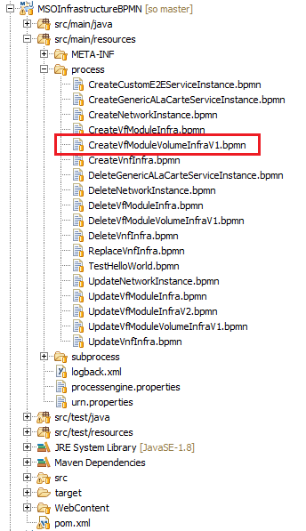
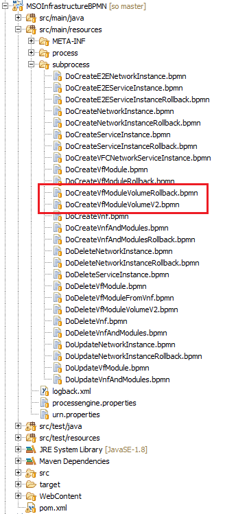
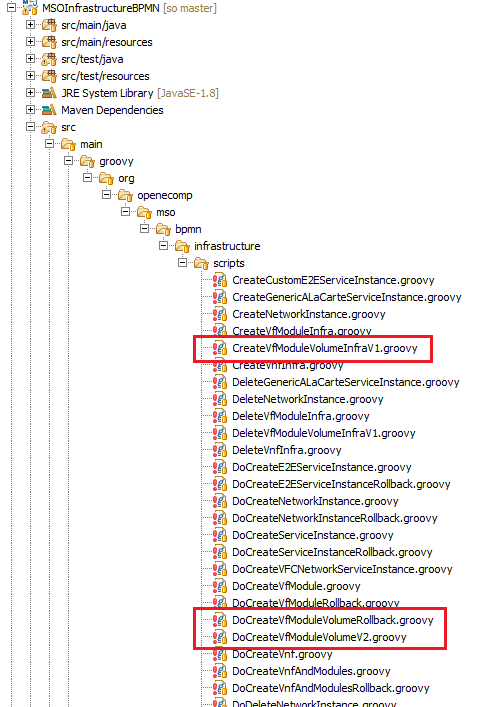
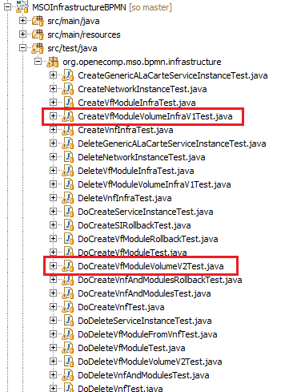
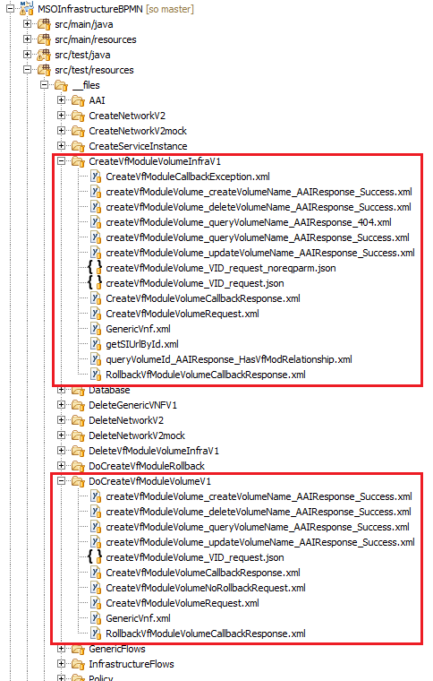

.. This work is licensed under a Creative Commons Attribution 4.0 International License.
.. http://creativecommons.org/licenses/by/4.0
.. Copyright 2017 Huawei Technologies Co., Ltd.

BPMN Project Structure
=======================

BPMN main process flow
----------------------

A BPMN main process flow is a top-level flow.  All main process flows are under the src/main/resources/process folder.

CreateVfModuleVolumeInfraV1 is a main process flow.

Open BPMN files with the camunda modeler (standalone application).  To launch the modeler from eclipse, right-click→open-with→Other→Browse.  Select Check the boxes on the dialog so that eclipse will open all .bpmn files with the camunda-modeler executable.

BPMN subprocess flow
---------------------

A BPMN subprocess flow is meant to be invoked by other flows (either main process flows or other subprocess flows).  All subprocess flows are under the src/main/resources/subprocess folder.

The CreateVfModuleVolumeInfraV1 process flow is delivered with two custom subflows: DoCreateVfModuleVolumeV2 and DoCreateVfModuleVolumeRollback.

Groovy scripts
---------------

There is one groovy script for each BPMN file.  Groovy scripts are invoked by script tasks within the BPMN flows.

Unit Tests
-----------

Normally, we create a unit test class for every flow.  This one is missing a unit test for its rollback flow.

Unit Test Resource Files
------------------------

Any files needed by the unit tests are kept under the src/test/resources/__files folder.

