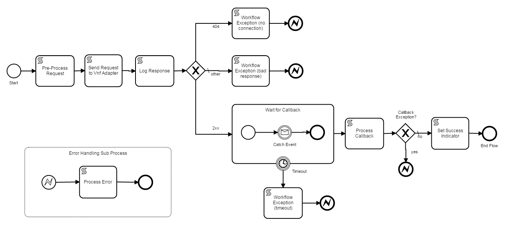

.. This work is licensed under a Creative Commons Attribution 4.0 International License.
.. http://creativecommons.org/licenses/by/4.0
.. Copyright 2017 Huawei Technologies Co., Ltd.

BPMN Subprocess Process Flows
==============================

Characteristics
----------------

**Invoked by other flows**

    A BPMN Call_Activity_ provides the mechanism to invoke subprocess flows.  The Called Element attribute of the Call Activity specifies the name of the subprocess to execute.

.. _Call_Activity: https://docs.camunda.org/manual/7.7/reference/bpmn20/subprocesses/call-activity/

**Input and Output variable mapping**

    In the modeler, you can specify a list of "In Mappings".  With this, you can map execution variables from the calling flow to the subprocess.  The subprocess always has its own copy of each variable.  To transfer values back to the calling flow, you specify "Out Mappings".

**May throw MSOWorkflowException**

    The current best practice for reporting errors from subprocess is described here:
	
	* The subprocess should create a WorkflowException object and store it in an execution called WorkflowException.
    * The WorkflowException object contains an error code and an error message.
    * The subprocess should then throw an MSOWorkflowException BPMN event which may be handled by the calling flow.
	
Example: VnfAdapterRestV1.bpmn
-------------------------------

