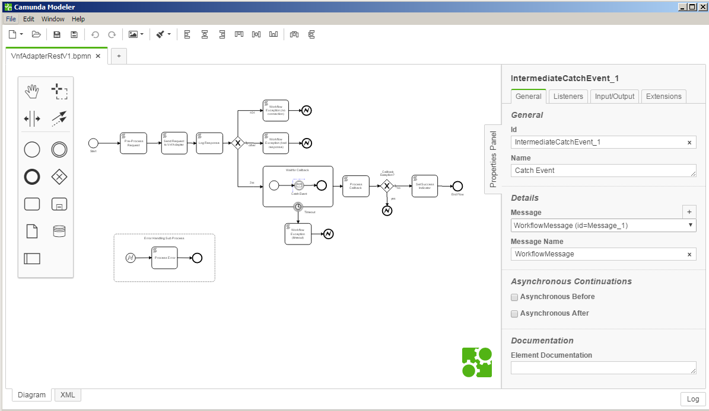

.. This work is licensed under a Creative Commons Attribution 4.0 International License.
.. http://creativecommons.org/licenses/by/4.0
.. Copyright 2017 Huawei Technologies Co., Ltd.

Camunda Modeler
=================

The Camunda_Modeler_ is the editor for BPMN 2.0 process flows.  It is a standalone application.  NOTE: the Camunda eclipse plugin is no longer supported and should not be used.

.. _Camunda_Modeler: https://docs.camunda.org/manual/latest/modeler/camunda-modeler/

Modeler Templates
------------------

Some work has already been done in MSO to develop templates_ for "building block" subprocess flows.  When a template is provided for a BPMN element, the modeler displays a custom form for inputting parameters.  This significantly simplifies flow construction and reduces the chance of making mistakes.

.. _templates: https://docs.camunda.org/manual/7.7/modeler/camunda-modeler/element-templates/