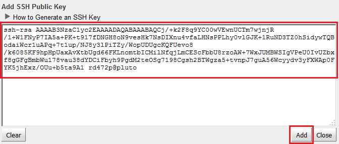
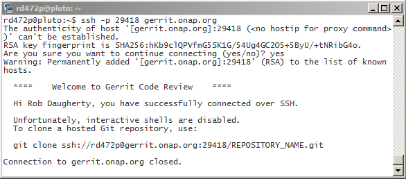

.. This work is licensed under a Creative Commons Attribution 4.0 International License.
.. http://creativecommons.org/licenses/by/4.0
.. Copyright 2017 Huawei Technologies Co., Ltd.

Configure git and gerrit
========================

Basics
------
The recommended version of git is 2.7.4 or later.  Check the installed version in the Ubuntu VM:

.. code-block:: bash

	git --version

Create an SSH key to user with gerrit.  Use no passphrase.

.. code-block:: bash

	ssh-keygen -t rsa
	
Enter your SSH public key (id_rsa) into gerrit:
	Browse to https://gerrit.onap.org
	Log in
	Open the menu next to your name (under the green search button)
	

	Select "Settings"
	In the "Settings" sidebar, click "SSH Public Keys"`
	Click "Add Key..."
	Paste the entire contents of $HOME/.ssh/id_rsa.pub into the text area and click "Add".
	

Install the git-review package.

.. code-block:: bash

	sudo apt update
	sudo apt install git-review
	
Create $HOME/.gitconfig (replace highlighted values with your own information):
	[user]
	
        name = FirstName LastName
		
        email = you@yourcompany.com
		
	[core]
	
        autocrlf = false
		
	[merge]
	
        tool = vimdiff
		
	[gitreview]
	
        username = YourLinuxFoundationId
		
**If you're behind a corporate firewall and your proxy server has SOCKS support...**

You may be able to use the SSH protocol with git, which is preferred versus HTTP.  This method is known to work in the AT&T corporate network.
Install the socat package, which allows you to tunnel SSH connections through a proxy that supports SOCKS:

.. code-block:: bash

	sudo apt update
	sudo apt install socat
	
Create (or append to) $HOME/.ssh/config (replace highlighted values with your information)

	Host gerrit.onap.org
	
	User userid
	
	Hostname gerrit.onap.org
	
	ProxyCommand socat - PROXY:host:%h:%p,proxyport=port
	
	IdentityFile /home/userid/.ssh/id_rsa
	
	ServerAliveInterval 10

Verify that you have connectivity to gerrit through the proxy.  Answer "yes" to continue connecting, if prompted.

.. code-block:: bash

	ssh -p 29418 gerrit.onap.org
	
