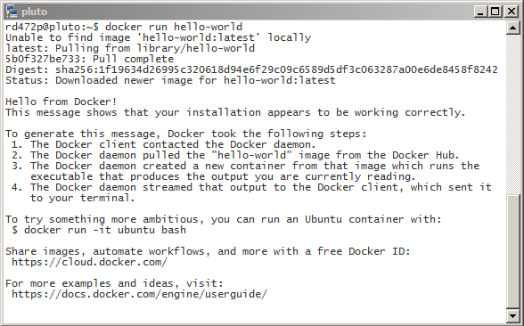

.. This work is licensed under a Creative Commons Attribution 4.0 International License.
.. http://creativecommons.org/licenses/by/4.0
.. Copyright 2017 Huawei Technologies Co., Ltd.

Install Docker
===============

Make sure curl is installed on the Ubuntu VM:

.. code-block:: bash

	sudo apt update
	sudo apt install curl

If you are behind a corporate firewall (replace "proxyhost:port" with your actual proxy information)
	https_proxy="https://*proxyhost:port*" curl -fsSL https://apt.dockerproject.org/gpg | sudo apt-key add -
	
Otherwise:
	curl -fsSL https://apt.dockerproject.org/gpg | sudo apt-key add -
Expected Response:
	OK
Add the docker package repository:
	sudo apt-add-repository "deb https://apt.dockerproject.org/repo ubuntu-xenial main"
	
Install packages:

.. code-block:: bash

    sudo apt update
    sudo apt-cache policy docker-engine
	sudo apt install docker-engine
	sudo apt install docker-compose
	
If you are behind a corporate firewall, you will need to configure proxy settings for docker so that images may be obtained from internet repositories.  In the commands shown here, replace *"proxyhost:port"*, *"yourdomain1.com"*, and *"yourdomain2.com"* with appropriate values.
	
    Make the docker configuration directory:

.. code-block:: bash
	
        sudo mkdir -p /etc/systemd/system/docker.service.d
	
    Edit (create) this file:

.. code-block:: bash
	
		sudo vi /etc/systemd/system/docker.service.d/http-proxy.conf
	
    Add these lines:

        [Service]
        
		Environment="HTTP_PROXY=https://*proxyhost:port*"
        
		Environment="HTTPS_PROXY=https://*proxyhost:port*"
        
		Environment="NO_PROXY=localhost,127.0.0.1,.yourdomain1.com,.yourdomain2.com"
	
    Restart docker:

.. code-block:: bash
	
        sudo systemctl daemon-reload
        sudo systemctl restart docker

Add yourself to the docker user group (replace "userid" with your user ID):

.. code-block:: bash

    sudo usermod -a -G docker *userid*

Log out and log back in so that the user group change will takeeffect.

Verify that you can connect to docker as yourself (i.e. not as root):

.. code-block:: bash

    docker ps

Verify that you can download and run the hello-world container

.. code-block:: bash

    docker run hello-world
	
