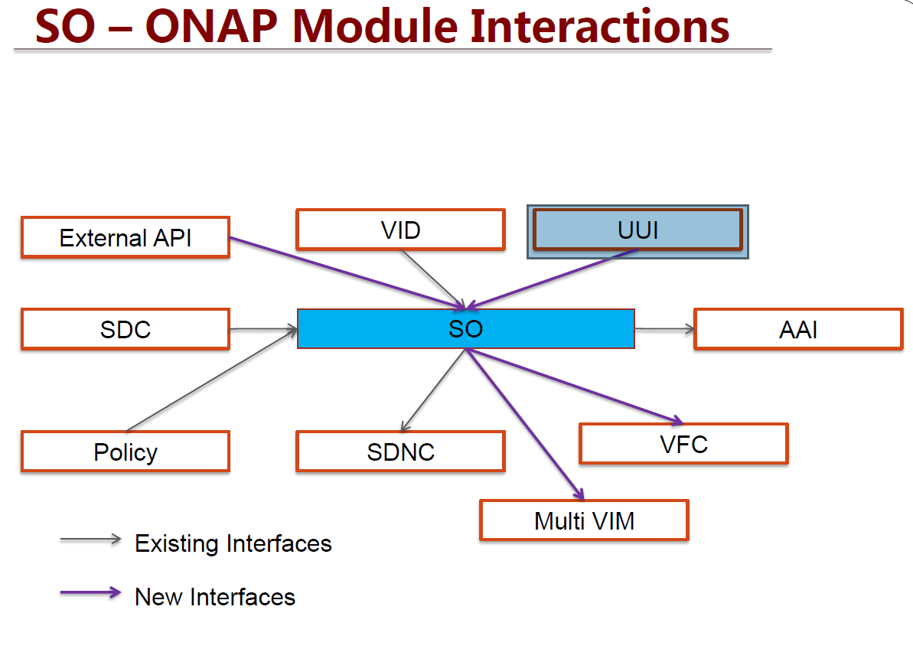

.. This work is licensed under a Creative Commons Attribution 4.0 International License.
.. http://creativecommons.org/licenses/by/4.0
.. Copyright 2017 Huawei Technologies Co., Ltd.

SO R1 Interfaces
================

Service Orchestrator in R1 uses interfaces from both the MSO seed code and as well as new interfaces between the new components of ONAP. 
The below documentation of the SO APIs and are reviewed in the architecture committee meeting on 22/08/2017.

See :download:`SO_API_v0.1.pdf`

The interface between UUi and SO for the E2E VoLTE service:

See :download:`UUI-SO_API_Specification_v0.1.docx`