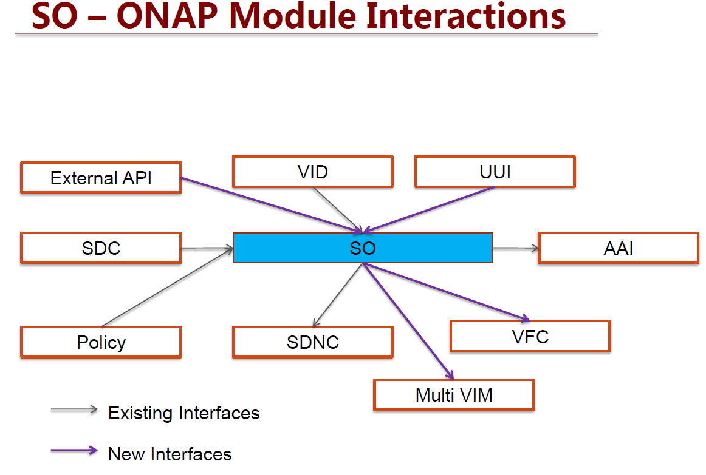

.. This work is licensed under a Creative Commons Attribution 4.0 International License.
.. http://creativecommons.org/licenses/by/4.0
.. Copyright 2017 Huawei Technologies Co., Ltd.

SO Amsterdam Interfaces
================

Service Orchestrator in Amsterdam release uses interfaces from both the MSO seed code and as well as new interfaces between the new components of ONAP. 
The below documentation of the SO APIs and are reviewed in the architecture committee meeting on 22/08/2017.

See :download:`SO_API_v0.1.2.pdf`

The interface between UUI and SO for the E2E VoLTE service:

See :download:`UUI-SO_API_Specification_v0.1.docx`

The interface between Multi VIM and SO:

See :download:`SO_MultiCloud.xlsx`

SO APIs
============

VID API
----------------
Create service instance
++++++++++++++++++++++++

+--------------------+-------------------------------------+
|Interface Definition|Description                          |
+====================+=====================================+
|URI                 |{serverRoot}/serviceInstances/v2     |
+--------------------+-------------------------------------+
|Operation Type      |POST                                 |
+--------------------+-------------------------------------+
|Content-Type        |application/json                     |
+--------------------+-------------------------------------+

Request Body:

+----------------+---------+-----------+--------------------------+-------------------------------------------+
|Attribute       |Qualifier|Cardinality|Content                   |Description                                |
+================+=========+===========+==========================+===========================================+
|requestDetails  |M        |1          |requestDetails Object     |Content of requestDetails object.          |
+----------------+---------+-----------+--------------------------+-------------------------------------------+

RequestDetails Object 

+-------------------+-------------------------+-------------------------------------------------+
|Attribute          |Content                  |Description                                      |
+===================+=========================+=================================================+
|modelInfo          |modelInfo Object         |Content of modelInfo object.                     |
+-------------------+-------------------------+-------------------------------------------------+
|subscriberInfo     |subscriberInfo Object    |Content of subscriberInfo object.                |
+-------------------+-------------------------+-------------------------------------------------+
|requestInfo        |requestInfo Object       |Content of requestInfo object.                   |
+-------------------+-------------------------+-------------------------------------------------+
|requestParameters  |requestParameters Object |Content of requestParameters object.             |
+-------------------+-------------------------+-------------------------------------------------+

ModelInfo Object 

+-------------------------+------------------+-------------------------------------------------+
|Attribute                |Content           |Description                                      |
+=========================+==================+=================================================+
|ModelType                |String            |Type of model                                    |
+-------------------------+------------------+-------------------------------------------------+
|ModelInvariantId         |String            |The Model Invariant Id.                          |
+-------------------------+------------------+-------------------------------------------------+
|ModelNameVersionId       |String            |The modelname Version Id                         |
+-------------------------+------------------+-------------------------------------------------+
|ModelName                |String            |Name of the Model                                |
+-------------------------+------------------+-------------------------------------------------+
|ModelVersion             |String            |Version of the model                             |
+-------------------------+------------------+-------------------------------------------------+
|ModelCustomization Name  |String            |The Model Customization name                     |
+-------------------------+------------------+-------------------------------------------------+

SubscriberInfo Object 

+-------------------------+------------------+-------------------------------------------------+
|Attribute                |Content           |Description                                      |
+=========================+==================+=================================================+
|GlobalSubscriberId       |String            |Global customer Id (in A&AI)                     |
+-------------------------+------------------+-------------------------------------------------+
|SubscriberName           |String            |Name of the Subscriber                           |
+-------------------------+------------------+-------------------------------------------------+

RequestInfo Object 

+-------------------------+------------------+-------------------------------------------------+
|Attribute                |Content           |Description                                      |
+=========================+==================+=================================================+
|InstanceName             |String            |The instance Name                                |
+-------------------------+------------------+-------------------------------------------------+
|ProductFamilyId          |String            |The product family Id.                           |
+-------------------------+------------------+-------------------------------------------------+
|Source                   |String            |source of the request                            |
+-------------------------+------------------+-------------------------------------------------+
|SuppressRollback         |Boolean           |SuppressRollback                                 |
+-------------------------+------------------+-------------------------------------------------+

RequestParameters Object 

+-------------------------+------------------+-------------------------------------------------+
|Attribute                |Content           |Description                                      |
+=========================+==================+=================================================+
|SubscriptionServiceType  |String            |The service type of the Subscription             |
+-------------------------+------------------+-------------------------------------------------+
|UserParams               |Array             |The product family Id.                           |
+-------------------------+------------------+-------------------------------------------------+

UserParams Object 

+-------------------------+------------------+-------------------------------------------------+
|Attribute                |Content           |Description                                      |
+=========================+==================+=================================================+
|name                     |String            |Tag name of attribute                            |
+-------------------------+------------------+-------------------------------------------------+
|value                    |String            |Value of the tag                                 |
+-------------------------+------------------+-------------------------------------------------+

Delete service instance
++++++++++++++++++++++++

+--------------------+---------------------------------------------------------+
|Interface Definition|Description                                              |
+====================+=========================================================+
|URI                 |{serverRoot}/serviceInstances/v2/{serviceInstanceId}     |
+--------------------+---------------------------------------------------------+
|Operation Type      |DELETE                                                   |
+--------------------+---------------------------------------------------------+
|Content-Type        |application/json                                         |
+--------------------+---------------------------------------------------------+

Request Body:

+----------------+---------+-----------+--------------------------+-------------------------------------------+
|Attribute       |Qualifier|Cardinality|Content                   |Description                                |
+================+=========+===========+==========================+===========================================+
|requestDetails  |M        |1          |requestDetails Object     |Content of requestDetails object.          |
+----------------+---------+-----------+--------------------------+-------------------------------------------+

RequestDetails Object 

+-------------------+-------------------------+-------------------------------------------------+
|Attribute          |Content                  |Description                                      |
+===================+=========================+=================================================+
|modelInfo          |modelInfo Object         |Content of modelInfo object.                     |
+-------------------+-------------------------+-------------------------------------------------+
|requestInfo        |requestInfo Object       |Content of requestInfo object.                   |
+-------------------+-------------------------+-------------------------------------------------+

ModelInfo Object 

+-------------------------+------------------+-------------------------------------------------+
|Attribute                |Content           |Description                                      |
+=========================+==================+=================================================+
|ModelType                |String            |Type of model                                    |
+-------------------------+------------------+-------------------------------------------------+
|ModelInvariantId         |String            |The Model Invariant Id.                          |
+-------------------------+------------------+-------------------------------------------------+
|ModelName                |String            |Name of the Model                                |
+-------------------------+------------------+-------------------------------------------------+
|ModelVersion             |String            |Version of the model                             |
+-------------------------+------------------+-------------------------------------------------+

RequestInfo Object 

+-------------------------+------------------+-------------------------------------------------+
|Attribute                |Content           |Description                                      |
+=========================+==================+=================================================+
|Source                   |String            |source of the request                            |
+-------------------------+------------------+-------------------------------------------------+

Create Volume Group
++++++++++++++++++++++++

+--------------------+-------------------------------------------------------------------------------------------+
|Interface Definition|Description                                                                                |
+====================+===========================================================================================+
|URI                 |{serverRoot}/serviceInstances/v2/{serviceInstanceId}/vnfs/{vnfInstanceId}/volumeGroups     |
+--------------------+-------------------------------------------------------------------------------------------+
|Operation Type      |POST                                                                                       |
+--------------------+-------------------------------------------------------------------------------------------+
|Content-Type        |application/json                                                                           |
+--------------------+-------------------------------------------------------------------------------------------+

Request Body:

+----------------+---------+-----------+--------------------------+-------------------------------------------+
|Attribute       |Qualifier|Cardinality|Content                   |Description                                |
+================+=========+===========+==========================+===========================================+
|requestDetails  |M        |1          |requestDetails Object     |Content of requestDetails object.          |
+----------------+---------+-----------+--------------------------+-------------------------------------------+

RequestDetails Object 

+---------------------+-------------------------+-------------------------------------------------+
|Attribute            |Content                  |Description                                      |
+=====================+=========================+=================================================+
|modelInfo            |modelInfo Object         |Content of modelInfo object.                     |
+---------------------+-------------------------+-------------------------------------------------+
|cloudConfiguration   |cloudConfiguration Object|Content of cloudConfiguration object.            |
+---------------------+-------------------------+-------------------------------------------------+
|requestInfo          |requestInfo Object       |Content of requestInfo object.                   |
+---------------------+-------------------------+-------------------------------------------------+
|relatedInstanceList  |List                     |Content of relatedInstanceList.                  |
+---------------------+-------------------------+-------------------------------------------------+

ModelInfo Object 

+-------------------------+------------------+-------------------------------------------------+
|Attribute                |Content           |Description                                      |
+=========================+==================+=================================================+
|ModelType                |String            |Type of model                                    |
+-------------------------+------------------+-------------------------------------------------+
|ModelInvariantId         |String            |The Model Invariant Id.                          |
+-------------------------+------------------+-------------------------------------------------+
|ModelNameVersionId       |String            |The modelname Version Id                         |
+-------------------------+------------------+-------------------------------------------------+
|ModelName                |String            |Name of the Model                                |
+-------------------------+------------------+-------------------------------------------------+
|ModelVersion             |String            |Version of the model                             |
+-------------------------+------------------+-------------------------------------------------+
|ModelCustomization Name  |String            |The Model Customization name                     |
+-------------------------+------------------+-------------------------------------------------+

CloudConfiguration Object 

+-------------------------+------------------+-------------------------------------------------+
|Attribute                |Content           |Description                                      |
+=========================+==================+=================================================+
|lcpCloudRegionId         |String            |CloudRegion Id (in A&AI)                         |
+-------------------------+------------------+-------------------------------------------------+
|tenantId                 |String            |Name of the Subscriber                           |
+-------------------------+------------------+-------------------------------------------------+

RequestInfo Object 

+-------------------------+------------------+-------------------------------------------------+
|Attribute                |Content           |Description                                      |
+=========================+==================+=================================================+
|InstanceName             |String            |The instance Name                                |
+-------------------------+------------------+-------------------------------------------------+
|Source                   |String            |source of the request                            |
+-------------------------+------------------+-------------------------------------------------+
|SuppressRollback         |Boolean           |SuppressRollback                                 |
+-------------------------+------------------+-------------------------------------------------+

relatedInstance List  

+-------------------------+------------------+-------------------------------------------------+
|Attribute                |Content           |Description                                      |
+=========================+==================+=================================================+
|relatedInstance          |Object            |relatedInstance Object                           |
+-------------------------+------------------+-------------------------------------------------+

relatedInstance List  

+-------------------------+------------------+-------------------------------------------------+
|Attribute                |Content           |Description                                      |
+=========================+==================+=================================================+
|instanceId               |String            |instanceId                                       |
+-------------------------+------------------+-------------------------------------------------+
|modelInfo                |Object            |Content of modelInfo object.                     |
+-------------------------+------------------+-------------------------------------------------+

Delete Volume Group
++++++++++++++++++++++++

+--------------------+---------------------------------------------------------------------------------------------------------------------+
|Interface Definition|Description                                                                                                          |
+====================+=====================================================================================================================+
|URI                 |{serverRoot}/serviceInstances/v2/{serviceInstanceId}/vnfs/{vnfInstanceId}/volumeGroups/{volume-groupinstance-id}     |
+--------------------+---------------------------------------------------------------------------------------------------------------------+
|Operation Type      |DELETE                                                                                                               |
+--------------------+---------------------------------------------------------------------------------------------------------------------+
|Content-Type        |application/json                                                                                                     |
+--------------------+---------------------------------------------------------------------------------------------------------------------+

Request Body:

+----------------+---------+-----------+--------------------------+-------------------------------------------+
|Attribute       |Qualifier|Cardinality|Content                   |Description                                |
+================+=========+===========+==========================+===========================================+
|requestDetails  |M        |1          |requestDetails Object     |Content of requestDetails object.          |
+----------------+---------+-----------+--------------------------+-------------------------------------------+

RequestDetails Object 

+---------------------+-------------------------+-------------------------------------------------+
|Attribute            |Content                  |Description                                      |
+=====================+=========================+=================================================+
|modelInfo            |modelInfo Object         |Content of modelInfo object.                     |
+---------------------+-------------------------+-------------------------------------------------+
|cloudConfiguration   |cloudConfiguration Object|Content of cloudConfiguration object.            |
+---------------------+-------------------------+-------------------------------------------------+
|requestInfo          |requestInfo Object       |Content of requestInfo object.                   |
+---------------------+-------------------------+-------------------------------------------------+

ModelInfo Object 

+-------------------------+------------------+-------------------------------------------------+
|Attribute                |Content           |Description                                      |
+=========================+==================+=================================================+
|ModelType                |String            |Type of model                                    |
+-------------------------+------------------+-------------------------------------------------+
|ModelName                |String            |Name of the Model                                |
+-------------------------+------------------+-------------------------------------------------+

CloudConfiguration Object 

+-------------------------+------------------+-------------------------------------------------+
|Attribute                |Content           |Description                                      |
+=========================+==================+=================================================+
|lcpCloudRegionId         |String            |CloudRegion Id (in A&AI)                         |
+-------------------------+------------------+-------------------------------------------------+
|tenantId                 |String            |Name of the Subscriber                           |
+-------------------------+------------------+-------------------------------------------------+

RequestInfo Object 

+-------------------------+------------------+-------------------------------------------------+
|Attribute                |Content           |Description                                      |
+=========================+==================+=================================================+
|Source                   |String            |source of the request                            |
+-------------------------+------------------+-------------------------------------------------+

Create VF Module
+++++++++++++++++

+--------------------+----------------------------------------------------------------------------------------+
|Interface Definition|Description                                                                             |
+====================+========================================================================================+
|URI                 |{serverRoot}/serviceInstances/v2/{serviceInstanceId}/vnfs/{vnfInstanceId}/vfModules     |
+--------------------+----------------------------------------------------------------------------------------+
|Operation Type      |POST                                                                                    |
+--------------------+----------------------------------------------------------------------------------------+
|Content-Type        |application/json                                                                        |
+--------------------+----------------------------------------------------------------------------------------+

Request Body:

+----------------+---------+-----------+--------------------------+-------------------------------------------+
|Attribute       |Qualifier|Cardinality|Content                   |Description                                |
+================+=========+===========+==========================+===========================================+
|requestDetails  |M        |1          |requestDetails Object     |Content of requestDetails object.          |
+----------------+---------+-----------+--------------------------+-------------------------------------------+

RequestDetails Object 

+---------------------+-------------------------+-------------------------------------------------+
|Attribute            |Content                  |Description                                      |
+=====================+=========================+=================================================+
|modelInfo            |modelInfo Object         |Content of modelInfo object.                     |
+---------------------+-------------------------+-------------------------------------------------+
|cloudConfiguration   |cloudConfiguration Object|Content of cloudConfiguration object.            |
+---------------------+-------------------------+-------------------------------------------------+
|requestInfo          |requestInfo Object       |Content of requestInfo object.                   |
+---------------------+-------------------------+-------------------------------------------------+
|relatedInstanceList  |List                     |Content of relatedInstanceList.                  |
+---------------------+-------------------------+-------------------------------------------------+

ModelInfo Object 

+-------------------------+------------------+-------------------------------------------------+
|Attribute                |Content           |Description                                      |
+=========================+==================+=================================================+
|ModelType                |String            |Type of model                                    |
+-------------------------+------------------+-------------------------------------------------+
|ModelInvariantId         |String            |The Model Invariant Id.                          |
+-------------------------+------------------+-------------------------------------------------+
|ModelNameVersionId       |String            |The modelname Version Id                         |
+-------------------------+------------------+-------------------------------------------------+
|ModelName                |String            |Name of the Model                                |
+-------------------------+------------------+-------------------------------------------------+
|ModelVersion             |String            |Version of the model                             |
+-------------------------+------------------+-------------------------------------------------+
|ModelCustomization Name  |String            |The Model Customization name                     |
+-------------------------+------------------+-------------------------------------------------+

CloudConfiguration Object 

+-------------------------+------------------+-------------------------------------------------+
|Attribute                |Content           |Description                                      |
+=========================+==================+=================================================+
|lcpCloudRegionId         |String            |CloudRegion Id (in A&AI)                         |
+-------------------------+------------------+-------------------------------------------------+
|tenantId                 |String            |Name of the Subscriber                           |
+-------------------------+------------------+-------------------------------------------------+

RequestInfo Object 

+-------------------------+------------------+-------------------------------------------------+
|Attribute                |Content           |Description                                      |
+=========================+==================+=================================================+
|InstanceName             |String            |The instance Name                                |
+-------------------------+------------------+-------------------------------------------------+
|Source                   |String            |source of the request                            |
+-------------------------+------------------+-------------------------------------------------+
|SuppressRollback         |Boolean           |SuppressRollback                                 |
+-------------------------+------------------+-------------------------------------------------+

relatedInstance List  

+-------------------------+------------------+-------------------------------------------------+
|Attribute                |Content           |Description                                      |
+=========================+==================+=================================================+
|relatedInstance          |Object            |relatedInstance Object                           |
+-------------------------+------------------+-------------------------------------------------+

relatedInstance List  

+-------------------------+------------------+-------------------------------------------------+
|Attribute                |Content           |Description                                      |
+=========================+==================+=================================================+
|instanceId               |String            |instanceId                                       |
+-------------------------+------------------+-------------------------------------------------+
|modelInfo                |Object            |Content of modelInfo object.                     |
+-------------------------+------------------+-------------------------------------------------+
|instanceName             |String            |Name of the instance                             |
+-------------------------+------------------+-------------------------------------------------+

Delete Volume Group
++++++++++++++++++++++++

+--------------------+--------------------------------------------------------------------------------------------------------------+
|Interface Definition|Description                                                                                                   |
+====================+==============================================================================================================+
|URI                 |{serverRoot}/serviceInstances/v2/{serviceInstanceId}/vnfs/{vnfInstanceId}/vfModules/{vfmoduleinstance-id}     |
+--------------------+--------------------------------------------------------------------------------------------------------------+
|Operation Type      |DELETE                                                                                                        |
+--------------------+--------------------------------------------------------------------------------------------------------------+
|Content-Type        |application/json                                                                                              |
+--------------------+--------------------------------------------------------------------------------------------------------------+

Request Body:

+----------------+---------+-----------+--------------------------+-------------------------------------------+
|Attribute       |Qualifier|Cardinality|Content                   |Description                                |
+================+=========+===========+==========================+===========================================+
|requestDetails  |M        |1          |requestDetails Object     |Content of requestDetails object.          |
+----------------+---------+-----------+--------------------------+-------------------------------------------+

RequestDetails Object 

+---------------------+-------------------------+-------------------------------------------------+
|Attribute            |Content                  |Description                                      |
+=====================+=========================+=================================================+
|modelInfo            |modelInfo Object         |Content of modelInfo object.                     |
+---------------------+-------------------------+-------------------------------------------------+
|cloudConfiguration   |cloudConfiguration Object|Content of cloudConfiguration object.            |
+---------------------+-------------------------+-------------------------------------------------+
|requestInfo          |requestInfo Object       |Content of requestInfo object.                   |
+---------------------+-------------------------+-------------------------------------------------+

ModelInfo Object 

+-------------------------+------------------+-------------------------------------------------+
|Attribute                |Content           |Description                                      |
+=========================+==================+=================================================+
|ModelType                |String            |Type of model                                    |
+-------------------------+------------------+-------------------------------------------------+
|ModelInvariantId         |String            |The Model Invariant Id.                          |
+-------------------------+------------------+-------------------------------------------------+
|ModelNameVersionId       |String            |The modelname Version Id                         |
+-------------------------+------------------+-------------------------------------------------+
|ModelName                |String            |Name of the Model                                |
+-------------------------+------------------+-------------------------------------------------+
|ModelVersion             |String            |Version of the model                             |
+-------------------------+------------------+-------------------------------------------------+
|ModelCustomization Name  |String            |The Model Customization name                     |
+-------------------------+------------------+-------------------------------------------------+

CloudConfiguration Object 

+-------------------------+------------------+-------------------------------------------------+
|Attribute                |Content           |Description                                      |
+=========================+==================+=================================================+
|lcpCloudRegionId         |String            |CloudRegion Id (in A&AI)                         |
+-------------------------+------------------+-------------------------------------------------+
|tenantId                 |String            |Name of the Subscriber                           |
+-------------------------+------------------+-------------------------------------------------+

RequestInfo Object 

+-------------------------+------------------+-------------------------------------------------+
|Attribute                |Content           |Description                                      |
+=========================+==================+=================================================+
|Source                   |String            |source of the request                            |
+-------------------------+------------------+-------------------------------------------------+

Create Network
+++++++++++++++

+--------------------+------------------------------------------------------------------+
|Interface Definition|Description                                                       |
+====================+==================================================================+
|URI                 |{serverRoot}/serviceInstances/v2/{serviceInstanceId}/networks     |
+--------------------+------------------------------------------------------------------+
|Operation Type      |POST                                                              |
+--------------------+------------------------------------------------------------------+
|Content-Type        |application/json                                                  |
+--------------------+------------------------------------------------------------------+

Request Body:

+----------------+---------+-----------+--------------------------+-------------------------------------------+
|Attribute       |Qualifier|Cardinality|Content                   |Description                                |
+================+=========+===========+==========================+===========================================+
|requestDetails  |M        |1          |requestDetails Object     |Content of requestDetails object.          |
+----------------+---------+-----------+--------------------------+-------------------------------------------+

RequestDetails Object 

+---------------------+-------------------------+-------------------------------------------------+
|Attribute            |Content                  |Description                                      |
+=====================+=========================+=================================================+
|modelInfo            |modelInfo Object         |Content of modelInfo object.                     |
+---------------------+-------------------------+-------------------------------------------------+
|cloudConfiguration   |cloudConfiguration Object|Content of cloudConfiguration object.            |
+---------------------+-------------------------+-------------------------------------------------+
|requestInfo          |requestInfo Object       |Content of requestInfo object.                   |
+---------------------+-------------------------+-------------------------------------------------+
|relatedInstanceList  |List                     |Content of relatedInstanceList.                  |
+---------------------+-------------------------+-------------------------------------------------+
|requestParameters    |requestParameters Object |Content of requestParameters object.             |
+---------------------+-------------------------+-------------------------------------------------+

ModelInfo Object 

+-------------------------+------------------+-------------------------------------------------+
|Attribute                |Content           |Description                                      |
+=========================+==================+=================================================+
|ModelType                |String            |Type of model                                    |
+-------------------------+------------------+-------------------------------------------------+
|ModelName                |String            |Name of the Model                                |
+-------------------------+------------------+-------------------------------------------------+

CloudConfiguration Object 

+-------------------------+------------------+-------------------------------------------------+
|Attribute                |Content           |Description                                      |
+=========================+==================+=================================================+
|lcpCloudRegionId         |String            |CloudRegion Id (in A&AI)                         |
+-------------------------+------------------+-------------------------------------------------+
|tenantId                 |String            |Name of the Subscriber                           |
+-------------------------+------------------+-------------------------------------------------+

RequestInfo Object 

+-------------------------+------------------+-------------------------------------------------+
|Attribute                |Content           |Description                                      |
+=========================+==================+=================================================+
|InstanceName             |String            |The instance Name                                |
+-------------------------+------------------+-------------------------------------------------+
|ProductFamilyId          |String            |The product family Id.                           |
+-------------------------+------------------+-------------------------------------------------+
|Source                   |String            |source of the request                            |
+-------------------------+------------------+-------------------------------------------------+
|SuppressRollback         |Boolean           |SuppressRollback                                 |
+-------------------------+------------------+-------------------------------------------------+

relatedInstance List  

+-------------------------+------------------+-------------------------------------------------+
|Attribute                |Content           |Description                                      |
+=========================+==================+=================================================+
|relatedInstance          |Object            |relatedInstance Object                           |
+-------------------------+------------------+-------------------------------------------------+

relatedInstance List  

+-------------------------+------------------+-------------------------------------------------+
|Attribute                |Content           |Description                                      |
+=========================+==================+=================================================+
|instanceId               |String            |instanceId                                       |
+-------------------------+------------------+-------------------------------------------------+
|modelInfo                |Object            |Content of modelInfo object.                     |
+-------------------------+------------------+-------------------------------------------------+

RequestParameters Object 

+-------------------------+------------------+-------------------------------------------------+
|Attribute                |Content           |Description                                      |
+=========================+==================+=================================================+
|UserParams               |Array             |The product family Id.                           |
+-------------------------+------------------+-------------------------------------------------+

UserParams Object 

+-------------------------+------------------+-------------------------------------------------+
|Attribute                |Content           |Description                                      |
+=========================+==================+=================================================+
|name                     |String            |Tag name of attribute                            |
+-------------------------+------------------+-------------------------------------------------+
|value                    |String            |Value of the tag                                 |
+-------------------------+------------------+-------------------------------------------------+

Delete Network
+++++++++++++++

+--------------------+--------------------------------------------------------------------------------------+
|Interface Definition|Description                                                                           |
+====================+======================================================================================+
|URI                 |{serverRoot}/serviceInstances/v2/{serviceInstanceId}/networks/{networkInstanceId}     |
+--------------------+--------------------------------------------------------------------------------------+
|Operation Type      |DELETE                                                                                |
+--------------------+--------------------------------------------------------------------------------------+
|Content-Type        |application/json                                                                      |
+--------------------+--------------------------------------------------------------------------------------+

Request Body:

+----------------+---------+-----------+--------------------------+-------------------------------------------+
|Attribute       |Qualifier|Cardinality|Content                   |Description                                |
+================+=========+===========+==========================+===========================================+
|requestDetails  |M        |1          |requestDetails Object     |Content of requestDetails object.          |
+----------------+---------+-----------+--------------------------+-------------------------------------------+

RequestDetails Object 

+---------------------+-------------------------+-------------------------------------------------+
|Attribute            |Content                  |Description                                      |
+=====================+=========================+=================================================+
|modelInfo            |modelInfo Object         |Content of modelInfo object.                     |
+---------------------+-------------------------+-------------------------------------------------+
|cloudConfiguration   |cloudConfiguration Object|Content of cloudConfiguration object.            |
+---------------------+-------------------------+-------------------------------------------------+
|requestInfo          |requestInfo Object       |Content of requestInfo object.                   |
+---------------------+-------------------------+-------------------------------------------------+

ModelInfo Object 

+-------------------------+------------------+-------------------------------------------------+
|Attribute                |Content           |Description                                      |
+=========================+==================+=================================================+
|ModelType                |String            |Type of model                                    |
+-------------------------+------------------+-------------------------------------------------+
|ModelName                |String            |Name of the Model                                |
+-------------------------+------------------+-------------------------------------------------+

CloudConfiguration Object 

+-------------------------+------------------+-------------------------------------------------+
|Attribute                |Content           |Description                                      |
+=========================+==================+=================================================+
|lcpCloudRegionId         |String            |CloudRegion Id (in A&AI)                         |
+-------------------------+------------------+-------------------------------------------------+
|tenantId                 |String            |Name of the Subscriber                           |
+-------------------------+------------------+-------------------------------------------------+

RequestInfo Object 

+-------------------------+------------------+-------------------------------------------------+
|Attribute                |Content           |Description                                      |
+=========================+==================+=================================================+
|Source                   |String            |source of the request                            |
+-------------------------+------------------+-------------------------------------------------+

Create VNF
+++++++++++++++

+--------------------+--------------------------------------------------------------+
|Interface Definition|Description                                                   |
+====================+==============================================================+
|URI                 |{serverRoot}/serviceInstances/v2/{serviceInstanceId}/vnfs     |
+--------------------+--------------------------------------------------------------+
|Operation Type      |POST                                                          |
+--------------------+--------------------------------------------------------------+
|Content-Type        |application/json                                              |
+--------------------+--------------------------------------------------------------+

Request Body:

+----------------+---------+-----------+--------------------------+-------------------------------------------+
|Attribute       |Qualifier|Cardinality|Content                   |Description                                |
+================+=========+===========+==========================+===========================================+
|requestDetails  |M        |1          |requestDetails Object     |Content of requestDetails object.          |
+----------------+---------+-----------+--------------------------+-------------------------------------------+

RequestDetails Object 

+---------------------+-------------------------+-------------------------------------------------+
|Attribute            |Content                  |Description                                      |
+=====================+=========================+=================================================+
|modelInfo            |modelInfo Object         |Content of modelInfo object.                     |
+---------------------+-------------------------+-------------------------------------------------+
|cloudConfiguration   |cloudConfiguration Object|Content of cloudConfiguration object.            |
+---------------------+-------------------------+-------------------------------------------------+
|requestInfo          |requestInfo Object       |Content of requestInfo object.                   |
+---------------------+-------------------------+-------------------------------------------------+
|relatedInstanceList  |List                     |Content of relatedInstanceList.                  |
+---------------------+-------------------------+-------------------------------------------------+
|requestParameters    |requestParameters Object |Content of requestParameters object.             |
+---------------------+-------------------------+-------------------------------------------------+

ModelInfo Object 

+-------------------------+------------------+-------------------------------------------------+
|Attribute                |Content           |Description                                      |
+=========================+==================+=================================================+
|ModelType                |String            |Type of model                                    |
+-------------------------+------------------+-------------------------------------------------+
|ModelInvariantId         |String            |The Model Invariant Id.                          |
+-------------------------+------------------+-------------------------------------------------+
|ModelNameVersionId       |String            |The modelname Version Id                         |
+-------------------------+------------------+-------------------------------------------------+
|ModelName                |String            |Name of the Model                                |
+-------------------------+------------------+-------------------------------------------------+
|ModelVersion             |String            |Version of the model                             |
+-------------------------+------------------+-------------------------------------------------+
|ModelCustomization Name  |String            |The Model Customization name                     |
+-------------------------+------------------+-------------------------------------------------+

CloudConfiguration Object 

+-------------------------+------------------+-------------------------------------------------+
|Attribute                |Content           |Description                                      |
+=========================+==================+=================================================+
|lcpCloudRegionId         |String            |CloudRegion Id (in A&AI)                         |
+-------------------------+------------------+-------------------------------------------------+
|tenantId                 |String            |Name of the Subscriber                           |
+-------------------------+------------------+-------------------------------------------------+

RequestInfo Object 

+-------------------------+------------------+-------------------------------------------------+
|Attribute                |Content           |Description                                      |
+=========================+==================+=================================================+
|InstanceName             |String            |The instance Name                                |
+-------------------------+------------------+-------------------------------------------------+
|ProductFamilyId          |String            |The product family Id.                           |
+-------------------------+------------------+-------------------------------------------------+
|Source                   |String            |source of the request                            |
+-------------------------+------------------+-------------------------------------------------+
|SuppressRollback         |Boolean           |SuppressRollback                                 |
+-------------------------+------------------+-------------------------------------------------+

relatedInstance List  

+-------------------------+------------------+-------------------------------------------------+
|Attribute                |Content           |Description                                      |
+=========================+==================+=================================================+
|relatedInstance          |Object            |relatedInstance Object                           |
+-------------------------+------------------+-------------------------------------------------+

relatedInstance List  

+-------------------------+------------------+-------------------------------------------------+
|Attribute                |Content           |Description                                      |
+=========================+==================+=================================================+
|instanceId               |String            |instanceId                                       |
+-------------------------+------------------+-------------------------------------------------+
|modelInfo                |Object            |Content of modelInfo object.                     |
+-------------------------+------------------+-------------------------------------------------+

RequestParameters Object 

+-------------------------+------------------+-------------------------------------------------+
|Attribute                |Content           |Description                                      |
+=========================+==================+=================================================+
|UserParams               |Array             |The product family Id.                           |
+-------------------------+------------------+-------------------------------------------------+

UserParams Object 

+-------------------------+------------------+-------------------------------------------------+
|Attribute                |Content           |Description                                      |
+=========================+==================+=================================================+
|name                     |String            |Tag name of attribute                            |
+-------------------------+------------------+-------------------------------------------------+
|value                    |String            |Value of the tag                                 |
+-------------------------+------------------+-------------------------------------------------+

Delete VNF
+++++++++++++++

+--------------------+------------------------------------------------------------------------------+
|Interface Definition|Description                                                                   |
+====================+==============================================================================+
|URI                 |{serverRoot}/serviceInstances/v2/{serviceInstanceId}/vnfs/{vnfInstanceId}     |
+--------------------+------------------------------------------------------------------------------+
|Operation Type      |DELETE                                                                        |
+--------------------+------------------------------------------------------------------------------+
|Content-Type        |application/json                                                              |
+--------------------+------------------------------------------------------------------------------+

Request Body:

+----------------+---------+-----------+--------------------------+-------------------------------------------+
|Attribute       |Qualifier|Cardinality|Content                   |Description                                |
+================+=========+===========+==========================+===========================================+
|requestDetails  |M        |1          |requestDetails Object     |Content of requestDetails object.          |
+----------------+---------+-----------+--------------------------+-------------------------------------------+

RequestDetails Object 

+---------------------+-------------------------+-------------------------------------------------+
|Attribute            |Content                  |Description                                      |
+=====================+=========================+=================================================+
|modelInfo            |modelInfo Object         |Content of modelInfo object.                     |
+---------------------+-------------------------+-------------------------------------------------+
|cloudConfiguration   |cloudConfiguration Object|Content of cloudConfiguration object.            |
+---------------------+-------------------------+-------------------------------------------------+
|requestInfo          |requestInfo Object       |Content of requestInfo object.                   |
+---------------------+-------------------------+-------------------------------------------------+
|requestParameters    |requestParameters Object |Content of requestParameters object.             |
+---------------------+-------------------------+-------------------------------------------------+

ModelInfo Object 

+-------------------------+------------------+-------------------------------------------------+
|Attribute                |Content           |Description                                      |
+=========================+==================+=================================================+
|ModelType                |String            |Type of model                                    |
+-------------------------+------------------+-------------------------------------------------+
|ModelName                |String            |Name of the Model                                |
+-------------------------+------------------+-------------------------------------------------+

CloudConfiguration Object 

+-------------------------+------------------+-------------------------------------------------+
|Attribute                |Content           |Description                                      |
+=========================+==================+=================================================+
|lcpCloudRegionId         |String            |CloudRegion Id (in A&AI)                         |
+-------------------------+------------------+-------------------------------------------------+
|tenantId                 |String            |Name of the Subscriber                           |
+-------------------------+------------------+-------------------------------------------------+

RequestInfo Object 

+-------------------------+------------------+-------------------------------------------------+
|Attribute                |Content           |Description                                      |
+=========================+==================+=================================================+
|Source                   |String            |source of the request                            |
+-------------------------+------------------+-------------------------------------------------+

RequestParameters Object 

+-------------------------+------------------+-------------------------------------------------+
|Attribute                |Content           |Description                                      |
+=========================+==================+=================================================+
|UserParams               |Array             |The product family Id.                           |
+-------------------------+------------------+-------------------------------------------------+

UserParams Object 

+-------------------------+------------------+-------------------------------------------------+
|Attribute                |Content           |Description                                      |
+=========================+==================+=================================================+
|name                     |String            |Tag name of attribute                            |
+-------------------------+------------------+-------------------------------------------------+
|value                    |String            |Value of the tag                                 |
+-------------------------+------------------+-------------------------------------------------+

GET Orchestration Request
++++++++++++++++++++++++++

+--------------------+--------------------------------------------------------------+
|Interface Definition|Description                                                   |
+====================+==============================================================+
|URI                 |{serverRoot}/orchestrationRequests/v2/{request-id}            |
+--------------------+--------------------------------------------------------------+
|Operation Type      |GET                                                           |
+--------------------+--------------------------------------------------------------+
|Content-Type        |application/json                                              |
+--------------------+--------------------------------------------------------------+

Response Body:

+----------------+---------+-----------+--------------------------+-------------------------------------------+
|Attribute       |Qualifier|Cardinality|Content                   |Description                                |
+================+=========+===========+==========================+===========================================+
|request         |M        |1          |request Object            |Content of request object.                 |
+----------------+---------+-----------+--------------------------+-------------------------------------------+

Request Object

+-------------------+---------+-----------+--------------------------+-------------------------------------------+
|Attribute          |Qualifier|Cardinality|Content                   |Description                                |
+===================+=========+===========+==========================+===========================================+
|requestId          |M        |1          |String                    |Request Id                                 |
+-------------------+---------+-----------+--------------------------+-------------------------------------------+
|startTime          |M        |1          |request Object            |Start time.                                |
+-------------------+---------+-----------+--------------------------+-------------------------------------------+
|serviceInstanceId  |M        |1          |request Object            |Service Instance id.                       |
+-------------------+---------+-----------+--------------------------+-------------------------------------------+
|requestScope       |M        |1          |request Object            |Scope of the request.                      |
+-------------------+---------+-----------+--------------------------+-------------------------------------------+
|requestType        |M        |1          |request Object            |Type of the request.                       |
+-------------------+---------+-----------+--------------------------+-------------------------------------------+
|requestDetails     |M        |1          |requestDetails Object     |Type of the request.                       |
+-------------------+---------+-----------+--------------------------+-------------------------------------------+
|requestStatus      |M        |1          |requestStatus Object      |Type of the request.                       |
+-------------------+---------+-----------+--------------------------+-------------------------------------------+

RequestDetails Object 

+-------------------+-------------------------+-------------------------------------------------+
|Attribute          |Content                  |Description                                      |
+===================+=========================+=================================================+
|modelInfo          |modelInfo Object         |Content of modelInfo object.                     |
+-------------------+-------------------------+-------------------------------------------------+
|subscriberInfo     |subscriberInfo Object    |Content of subscriberInfo object.                |
+-------------------+-------------------------+-------------------------------------------------+
|requestInfo        |requestInfo Object       |Content of requestInfo object.                   |
+-------------------+-------------------------+-------------------------------------------------+
|requestParameters  |requestParameters Object |Content of requestParameters object.             |
+-------------------+-------------------------+-------------------------------------------------+

ModelInfo Object 

+-------------------------+------------------+-------------------------------------------------+
|Attribute                |Content           |Description                                      |
+=========================+==================+=================================================+
|ModelType                |String            |Type of model                                    |
+-------------------------+------------------+-------------------------------------------------+
|ModelInvariantId         |String            |The Model Invariant Id.                          |
+-------------------------+------------------+-------------------------------------------------+
|ModelNameVersionId       |String            |The modelname Version Id                         |
+-------------------------+------------------+-------------------------------------------------+
|ModelName                |String            |Name of the Model                                |
+-------------------------+------------------+-------------------------------------------------+
|ModelVersion             |String            |Version of the model                             |
+-------------------------+------------------+-------------------------------------------------+

SubscriberInfo Object 

+-------------------------+------------------+-------------------------------------------------+
|Attribute                |Content           |Description                                      |
+=========================+==================+=================================================+
|GlobalSubscriberId       |String            |Global customer Id (in A&AI)                     |
+-------------------------+------------------+-------------------------------------------------+
|SubscriberName           |String            |Name of the Subscriber                           |
+-------------------------+------------------+-------------------------------------------------+

RequestInfo Object 

+-------------------------+------------------+-------------------------------------------------+
|Attribute                |Content           |Description                                      |
+=========================+==================+=================================================+
|InstanceName             |String            |The instance Name                                |
+-------------------------+------------------+-------------------------------------------------+
|Source                   |String            |source of the request                            |
+-------------------------+------------------+-------------------------------------------------+
|SuppressRollback         |Boolean           |SuppressRollback                                 |
+-------------------------+------------------+-------------------------------------------------+

RequestParameters Object 

+-------------------------+------------------+-------------------------------------------------+
|Attribute                |Content           |Description                                      |
+=========================+==================+=================================================+
|SubscriptionServiceType  |String            |The service type of the Subscription             |
+-------------------------+------------------+-------------------------------------------------+

RequestStatus Object

+-------------------------+------------------+-------------------------------------------------+
|Attribute                |Content           |Description                                      |
+=========================+==================+=================================================+
|timestamp                |String            |Time                                             |
+-------------------------+------------------+-------------------------------------------------+
|requestState             |String            |state of the request                             |
+-------------------------+------------------+-------------------------------------------------+
|statusMessage            |String            |statusMessage                                    |
+-------------------------+------------------+-------------------------------------------------+
|percentProgress          |String            |percentage of progress                           |
+-------------------------+------------------+-------------------------------------------------+

GET Orchestration Requests
++++++++++++++++++++++++++

+--------------------+--------------------------------------------------------------+
|Interface Definition|Description                                                   |
+====================+==============================================================+
|URI                 |{serverRoot}/orchestrationRequests/v2                         |
+--------------------+--------------------------------------------------------------+
|Operation Type      |GET                                                           |
+--------------------+--------------------------------------------------------------+
|Content-Type        |application/json                                              |
+--------------------+--------------------------------------------------------------+

Response Body:

+----------------+---------+-----------+--------------------------+-------------------------------------------+
|Attribute       |Qualifier|Cardinality|Content                   |Description                                |
+================+=========+===========+==========================+===========================================+
|requestList     |M        |1          |Array                     |Content of request List.                   |
+----------------+---------+-----------+--------------------------+-------------------------------------------+

RequestList : 

+----------------+---------+-----------+--------------------------+-------------------------------------------+
|Attribute       |Qualifier|Cardinality|Content                   |Description                                |
+================+=========+===========+==========================+===========================================+
|request         |M        |1          |request Object            |Content of request object.                 |
+----------------+---------+-----------+--------------------------+-------------------------------------------+

Request Object

+-------------------+---------+-----------+--------------------------+-------------------------------------------+
|Attribute          |Qualifier|Cardinality|Content                   |Description                                |
+===================+=========+===========+==========================+===========================================+
|requestId          |M        |1          |String                    |Request Id                                 |
+-------------------+---------+-----------+--------------------------+-------------------------------------------+
|startTime          |M        |1          |request Object            |Start time.                                |
+-------------------+---------+-----------+--------------------------+-------------------------------------------+
|serviceInstanceId  |M        |1          |request Object            |Service Instance id.                       |
+-------------------+---------+-----------+--------------------------+-------------------------------------------+
|requestScope       |M        |1          |request Object            |Scope of the request.                      |
+-------------------+---------+-----------+--------------------------+-------------------------------------------+
|requestType        |M        |1          |request Object            |Type of the request.                       |
+-------------------+---------+-----------+--------------------------+-------------------------------------------+
|requestDetails     |M        |1          |requestDetails Object     |Type of the request.                       |
+-------------------+---------+-----------+--------------------------+-------------------------------------------+
|requestStatus      |M        |1          |requestStatus Object      |Type of the request.                       |
+-------------------+---------+-----------+--------------------------+-------------------------------------------+

RequestDetails Object 

+-------------------+-------------------------+-------------------------------------------------+
|Attribute          |Content                  |Description                                      |
+===================+=========================+=================================================+
|modelInfo          |modelInfo Object         |Content of modelInfo object.                     |
+-------------------+-------------------------+-------------------------------------------------+
|subscriberInfo     |subscriberInfo Object    |Content of subscriberInfo object.                |
+-------------------+-------------------------+-------------------------------------------------+
|requestInfo        |requestInfo Object       |Content of requestInfo object.                   |
+-------------------+-------------------------+-------------------------------------------------+
|requestParameters  |requestParameters Object |Content of requestParameters object.             |
+-------------------+-------------------------+-------------------------------------------------+

ModelInfo Object 

+-------------------------+------------------+-------------------------------------------------+
|Attribute                |Content           |Description                                      |
+=========================+==================+=================================================+
|ModelType                |String            |Type of model                                    |
+-------------------------+------------------+-------------------------------------------------+
|ModelInvariantId         |String            |The Model Invariant Id.                          |
+-------------------------+------------------+-------------------------------------------------+
|ModelNameVersionId       |String            |The modelname Version Id                         |
+-------------------------+------------------+-------------------------------------------------+
|ModelName                |String            |Name of the Model                                |
+-------------------------+------------------+-------------------------------------------------+
|ModelVersion             |String            |Version of the model                             |
+-------------------------+------------------+-------------------------------------------------+

SubscriberInfo Object 

+-------------------------+------------------+-------------------------------------------------+
|Attribute                |Content           |Description                                      |
+=========================+==================+=================================================+
|GlobalSubscriberId       |String            |Global customer Id (in A&AI)                     |
+-------------------------+------------------+-------------------------------------------------+
|SubscriberName           |String            |Name of the Subscriber                           |
+-------------------------+------------------+-------------------------------------------------+

RequestInfo Object 

+-------------------------+------------------+-------------------------------------------------+
|Attribute                |Content           |Description                                      |
+=========================+==================+=================================================+
|InstanceName             |String            |The instance Name                                |
+-------------------------+------------------+-------------------------------------------------+
|Source                   |String            |source of the request                            |
+-------------------------+------------------+-------------------------------------------------+
|SuppressRollback         |Boolean           |SuppressRollback                                 |
+-------------------------+------------------+-------------------------------------------------+

RequestParameters Object 

+-------------------------+------------------+-------------------------------------------------+
|Attribute                |Content           |Description                                      |
+=========================+==================+=================================================+
|SubscriptionServiceType  |String            |The service type of the Subscription             |
+-------------------------+------------------+-------------------------------------------------+

RequestStatus Object

+-------------------------+------------------+-------------------------------------------------+
|Attribute                |Content           |Description                                      |
+=========================+==================+=================================================+
|timestamp                |String            |Time                                             |
+-------------------------+------------------+-------------------------------------------------+
|requestState             |String            |state of the request                             |
+-------------------------+------------------+-------------------------------------------------+
|statusMessage            |String            |statusMessage                                    |
+-------------------------+------------------+-------------------------------------------------+
|percentProgress          |String            |percentage of progress                           |
+-------------------------+------------------+-------------------------------------------------+

SDC API
--------

Get List of Existing Catalog Assets 
+++++++++++++++++++++++++++++++++++

+--------------------+--------------------------+
|Interface Definition|Description               |
+====================+==========================+
|URI                 |sdc/v1/catalog/{assetType}|
+--------------------+--------------------------+
|Operation Type      |GET                       |
+--------------------+--------------------------+

Request Parameters:

+-------------------+---------+-----------+-------+-------------------------------------------------------------+
|Attribute          |Qualifier|Cardinality|Content|Description                                                  |
+===================+=========+===========+=======+=============================================================+
|assetType          |M        |1          |String |The requested asset type.valid values are resources/services.|
+-------------------+---------+-----------+-------+-------------------------------------------------------------+
|service-type       |M        |1          |String |Service Type                                                 |
+-------------------+---------+-----------+-------+-------------------------------------------------------------+
|service-instance-id|M        |1          |String |Service Instance ID                                          |
+-------------------+---------+-----------+-------+-------------------------------------------------------------+

Request Headers:

+-------------------+---------+-----------------------------------------------------------------------------------------+
|Header Name        |Qualifier|Description                                                                              |
+===================+=========+=========================================================================================+
|X-ECOMP-RequestID  |N        |request ID.If it is not sent it will be automatically generated by SDC on request receipt|
+-------------------+---------+-----------------------------------------------------------------------------------------+
|X-ECOMP-InstanceID |Y        |Instance ID                                                                              |
+-------------------+---------+-----------------------------------------------------------------------------------------+
|Accept             |N        |Determines the format of the body of the response. Valid values are :  ?application/json?|
+-------------------+---------+-----------------------------------------------------------------------------------------+
|Authorization      |Y        |Base64 encoded username:password                                                         |
+-------------------+---------+-----------------------------------------------------------------------------------------+

Response:

+------------------+---------+-----------+-------+--------------------------------------------------------------------------------------+
|Attribute         |Qualifier|Cardinality|Content|Description                                                                           |
+==================+=========+===========+=======+======================================================================================+
|uuid              |M        |1          |String |Global Asset Version Identifier: UUID generated by SDC per each version of the asset. |
+------------------+---------+-----------+-------+--------------------------------------------------------------------------------------+
|invariantUUID     |M        |1          |String |UUID generated by SDC per each asset.                                                 |
+------------------+---------+-----------+-------+--------------------------------------------------------------------------------------+
|name              |M        |1          |String |The name of the asset                                                                 |
+------------------+---------+-----------+-------+--------------------------------------------------------------------------------------+
|version           |M        |1          |String |The asset version in SDC catalog.                                                     |
+------------------+---------+-----------+-------+--------------------------------------------------------------------------------------+
|toscaModelURL     |M        |1          |String |Relative asset?s URL. Should be used in REST GET API to download the asset?s CSAR.    |
+------------------+---------+-----------+-------+--------------------------------------------------------------------------------------+
|category          |M        |1          |String |Category of the asset.                                                                |
+------------------+---------+-----------+-------+--------------------------------------------------------------------------------------+
|subcategory       |M        |1          |String |Sub-category of the asset                                                             |
+------------------+---------+-----------+-------+--------------------------------------------------------------------------------------+
|resourceType      |M        |1          |String |The type of resource.resource types are VF, VL, CP, VFC, VFCMT, PNF.                  |
+------------------+---------+-----------+-------+--------------------------------------------------------------------------------------+
|lifecycleState    |M        |1          |String |The lifecycle state of the asset                                                      |
+------------------+---------+-----------+-------+--------------------------------------------------------------------------------------+
|lastUpdaterUserId |M        |1          |String |UserID of the SDC designer who was the last to update the asset for this major version|
+------------------+---------+-----------+-------+--------------------------------------------------------------------------------------+

Get Specific Asset Detailed Metadata 
++++++++++++++++++++++++++++++++++++

+--------------------+-------------------------------------------+
|Interface Definition|Description                                |
+====================+===========================================+
|URI                 |/sdc/v1/catalog/{assetType}/{uuid}/metadata|
+--------------------+-------------------------------------------+
|Operation Type      |GET                                        |
+--------------------+-------------------------------------------+

Request Parameters:

+-------------------+---------+-----------+-------+-------------------------------------------------------------------------------------+
|Attribute          |Qualifier|Cardinality|Content|Description                                                                          |
+===================+=========+===========+=======+=====================================================================================+
|assetType          |M        |1          |String |The requested asset type.valid values are resources/services.                        |
+-------------------+---------+-----------+-------+-------------------------------------------------------------------------------------+
|uuid               |M        |1          |String |Global Asset Version Identifier: UUID generated by SDC per each version of the asset.|
+-------------------+---------+-----------+-------+-------------------------------------------------------------------------------------+

Request Headers:

+-------------------+---------+-----------------------------------------------------------------------------------------+
|Header Name        |Qualifier|Description                                                                              |
+===================+=========+=========================================================================================+
|X-ECOMP-RequestID  |N        |request ID.If it is not sent it will be automatically generated by SDC on request receipt|
+-------------------+---------+-----------------------------------------------------------------------------------------+
|X-ECOMP-InstanceID |Y        |Instance ID                                                                              |
+-------------------+---------+-----------------------------------------------------------------------------------------+
|Accept             |N        |Determines the format of the body of the response. Valid values are :  ?application/json?|
+-------------------+---------+-----------------------------------------------------------------------------------------+
|Authorization      |Y        |Base64 encoded username:password                                                         |
+-------------------+---------+-----------------------------------------------------------------------------------------+

Response:

+--------------------+---------+-------+--------------------------------------------------------------------------------------+
|Attribute           |Qualifier|Content|Description                                                                           |
+====================+=========+=======+======================================================================================+
|uuid                |M        |String |Global Asset Version Identifier: UUID generated by SDC per each version of the asset. |
+--------------------+---------+-------+--------------------------------------------------------------------------------------+
|invariantUUID       |M        |String |UUID generated by SDC per each asset.                                                 |
+--------------------+---------+-------+--------------------------------------------------------------------------------------+
|name                |M        |String |The name of the asset                                                                 |
+--------------------+---------+-------+--------------------------------------------------------------------------------------+
|version             |M        |String |The asset version in SDC catalog.                                                     |
+--------------------+---------+-------+--------------------------------------------------------------------------------------+
|toscaModelURL       |M        |String |Relative asset?s URL. Should be used in REST GET API to download the asset?s CSAR.    |
+--------------------+---------+-------+--------------------------------------------------------------------------------------+
|description         |M        |String |Short description of the resource                                                     |
+--------------------+---------+-------+--------------------------------------------------------------------------------------+
|lastUpdaterUserId   |M        |String |UserID of the SDC designer who was the last to update the asset for this major version|
+--------------------+---------+-------+--------------------------------------------------------------------------------------+
|lastUpdaterFullName |M        |String |UserID of the SDC designer who was the last to update the asset for this major version|
+--------------------+---------+-------+--------------------------------------------------------------------------------------+
|category            |M        |String |Category of the asset                                                                 |
+--------------------+---------+-------+--------------------------------------------------------------------------------------+
|subCategory         |M        |String |Sub-category of the asset.                                                            |
+--------------------+---------+-------+--------------------------------------------------------------------------------------+
|toscaResourceName   |M        |String |The full name of the asset                                                            |
+--------------------+---------+-------+--------------------------------------------------------------------------------------+
|resourceType        |M        |String |The type of resource.                                                                 |
+--------------------+---------+-------+--------------------------------------------------------------------------------------+
|lifecycleState      |M        |String |The lifecycle state of the asset                                                      |
+--------------------+---------+-------+--------------------------------------------------------------------------------------+
|resources           |N        |Object |Category of the asset                                                                 |
+--------------------+---------+-------+--------------------------------------------------------------------------------------+
|artifacts           |M        |Object |Category of the asset                                                                 |
+--------------------+---------+-------+--------------------------------------------------------------------------------------+

Resource Object:

+---------------------+---------+-------+-------------------------------------------------------------------------------------------------------------------+
|Attribute            |Qualifier|Content|Description                                                                                                        |                                                                         |
+=====================+=========+=======+===================================================================================================================+
|resourceInstanceName |M        |String |Logical Resource Instance Name.Unique Identifier of  the instance of the  specific resource in the service context.|
+---------------------+---------+-------+-------------------------------------------------------------------------------------------------------------------+
|resourceName         |M        |String |Resource Name                                                                                                      |
+---------------------+---------+-------+-------------------------------------------------------------------------------------------------------------------+
|resourceInvariantUUID|M        |String |The invariant UUID of the resource                                                                                 |
+---------------------+---------+-------+-------------------------------------------------------------------------------------------------------------------+
|resourceVersion      |M        |String |Resource Version                                                                                                   |
+---------------------+---------+-------+-------------------------------------------------------------------------------------------------------------------+
|resoucreType         |M        |String |Resource Type                                                                                                      |
+---------------------+---------+-------+-------------------------------------------------------------------------------------------------------------------+
|resourceUUID         |M        |String |Global UUID of the resource that specific artifact belongs to                                                      |
+---------------------+---------+-------+-------------------------------------------------------------------------------------------------------------------+
|artifacts            |M        |Object |Array of  resource instance deployment artifacts.                                                                  |
+---------------------+---------+-------+-------------------------------------------------------------------------------------------------------------------+

Artifact Metadata Object:

+---------------------+---------+--------+-------------------------------------------------------------------------------------------------------------------+
|Attribute            |Qualifier|Content |Description                                                                                                        |
+=====================+=========+========+===================================================================================================================+
|artifactName         |M        |String  |Artifact File name                                                                                                 |
+---------------------+---------+--------+-------------------------------------------------------------------------------------------------------------------+
|artifactLabel        |M        |String  |Identifier of the artifact within the VF / Service.                                                                |
+---------------------+---------+--------+-------------------------------------------------------------------------------------------------------------------+
|artifactType         |M        |String  |Artifact Type                                                                                                      |
+---------------------+---------+--------+-------------------------------------------------------------------------------------------------------------------+
|artifactGroupType    |M        |String  |Whether the artifact is informational or deployment.                                                               |
+---------------------+---------+--------+-------------------------------------------------------------------------------------------------------------------+
|artifactURL          |M        |String  |Relative artifact?s URL.                                                                                           |
+---------------------+---------+--------+-------------------------------------------------------------------------------------------------------------------+
|artifactDescription  |M        |String  |Artifact Description                                                                                               |
+---------------------+---------+--------+-------------------------------------------------------------------------------------------------------------------+
|artifactTimeout      |N        |Integer |Artifact Description                                                                                               |
+---------------------+---------+--------+-------------------------------------------------------------------------------------------------------------------+
|artifactChecksum     |M        |String  |Base-64 encoded MD5 checksum of the artifact?s payload.                                                            |
+---------------------+---------+--------+-------------------------------------------------------------------------------------------------------------------+
|artifactUUID         |M        |String  |Global UUID generated by SDC each time  when artifact payload is  updated.                                         |
+---------------------+---------+--------+-------------------------------------------------------------------------------------------------------------------+
|artifactVersion      |M        |String  |Service Version                                                                                                    |
+---------------------+---------+--------+-------------------------------------------------------------------------------------------------------------------+
|generatedFromUUID    |N        |String  |This attribute will be  sent only  in the case of  an artifact  generated on basis of  other artifact              |
+---------------------+---------+--------+-------------------------------------------------------------------------------------------------------------------+

Download (CSAR of) Specific Asset
+++++++++++++++++++++++++++++++++

+--------------------+-----------------------------------------------------------+
|Interface Definition|Description                                                |
+====================+===========================================================+
|URI                 |/sdc/v1/catalog/{assetType}/{uuid}/artifacts/{artifactUUID}|
+--------------------+-----------------------------------------------------------+
|Operation Type      |GET                                                        |
+--------------------+-----------------------------------------------------------+

Request Parameters:

+-------------------+---------+-----------+-------+-------------------------------------------------------------------------------------+
|Attribute          |Qualifier|Cardinality|Content|Description                                                                          |
+===================+=========+===========+=======+=====================================================================================+
|assetType          |M        |1          |String |The requested asset type.valid values are resources/services.                        |
+-------------------+---------+-----------+-------+-------------------------------------------------------------------------------------+
|Uuid               |M        |1          |String |The uuid of the asset as published in the metadata                                   |
+-------------------+---------+-----------+-------+-------------------------------------------------------------------------------------+
|artifactUUID       |M        |1          |String |The artifactUUID of the asset as published in the metadata                           |
+-------------------+---------+-----------+-------+-------------------------------------------------------------------------------------+

Response:

+--------------------+---------+--------------------------------------------------------------------------------------------------------------------------+
|Header name         |Qualifier|Description                                                                                                               |
+====================+=========+==========================================================================================================================+
|Content-Type        |M        |Specifies the  downloaded payload format as ? arbitrary data in binary format? .Valid value is : application/octet-stream |
+--------------------+---------+--------------------------------------------------------------------------------------------------------------------------+
|Content-Length      |M        |Streamed artifact payload size                                                                                            |
+--------------------+---------+--------------------------------------------------------------------------------------------------------------------------+
|Content-Disposition |M        |Specifies  the name of  file to  store the  downloaded artifact?s  payload  ( RFC 2183) .                                 |
+--------------------+---------+--------------------------------------------------------------------------------------------------------------------------+

Upload Artifact 
+++++++++++++++

+--------------------+-----------------------------------------------------------------------------------------------+
|Interface Definition|Description                                                                                    |
+====================+===============================================================================================+
|URI                 |/sdc/v1/catalog/{assetType}/{uuid}/resourceInstances/{resourceInstanceNormalizedName}/artifacts|
+--------------------+-----------------------------------------------------------------------------------------------+
|Operation Type      |POST                                                                                           |
+--------------------+-----------------------------------------------------------------------------------------------+

Request Parameters:

+------------------------------+---------+-----------+-------+-------------------------------------------------------------------------------------+
|Attribute                     |Qualifier|Cardinality|Content|Description                                                                          |
+==============================+=========+===========+=======+=====================================================================================+
|assetType                     |M        |1          |String |The requested asset type.valid values are resources/services.                        |
+------------------------------+---------+-----------+-------+-------------------------------------------------------------------------------------+
|Uuid                          |M        |1          |String |The uuid of the asset as published in the metadata                                   |
+------------------------------+---------+-----------+-------+-------------------------------------------------------------------------------------+
|resourceInstanceNormalizedName|M        |1          |String |Normalized name of resource                                                          |
+------------------------------+---------+-----------+-------+-------------------------------------------------------------------------------------+

Request Body
++++++++++++

+------------------------------+---------+-----------+-------+-------------------------------------------------------------------------------------+
|Attribute                     |Qualifier|Cardinality|Content|Description                                                                          |
+==============================+=========+===========+=======+=====================================================================================+
|payloadData                   |M        |1          |String |The data of the artifact after Base64 encoding                                       |
+------------------------------+---------+-----------+-------+-------------------------------------------------------------------------------------+
|artifactLabel                 |M        |1          |String |Identifier of the artifact within the VF / Service.                                  |
+------------------------------+---------+-----------+-------+-------------------------------------------------------------------------------------+
|artifactName                  |M        |1          |String |The name of the artifact                                                             |
+------------------------------+---------+-----------+-------+-------------------------------------------------------------------------------------+
|artifactType                  |M        |1          |String |The type of the artifact                                                             |
+------------------------------+---------+-----------+-------+-------------------------------------------------------------------------------------+
|artifactGroupType             |M        |1          |String |Whether the artifact is informational or deployment.                                 |
+------------------------------+---------+-----------+-------+-------------------------------------------------------------------------------------+
|description                   |M        |1          |String |Description of the artifact                                                          |
+------------------------------+---------+-----------+-------+-------------------------------------------------------------------------------------+

Request Headers:

+-------------------+---------+-----------------------------------------------------------------------------------------+
|Header Name        |Qualifier|Description                                                                              |
+===================+=========+=========================================================================================+
|X-ECOMP-RequestID  |N        |request ID.If it is not sent it will be automatically generated by SDC on request receipt|
+-------------------+---------+-----------------------------------------------------------------------------------------+
|X-ECOMP-InstanceID |Y        |Instance ID                                                                              |
+-------------------+---------+-----------------------------------------------------------------------------------------+
|Accept             |N        |Determines the format of the body of the response. Valid values are :  ?application/json?|
+-------------------+---------+-----------------------------------------------------------------------------------------+
|Authorization      |Y        |Base64 encoded username:password                                                         |
+-------------------+---------+-----------------------------------------------------------------------------------------+
|USER_ID            |Y        |The user ID of the DCAE Designer. This user must also have Designer role in SDC          |
+-------------------+---------+-----------------------------------------------------------------------------------------+
|Content-Type       |Y        |Valid value is : application/json                                                        |
+-------------------+---------+-----------------------------------------------------------------------------------------+
|Content-MD5        |Y        |The value for this header must be the MD5 checksum over the whole json body              |
+-------------------+---------+-----------------------------------------------------------------------------------------+

Response:

+--------------------+---------+-------+---------------------------------------------------------------------------------------------------+
|Attribute           |Qualifier|Content|Description                                                                                        |
+====================+=========+=======+===================================================================================================+
|artifactName        |M        |String |Artifact File name                                                                                 |
+--------------------+---------+-------+---------------------------------------------------------------------------------------------------+
|artifactType        |M        |String |Artifact Type                                                                                      |
+--------------------+---------+-------+---------------------------------------------------------------------------------------------------+
|artifactURL         |M        |String |Relative artifact?s URL.                                                                           |
+--------------------+---------+-------+---------------------------------------------------------------------------------------------------+
|artifactDescription |M        |String |Artifact Description.                                                                              |
+--------------------+---------+-------+---------------------------------------------------------------------------------------------------+
|artifactTimeout     |N        |String |Will be populated only if its value is not 0.                                                      |
+--------------------+---------+-------+---------------------------------------------------------------------------------------------------+
|artifactChecksum    |Y        |String |Base-64 encoded MD5 checksum of the artifact?s payload.                                            |
+--------------------+---------+-------+---------------------------------------------------------------------------------------------------+
|artifactUUID        |Y        |String |Global UUID generated by SDC each time  when artifact payload is  updated.                         |
+--------------------+---------+-------+---------------------------------------------------------------------------------------------------+
|artifactVersion     |Y        |String |Service Version .                                                                                  |
+--------------------+---------+-------+---------------------------------------------------------------------------------------------------+
|generatedFromUUID   |N        |String |This attribute will be sent only  in the case of an artifact generated on basis of other artifact  |
+--------------------+---------+-------+---------------------------------------------------------------------------------------------------+

Update Artifact  
+++++++++++++++

+--------------------+--------------------------------------------------------------------------------------------------------------+
|Interface Definition|Description                                                                                                   |
+====================+==============================================================================================================+
|URI                 |/sdc/v1/catalog/{assetType}/{uuid}/resourceInstances/{resourceInstanceNormalizedName}/artifacts/{artifactUUID}|
+--------------------+--------------------------------------------------------------------------------------------------------------+
|Operation Type      |POST                                                                                                          |
+--------------------+--------------------------------------------------------------------------------------------------------------+

Request Parameters:

+------------------------------+---------+-----------+-------+-------------------------------------------------------------------------------------+
|Attribute                     |Qualifier|Cardinality|Content|Description                                                                          |
+==============================+=========+===========+=======+=====================================================================================+
|assetType                     |M        |1          |String |The requested asset type.valid values are resources/services.                        |
+------------------------------+---------+-----------+-------+-------------------------------------------------------------------------------------+
|Uuid                          |M        |1          |String |The uuid of the asset as published in the metadata                                   |
+------------------------------+---------+-----------+-------+-------------------------------------------------------------------------------------+
|artifactUUID                  |M        |1          |String |The uuid of the artifact as published in the response of the upload/update operation |
+------------------------------+---------+-----------+-------+-------------------------------------------------------------------------------------+
|resourceInstanceNormalizedName|M        |1          |String |Normalized name of resource                                                          |
+------------------------------+---------+-----------+-------+-------------------------------------------------------------------------------------+

Request Headers:

+-------------------+---------+-----------------------------------------------------------------------------------------+
|Header Name        |Qualifier|Description                                                                              |
+===================+=========+=========================================================================================+
|X-ECOMP-RequestID  |N        |request ID.If it is not sent it will be automatically generated by SDC on request receipt|
+-------------------+---------+-----------------------------------------------------------------------------------------+
|X-ECOMP-InstanceID |Y        |Instance ID                                                                              |
+-------------------+---------+-----------------------------------------------------------------------------------------+
|Accept             |N        |Determines the format of the body of the response. Valid values are :  ?application/json?|
+-------------------+---------+-----------------------------------------------------------------------------------------+
|Authorization      |Y        |Base64 encoded username:password                                                         |
+-------------------+---------+-----------------------------------------------------------------------------------------+
|USER_ID            |Y        |The user ID of the DCAE Designer. This user must also have Designer role in SDC          |
+-------------------+---------+-----------------------------------------------------------------------------------------+
|Content-Type       |Y        |Valid value is : application/json                                                        |
+-------------------+---------+-----------------------------------------------------------------------------------------+
|Content-MD5        |Y        |The value for this header must be the MD5 checksum over the whole json body              |
+-------------------+---------+-----------------------------------------------------------------------------------------+

Request Body:

+------------------------------+---------+-----------+-------+-------------------------------------------------------------------------------------+
|Attribute                     |Qualifier|Cardinality|Content|Description                                                                          |
+==============================+=========+===========+=======+=====================================================================================+
|payloadData                   |M        |1          |String |The data of the artifact after Base64 encoding                                       |
+------------------------------+---------+-----------+-------+-------------------------------------------------------------------------------------+
|artifactLabel                 |M        |1          |String |Identifier of the artifact within the VF / Service.                                  |
+------------------------------+---------+-----------+-------+-------------------------------------------------------------------------------------+
|artifactName                  |M        |1          |String |The name of the artifact                                                             |
+------------------------------+---------+-----------+-------+-------------------------------------------------------------------------------------+
|artifactType                  |M        |1          |String |The type of the artifact                                                             |
+------------------------------+---------+-----------+-------+-------------------------------------------------------------------------------------+
|artifactGroupType             |M        |1          |String |Whether the artifact is informational or deployment.                                 |
+------------------------------+---------+-----------+-------+-------------------------------------------------------------------------------------+
|description                   |M        |1          |String |Description of the artifact                                                          |
+------------------------------+---------+-----------+-------+-------------------------------------------------------------------------------------+

Response:

+--------------------+---------+-------+---------------------------------------------------------------------------------------------------+
|Attribute           |Qualifier|Content|Description                                                                                        |
+====================+=========+=======+===================================================================================================+
|artifactName        |M        |String |Artifact File name                                                                                 |
+--------------------+---------+-------+---------------------------------------------------------------------------------------------------+
|artifactType        |M        |String |Artifact Type                                                                                      |
+--------------------+---------+-------+---------------------------------------------------------------------------------------------------+
|artifactURL         |M        |String |Relative artifact?s URL.                                                                           |
+--------------------+---------+-------+---------------------------------------------------------------------------------------------------+
|artifactDescription |M        |String |Artifact Description.                                                                              |
+--------------------+---------+-------+---------------------------------------------------------------------------------------------------+
|artifactTimeout     |N        |String |Will be populated only if its value is not 0.                                                      |
+--------------------+---------+-------+---------------------------------------------------------------------------------------------------+
|artifactChecksum    |Y        |String |Base-64 encoded MD5 checksum of the artifact?s payload.                                            |
+--------------------+---------+-------+---------------------------------------------------------------------------------------------------+
|artifactUUID        |Y        |String |Global UUID generated by SDC each time  when artifact payload is  updated.                         |
+--------------------+---------+-------+---------------------------------------------------------------------------------------------------+
|artifactVersion     |Y        |String |Service Version .                                                                                  |
+--------------------+---------+-------+---------------------------------------------------------------------------------------------------+
|generatedFromUUID   |N        |String |This attribute will be sent only  in the case of an artifact generated on basis of other artifact  |
+--------------------+---------+-------+---------------------------------------------------------------------------------------------------+

Delete Artifact   
+++++++++++++++

+--------------------+--------------------------------------------------------------------------------------------------------------+
|Interface Definition|Description                                                                                                   |
+====================+==============================================================================================================+
|URI                 |/sdc/v1/catalog/{assetType}/{uuid}/resourceInstances/{resourceInstanceNormalizedName}/artifacts/{artifactUUID}|
+--------------------+--------------------------------------------------------------------------------------------------------------+
|Operation Type      |DELETE                                                                                                        |
+--------------------+--------------------------------------------------------------------------------------------------------------+

Request Parameters:

+------------------------------+---------+-----------+-------+-------------------------------------------------------------------------------------+
|Attribute                     |Qualifier|Cardinality|Content|Description                                                                          |
+==============================+=========+===========+=======+=====================================================================================+
|assetType                     |M        |1          |String |The requested asset type.valid values are resources/services.                        |
+------------------------------+---------+-----------+-------+-------------------------------------------------------------------------------------+
|Uuid                          |M        |1          |String |The uuid of the asset as published in the metadata                                   |
+------------------------------+---------+-----------+-------+-------------------------------------------------------------------------------------+
|artifactUUID                  |M        |1          |String |The uuid of the artifact as published in the response of the upload/update operation |
+------------------------------+---------+-----------+-------+-------------------------------------------------------------------------------------+
|resourceInstanceNormalizedName|M        |1          |String |Normalized name of resource                                                          |
+------------------------------+---------+-----------+-------+-------------------------------------------------------------------------------------+

Request Headers:

+-------------------+---------+-----------------------------------------------------------------------------------------+
|Header Name        |Qualifier|Description                                                                              |
+===================+=========+=========================================================================================+
|X-ECOMP-RequestID  |N        |request ID.If it is not sent it will be automatically generated by SDC on request receipt|
+-------------------+---------+-----------------------------------------------------------------------------------------+
|X-ECOMP-InstanceID |Y        |Instance ID                                                                              |
+-------------------+---------+-----------------------------------------------------------------------------------------+
|Accept             |N        |Determines the format of the body of the response. Valid values are :  ?application/json?|
+-------------------+---------+-----------------------------------------------------------------------------------------+
|Authorization      |Y        |Base64 encoded username:password                                                         |
+-------------------+---------+-----------------------------------------------------------------------------------------+
|USER_ID            |Y        |The user ID of the DCAE Designer. This user must also have Designer role in SDC          |
+-------------------+---------+-----------------------------------------------------------------------------------------+

Response:

+--------------------+---------+-------+---------------------------------------------------------------------------------------------------+
|Attribute           |Qualifier|Content|Description                                                                                        |
+====================+=========+=======+===================================================================================================+
|artifactUUID        |Y        |String |Global UUID generated by SDC each time  when artifact payload is  updated.                         |
+--------------------+---------+-------+---------------------------------------------------------------------------------------------------+

Update Lifecycle   
++++++++++++++++

+--------------------+--------------------------------------------------------------------------------------------------------------+
|Interface Definition|Description                                                                                                   |
+====================+==============================================================================================================+
|URI                 |/sdc/v1/catalog/{assetType}/{uuid}/lifecycleState/{lifecycleOperation}                                        |
+--------------------+--------------------------------------------------------------------------------------------------------------+
|Operation Type      |POST                                                                                                          |
+--------------------+--------------------------------------------------------------------------------------------------------------+

Request Parameters:

+------------------------------+---------+-----------+-------+-----------------------------------------------------------------------------------------------------+
|Attribute                     |Qualifier|Cardinality|Content|Description                                                                                          |
+==============================+=========+===========+=======+=====================================================================================================+
|assetType                     |M        |1          |String |The requested asset type.valid values are resources/services.                                        |
+------------------------------+---------+-----------+-------+-----------------------------------------------------------------------------------------------------+
|Uuid                          |M        |1          |String |The uuid of the asset as published in the metadata                                                   |
+------------------------------+---------+-----------+-------+-----------------------------------------------------------------------------------------------------+
|lifecycleOperation            |M        |1          |String |The lifecycle operation to be performed on the asset.Valid values are: Checkin / Checkout /  Certify |
+------------------------------+---------+-----------+-------+-----------------------------------------------------------------------------------------------------+

Request Headers:

+-------------------+---------+-----------------------------------------------------------------------------------------+
|Header Name        |Qualifier|Description                                                                              |
+===================+=========+=========================================================================================+
|X-ECOMP-RequestID  |N        |request ID.If it is not sent it will be automatically generated by SDC on request receipt|
+-------------------+---------+-----------------------------------------------------------------------------------------+
|X-ECOMP-InstanceID |Y        |Instance ID                                                                              |
+-------------------+---------+-----------------------------------------------------------------------------------------+
|Accept             |N        |Determines the format of the body of the response. Valid values are :  ?application/json?|
+-------------------+---------+-----------------------------------------------------------------------------------------+
|Authorization      |Y        |Base64 encoded username:password                                                         |
+-------------------+---------+-----------------------------------------------------------------------------------------+
|USER_ID            |Y        |The user ID of the DCAE Designer. This user must also have Designer role in SDC          |
+-------------------+---------+-----------------------------------------------------------------------------------------+

Request Parameters:

+-------------------+---------+-----------------------------------------------------------------------------------------+
|Attribute          |Qualifier|Description                                                                              |
+===================+=========+=========================================================================================+
|userRemarks        |N        |Short description (free text) about the asset version being changed                      |
+-------------------+---------+-----------------------------------------------------------------------------------------+

Response:

+--------------------+---------+-------+---------------------------------------------------------------------------------------------------+
|Attribute           |Qualifier|Content|Description                                                                                        |
+====================+=========+=======+===================================================================================================+
|uuid                |Y        |String |UUID generated by SDC per each major version of the asset                                          |
+--------------------+---------+-------+---------------------------------------------------------------------------------------------------+
|invariantUUID       |Y        |String |UUID generated by SDC per each asset. This UUID stays constant for all the asset?s versions        |
+--------------------+---------+-------+---------------------------------------------------------------------------------------------------+
|name                |Y        |String |The name of the asset.                                                                             |
+--------------------+---------+-------+---------------------------------------------------------------------------------------------------+
|version             |Y        |String |The asset version in SDC catalog                                                                   |
+--------------------+---------+-------+---------------------------------------------------------------------------------------------------+
|category            |Y        |String |Category of the asset.                                                                             |
+--------------------+---------+-------+---------------------------------------------------------------------------------------------------+
|subcategory         |Y        |String |Sub-category of the asset.                                                                         |
+--------------------+---------+-------+---------------------------------------------------------------------------------------------------+
|resourceType        |Y        |String |The type of resource.                                                                              |
+--------------------+---------+-------+---------------------------------------------------------------------------------------------------+
|lifecycleState      |Y        |String |The lifecycle state of the asset.                                                                  |
+--------------------+---------+-------+---------------------------------------------------------------------------------------------------+
|lastUpdaterUserId   |Y        |String |User ID of the SDC designer who was the last to update the asset for this major version.           |
+--------------------+---------+-------+---------------------------------------------------------------------------------------------------+

Create Resource   
+++++++++++++++

+--------------------+--------------------------------------------------------------------------------------------------------------+
|Interface Definition|Description                                                                                                   |
+====================+==============================================================================================================+
|URI                 |/sdc/v1/catalog/resources                                                                                     |
+--------------------+--------------------------------------------------------------------------------------------------------------+
|Operation Type      |POST                                                                                                          |
+--------------------+--------------------------------------------------------------------------------------------------------------+

Request Headers:

+-------------------+---------+-----------------------------------------------------------------------------------------+
|Header Name        |Qualifier|Description                                                                              |
+===================+=========+=========================================================================================+
|X-ECOMP-RequestID  |N        |request ID.If it is not sent it will be automatically generated by SDC on request receipt|
+-------------------+---------+-----------------------------------------------------------------------------------------+
|X-ECOMP-InstanceID |Y        |Instance ID                                                                              |
+-------------------+---------+-----------------------------------------------------------------------------------------+
|Accept             |N        |Determines the format of the body of the response. Valid values are :  ?application/json?|
+-------------------+---------+-----------------------------------------------------------------------------------------+
|Authorization      |Y        |Base64 encoded username:password                                                         |
+-------------------+---------+-----------------------------------------------------------------------------------------+
|USER_ID            |Y        |The user ID of the DCAE Designer. This user must also have Designer role in SDC          |
+-------------------+---------+-----------------------------------------------------------------------------------------+
|Content-Type       |Y        |Valid value is : application/json                                                        |
+-------------------+---------+-----------------------------------------------------------------------------------------+

Request Parameters:

+-------------------+---------+-----------------------------------------------------------------------------------------+
|Attribute          |Qualifier|Description                                                                              |
+===================+=========+=========================================================================================+
|name               |Y        |The name of the resource                                                                 |
+-------------------+---------+-----------------------------------------------------------------------------------------+
|description        |Y        |Short description of the resource                                                        |
+-------------------+---------+-----------------------------------------------------------------------------------------+
|resourceType       |Y        |?VFCMT? / ?VF? / ?PNF?                                                                   |
+-------------------+---------+-----------------------------------------------------------------------------------------+
|category           |Y        |VFCMT category is ?Template?.                                                            |
+-------------------+---------+-----------------------------------------------------------------------------------------+
|subcategory        |Y        |VFCMT subcategory is ?Monitoring Template?.                                              |
+-------------------+---------+-----------------------------------------------------------------------------------------+
|vendorName         |Y        |Vendor Name                                                                              |
+-------------------+---------+-----------------------------------------------------------------------------------------+
|vendorRelease      |Y        |Vendor Release                                                                           |
+-------------------+---------+-----------------------------------------------------------------------------------------+
|tags               |Y        |The tags are used for search options.                                                    |
+-------------------+---------+-----------------------------------------------------------------------------------------+
|icon               |Y        |The icon should be pre-defined in SDC.                                                   |
+-------------------+---------+-----------------------------------------------------------------------------------------+
|contactId          |Y        |The user ID of user responsible for this VFCMT.                                          |
+-------------------+---------+-----------------------------------------------------------------------------------------+

Response:

+--------------------+---------+-------+---------------------------------------------------------------------------------------------------+
|Attribute           |Qualifier|Content|Description                                                                                        |
+====================+=========+=======+===================================================================================================+
|uuid                |Y        |String |UUID generated by SDC per each major version of the asset                                          |
+--------------------+---------+-------+---------------------------------------------------------------------------------------------------+
|invariantUUID       |Y        |String |UUID generated by SDC per each asset. This UUID stays constant for all the asset?s versions        |
+--------------------+---------+-------+---------------------------------------------------------------------------------------------------+
|name                |Y        |String |The name of the asset.                                                                             |
+--------------------+---------+-------+---------------------------------------------------------------------------------------------------+
|version             |Y        |String |The asset version in SDC catalog                                                                   |
+--------------------+---------+-------+---------------------------------------------------------------------------------------------------+
|category            |Y        |String |Category of the asset.                                                                             |
+--------------------+---------+-------+---------------------------------------------------------------------------------------------------+
|subcategory         |Y        |String |Sub-category of the asset.                                                                         |
+--------------------+---------+-------+---------------------------------------------------------------------------------------------------+
|resourceType        |Y        |String |The type of resource.                                                                              |
+--------------------+---------+-------+---------------------------------------------------------------------------------------------------+
|lifecycleState      |Y        |String |The lifecycle state of the asset.                                                                  |
+--------------------+---------+-------+---------------------------------------------------------------------------------------------------+
|lastUpdaterUserId   |Y        |String |User ID of the SDC designer who was the last to update the asset for this major version.           |
+--------------------+---------+-------+---------------------------------------------------------------------------------------------------+

UUI API
----------------
Create E2E service instance
++++++++++++++++++++++++++++

+--------------------+-------------------------------------+
|Interface Definition|Description                          |
+====================+=====================================+
|URI                 |{serverRoot}/e2eServiceInstances/v3  |
+--------------------+-------------------------------------+
|Operation Type      |POST                                 |
+--------------------+-------------------------------------+
|Content-Type        |application/json                     |
+--------------------+-------------------------------------+

Request Body:

+---------+---------+-----------+--------------------------+-----------------------------+
|Attribute|Qualifier|Cardinality|Content                   |Description                  |
+=========+=========+===========+==========================+=============================+
|service  |M        |1          |Service Object            |Content of service object.   |
+---------+---------+-----------+--------------------------+-----------------------------+

Service Object 

+----------------+------------------+-------------------------------------------------+
|Attribute       |Content           |Description                                      |
+================+==================+=================================================+
|name            |String            |Service instance name.                           |
+----------------+------------------+-------------------------------------------------+
|description     |String            |Service instance description                     |
+----------------+------------------+-------------------------------------------------+
|serviceDef ID   |String            |The service invariantUUID. It is defined in SDC. |
+----------------+------------------+-------------------------------------------------+
|templateId      |String            |The service Template UUID. It is defined in SDC. |
+----------------+------------------+-------------------------------------------------+
|parameters      |Parameter Object  |Parameter Object                                 |
+----------------+------------------+-------------------------------------------------+

Parameter Object

+----------------------+------------------+-----------------------------------------------------+
|Attribute             |Content           |Description                                          |
+======================+==================+=====================================================+
|globalSubscriberId    |String            |The subscriber id. It is defined in AAI              |
+----------------------+------------------+-----------------------------------------------------+
|subscriberName        |String            |The subscriber name. It is defined in AAI            |
+----------------------+------------------+-----------------------------------------------------+
|serviceType           |String            |The service type. It is defined in AAI               |
+----------------------+------------------+-----------------------------------------------------+
|templateName          |String            |The service Template name                            |
+----------------------+------------------+-----------------------------------------------------+
|resources             |Object            |This field manages parameters of resources           |
+----------------------+------------------+-----------------------------------------------------+
|resourceName          |String            |The resource name                                    |
+----------------------+------------------+-----------------------------------------------------+
|resouceDefId          |String            |The resource invariantUUID. It is defined in SDC.    |
+----------------------+------------------+-----------------------------------------------------+
|resourceId            |String            |The resource UUID. It is defined in SDC.             |
+----------------------+------------------+-----------------------------------------------------+
|nsParameters          |String            |Parameters for current resource object.              |
+----------------------+------------------+-----------------------------------------------------+
|locationConstraints   |String            |The DC location info for each VNF of current service |
+----------------------+------------------+-----------------------------------------------------+
|vnfProfileId          |String            |VNFD id                                              |
+----------------------+------------------+-----------------------------------------------------+
|additionalParamForNs  |String            |The parameter for current resource                   |
+----------------------+------------------+-----------------------------------------------------+

Response:

+-------------+---------+-----------+-------+------------------------------------------------------------------------+
|Attribute    |Qualifier|Cardinality|Content|Description                                                             |
+-------------+---------+-----------+-------+------------------------------------------------------------------------+
|serviceId    |M        |1          |String |Service instance ID.                                                    |
+-------------+---------+-----------+-------+------------------------------------------------------------------------+
|operationId  |M        |1          |String |Service Operation ID.                                                   |
+-------------+---------+-----------+-------+------------------------------------------------------------------------+

Delete E2E service instance
++++++++++++++++++++++++++++

+--------------------+-----------------------------------------------+
|Interface Definition|Description                                    |
+====================+===============================================+
|URI                 |{serverRoot}/e2eServiceInstances/v3/{serviceId}|
+--------------------+-----------------------------------------------+
|Operation Type      |DELETE                                         |
+--------------------+-----------------------------------------------+

Request Parameters:

+-------------------+---------+-----------+-------+----------------------------------------+
|Attribute          |Qualifier|Cardinality|Content|Description                             |
+===================+=========+===========+=======+========================================+
|globalSubscriberId |M        |1          |String |The subscriber id. It is defined in AAI |
+-------------------+---------+-----------+-------+----------------------------------------+
|serviceType        |M        |1          |String |The service type. It is defined in AAI  |
+-------------------+---------+-----------+-------+----------------------------------------+

Response:

+-------------+---------+-----------+-------+------------------------------------------------------------------------+
|Attribute    |Qualifier|Cardinality|Content|Description                                                             |
+-------------+---------+-----------+-------+------------------------------------------------------------------------+
|operationId  |M        |1          |String |The operation id.                                                       |
+-------------+---------+-----------+-------+------------------------------------------------------------------------+

Query E2E service operation result
++++++++++++++++++++++++++

+--------------------+------------------------------------------------------------------------+
|Interface Definition|Description                                                             |
+====================+========================================================================+
|URI                 |{serverRoot}/e2eServiceInstances/v3/{serviceId}/operations/{operationId}|
+--------------------+------------------------------------------------------------------------+
|Operation Type      |GET                                                                     |
+--------------------+------------------------------------------------------------------------+

Request Parameters:

+--------------+---------+-----------+-------+--------------+
|Attribute     |Qualifier|Cardinality|Content|Description   |
+==============+=========+===========+=======+==============+
|serviceId     |M        |1          |Service instance ID.  |
+--------------+---------+-----------+-------+--------------+
|operationId   |M        |1          |Service Operation ID. |
+--------------+---------+-----------+-------+--------------+

Response:

+------------------+---------+-----------+-------+------------------------------------------------------------------------+
|Attribute         |Qualifier|Cardinality|Content|Description                                                             |
+------------------+---------+-----------+-------+------------------------------------------------------------------------+
|operation         |M        |1          |String |Operation object identify.                                              |
+------------------+---------+-----------+-------+------------------------------------------------------------------------+
|operationId       |M        |1          |String |Operation ID.                                                           |
+------------------+---------+-----------+-------+------------------------------------------------------------------------+
|operation         |M        |1          |String |Operation type, create|delete.                                          |
+------------------+---------+-----------+-------+------------------------------------------------------------------------+
|result            |M        |1          |String |Operation result: finished, error, processing.                          |
+------------------+---------+-----------+-------+------------------------------------------------------------------------+
|reason            |M        |1          |String |If failing, need to write fail reason.                                  |
+------------------+---------+-----------+-------+------------------------------------------------------------------------+
|userId            |M        |1          |String |Operation user ID.                                                      |
+------------------+---------+-----------+-------+------------------------------------------------------------------------+
|operationContent  |M        |1          |String |The status detail of current operation which is being executing.        |
+------------------+---------+-----------+-------+------------------------------------------------------------------------+
|progress          |M        |1          |String |Current operation progress.                                             |
+------------------+---------+-----------+-------+------------------------------------------------------------------------+
|operateAt         |M        |1          |String |Time that it starts to execute operation.                               |
+------------------+---------+-----------+-------+------------------------------------------------------------------------+
|finishedAt        |M        |1          |String |Time that it finished executing operation.                              |
+------------------+---------+-----------+-------+------------------------------------------------------------------------+

AAI API
----------------

create or update an existing service-instance
+++++++++++++++++++++++++++++++++++++++++++++

+--------------------+--------------------------------------------------------------------------------------------------------------------------------------------------------------------+
|Interface Definition|Description                                                                                                                                                         |
+====================+====================================================================================================================================================================+
|URI                 |/business/customers/customer/{global-customer-id}/service-subscriptions/service-subscription/{service-type}/service-instances/service-instance/{service-instance-id}|
+--------------------+--------------------------------------------------------------------------------------------------------------------------------------------------------------------+
|Operation Type      |PUT                                                                                                                                                                 |
+--------------------+--------------------------------------------------------------------------------------------------------------------------------------------------------------------+

Request Parameters:

+-------------------+---------+-----------+-------+-----------------------+
|Attribute          |Qualifier|Cardinality|Content|Description            |
+===================+=========+===========+=======+=======================+
|global-customer-id |M        |1          |String |Global Customer ID     |
+-------------------+---------+-----------+-------+-----------------------+
|service-type       |M        |1          |String |Service Type           |
+-------------------+---------+-----------+-------+-----------------------+
|service-instance-id|M        |1          |String |Service Instance ID    |
+-------------------+---------+-----------+-------+-----------------------+

Response:

+---------+---------+-----------+-------+-------------------+
|Attribute|Qualifier|Cardinality|Content|Description        |
+---------+---------+-----------+-------+-------------------+
|HTTP code|M        |1          |Integer|HTTP response code |
+---------+---------+-----------+-------+-------------------+

delete an existing service-instance
+++++++++++++++++++++++++++++++++++

+--------------------+--------------------------------------------------------------------------------------------------------------------------------------------------------------------+
|Interface Definition|Description                                                                                                                                                         |
+====================+====================================================================================================================================================================+
|URI                 |/business/customers/customer/{global-customer-id}/service-subscriptions/service-subscription/{service-type}/service-instances/service-instance/{service-instance-id}|
+--------------------+--------------------------------------------------------------------------------------------------------------------------------------------------------------------+
|Operation Type      |DELETE                                                                                                                                                              |
+--------------------+--------------------------------------------------------------------------------------------------------------------------------------------------------------------+

Request Parameters:

+-------------------+---------+-----------+-------+-----------------------+
|Attribute          |Qualifier|Cardinality|Content|Description            |
+===================+=========+===========+=======+=======================+
|global-customer-id |M        |1          |String |Global Customer ID     |
+-------------------+---------+-----------+-------+-----------------------+
|service-type       |M        |1          |String |Service Type           |
+-------------------+---------+-----------+-------+-----------------------+
|service-instance-id|M        |1          |String |Service Instance ID    |
+-------------------+---------+-----------+-------+-----------------------+

Response:

+---------+---------+-----------+-------+-------------------+
|Attribute|Qualifier|Cardinality|Content|Description        |
+---------+---------+-----------+-------+-------------------+
|HTTP code|M        |1          |Integer|HTTP response code |
+---------+---------+-----------+-------+-------------------+

get service-instances
+++++++++++++++++++++

+--------------------+-----------------------------------------------------------------------------------------------------------------------------+
|Interface Definition|Description                                                                                                                  |
+====================+=============================================================================================================================+
|URI                 |/business/customers/customer/{global-customer-id}/service-subscriptions/service-subscription/{service-type}/service-instances|
+--------------------+-----------------------------------------------------------------------------------------------------------------------------+
|Operation Type      |GET                                                                                                                          |
+--------------------+-----------------------------------------------------------------------------------------------------------------------------+

Request Parameters:

+-------------------+---------+-----------+-------+-----------------------+
|Attribute          |Qualifier|Cardinality|Content|Description            |
+===================+=========+===========+=======+=======================+
|global-customer-id |M        |1          |String |Global Customer ID     |
+-------------------+---------+-----------+-------+-----------------------+
|service-type       |M        |1          |String |Service Type           |
+-------------------+---------+-----------+-------+-----------------------+

Response:

+-----------------+---------+-----------+----------------+-------------------+
|Attribute        |Qualifier|Cardinality|Content         |Description        |
+-----------------+---------+-----------+----------------+-------------------+
|service-instances|M        |1          |ServiceInstances|Service Instances  |
+-----------------+---------+-----------+----------------+-------------------+

get service-instance
++++++++++++++++++++

+--------------------+--------------------------------------------------------------------------------------------------------------------------------------------------------------------+
|Interface Definition|Description                                                                                                                                                         |
+====================+====================================================================================================================================================================+
|URI                 |/business/customers/customer/{global-customer-id}/service-subscriptions/service-subscription/{service-type}/service-instances/service-instance/{service-instance-id}|
+--------------------+--------------------------------------------------------------------------------------------------------------------------------------------------------------------+
|Operation Type      |GET                                                                                                                                                                 |
+--------------------+--------------------------------------------------------------------------------------------------------------------------------------------------------------------+

Request Parameters:

+-------------------+---------+-----------+-------+-----------------------+
|Attribute          |Qualifier|Cardinality|Content|Description            |
+===================+=========+===========+=======+=======================+
|global-customer-id |M        |1          |String |Global Customer ID     |
+-------------------+---------+-----------+-------+-----------------------+
|service-type       |M        |1          |String |Service Type           |
+-------------------+---------+-----------+-------+-----------------------+
|service-instance-id|M        |1          |String |Service instance ID    |
+-------------------+---------+-----------+-------+-----------------------+

Response:

+-----------------+---------+-----------+----------------+-------------------+
|Attribute        |Qualifier|Cardinality|Content         |Description        |
+-----------------+---------+-----------+----------------+-------------------+
|service-instance |M        |1          |ServiceInstance |Service Instance   |
+-----------------+---------+-----------+----------------+-------------------+

see node definition for valid relationships
+++++++++++++++++++++++++++++++++++++++++++

+--------------------+---------------------------------------------------------------------------------------------------------------------------------------------------------------------------------------------------+
|Interface Definition|Description                                                                                                                                                                                        |
+====================+===================================================================================================================================================================================================+
|URI                 |/business/customers/customer/{global-customer-id}/service-subscriptions/service-subscription/{service-type}/service-instances/service-instance/{service-instance-id}/relationship-list/relationship|
+--------------------+---------------------------------------------------------------------------------------------------------------------------------------------------------------------------------------------------+
|Operation Type      |PUT                                                                                                                                                                                                |
+--------------------+---------------------------------------------------------------------------------------------------------------------------------------------------------------------------------------------------+

Request Parameters:

+-------------------+---------+-----------+-------+-----------------------+
|Attribute          |Qualifier|Cardinality|Content|Description            |
+===================+=========+===========+=======+=======================+
|global-customer-id |M        |1          |String |Global Customer ID     |
+-------------------+---------+-----------+-------+-----------------------+
|service-type       |M        |1          |String |Service Type           |
+-------------------+---------+-----------+-------+-----------------------+
|service-instance-id|M        |1          |String |Service instance ID    |
+-------------------+---------+-----------+-------+-----------------------+

Response:

+---------+---------+-----------+-------+-------------------+
|Attribute|Qualifier|Cardinality|Content|Description        |
+---------+---------+-----------+-------+-------------------+
|HTTP code|M        |1          |Integer|HTTP response code |
+---------+---------+-----------+-------+-------------------+

delete an existing relationship
+++++++++++++++++++++++++++++++

+--------------------+---------------------------------------------------------------------------------------------------------------------------------------------------------------------------------------------------+
|Interface Definition|Description                                                                                                                                                                                        |
+====================+===================================================================================================================================================================================================+
|URI                 |/business/customers/customer/{global-customer-id}/service-subscriptions/service-subscription/{service-type}/service-instances/service-instance/{service-instance-id}/relationship-list/relationship|
+--------------------+---------------------------------------------------------------------------------------------------------------------------------------------------------------------------------------------------+
|Operation Type      |DELETE                                                                                                                                                                                             |
+--------------------+---------------------------------------------------------------------------------------------------------------------------------------------------------------------------------------------------+

Request Parameters:

+-------------------+---------+-----------+-------+-----------------------+
|Attribute          |Qualifier|Cardinality|Content|Description            |
+===================+=========+===========+=======+=======================+
|global-customer-id |M        |1          |String |Global Customer ID     |
+-------------------+---------+-----------+-------+-----------------------+
|service-type       |M        |1          |String |Service Type           |
+-------------------+---------+-----------+-------+-----------------------+
|service-instance-id|M        |1          |String |Service instance ID    |
+-------------------+---------+-----------+-------+-----------------------+

Response:

+---------+---------+-----------+-------+-------------------+
|Attribute|Qualifier|Cardinality|Content|Description        |
+---------+---------+-----------+-------+-------------------+
|HTTP code|M        |1          |Integer|HTTP response code |
+---------+---------+-----------+-------+-------------------+

VFC APIs
---------

Create NS
+++++++++++

+--------------------+-------------------+
|Interface Definition|Description        |
+====================+===================+
|URI                 |/ns                |
+--------------------+-------------------+
|Operation Type      |POST               |
+--------------------+-------------------+
|Content-Type        |application/json   |
+--------------------+-------------------+

Request Parameters:

+-------------------+---------+-----------+-------+-----------------------+
|Attribute          |Qualifier|Cardinality|Content|Description            |
+===================+=========+===========+=======+=======================+
|context            |M        |1          |Object |Context                |
+-------------------+---------+-----------+-------+-----------------------+
|csarId             |M        |1          |String |csarId                 |
+-------------------+---------+-----------+-------+-----------------------+
|nsName             |M        |1          |String |Name of the NS         |
+-------------------+---------+-----------+-------+-----------------------+
|description        |M        |1          |String |description            |
+-------------------+---------+-----------+-------+-----------------------+

Response:

+-----------------+---------+-----------+----------------+-------------------+
|Attribute        |Qualifier|Cardinality|Content         |Description        |
+-----------------+---------+-----------+----------------+-------------------+
|nsInstanceId     |M        |1          |String          |nsInstanceId       |
+-----------------+---------+-----------+----------------+-------------------+

Get NS
+++++++

+--------------------+-------------------+
|Interface Definition|Description        |
+====================+===================+
|URI                 |/ns                |
+--------------------+-------------------+
|Operation Type      |GET                |
+--------------------+-------------------+
|Content-Type        |application/json   |
+--------------------+-------------------+

Response:

+-----------------+---------+-----------+----------------+-------------------+
|Attribute        |Qualifier|Cardinality|Content         |Description        |
+-----------------+---------+-----------+----------------+-------------------+
|nsInstanceId     |M        |1          |String          |nsInstanceId       |
+-----------------+---------+-----------+----------------+-------------------+
|nsName           |M        |1          |String          |The name of ns     |
+-----------------+---------+-----------+----------------+-------------------+
|description      |M        |1          |String          |description        |
+-----------------+---------+-----------+----------------+-------------------+
|nsdId            |M        |1          |String          |ID of ns           |
+-----------------+---------+-----------+----------------+-------------------+
|vnfInfo          |M        |1          |Array           |Vnf information    |
+-----------------+---------+-----------+----------------+-------------------+
|vlInfo           |M        |1          |Array           |vl information     |
+-----------------+---------+-----------+----------------+-------------------+
|vnffgInfo        |M        |1          |Array           |vnffg information  |
+-----------------+---------+-----------+----------------+-------------------+
|nsState          |M        |1          |String          |state of ns        |
+-----------------+---------+-----------+----------------+-------------------+

vnfInfo Object: 

+-----------------+---------+-----------+----------------+-------------------+
|Attribute        |Qualifier|Cardinality|Content         |Description        |
+-----------------+---------+-----------+----------------+-------------------+
|vnfInstanceId    |M        |1          |String          |vnfInstanceId      |
+-----------------+---------+-----------+----------------+-------------------+
|vnfInstanceName  |M        |1          |String          |vnfInstanceName    |
+-----------------+---------+-----------+----------------+-------------------+
|vnfdId           |M        |1          |String          |vnfdId             |
+-----------------+---------+-----------+----------------+-------------------+

vlInfo Object: 

+----------------------+---------+-----------+----------------+-------------------+
|Attribute             |Qualifier|Cardinality|Content         |Description        |
+----------------------+---------+-----------+----------------+-------------------+
|vlInstanceId          |M        |1          |String          |vlInstanceId       |
+----------------------+---------+-----------+----------------+-------------------+
|vlInstanceName        |M        |1          |String          |vlInstanceName     |
+----------------------+---------+-----------+----------------+-------------------+
|vldId                 |M        |1          |String          |vldId              |
+----------------------+---------+-----------+----------------+-------------------+
|relatedCpInstanceId   |M        |1          |Array           |relatedCpInstanceId|
+----------------------+---------+-----------+----------------+-------------------+

relatedCpInstanceId Array: 

+----------------------+---------+-----------+----------------+-------------------+
|Attribute             |Qualifier|Cardinality|Content         |Description        |
+----------------------+---------+-----------+----------------+-------------------+
|cpInstanceId          |M        |1          |String          |cpInstanceId       |
+----------------------+---------+-----------+----------------+-------------------+
|cpInstanceName        |M        |1          |String          |cpInstanceName     |
+----------------------+---------+-----------+----------------+-------------------+
|cpdId                 |M        |1          |String          |cpdId              |
+----------------------+---------+-----------+----------------+-------------------+

vnffgInfo Array:

+----------------------+---------+-----------+----------------+-------------------+
|Attribute             |Qualifier|Cardinality|Content         |Description        |
+----------------------+---------+-----------+----------------+-------------------+
|vnffgInstanceId       |M        |1          |String          |vnffgInstanceId    |
+----------------------+---------+-----------+----------------+-------------------+
|vnfId                 |M        |1          |String          |vnfId              |
+----------------------+---------+-----------+----------------+-------------------+
|pnfId                 |M        |1          |String          |pnfId              |
+----------------------+---------+-----------+----------------+-------------------+
|virtualLinkId         |M        |1          |Array           |virtualLinkId      |
+----------------------+---------+-----------+----------------+-------------------+
|cpId                  |M        |1          |Array           |cpId               |
+----------------------+---------+-----------+----------------+-------------------+
|nfp                   |M        |1          |Array           |nfp                |
+----------------------+---------+-----------+----------------+-------------------+

Instantiate NS
+++++++++++++++

+--------------------+-------------------------------------+
|Interface Definition|Description                          |
+====================+=====================================+
|URI                 |/ns/{nsInstanceId}/Instantiate       |
+--------------------+-------------------------------------+
|Operation Type      |POST                                 |
+--------------------+-------------------------------------+
|Content-Type        |application/json                     |
+--------------------+-------------------------------------+

Request Parameters:

+----------------------+---------+-----------+-------+-----------------------+
|Attribute             |Qualifier|Cardinality|Content|Description            |
+======================+=========+===========+=======+=======================+
|LocationConstraints   |M        |1          |Array  |LocationConstraints    |
+----------------------+---------+-----------+-------+-----------------------+
|additionalParamForNs  |M        |1          |String |additionalParamForNs   |
+----------------------+---------+-----------+-------+-----------------------+
|nsInstanceId          |M        |1          |String |nsInstanceId           |
+----------------------+---------+-----------+-------+-----------------------+

LocationConstraints Array:

+----------------------+---------+-----------+-------+-----------------------+
|Attribute             |Qualifier|Cardinality|Content|Description            |
+======================+=========+===========+=======+=======================+
|vnfProfileId          |M        |1          |String  |vnfProfileId          |
+----------------------+---------+-----------+-------+-----------------------+
|vimid                 |M        |1          |String |vimid                  |
+----------------------+---------+-----------+-------+-----------------------+

Response:

+--------------+---------+-----------+-------+-----------------------+
|Attribute     |Qualifier|Cardinality|Content|Description            |
+==============+=========+===========+=======+=======================+
|jobId         |M        |1          |String |jobId                  |
+--------------+---------+-----------+-------+-----------------------+

Terminate NS
+++++++++++++++

+--------------------+-------------------------------------+
|Interface Definition|Description                          |
+====================+=====================================+
|URI                 |/ns/{ns_instance_id}/terminate       |
+--------------------+-------------------------------------+
|Operation Type      |POST                                 |
+--------------------+-------------------------------------+
|Content-Type        |application/json                     |
+--------------------+-------------------------------------+

Request Parameters:

+----------------------------+---------+-----------+-------+-----------------------------+
|Attribute                   |Qualifier|Cardinality|Content|Description                  |
+============================+=========+===========+=======+=============================+
|terminationType             |M        |1          |String |terminationType              |
+----------------------------+---------+-----------+-------+-----------------------------+
|gracefulTerminationTimeout  |M        |1          |String |gracefulTerminationTimeout   |
+----------------------------+---------+-----------+-------+-----------------------------+
|nsInstanceId                |M        |1          |String |nsInstanceId                 |
+----------------------------+---------+-----------+-------+-----------------------------+

Response:

+--------------+---------+-----------+-------+-----------------------+
|Attribute     |Qualifier|Cardinality|Content|Description            |
+==============+=========+===========+=======+=======================+
|jobId         |M        |1          |String |jobId                  |
+--------------+---------+-----------+-------+-----------------------+

Delete NS
+++++++++++++++

+--------------------+-------------------------------------+
|Interface Definition|Description                          |
+====================+=====================================+
|URI                 |/ns/{ns_instance_id}                 |
+--------------------+-------------------------------------+
|Operation Type      |DELETE                               |
+--------------------+-------------------------------------+

Request Parameters:

+----------------------------+---------+-----------+-------+-----------------------------+
|Attribute                   |Qualifier|Cardinality|Content|Description                  |
+============================+=========+===========+=======+=============================+
|nsInstanceId                |M        |1          |String |nsInstanceId                 |
+----------------------------+---------+-----------+-------+-----------------------------+