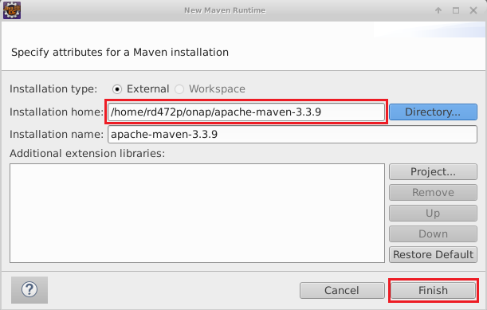
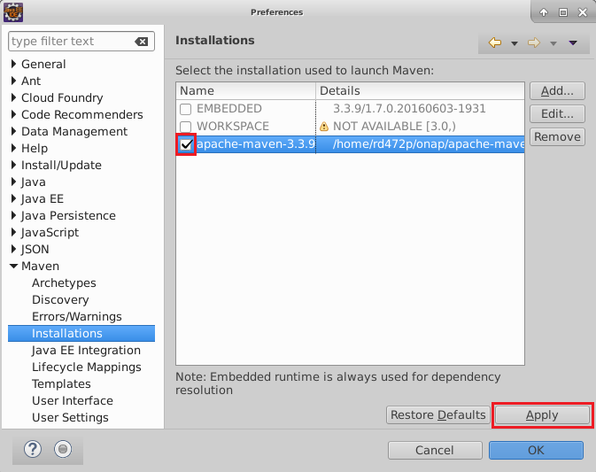
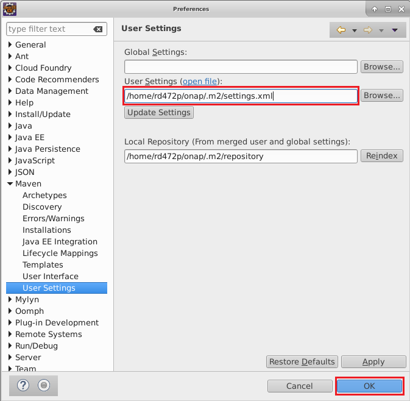

.. This work is licensed under a Creative Commons Attribution 4.0 International License.
.. http://creativecommons.org/licenses/by/4.0
.. Copyright 2017 Huawei Technologies Co., Ltd.

Workspace and Development Tools
===============================

We recognize that there are different ways to set up a workspace and different tools that may be chosen.  This is just one way to set things up.

Suggested Directory Structure
------------------------------
*NOTE*: You may have different versions of eclipse and java.

	onap
	
		.m2
		
		apache-maven-3.3.9
		
		camunda-modeler
		
		eclipse-jee-neon-3-linux-gtk-x86_64
		
		jdk1.8.0_131
		
		workspace
		
			SO
				chef-repo
				
				docker-config
				
				libs
				
				so
				
				so-config
				
Java
-----
Download the latest Java_8_SE_Development_Kit_ from Oracle.   Select a Linux x64 package.

Unpack it.

.. _Java_8_SE_Development_Kit: http://www.oracle.com/technetwork/java/javase/downloads/jdk8-downloads-2133151.html

Maven
------

Download the Apache_Maven_3.3.9_ binary.  NOTE: 3.3.9 is the recommended version, even though much higher versions are available.

Unpack it.

.. _Apache_Maven_3.3.9: https://archive.apache.org/dist/maven/maven-3/3.3.9/binaries/

Create an .m2 directory for maven and put settings.xml_ in it.  Edit the local repository path in settings.xml to make it correct for your environment.  Everything else should be OK.

.. _settings.xml: https://wiki.onap.org/download/attachments/15997820/settings.xml?version=1&modificationDate=1506156303000&api=v2

Camunda Modeler
---------------

Download the Camunda_Modeler_.  Select the Linux x64 package.
Unpack it.

.. _Camunda_Modeler: https://camunda.org/download/modeler/

Eclipse
-------

Download Eclipse_for_Linux_.  Select the 64-bit Eclipse IDE for Java EE Developers.  Oxygen seems to be the latest version. These instructions were written for Neon.
Unpack it.

.. _Eclipse_for_Linux:  https://www.eclipse.org/downloads/eclipse-packages/?osType=linux

In the eclipse directory, edit eclipse.ini

	Add (or change) the -vm setting so that it points to your JDK.
	
	Adjust the maximum heap space (2GB is recommended).
	
	Example:
	
.. image:: images/Workspace_and_Development_Tools.png	
	
Eclipse Settings
----------------

**Configure eclipse to use your external maven 3.3.9 installation:**
	Go to Window→Preferences→Maven→Installations
	
	Click "Add" and browse to your apache-maven-3.3.9 directory.  Click "OK" to select it.
	
	Click "Finish"
	

Make sure the external installation is selected:

**Configure eclipse to use your settings.xml**
	Go to Window→Preferences→Maven→User Settings
	
	Type the full path to your settings.xml file into the "User Settings" box and click "OK".
	
