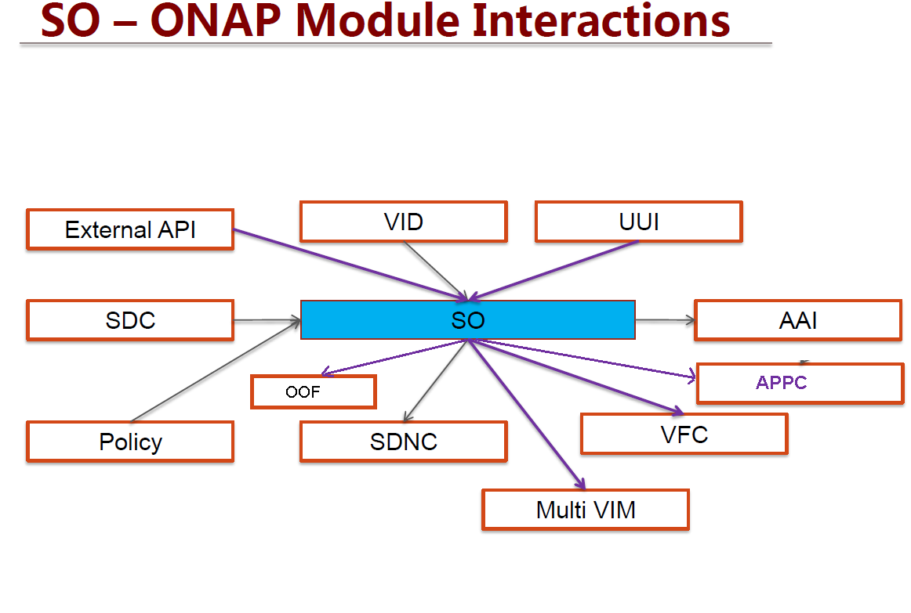

.. This work is licensed under a Creative Commons Attribution 4.0 International License.
.. http://creativecommons.org/licenses/by/4.0
.. Copyright 2018 Huawei Technologies Co., Ltd.

SO Interfaces
================================

SO APIs
----------------

North Bound APIs
----------------
Create service instance
++++++++++++++++++++++++

+--------------------+-------------------------------------+
|Interface Definition|Description                          |
+====================+=====================================+
|URI                 |/onap/so/infra/serviceInstantiation/serviceInstances/v6     |
+--------------------+-------------------------------------+
|Operation Type      |POST                                 |
+--------------------+-------------------------------------+
|Content-Type        |application/json                     |
+--------------------+-------------------------------------+

Request Body:

+----------------+---------+-----------+--------------------------+-------------------------------------------+
|Attribute       |Qualifier|Cardinality|Content                   |Description                                |
+================+=========+===========+==========================+===========================================+
|requestDetails  |M        |1          |requestDetails Object     |Content of requestDetails object.          |
+----------------+---------+-----------+--------------------------+-------------------------------------------+

RequestDetails Object 

+-------------------+--------------------------+-------------------------------------------------+
|Attribute          |Content                   |Description                                      |
+===================+==========================+=================================================+
|modelInfo          |modelInfo Object          |Content of modelInfo object.                     |
+-------------------+--------------------------+-------------------------------------------------+
|subscriberInfo     |subscriberInfo Object     |Content of subscriberInfo object.                |
+-------------------+--------------------------+-------------------------------------------------+
|requestInfo        |requestInfo Object        |Content of requestInfo object.                   |
+-------------------+--------------------------+-------------------------------------------------+
|requestParameters  |requestParameters Object  |Content of requestParameters object.             |
+-------------------+--------------------------+-------------------------------------------------+
|relatedInstanceList|relatedInstanceList Object|Content of relatedInstanceList object.           |
+-------------------+--------------------------+-------------------------------------------------+
|cloudConfiguration |cloudConfiguration Object |Content of cloudConfiguration object.            |
+-------------------+--------------------------+-------------------------------------------------+
|project            |project Object            |Content of project object.                       |
+-------------------+--------------------------+-------------------------------------------------+
|owningEntity       |owningEntity Object       |Content of owningEntity object.                  |
+-------------------+--------------------------+-------------------------------------------------+
|platform           |platform Object           |Content of platform object.                      |
+-------------------+--------------------------+-------------------------------------------------+
|lineOfBusiness     |lineOfBusiness Object     |Content of lineOfBusiness object.                |
+-------------------+--------------------------+-------------------------------------------------+

ModelInfo Object 

+-------------------------+------------------+-------------------------------------------------+
|Attribute                |Content           |Description                                      |
+=========================+==================+=================================================+
|ModelType                |String            |Type of model                                    |
+-------------------------+------------------+-------------------------------------------------+
|ModelInvariantId         |String            |The Model Invariant Id.                          |
+-------------------------+------------------+-------------------------------------------------+
|ModelNameVersionId       |String            |The modelname Version Id                         |
+-------------------------+------------------+-------------------------------------------------+
|ModelName                |String            |Name of the Model                                |
+-------------------------+------------------+-------------------------------------------------+
|ModelVersion             |String            |Version of the model                             |
+-------------------------+------------------+-------------------------------------------------+
|ModelCustomization Name  |String            |The Model Customization name                     |
+-------------------------+------------------+-------------------------------------------------+
|modelCustomizationUuid   |String            |The Model Customization UUid                     |
+-------------------------+------------------+-------------------------------------------------+
|modelVersionId           |String            |The Model version id                             |
+-------------------------+------------------+-------------------------------------------------+
|modelUuid                |String            |The Model UUid                                   |
+-------------------------+------------------+-------------------------------------------------+
|modelInvariantUuid       |String            |The Model Invariant  UUid                        |
+-------------------------+------------------+-------------------------------------------------+
|modelInstanceName        |String            |The Model Instance  name                         |
+-------------------------+------------------+-------------------------------------------------+

SubscriberInfo Object 

+-------------------------+------------------+-------------------------------------------------+
|Attribute                |Content           |Description                                      |
+=========================+==================+=================================================+
|GlobalSubscriberId       |String            |Global customer Id (in A&AI)                     |
+-------------------------+------------------+-------------------------------------------------+
|SubscriberName           |String            |Name of the Subscriber                           |
+-------------------------+------------------+-------------------------------------------------+

RequestInfo Object 

+-------------------------+------------------+-------------------------------------------------+
|Attribute                |Content           |Description                                      |
+=========================+==================+=================================================+
|Source                   |String            |source of the request                            |
+-------------------------+------------------+-------------------------------------------------+
|billingAccountNumber     |String            |billingAccountNumber of the request              |
+-------------------------+------------------+-------------------------------------------------+
|callbackUrl              |String            |callbackUrl of the request                       |
+-------------------------+------------------+-------------------------------------------------+
|correlator               |String            |correlator of the request                        |
+-------------------------+------------------+-------------------------------------------------+
|orderNumber              |String            |orderNumber of the request                       |
+-------------------------+------------------+-------------------------------------------------+
|productFamilyId          |String            |productFamilyId of the request                   |
+-------------------------+------------------+-------------------------------------------------+
|orderVersion             |String            |orderVersion of the request                      |
+-------------------------+------------------+-------------------------------------------------+
|instanceName             |String            |instanceName of the request                      |
+-------------------------+------------------+-------------------------------------------------+
|suppressRollback         |String            |suppressRollback of the request                  |
+-------------------------+------------------+-------------------------------------------------+
|requestorId              |String            |requestorId of the request                       |
+-------------------------+------------------+-------------------------------------------------+

RequestParameters Object 

+-------------------------+------------------+-------------------------------------------------+
|Attribute                |Content           |Description                                      |
+=========================+==================+=================================================+
|SubscriptionServiceType  |String            |The service type of the Subscription             |
+-------------------------+------------------+-------------------------------------------------+
|UserParams               |Array             |The product family Id.                           |
+-------------------------+------------------+-------------------------------------------------+
|aLaCarte                 |Boolean           | aLaCarte                                        |
+-------------------------+------------------+-------------------------------------------------+
|autoBuildVfModules       |Boolean           |autoBuildVfModules                               |
+-------------------------+------------------+-------------------------------------------------+
|cascadeDelete            |Boolean           |cascadeDelete                                    |
+-------------------------+------------------+-------------------------------------------------+
|usePreload               |Boolean           |usePreload                                       |
+-------------------------+------------------+-------------------------------------------------+
|rebuildVolumeGroups      |Boolean           |rebuildVolumeGroups                              |
+-------------------------+------------------+-------------------------------------------------+
|payload                  |String            |payload                                          |
+-------------------------+------------------+-------------------------------------------------+
|controllerType           |String            |controllerType                                   |
+-------------------------+------------------+-------------------------------------------------+

UserParams Object 

+-------------------------+------------------+-------------------------------------------------+
|Attribute                |Content           |Description                                      |
+=========================+==================+=================================================+
|name                     |String            |Tag name of attribute                            |
+-------------------------+------------------+-------------------------------------------------+
|value                    |String            |Value of the tag                                 |
+-------------------------+------------------+-------------------------------------------------+

CloudConfiguration Object 

+-------------------------+------------------+-------------------------------------------------+
|Attribute                |Content           |Description                                      |
+=========================+==================+=================================================+
|lcpCloudRegionId         |String            |CloudRegion Id (in A&AI)                         |
+-------------------------+------------------+-------------------------------------------------+
|tenantId                 |String            |Name of the Subscriber                           |
+-------------------------+------------------+-------------------------------------------------+
|aicNodeClli              |String            |aicNodeClli property                             |
+-------------------------+------------------+-------------------------------------------------+

Project Object

+-------------------------+------------------+-------------------------------------------------+
|Attribute                |Content           |Description                                      |
+=========================+==================+=================================================+
|projectName              |String            |Name of the project                              |
+-------------------------+------------------+-------------------------------------------------+

OwningEntity Object

+-------------------------+------------------+-------------------------------------------------+
|Attribute                |Content           |Description                                      |
+=========================+==================+=================================================+
|owningEntityId           |String            |owningEntityId of the owingEntity                |
+-------------------------+------------------+-------------------------------------------------+
|owningEntityName         |String            |owningEntityName of the owingEntity              |
+-------------------------+------------------+-------------------------------------------------+

Platform Object

+-------------------------+------------------+-------------------------------------------------+
|Attribute                |Content           |Description                                      |
+=========================+==================+=================================================+
|platformName             |String            |Platform Name                                    |
+-------------------------+------------------+-------------------------------------------------+

LineOfBusiness Object

+-------------------------+------------------+-------------------------------------------------+
|Attribute                |Content           |Description                                      |
+=========================+==================+=================================================+
|lineOfBusinessName       |String            |Line Of Business Name                            |
+-------------------------+------------------+-------------------------------------------------+

Delete service instance
++++++++++++++++++++++++

+--------------------+---------------------------------------------------------+
|Interface Definition|Description                                              |
+====================+=========================================================+
|URI                 |/onap/so/infra/serviceInstantiation/serviceInstances/v6/{serviceInstanceId}     |
+--------------------+---------------------------------------------------------+
|Operation Type      |DELETE                                                   |
+--------------------+---------------------------------------------------------+
|Content-Type        |application/json                                         |
+--------------------+---------------------------------------------------------+

Request Body:

+----------------+---------+-----------+--------------------------+-------------------------------------------+
|Attribute       |Qualifier|Cardinality|Content                   |Description                                |
+================+=========+===========+==========================+===========================================+
|requestDetails  |M        |1          |requestDetails Object     |Content of requestDetails object.          |
+----------------+---------+-----------+--------------------------+-------------------------------------------+

RequestDetails Object 

+-------------------+-------------------------+-------------------------------------------------+
|Attribute          |Content                  |Description                                      |
+===================+=========================+=================================================+
|modelInfo          |modelInfo Object         |Content of modelInfo object.                     |
+-------------------+-------------------------+-------------------------------------------------+
|requestInfo        |requestInfo Object       |Content of requestInfo object.                   |
+-------------------+-------------------------+-------------------------------------------------+

ModelInfo Object 

+-------------------------+------------------+-------------------------------------------------+
|Attribute                |Content           |Description                                      |
+=========================+==================+=================================================+
|ModelType                |String            |Type of model                                    |
+-------------------------+------------------+-------------------------------------------------+
|ModelInvariantId         |String            |The Model Invariant Id.                          |
+-------------------------+------------------+-------------------------------------------------+
|ModelName                |String            |Name of the Model                                |
+-------------------------+------------------+-------------------------------------------------+
|ModelVersion             |String            |Version of the model                             |
+-------------------------+------------------+-------------------------------------------------+

RequestInfo Object 

+-------------------------+------------------+-------------------------------------------------+
|Attribute                |Content           |Description                                      |
+=========================+==================+=================================================+
|Source                   |String            |source of the request                            |
+-------------------------+------------------+-------------------------------------------------+

Create Volume Group
++++++++++++++++++++++++

+--------------------+-------------------------------------------------------------------------------------------+
|Interface Definition|Description                                                                                |
+====================+===========================================================================================+
|URI                 |/onap/so/infra/serviceInstantiation/serviceInstances/v6/{serviceInstanceId}/vnfs/{vnfInstanceId}/volumeGroups     |
+--------------------+-------------------------------------------------------------------------------------------+
|Operation Type      |POST                                                                                       |
+--------------------+-------------------------------------------------------------------------------------------+
|Content-Type        |application/json                                                                           |
+--------------------+-------------------------------------------------------------------------------------------+

Request Body:

+----------------+---------+-----------+--------------------------+-------------------------------------------+
|Attribute       |Qualifier|Cardinality|Content                   |Description                                |
+================+=========+===========+==========================+===========================================+
|requestDetails  |M        |1          |requestDetails Object     |Content of requestDetails object.          |
+----------------+---------+-----------+--------------------------+-------------------------------------------+

RequestDetails Object 

+-------------------+--------------------------+-------------------------------------------------+
|Attribute          |Content                   |Description                                      |
+===================+==========================+=================================================+
|modelInfo          |modelInfo Object          |Content of modelInfo object.                     |
+-------------------+--------------------------+-------------------------------------------------+
|subscriberInfo     |subscriberInfo Object     |Content of subscriberInfo object.                |
+-------------------+--------------------------+-------------------------------------------------+
|requestInfo        |requestInfo Object        |Content of requestInfo object.                   |
+-------------------+--------------------------+-------------------------------------------------+
|requestParameters  |requestParameters Object  |Content of requestParameters object.             |
+-------------------+--------------------------+-------------------------------------------------+
|relatedInstanceList|relatedInstanceList Object|Content of relatedInstanceList object.           |
+-------------------+--------------------------+-------------------------------------------------+
|cloudConfiguration |cloudConfiguration Object |Content of cloudConfiguration object.            |
+-------------------+--------------------------+-------------------------------------------------+
|project            |project Object            |Content of project object.                       |
+-------------------+--------------------------+-------------------------------------------------+
|owningEntity       |owningEntity Object       |Content of owningEntity object.                  |
+-------------------+--------------------------+-------------------------------------------------+
|platform           |platform Object           |Content of platform object.                      |
+-------------------+--------------------------+-------------------------------------------------+
|lineOfBusiness     |lineOfBusiness Object     |Content of lineOfBusiness object.                |
+-------------------+--------------------------+-------------------------------------------------+

ModelInfo Object 

+-------------------------+------------------+-------------------------------------------------+
|Attribute                |Content           |Description                                      |
+=========================+==================+=================================================+
|ModelType                |String            |Type of model                                    |
+-------------------------+------------------+-------------------------------------------------+
|ModelInvariantId         |String            |The Model Invariant Id.                          |
+-------------------------+------------------+-------------------------------------------------+
|ModelNameVersionId       |String            |The modelname Version Id                         |
+-------------------------+------------------+-------------------------------------------------+
|ModelName                |String            |Name of the Model                                |
+-------------------------+------------------+-------------------------------------------------+
|ModelVersion             |String            |Version of the model                             |
+-------------------------+------------------+-------------------------------------------------+
|ModelCustomization Name  |String            |The Model Customization name                     |
+-------------------------+------------------+-------------------------------------------------+
|modelCustomizationUuid   |String            |The Model Customization UUid                     |
+-------------------------+------------------+-------------------------------------------------+
|modelVersionId           |String            |The Model version id                             |
+-------------------------+------------------+-------------------------------------------------+
|modelUuid                |String            |The Model UUid                                   |
+-------------------------+------------------+-------------------------------------------------+
|modelInvariantUuid       |String            |The Model Invariant  UUid                        |
+-------------------------+------------------+-------------------------------------------------+
|modelInstanceName        |String            |The Model Instance  name                         |
+-------------------------+------------------+-------------------------------------------------+

CloudConfiguration Object 

+-------------------------+------------------+-------------------------------------------------+
|Attribute                |Content           |Description                                      |
+=========================+==================+=================================================+
|lcpCloudRegionId         |String            |CloudRegion Id (in A&AI)                         |
+-------------------------+------------------+-------------------------------------------------+
|tenantId                 |String            |Name of the Subscriber                           |
+-------------------------+------------------+-------------------------------------------------+
|aicNodeClli              |String            |aicNodeClli property                             |
+-------------------------+------------------+-------------------------------------------------+

RequestInfo Object 

+-------------------------+------------------+-------------------------------------------------+
|Attribute                |Content           |Description                                      |
+=========================+==================+=================================================+
|Source                   |String            |source of the request                            |
+-------------------------+------------------+-------------------------------------------------+
|billingAccountNumber     |String            |billingAccountNumber of the request              |
+-------------------------+------------------+-------------------------------------------------+
|callbackUrl              |String            |callbackUrl of the request                       |
+-------------------------+------------------+-------------------------------------------------+
|correlator               |String            |correlator of the request                        |
+-------------------------+------------------+-------------------------------------------------+
|orderNumber              |String            |orderNumber of the request                       |
+-------------------------+------------------+-------------------------------------------------+
|productFamilyId          |String            |productFamilyId of the request                   |
+-------------------------+------------------+-------------------------------------------------+
|orderVersion             |String            |orderVersion of the request                      |
+-------------------------+------------------+-------------------------------------------------+
|instanceName             |String            |instanceName of the request                      |
+-------------------------+------------------+-------------------------------------------------+
|suppressRollback         |String            |suppressRollback of the request                  |
+-------------------------+------------------+-------------------------------------------------+
|requestorId              |String            |requestorId of the request                       |
+-------------------------+------------------+-------------------------------------------------+

relatedInstance List  

+-------------------------+------------------+-------------------------------------------------+
|Attribute                |Content           |Description                                      |
+=========================+==================+=================================================+
|relatedInstance          |Object            |relatedInstance Object                           |
+-------------------------+------------------+-------------------------------------------------+

relatedInstance List  

+-------------------------+------------------+-------------------------------------------------+
|Attribute                |Content           |Description                                      |
+=========================+==================+=================================================+
|instanceId               |String            |instanceId                                       |
+-------------------------+------------------+-------------------------------------------------+
|modelInfo                |Object            |Content of modelInfo object.                     |
+-------------------------+------------------+-------------------------------------------------+

Delete Volume Group
++++++++++++++++++++++++

+--------------------+---------------------------------------------------------------------------------------------------------------------+
|Interface Definition|Description                                                                                                          |
+====================+=====================================================================================================================+
|URI                 |/onap/so/infra/serviceInstantiation/serviceInstances/v6/{serviceInstanceId}/vnfs/{vnfInstanceId}/volumeGroups/{volume-groupinstance-id}     |
+--------------------+---------------------------------------------------------------------------------------------------------------------+
|Operation Type      |DELETE                                                                                                               |
+--------------------+---------------------------------------------------------------------------------------------------------------------+
|Content-Type        |application/json                                                                                                     |
+--------------------+---------------------------------------------------------------------------------------------------------------------+

Request Body:

+----------------+---------+-----------+--------------------------+-------------------------------------------+
|Attribute       |Qualifier|Cardinality|Content                   |Description                                |
+================+=========+===========+==========================+===========================================+
|requestDetails  |M        |1          |requestDetails Object     |Content of requestDetails object.          |
+----------------+---------+-----------+--------------------------+-------------------------------------------+

RequestDetails Object 

+---------------------+-------------------------+-------------------------------------------------+
|Attribute            |Content                  |Description                                      |
+=====================+=========================+=================================================+
|modelInfo            |modelInfo Object         |Content of modelInfo object.                     |
+---------------------+-------------------------+-------------------------------------------------+
|cloudConfiguration   |cloudConfiguration Object|Content of cloudConfiguration object.            |
+---------------------+-------------------------+-------------------------------------------------+
|requestInfo          |requestInfo Object       |Content of requestInfo object.                   |
+---------------------+-------------------------+-------------------------------------------------+

ModelInfo Object 

+-------------------------+------------------+-------------------------------------------------+
|Attribute                |Content           |Description                                      |
+=========================+==================+=================================================+
|ModelType                |String            |Type of model                                    |
+-------------------------+------------------+-------------------------------------------------+
|ModelName                |String            |Name of the Model                                |
+-------------------------+------------------+-------------------------------------------------+

CloudConfiguration Object 

+-------------------------+------------------+-------------------------------------------------+
|Attribute                |Content           |Description                                      |
+=========================+==================+=================================================+
|lcpCloudRegionId         |String            |CloudRegion Id (in A&AI)                         |
+-------------------------+------------------+-------------------------------------------------+
|tenantId                 |String            |Name of the Subscriber                           |
+-------------------------+------------------+-------------------------------------------------+

RequestInfo Object 

+-------------------------+------------------+-------------------------------------------------+
|Attribute                |Content           |Description                                      |
+=========================+==================+=================================================+
|Source                   |String            |source of the request                            |
+-------------------------+------------------+-------------------------------------------------+

Create VF Module
+++++++++++++++++

+--------------------+----------------------------------------------------------------------------------------+
|Interface Definition|Description                                                                             |
+====================+========================================================================================+
|URI                 |/onap/so/infra/serviceInstantiation/serviceInstances/v6/{serviceInstanceId}/vnfs/{vnfInstanceId}/vfModules     |
+--------------------+----------------------------------------------------------------------------------------+
|Operation Type      |POST                                                                                    |
+--------------------+----------------------------------------------------------------------------------------+
|Content-Type        |application/json                                                                        |
+--------------------+----------------------------------------------------------------------------------------+

Request Body:

+----------------+---------+-----------+--------------------------+-------------------------------------------+
|Attribute       |Qualifier|Cardinality|Content                   |Description                                |
+================+=========+===========+==========================+===========================================+
|requestDetails  |M        |1          |requestDetails Object     |Content of requestDetails object.          |
+----------------+---------+-----------+--------------------------+-------------------------------------------+

RequestDetails Object 

+---------------------+-------------------------+-------------------------------------------------+
|Attribute            |Content                  |Description                                      |
+=====================+=========================+=================================================+
|modelInfo            |modelInfo Object         |Content of modelInfo object.                     |
+---------------------+-------------------------+-------------------------------------------------+
|cloudConfiguration   |cloudConfiguration Object|Content of cloudConfiguration object.            |
+---------------------+-------------------------+-------------------------------------------------+
|requestInfo          |requestInfo Object       |Content of requestInfo object.                   |
+---------------------+-------------------------+-------------------------------------------------+
|relatedInstanceList  |List                     |Content of relatedInstanceList.                  |
+---------------------+-------------------------+-------------------------------------------------+

ModelInfo Object 

+-------------------------+------------------+-------------------------------------------------+
|Attribute                |Content           |Description                                      |
+=========================+==================+=================================================+
|ModelType                |String            |Type of model                                    |
+-------------------------+------------------+-------------------------------------------------+
|ModelInvariantId         |String            |The Model Invariant Id.                          |
+-------------------------+------------------+-------------------------------------------------+
|ModelNameVersionId       |String            |The modelname Version Id                         |
+-------------------------+------------------+-------------------------------------------------+
|ModelName                |String            |Name of the Model                                |
+-------------------------+------------------+-------------------------------------------------+
|ModelVersion             |String            |Version of the model                             |
+-------------------------+------------------+-------------------------------------------------+
|ModelCustomization Name  |String            |The Model Customization name                     |
+-------------------------+------------------+-------------------------------------------------+

CloudConfiguration Object 

+-------------------------+------------------+-------------------------------------------------+
|Attribute                |Content           |Description                                      |
+=========================+==================+=================================================+
|lcpCloudRegionId         |String            |CloudRegion Id (in A&AI)                         |
+-------------------------+------------------+-------------------------------------------------+
|tenantId                 |String            |Name of the Subscriber                           |
+-------------------------+------------------+-------------------------------------------------+

RequestInfo Object 

+-------------------------+------------------+-------------------------------------------------+
|Attribute                |Content           |Description                                      |
+=========================+==================+=================================================+
|InstanceName             |String            |The instance Name                                |
+-------------------------+------------------+-------------------------------------------------+
|Source                   |String            |source of the request                            |
+-------------------------+------------------+-------------------------------------------------+
|SuppressRollback         |Boolean           |SuppressRollback                                 |
+-------------------------+------------------+-------------------------------------------------+

relatedInstance List  

+-------------------------+------------------+-------------------------------------------------+
|Attribute                |Content           |Description                                      |
+=========================+==================+=================================================+
|relatedInstance          |Object            |relatedInstance Object                           |
+-------------------------+------------------+-------------------------------------------------+

relatedInstance List  

+-------------------------+------------------+-------------------------------------------------+
|Attribute                |Content           |Description                                      |
+=========================+==================+=================================================+
|instanceId               |String            |instanceId                                       |
+-------------------------+------------------+-------------------------------------------------+
|modelInfo                |Object            |Content of modelInfo object.                     |
+-------------------------+------------------+-------------------------------------------------+
|instanceName             |String            |Name of the instance                             |
+-------------------------+------------------+-------------------------------------------------+

Delete VF Module
++++++++++++++++++++++++

+--------------------+--------------------------------------------------------------------------------------------------------------+
|Interface Definition|Description                                                                                                   |
+====================+==============================================================================================================+
|URI                 |/onap/so/infra/serviceInstantiation/serviceInstances/v6/{serviceInstanceId}/vnfs/{vnfInstanceId}/vfModules/{vfmoduleinstance-id}     |
+--------------------+--------------------------------------------------------------------------------------------------------------+
|Operation Type      |DELETE                                                                                                        |
+--------------------+--------------------------------------------------------------------------------------------------------------+
|Content-Type        |application/json                                                                                              |
+--------------------+--------------------------------------------------------------------------------------------------------------+

Request Body:

+----------------+---------+-----------+--------------------------+-------------------------------------------+
|Attribute       |Qualifier|Cardinality|Content                   |Description                                |
+================+=========+===========+==========================+===========================================+
|requestDetails  |M        |1          |requestDetails Object     |Content of requestDetails object.          |
+----------------+---------+-----------+--------------------------+-------------------------------------------+

RequestDetails Object 

+---------------------+-------------------------+-------------------------------------------------+
|Attribute            |Content                  |Description                                      |
+=====================+=========================+=================================================+
|modelInfo            |modelInfo Object         |Content of modelInfo object.                     |
+---------------------+-------------------------+-------------------------------------------------+
|cloudConfiguration   |cloudConfiguration Object|Content of cloudConfiguration object.            |
+---------------------+-------------------------+-------------------------------------------------+
|requestInfo          |requestInfo Object       |Content of requestInfo object.                   |
+---------------------+-------------------------+-------------------------------------------------+

ModelInfo Object 

+-------------------------+------------------+-------------------------------------------------+
|Attribute                |Content           |Description                                      |
+=========================+==================+=================================================+
|ModelType                |String            |Type of model                                    |
+-------------------------+------------------+-------------------------------------------------+
|ModelInvariantId         |String            |The Model Invariant Id.                          |
+-------------------------+------------------+-------------------------------------------------+
|ModelNameVersionId       |String            |The modelname Version Id                         |
+-------------------------+------------------+-------------------------------------------------+
|ModelName                |String            |Name of the Model                                |
+-------------------------+------------------+-------------------------------------------------+
|ModelVersion             |String            |Version of the model                             |
+-------------------------+------------------+-------------------------------------------------+
|ModelCustomization Name  |String            |The Model Customization name                     |
+-------------------------+------------------+-------------------------------------------------+

CloudConfiguration Object 

+-------------------------+------------------+-------------------------------------------------+
|Attribute                |Content           |Description                                      |
+=========================+==================+=================================================+
|lcpCloudRegionId         |String            |CloudRegion Id (in A&AI)                         |
+-------------------------+------------------+-------------------------------------------------+
|tenantId                 |String            |Name of the Subscriber                           |
+-------------------------+------------------+-------------------------------------------------+

RequestInfo Object 

+-------------------------+------------------+-------------------------------------------------+
|Attribute                |Content           |Description                                      |
+=========================+==================+=================================================+
|Source                   |String            |source of the request                            |
+-------------------------+------------------+-------------------------------------------------+

Create VNF
+++++++++++++++

+--------------------+--------------------------------------------------------------+
|Interface Definition|Description                                                   |
+====================+==============================================================+
|URI                 |/onap/so/infra/serviceInstantiation/serviceInstances/v6/{serviceInstanceId}/vnfs     |
+--------------------+--------------------------------------------------------------+
|Operation Type      |POST                                                          |
+--------------------+--------------------------------------------------------------+
|Content-Type        |application/json                                              |
+--------------------+--------------------------------------------------------------+

Request Body:

+----------------+---------+-----------+--------------------------+-------------------------------------------+
|Attribute       |Qualifier|Cardinality|Content                   |Description                                |
+================+=========+===========+==========================+===========================================+
|requestDetails  |M        |1          |requestDetails Object     |Content of requestDetails object.          |
+----------------+---------+-----------+--------------------------+-------------------------------------------+

RequestDetails Object 

+-------------------+--------------------------+-------------------------------------------------+
|Attribute          |Content                   |Description                                      |
+===================+==========================+=================================================+
|modelInfo          |modelInfo Object          |Content of modelInfo object.                     |
+-------------------+--------------------------+-------------------------------------------------+
|subscriberInfo     |subscriberInfo Object     |Content of subscriberInfo object.                |
+-------------------+--------------------------+-------------------------------------------------+
|requestInfo        |requestInfo Object        |Content of requestInfo object.                   |
+-------------------+--------------------------+-------------------------------------------------+
|requestParameters  |requestParameters Object  |Content of requestParameters object.             |
+-------------------+--------------------------+-------------------------------------------------+
|relatedInstanceList|relatedInstanceList Object|Content of relatedInstanceList object.           |
+-------------------+--------------------------+-------------------------------------------------+
|cloudConfiguration |cloudConfiguration Object |Content of cloudConfiguration object.            |
+-------------------+--------------------------+-------------------------------------------------+
|project            |project Object            |Content of project object.                       |
+-------------------+--------------------------+-------------------------------------------------+
|owningEntity       |owningEntity Object       |Content of owningEntity object.                  |
+-------------------+--------------------------+-------------------------------------------------+
|platform           |platform Object           |Content of platform object.                      |
+-------------------+--------------------------+-------------------------------------------------+
|lineOfBusiness     |lineOfBusiness Object     |Content of lineOfBusiness object.                |
+-------------------+--------------------------+-------------------------------------------------+

ModelInfo Object 

+-------------------------+------------------+-------------------------------------------------+
|Attribute                |Content           |Description                                      |
+=========================+==================+=================================================+
|ModelType                |String            |Type of model                                    |
+-------------------------+------------------+-------------------------------------------------+
|ModelInvariantId         |String            |The Model Invariant Id.                          |
+-------------------------+------------------+-------------------------------------------------+
|ModelNameVersionId       |String            |The modelname Version Id                         |
+-------------------------+------------------+-------------------------------------------------+
|ModelName                |String            |Name of the Model                                |
+-------------------------+------------------+-------------------------------------------------+
|ModelVersion             |String            |Version of the model                             |
+-------------------------+------------------+-------------------------------------------------+
|ModelCustomization Name  |String            |The Model Customization name                     |
+-------------------------+------------------+-------------------------------------------------+
|modelCustomizationUuid   |String            |The Model Customization UUid                     |
+-------------------------+------------------+-------------------------------------------------+
|modelVersionId           |String            |The Model version id                             |
+-------------------------+------------------+-------------------------------------------------+
|modelUuid                |String            |The Model UUid                                   |
+-------------------------+------------------+-------------------------------------------------+
|modelInvariantUuid       |String            |The Model Invariant  UUid                        |
+-------------------------+------------------+-------------------------------------------------+
|modelInstanceName        |String            |The Model Instance  name                         |
+-------------------------+------------------+-------------------------------------------------+

CloudConfiguration Object 

+-------------------------+------------------+-------------------------------------------------+
|Attribute                |Content           |Description                                      |
+=========================+==================+=================================================+
|lcpCloudRegionId         |String            |CloudRegion Id (in A&AI)                         |
+-------------------------+------------------+-------------------------------------------------+
|tenantId                 |String            |Name of the Subscriber                           |
+-------------------------+------------------+-------------------------------------------------+

RequestInfo Object 

+-------------------------+------------------+-------------------------------------------------+
|Attribute                |Content           |Description                                      |
+=========================+==================+=================================================+
|Source                   |String            |source of the request                            |
+-------------------------+------------------+-------------------------------------------------+
|billingAccountNumber     |String            |billingAccountNumber of the request              |
+-------------------------+------------------+-------------------------------------------------+
|callbackUrl              |String            |callbackUrl of the request                       |
+-------------------------+------------------+-------------------------------------------------+
|correlator               |String            |correlator of the request                        |
+-------------------------+------------------+-------------------------------------------------+
|orderNumber              |String            |orderNumber of the request                       |
+-------------------------+------------------+-------------------------------------------------+
|productFamilyId          |String            |productFamilyId of the request                   |
+-------------------------+------------------+-------------------------------------------------+
|orderVersion             |String            |orderVersion of the request                      |
+-------------------------+------------------+-------------------------------------------------+
|instanceName             |String            |instanceName of the request                      |
+-------------------------+------------------+-------------------------------------------------+
|suppressRollback         |String            |suppressRollback of the request                  |
+-------------------------+------------------+-------------------------------------------------+
|requestorId              |String            |requestorId of the request                       |
+-------------------------+------------------+-------------------------------------------------+

relatedInstance List  

+-------------------------+------------------+-------------------------------------------------+
|Attribute                |Content           |Description                                      |
+=========================+==================+=================================================+
|relatedInstance          |Object            |relatedInstance Object                           |
+-------------------------+------------------+-------------------------------------------------+

relatedInstance List  

+-------------------------+------------------+-------------------------------------------------+
|Attribute                |Content           |Description                                      |
+=========================+==================+=================================================+
|instanceId               |String            |instanceId                                       |
+-------------------------+------------------+-------------------------------------------------+
|modelInfo                |Object            |Content of modelInfo object.                     |
+-------------------------+------------------+-------------------------------------------------+

RequestParameters Object 

+-------------------------+------------------+-------------------------------------------------+
|Attribute                |Content           |Description                                      |
+=========================+==================+=================================================+
|UserParams               |Array             |The product family Id.                           |
+-------------------------+------------------+-------------------------------------------------+

UserParams Object 

+-------------------------+------------------+-------------------------------------------------+
|Attribute                |Content           |Description                                      |
+=========================+==================+=================================================+
|name                     |String            |Tag name of attribute                            |
+-------------------------+------------------+-------------------------------------------------+
|value                    |String            |Value of the tag                                 |
+-------------------------+------------------+-------------------------------------------------+

Delete VNF
+++++++++++++++

+--------------------+------------------------------------------------------------------------------+
|Interface Definition|Description                                                                   |
+====================+==============================================================================+
|URI                 |/onap/so/infra/serviceInstantiation/serviceInstances/v6/{serviceInstanceId}/vnfs/{vnfInstanceId}     |
+--------------------+------------------------------------------------------------------------------+
|Operation Type      |DELETE                                                                        |
+--------------------+------------------------------------------------------------------------------+
|Content-Type        |application/json                                                              |
+--------------------+------------------------------------------------------------------------------+

Request Body:

+----------------+---------+-----------+--------------------------+-------------------------------------------+
|Attribute       |Qualifier|Cardinality|Content                   |Description                                |
+================+=========+===========+==========================+===========================================+
|requestDetails  |M        |1          |requestDetails Object     |Content of requestDetails object.          |
+----------------+---------+-----------+--------------------------+-------------------------------------------+

RequestDetails Object 

+---------------------+-------------------------+-------------------------------------------------+
|Attribute            |Content                  |Description                                      |
+=====================+=========================+=================================================+
|modelInfo            |modelInfo Object         |Content of modelInfo object.                     |
+---------------------+-------------------------+-------------------------------------------------+
|cloudConfiguration   |cloudConfiguration Object|Content of cloudConfiguration object.            |
+---------------------+-------------------------+-------------------------------------------------+
|requestInfo          |requestInfo Object       |Content of requestInfo object.                   |
+---------------------+-------------------------+-------------------------------------------------+
|requestParameters    |requestParameters Object |Content of requestParameters object.             |
+---------------------+-------------------------+-------------------------------------------------+

ModelInfo Object 

+-------------------------+------------------+-------------------------------------------------+
|Attribute                |Content           |Description                                      |
+=========================+==================+=================================================+
|ModelType                |String            |Type of model                                    |
+-------------------------+------------------+-------------------------------------------------+
|ModelName                |String            |Name of the Model                                |
+-------------------------+------------------+-------------------------------------------------+

CloudConfiguration Object 

+-------------------------+------------------+-------------------------------------------------+
|Attribute                |Content           |Description                                      |
+=========================+==================+=================================================+
|lcpCloudRegionId         |String            |CloudRegion Id (in A&AI)                         |
+-------------------------+------------------+-------------------------------------------------+
|tenantId                 |String            |Name of the Subscriber                           |
+-------------------------+------------------+-------------------------------------------------+

RequestInfo Object 

+-------------------------+------------------+-------------------------------------------------+
|Attribute                |Content           |Description                                      |
+=========================+==================+=================================================+
|Source                   |String            |source of the request                            |
+-------------------------+------------------+-------------------------------------------------+

RequestParameters Object 

+-------------------------+------------------+-------------------------------------------------+
|Attribute                |Content           |Description                                      |
+=========================+==================+=================================================+
|UserParams               |Array             |The product family Id.                           |
+-------------------------+------------------+-------------------------------------------------+

UserParams Object 

+-------------------------+------------------+-------------------------------------------------+
|Attribute                |Content           |Description                                      |
+=========================+==================+=================================================+
|name                     |String            |Tag name of attribute                            |
+-------------------------+------------------+-------------------------------------------------+
|value                    |String            |Value of the tag                                 |
+-------------------------+------------------+-------------------------------------------------+

GET Orchestration Request
++++++++++++++++++++++++++

+--------------------+--------------------------------------------------------------+
|Interface Definition|Description                                                   |
+====================+==============================================================+
|URI                 |/onap/so/infra/serviceInstantiation/orchestrationRequests/v6/{request-id}            |
+--------------------+--------------------------------------------------------------+
|Operation Type      |GET                                                           |
+--------------------+--------------------------------------------------------------+
|Content-Type        |application/json                                              |
+--------------------+--------------------------------------------------------------+

Response Body:

+----------------+---------+-----------+--------------------------+-------------------------------------------+
|Attribute       |Qualifier|Cardinality|Content                   |Description                                |
+================+=========+===========+==========================+===========================================+
|request         |M        |1          |request Object            |Content of request object.                 |
+----------------+---------+-----------+--------------------------+-------------------------------------------+

Request Object

+-------------------+---------+-----------+--------------------------+-------------------------------------------+
|Attribute          |Qualifier|Cardinality|Content                   |Description                                |
+===================+=========+===========+==========================+===========================================+
|requestId          |M        |1          |String                    |Request Id                                 |
+-------------------+---------+-----------+--------------------------+-------------------------------------------+
|startTime          |M        |1          |request Object            |Start time.                                |
+-------------------+---------+-----------+--------------------------+-------------------------------------------+
|requestScope       |M        |1          |request Object            |Scope of the request.                      |
+-------------------+---------+-----------+--------------------------+-------------------------------------------+
|requestType        |M        |1          |request Object            |Type of the request.                       |
+-------------------+---------+-----------+--------------------------+-------------------------------------------+
|requestDetails     |M        |1          |requestDetails Object     |Type of the request.                       |
+-------------------+---------+-----------+--------------------------+-------------------------------------------+
|requestStatus      |M        |1          |requestStatus Object      |Type of the request.                       |
+-------------------+---------+-----------+--------------------------+-------------------------------------------+

RequestDetails Object 

+-------------------+--------------------------+-------------------------------------------------+
|Attribute          |Content                   |Description                                      |
+===================+==========================+=================================================+
|modelInfo          |modelInfo Object          |Content of modelInfo object.                     |
+-------------------+--------------------------+-------------------------------------------------+
|subscriberInfo     |subscriberInfo Object     |Content of subscriberInfo object.                |
+-------------------+--------------------------+-------------------------------------------------+
|requestInfo        |requestInfo Object        |Content of requestInfo object.                   |
+-------------------+--------------------------+-------------------------------------------------+
|requestParameters  |requestParameters Object  |Content of requestParameters object.             |
+-------------------+--------------------------+-------------------------------------------------+
|relatedInstanceList|relatedInstanceList Object|Content of relatedInstanceList object.           |
+-------------------+--------------------------+-------------------------------------------------+
|cloudConfiguration |cloudConfiguration Object |Content of cloudConfiguration object.            |
+-------------------+--------------------------+-------------------------------------------------+
|project            |project Object            |Content of project object.                       |
+-------------------+--------------------------+-------------------------------------------------+
|owningEntity       |owningEntity Object       |Content of owningEntity object.                  |
+-------------------+--------------------------+-------------------------------------------------+
|platform           |platform Object           |Content of platform object.                      |
+-------------------+--------------------------+-------------------------------------------------+
|lineOfBusiness     |lineOfBusiness Object     |Content of lineOfBusiness object.                |
+-------------------+--------------------------+-------------------------------------------------+

ModelInfo Object 

+-------------------------+------------------+-------------------------------------------------+
|Attribute                |Content           |Description                                      |
+=========================+==================+=================================================+
|ModelType                |String            |Type of model                                    |
+-------------------------+------------------+-------------------------------------------------+
|ModelInvariantId         |String            |The Model Invariant Id.                          |
+-------------------------+------------------+-------------------------------------------------+
|ModelNameVersionId       |String            |The modelname Version Id                         |
+-------------------------+------------------+-------------------------------------------------+
|ModelName                |String            |Name of the Model                                |
+-------------------------+------------------+-------------------------------------------------+
|ModelVersion             |String            |Version of the model                             |
+-------------------------+------------------+-------------------------------------------------+
|ModelCustomization Name  |String            |The Model Customization name                     |
+-------------------------+------------------+-------------------------------------------------+
|modelCustomizationUuid   |String            |The Model Customization UUid                     |
+-------------------------+------------------+-------------------------------------------------+
|modelVersionId           |String            |The Model version id                             |
+-------------------------+------------------+-------------------------------------------------+
|modelUuid                |String            |The Model UUid                                   |
+-------------------------+------------------+-------------------------------------------------+
|modelInvariantUuid       |String            |The Model Invariant  UUid                        |
+-------------------------+------------------+-------------------------------------------------+
|modelInstanceName        |String            |The Model Instance  name                         |
+-------------------------+------------------+-------------------------------------------------+

SubscriberInfo Object 

+-------------------------+------------------+-------------------------------------------------+
|Attribute                |Content           |Description                                      |
+=========================+==================+=================================================+
|GlobalSubscriberId       |String            |Global customer Id (in A&AI)                     |
+-------------------------+------------------+-------------------------------------------------+
|SubscriberName           |String            |Name of the Subscriber                           |
+-------------------------+------------------+-------------------------------------------------+

RequestInfo Object 

+-------------------------+------------------+-------------------------------------------------+
|Attribute                |Content           |Description                                      |
+=========================+==================+=================================================+
|Source                   |String            |source of the request                            |
+-------------------------+------------------+-------------------------------------------------+
|billingAccountNumber     |String            |billingAccountNumber of the request              |
+-------------------------+------------------+-------------------------------------------------+
|callbackUrl              |String            |callbackUrl of the request                       |
+-------------------------+------------------+-------------------------------------------------+
|correlator               |String            |correlator of the request                        |
+-------------------------+------------------+-------------------------------------------------+
|orderNumber              |String            |orderNumber of the request                       |
+-------------------------+------------------+-------------------------------------------------+
|productFamilyId          |String            |productFamilyId of the request                   |
+-------------------------+------------------+-------------------------------------------------+
|orderVersion             |String            |orderVersion of the request                      |
+-------------------------+------------------+-------------------------------------------------+
|instanceName             |String            |instanceName of the request                      |
+-------------------------+------------------+-------------------------------------------------+
|suppressRollback         |String            |suppressRollback of the request                  |
+-------------------------+------------------+-------------------------------------------------+
|requestorId              |String            |requestorId of the request                       |
+-------------------------+------------------+-------------------------------------------------+

RequestParameters Object 

+-------------------------+------------------+-------------------------------------------------+
|Attribute                |Content           |Description                                      |
+=========================+==================+=================================================+
|SubscriptionServiceType  |String            |The service type of the Subscription             |
+-------------------------+------------------+-------------------------------------------------+

RequestStatus Object

+-------------------------+------------------+-------------------------------------------------+
|Attribute                |Content           |Description                                      |
+=========================+==================+=================================================+
|finishTime               |String            |Time                                             |
+-------------------------+------------------+-------------------------------------------------+
|requestState             |String            |state of the request                             |
+-------------------------+------------------+-------------------------------------------------+
|statusMessage            |String            |statusMessage                                    |
+-------------------------+------------------+-------------------------------------------------+
|percentProgress          |String            |percentage of progress                           |
+-------------------------+------------------+-------------------------------------------------+

GET Orchestration Requests
++++++++++++++++++++++++++

+--------------------+--------------------------------------------------------------+
|Interface Definition|Description                                                   |
+====================+==============================================================+
|URI                 |/onap/so/infra/serviceInstantiation/orchestrationRequests/v6                         |
+--------------------+--------------------------------------------------------------+
|Operation Type      |GET                                                           |
+--------------------+--------------------------------------------------------------+
|Content-Type        |application/json                                              |
+--------------------+--------------------------------------------------------------+

Response Body:

+----------------+---------+-----------+--------------------------+-------------------------------------------+
|Attribute       |Qualifier|Cardinality|Content                   |Description                                |
+================+=========+===========+==========================+===========================================+
|requestList     |M        |1          |Array                     |Content of request List.                   |
+----------------+---------+-----------+--------------------------+-------------------------------------------+

RequestList : 

+----------------+---------+-----------+--------------------------+-------------------------------------------+
|Attribute       |Qualifier|Cardinality|Content                   |Description                                |
+================+=========+===========+==========================+===========================================+
|request         |M        |1          |request Object            |Content of request object.                 |
+----------------+---------+-----------+--------------------------+-------------------------------------------+

Request Object

+-------------------+---------+-----------+--------------------------+-------------------------------------------+
|Attribute          |Qualifier|Cardinality|Content                   |Description                                |
+===================+=========+===========+==========================+===========================================+
|requestId          |M        |1          |String                    |Request Id.                                |
+-------------------+---------+-----------+--------------------------+-------------------------------------------+
|startTime          |M        |1          |request Object            |Start time.                                |
+-------------------+---------+-----------+--------------------------+-------------------------------------------+
|requestScope       |M        |1          |request Object            |Scope of the request.                      |
+-------------------+---------+-----------+--------------------------+-------------------------------------------+
|requestType        |M        |1          |request Object            |Type of the request.                       |
+-------------------+---------+-----------+--------------------------+-------------------------------------------+
|requestDetails     |M        |1          |requestDetails Object     |Type of the request.                       |
+-------------------+---------+-----------+--------------------------+-------------------------------------------+
|requestStatus      |M        |1          |requestStatus Object      |Type of the request.                       |
+-------------------+---------+-----------+--------------------------+-------------------------------------------+

RequestDetails Object 

+-------------------+--------------------------+-------------------------------------------------+
|Attribute          |Content                   |Description                                      |
+===================+==========================+=================================================+
|modelInfo          |modelInfo Object          |Content of modelInfo object.                     |
+-------------------+--------------------------+-------------------------------------------------+
|subscriberInfo     |subscriberInfo Object     |Content of subscriberInfo object.                |
+-------------------+--------------------------+-------------------------------------------------+
|requestInfo        |requestInfo Object        |Content of requestInfo object.                   |
+-------------------+--------------------------+-------------------------------------------------+
|requestParameters  |requestParameters Object  |Content of requestParameters object.             |
+-------------------+--------------------------+-------------------------------------------------+
|relatedInstanceList|relatedInstanceList Object|Content of relatedInstanceList object.           |
+-------------------+--------------------------+-------------------------------------------------+
|cloudConfiguration |cloudConfiguration Object |Content of cloudConfiguration object.            |
+-------------------+--------------------------+-------------------------------------------------+
|project            |project Object            |Content of project object.                       |
+-------------------+--------------------------+-------------------------------------------------+
|owningEntity       |owningEntity Object       |Content of owningEntity object.                  |
+-------------------+--------------------------+-------------------------------------------------+
|platform           |platform Object           |Content of platform object.                      |
+-------------------+--------------------------+-------------------------------------------------+
|lineOfBusiness     |lineOfBusiness Object     |Content of lineOfBusiness object.                |
+-------------------+--------------------------+-------------------------------------------------+

ModelInfo Object 

+-------------------------+------------------+-------------------------------------------------+
|Attribute                |Content           |Description                                      |
+=========================+==================+=================================================+
|ModelType                |String            |Type of model                                    |
+-------------------------+------------------+-------------------------------------------------+
|ModelInvariantId         |String            |The Model Invariant Id.                          |
+-------------------------+------------------+-------------------------------------------------+
|ModelNameVersionId       |String            |The modelname Version Id                         |
+-------------------------+------------------+-------------------------------------------------+
|ModelName                |String            |Name of the Model                                |
+-------------------------+------------------+-------------------------------------------------+
|ModelVersion             |String            |Version of the model                             |
+-------------------------+------------------+-------------------------------------------------+
|ModelCustomization Name  |String            |The Model Customization name                     |
+-------------------------+------------------+-------------------------------------------------+
|modelCustomizationUuid   |String            |The Model Customization UUid                     |
+-------------------------+------------------+-------------------------------------------------+
|modelVersionId           |String            |The Model version id                             |
+-------------------------+------------------+-------------------------------------------------+
|modelUuid                |String            |The Model UUid                                   |
+-------------------------+------------------+-------------------------------------------------+
|modelInvariantUuid       |String            |The Model Invariant  UUid                        |
+-------------------------+------------------+-------------------------------------------------+
|modelInstanceName        |String            |The Model Instance  name                         |
+-------------------------+------------------+-------------------------------------------------+

SubscriberInfo Object 

+-------------------------+------------------+-------------------------------------------------+
|Attribute                |Content           |Description                                      |
+=========================+==================+=================================================+
|GlobalSubscriberId       |String            |Global customer Id (in A&AI)                     |
+-------------------------+------------------+-------------------------------------------------+
|SubscriberName           |String            |Name of the Subscriber                           |
+-------------------------+------------------+-------------------------------------------------+

RequestInfo Object 

+-------------------------+------------------+-------------------------------------------------+
|Attribute                |Content           |Description                                      |
+=========================+==================+=================================================+
|Source                   |String            |source of the request                            |
+-------------------------+------------------+-------------------------------------------------+
|billingAccountNumber     |String            |billingAccountNumber of the request              |
+-------------------------+------------------+-------------------------------------------------+
|callbackUrl              |String            |callbackUrl of the request                       |
+-------------------------+------------------+-------------------------------------------------+
|correlator               |String            |correlator of the request                        |
+-------------------------+------------------+-------------------------------------------------+
|orderNumber              |String            |orderNumber of the request                       |
+-------------------------+------------------+-------------------------------------------------+
|productFamilyId          |String            |productFamilyId of the request                   |
+-------------------------+------------------+-------------------------------------------------+
|orderVersion             |String            |orderVersion of the request                      |
+-------------------------+------------------+-------------------------------------------------+
|instanceName             |String            |instanceName of the request                      |
+-------------------------+------------------+-------------------------------------------------+
|suppressRollback         |String            |suppressRollback of the request                  |
+-------------------------+------------------+-------------------------------------------------+
|requestorId              |String            |requestorId of the request                       |
+-------------------------+------------------+-------------------------------------------------+

RequestParameters Object 

+-------------------------+------------------+-------------------------------------------------+
|Attribute                |Content           |Description                                      |
+=========================+==================+=================================================+
|SubscriptionServiceType  |String            |The service type of the Subscription             |
+-------------------------+------------------+-------------------------------------------------+

RequestStatus Object

+-------------------------+------------------+-------------------------------------------------+
|Attribute                |Content           |Description                                      |
+=========================+==================+=================================================+
|finishTime               |String            |Time                                             |
+-------------------------+------------------+-------------------------------------------------+
|requestState             |String            |state of the request                             |
+-------------------------+------------------+-------------------------------------------------+
|statusMessage            |String            |statusMessage                                    |
+-------------------------+------------------+-------------------------------------------------+
|percentProgress          |String            |percentage of progress                           |
+-------------------------+------------------+-------------------------------------------------+

SDC API
--------

Get List of Existing Catalog Assets 
+++++++++++++++++++++++++++++++++++

+--------------------+--------------------------+
|Interface Definition|Description               |
+====================+==========================+
|URI                 |sdc/v1/catalog/{assetType}|
+--------------------+--------------------------+
|Operation Type      |GET                       |
+--------------------+--------------------------+

Request Parameters:

+-------------------+---------+-----------+-------+-------------------------------------------------------------+
|Attribute          |Qualifier|Cardinality|Content|Description                                                  |
+===================+=========+===========+=======+=============================================================+
|assetType          |M        |1          |String |The requested asset type.valid values are resources/services.|
+-------------------+---------+-----------+-------+-------------------------------------------------------------+
|service-type       |M        |1          |String |Service Type                                                 |
+-------------------+---------+-----------+-------+-------------------------------------------------------------+
|service-instance-id|M        |1          |String |Service Instance ID                                          |
+-------------------+---------+-----------+-------+-------------------------------------------------------------+

Request Headers:

+-------------------+---------+-----------------------------------------------------------------------------------------+
|Header Name        |Qualifier|Description                                                                              |
+===================+=========+=========================================================================================+
|X-ECOMP-RequestID  |N        |request ID.If it is not sent it will be automatically generated by SDC on request receipt|
+-------------------+---------+-----------------------------------------------------------------------------------------+
|X-ECOMP-InstanceID |Y        |Instance ID                                                                              |
+-------------------+---------+-----------------------------------------------------------------------------------------+
|Accept             |N        |Determines the format of the body of the response. Valid values are :  application/json|
+-------------------+---------+-----------------------------------------------------------------------------------------+
|Authorization      |Y        |Base64 encoded username:password                                                         |
+-------------------+---------+-----------------------------------------------------------------------------------------+

Response:

+------------------+---------+-----------+-------+--------------------------------------------------------------------------------------+
|Attribute         |Qualifier|Cardinality|Content|Description                                                                           |
+==================+=========+===========+=======+======================================================================================+
|uuid              |M        |1          |String |Global Asset Version Identifier: UUID generated by SDC per each version of the asset. |
+------------------+---------+-----------+-------+--------------------------------------------------------------------------------------+
|invariantUUID     |M        |1          |String |UUID generated by SDC per each asset.                                                 |
+------------------+---------+-----------+-------+--------------------------------------------------------------------------------------+
|name              |M        |1          |String |The name of the asset                                                                 |
+------------------+---------+-----------+-------+--------------------------------------------------------------------------------------+
|version           |M        |1          |String |The asset version in SDC catalog.                                                     |
+------------------+---------+-----------+-------+--------------------------------------------------------------------------------------+
|toscaModelURL     |M        |1          |String |Relative assets URL. Should be used in REST GET API to download the assets CSAR.    |
+------------------+---------+-----------+-------+--------------------------------------------------------------------------------------+
|category          |M        |1          |String |Category of the asset.                                                                |
+------------------+---------+-----------+-------+--------------------------------------------------------------------------------------+
|subcategory       |M        |1          |String |Sub-category of the asset                                                             |
+------------------+---------+-----------+-------+--------------------------------------------------------------------------------------+
|resourceType      |M        |1          |String |The type of resource.resource types are VF, VL, CP, VFC, VFCMT, PNF.                  |
+------------------+---------+-----------+-------+--------------------------------------------------------------------------------------+
|lifecycleState    |M        |1          |String |The lifecycle state of the asset                                                      |
+------------------+---------+-----------+-------+--------------------------------------------------------------------------------------+
|lastUpdaterUserId |M        |1          |String |UserID of the SDC designer who was the last to update the asset for this major version|
+------------------+---------+-----------+-------+--------------------------------------------------------------------------------------+

Get Specific Asset Detailed Metadata 
++++++++++++++++++++++++++++++++++++

+--------------------+-------------------------------------------+
|Interface Definition|Description                                |
+====================+===========================================+
|URI                 |/sdc/v1/catalog/{assetType}/{uuid}/metadata|
+--------------------+-------------------------------------------+
|Operation Type      |GET                                        |
+--------------------+-------------------------------------------+

Request Parameters:

+-------------------+---------+-----------+-------+-------------------------------------------------------------------------------------+
|Attribute          |Qualifier|Cardinality|Content|Description                                                                          |
+===================+=========+===========+=======+=====================================================================================+
|assetType          |M        |1          |String |The requested asset type.valid values are resources/services.                        |
+-------------------+---------+-----------+-------+-------------------------------------------------------------------------------------+
|uuid               |M        |1          |String |Global Asset Version Identifier: UUID generated by SDC per each version of the asset.|
+-------------------+---------+-----------+-------+-------------------------------------------------------------------------------------+

Request Headers:

+-------------------+---------+-----------------------------------------------------------------------------------------+
|Header Name        |Qualifier|Description                                                                              |
+===================+=========+=========================================================================================+
|X-ECOMP-RequestID  |N        |request ID.If it is not sent it will be automatically generated by SDC on request receipt|
+-------------------+---------+-----------------------------------------------------------------------------------------+
|X-ECOMP-InstanceID |Y        |Instance ID                                                                              |
+-------------------+---------+-----------------------------------------------------------------------------------------+
|Accept             |N        |Determines the format of the body of the response. Valid values are :  application/json|
+-------------------+---------+-----------------------------------------------------------------------------------------+
|Authorization      |Y        |Base64 encoded username:password                                                         |
+-------------------+---------+-----------------------------------------------------------------------------------------+

Response:

+--------------------+---------+-------+--------------------------------------------------------------------------------------+
|Attribute           |Qualifier|Content|Description                                                                           |
+====================+=========+=======+======================================================================================+
|uuid                |M        |String |Global Asset Version Identifier: UUID generated by SDC per each version of the asset. |
+--------------------+---------+-------+--------------------------------------------------------------------------------------+
|invariantUUID       |M        |String |UUID generated by SDC per each asset.                                                 |
+--------------------+---------+-------+--------------------------------------------------------------------------------------+
|name                |M        |String |The name of the asset                                                                 |
+--------------------+---------+-------+--------------------------------------------------------------------------------------+
|version             |M        |String |The asset version in SDC catalog.                                                     |
+--------------------+---------+-------+--------------------------------------------------------------------------------------+
|toscaModelURL       |M        |String |Relative assets URL. Should be used in REST GET API to download the assets CSAR.    |
+--------------------+---------+-------+--------------------------------------------------------------------------------------+
|description         |M        |String |Short description of the resource                                                     |
+--------------------+---------+-------+--------------------------------------------------------------------------------------+
|lastUpdaterUserId   |M        |String |UserID of the SDC designer who was the last to update the asset for this major version|
+--------------------+---------+-------+--------------------------------------------------------------------------------------+
|lastUpdaterFullName |M        |String |UserID of the SDC designer who was the last to update the asset for this major version|
+--------------------+---------+-------+--------------------------------------------------------------------------------------+
|category            |M        |String |Category of the asset                                                                 |
+--------------------+---------+-------+--------------------------------------------------------------------------------------+
|subCategory         |M        |String |Sub-category of the asset.                                                            |
+--------------------+---------+-------+--------------------------------------------------------------------------------------+
|toscaResourceName   |M        |String |The full name of the asset                                                            |
+--------------------+---------+-------+--------------------------------------------------------------------------------------+
|resourceType        |M        |String |The type of resource.                                                                 |
+--------------------+---------+-------+--------------------------------------------------------------------------------------+
|lifecycleState      |M        |String |The lifecycle state of the asset                                                      |
+--------------------+---------+-------+--------------------------------------------------------------------------------------+
|resources           |N        |Object |Category of the asset                                                                 |
+--------------------+---------+-------+--------------------------------------------------------------------------------------+
|artifacts           |M        |Object |Category of the asset                                                                 |
+--------------------+---------+-------+--------------------------------------------------------------------------------------+

Resource Object:

+---------------------+---------+-------+-------------------------------------------------------------------------------------------------------------------+
|Attribute            |Qualifier|Content|Description                                                                                                        |                                                                         |
+=====================+=========+=======+===================================================================================================================+
|resourceInstanceName |M        |String |Logical Resource Instance Name.Unique Identifier of  the instance of the  specific resource in the service context.|
+---------------------+---------+-------+-------------------------------------------------------------------------------------------------------------------+
|resourceName         |M        |String |Resource Name                                                                                                      |
+---------------------+---------+-------+-------------------------------------------------------------------------------------------------------------------+
|resourceInvariantUUID|M        |String |The invariant UUID of the resource                                                                                 |
+---------------------+---------+-------+-------------------------------------------------------------------------------------------------------------------+
|resourceVersion      |M        |String |Resource Version                                                                                                   |
+---------------------+---------+-------+-------------------------------------------------------------------------------------------------------------------+
|resoucreType         |M        |String |Resource Type                                                                                                      |
+---------------------+---------+-------+-------------------------------------------------------------------------------------------------------------------+
|resourceUUID         |M        |String |Global UUID of the resource that specific artifact belongs to                                                      |
+---------------------+---------+-------+-------------------------------------------------------------------------------------------------------------------+
|artifacts            |M        |Object |Array of  resource instance deployment artifacts.                                                                  |
+---------------------+---------+-------+-------------------------------------------------------------------------------------------------------------------+

Artifact Metadata Object:

+---------------------+---------+--------+-------------------------------------------------------------------------------------------------------------------+
|Attribute            |Qualifier|Content |Description                                                                                                        |
+=====================+=========+========+===================================================================================================================+
|artifactName         |M        |String  |Artifact File name                                                                                                 |
+---------------------+---------+--------+-------------------------------------------------------------------------------------------------------------------+
|artifactLabel        |M        |String  |Identifier of the artifact within the VF / Service.                                                                |
+---------------------+---------+--------+-------------------------------------------------------------------------------------------------------------------+
|artifactType         |M        |String  |Artifact Type                                                                                                      |
+---------------------+---------+--------+-------------------------------------------------------------------------------------------------------------------+
|artifactGroupType    |M        |String  |Whether the artifact is informational or deployment.                                                               |
+---------------------+---------+--------+-------------------------------------------------------------------------------------------------------------------+
|artifactURL          |M        |String  |Relative artifacts URL.                                                                                           |
+---------------------+---------+--------+-------------------------------------------------------------------------------------------------------------------+
|artifactDescription  |M        |String  |Artifact Description                                                                                               |
+---------------------+---------+--------+-------------------------------------------------------------------------------------------------------------------+
|artifactTimeout      |N        |Integer |Artifact Description                                                                                               |
+---------------------+---------+--------+-------------------------------------------------------------------------------------------------------------------+
|artifactChecksum     |M        |String  |Base-64 encoded MD5 checksum of the artifacts payload.                                                            |
+---------------------+---------+--------+-------------------------------------------------------------------------------------------------------------------+
|artifactUUID         |M        |String  |Global UUID generated by SDC each time  when artifact payload is  updated.                                         |
+---------------------+---------+--------+-------------------------------------------------------------------------------------------------------------------+
|artifactVersion      |M        |String  |Service Version                                                                                                    |
+---------------------+---------+--------+-------------------------------------------------------------------------------------------------------------------+
|generatedFromUUID    |N        |String  |This attribute will be  sent only  in the case of  an artifact  generated on basis of  other artifact              |
+---------------------+---------+--------+-------------------------------------------------------------------------------------------------------------------+

Download (CSAR of) Specific Asset
+++++++++++++++++++++++++++++++++

+--------------------+-----------------------------------------------------------+
|Interface Definition|Description                                                |
+====================+===========================================================+
|URI                 |/sdc/v1/catalog/{assetType}/{uuid}/artifacts/{artifactUUID}|
+--------------------+-----------------------------------------------------------+
|Operation Type      |GET                                                        |
+--------------------+-----------------------------------------------------------+

Request Parameters:

+-------------------+---------+-----------+-------+-------------------------------------------------------------------------------------+
|Attribute          |Qualifier|Cardinality|Content|Description                                                                          |
+===================+=========+===========+=======+=====================================================================================+
|assetType          |M        |1          |String |The requested asset type.valid values are resources/services.                        |
+-------------------+---------+-----------+-------+-------------------------------------------------------------------------------------+
|Uuid               |M        |1          |String |The uuid of the asset as published in the metadata                                   |
+-------------------+---------+-----------+-------+-------------------------------------------------------------------------------------+
|artifactUUID       |M        |1          |String |The artifactUUID of the asset as published in the metadata                           |
+-------------------+---------+-----------+-------+-------------------------------------------------------------------------------------+

Response:

+--------------------+---------+--------------------------------------------------------------------------------------------------------------------------+
|Header name         |Qualifier|Description                                                                                                               |
+====================+=========+==========================================================================================================================+
|Content-Type        |M        |Specifies the  downloaded payload format as  arbitrary data in binary format .Valid value is : application/octet-stream |
+--------------------+---------+--------------------------------------------------------------------------------------------------------------------------+
|Content-Length      |M        |Streamed artifact payload size                                                                                            |
+--------------------+---------+--------------------------------------------------------------------------------------------------------------------------+
|Content-Disposition |M        |Specifies  the name of  file to  store the  downloaded artifacts  payload  ( RFC 2183) .                                 |
+--------------------+---------+--------------------------------------------------------------------------------------------------------------------------+

Upload Artifact 
+++++++++++++++

+--------------------+-----------------------------------------------------------------------------------------------+
|Interface Definition|Description                                                                                    |
+====================+===============================================================================================+
|URI                 |/sdc/v1/catalog/{assetType}/{uuid}/resourceInstances/{resourceInstanceNormalizedName}/artifacts|
+--------------------+-----------------------------------------------------------------------------------------------+
|Operation Type      |POST                                                                                           |
+--------------------+-----------------------------------------------------------------------------------------------+

Request Parameters:

+------------------------------+---------+-----------+-------+-------------------------------------------------------------------------------------+
|Attribute                     |Qualifier|Cardinality|Content|Description                                                                          |
+==============================+=========+===========+=======+=====================================================================================+
|assetType                     |M        |1          |String |The requested asset type.valid values are resources/services.                        |
+------------------------------+---------+-----------+-------+-------------------------------------------------------------------------------------+
|Uuid                          |M        |1          |String |The uuid of the asset as published in the metadata                                   |
+------------------------------+---------+-----------+-------+-------------------------------------------------------------------------------------+
|resourceInstanceNormalizedName|M        |1          |String |Normalized name of resource                                                          |
+------------------------------+---------+-----------+-------+-------------------------------------------------------------------------------------+

Request Body
++++++++++++

+------------------------------+---------+-----------+-------+-------------------------------------------------------------------------------------+
|Attribute                     |Qualifier|Cardinality|Content|Description                                                                          |
+==============================+=========+===========+=======+=====================================================================================+
|payloadData                   |M        |1          |String |The data of the artifact after Base64 encoding                                       |
+------------------------------+---------+-----------+-------+-------------------------------------------------------------------------------------+
|artifactLabel                 |M        |1          |String |Identifier of the artifact within the VF / Service.                                  |
+------------------------------+---------+-----------+-------+-------------------------------------------------------------------------------------+
|artifactName                  |M        |1          |String |The name of the artifact                                                             |
+------------------------------+---------+-----------+-------+-------------------------------------------------------------------------------------+
|artifactType                  |M        |1          |String |The type of the artifact                                                             |
+------------------------------+---------+-----------+-------+-------------------------------------------------------------------------------------+
|artifactGroupType             |M        |1          |String |Whether the artifact is informational or deployment.                                 |
+------------------------------+---------+-----------+-------+-------------------------------------------------------------------------------------+
|description                   |M        |1          |String |Description of the artifact                                                          |
+------------------------------+---------+-----------+-------+-------------------------------------------------------------------------------------+

Request Headers:

+-------------------+---------+-----------------------------------------------------------------------------------------+
|Header Name        |Qualifier|Description                                                                              |
+===================+=========+=========================================================================================+
|X-ECOMP-RequestID  |N        |request ID.If it is not sent it will be automatically generated by SDC on request receipt|
+-------------------+---------+-----------------------------------------------------------------------------------------+
|X-ECOMP-InstanceID |Y        |Instance ID                                                                              |
+-------------------+---------+-----------------------------------------------------------------------------------------+
|Accept             |N        |Determines the format of the body of the response. Valid values are :  application/json|
+-------------------+---------+-----------------------------------------------------------------------------------------+
|Authorization      |Y        |Base64 encoded username:password                                                         |
+-------------------+---------+-----------------------------------------------------------------------------------------+
|USER_ID            |Y        |The user ID of the DCAE Designer. This user must also have Designer role in SDC          |
+-------------------+---------+-----------------------------------------------------------------------------------------+
|Content-Type       |Y        |Valid value is : application/json                                                        |
+-------------------+---------+-----------------------------------------------------------------------------------------+
|Content-MD5        |Y        |The value for this header must be the MD5 checksum over the whole json body              |
+-------------------+---------+-----------------------------------------------------------------------------------------+

Response:

+--------------------+---------+-------+---------------------------------------------------------------------------------------------------+
|Attribute           |Qualifier|Content|Description                                                                                        |
+====================+=========+=======+===================================================================================================+
|artifactName        |M        |String |Artifact File name                                                                                 |
+--------------------+---------+-------+---------------------------------------------------------------------------------------------------+
|artifactType        |M        |String |Artifact Type                                                                                      |
+--------------------+---------+-------+---------------------------------------------------------------------------------------------------+
|artifactURL         |M        |String |Relative artifacts URL.                                                                           |
+--------------------+---------+-------+---------------------------------------------------------------------------------------------------+
|artifactDescription |M        |String |Artifact Description.                                                                              |
+--------------------+---------+-------+---------------------------------------------------------------------------------------------------+
|artifactTimeout     |N        |String |Will be populated only if its value is not 0.                                                      |
+--------------------+---------+-------+---------------------------------------------------------------------------------------------------+
|artifactChecksum    |Y        |String |Base-64 encoded MD5 checksum of the artifacts payload.                                            |
+--------------------+---------+-------+---------------------------------------------------------------------------------------------------+
|artifactUUID        |Y        |String |Global UUID generated by SDC each time  when artifact payload is  updated.                         |
+--------------------+---------+-------+---------------------------------------------------------------------------------------------------+
|artifactVersion     |Y        |String |Service Version .                                                                                  |
+--------------------+---------+-------+---------------------------------------------------------------------------------------------------+
|generatedFromUUID   |N        |String |This attribute will be sent only  in the case of an artifact generated on basis of other artifact  |
+--------------------+---------+-------+---------------------------------------------------------------------------------------------------+

Update Artifact  
+++++++++++++++

+--------------------+--------------------------------------------------------------------------------------------------------------+
|Interface Definition|Description                                                                                                   |
+====================+==============================================================================================================+
|URI                 |/sdc/v1/catalog/{assetType}/{uuid}/resourceInstances/{resourceInstanceNormalizedName}/artifacts/{artifactUUID}|
+--------------------+--------------------------------------------------------------------------------------------------------------+
|Operation Type      |POST                                                                                                          |
+--------------------+--------------------------------------------------------------------------------------------------------------+

Request Parameters:

+------------------------------+---------+-----------+-------+-------------------------------------------------------------------------------------+
|Attribute                     |Qualifier|Cardinality|Content|Description                                                                          |
+==============================+=========+===========+=======+=====================================================================================+
|assetType                     |M        |1          |String |The requested asset type.valid values are resources/services.                        |
+------------------------------+---------+-----------+-------+-------------------------------------------------------------------------------------+
|Uuid                          |M        |1          |String |The uuid of the asset as published in the metadata                                   |
+------------------------------+---------+-----------+-------+-------------------------------------------------------------------------------------+
|artifactUUID                  |M        |1          |String |The uuid of the artifact as published in the response of the upload/update operation |
+------------------------------+---------+-----------+-------+-------------------------------------------------------------------------------------+
|resourceInstanceNormalizedName|M        |1          |String |Normalized name of resource                                                          |
+------------------------------+---------+-----------+-------+-------------------------------------------------------------------------------------+

Request Headers:

+-------------------+---------+-----------------------------------------------------------------------------------------+
|Header Name        |Qualifier|Description                                                                              |
+===================+=========+=========================================================================================+
|X-ECOMP-RequestID  |N        |request ID.If it is not sent it will be automatically generated by SDC on request receipt|
+-------------------+---------+-----------------------------------------------------------------------------------------+
|X-ECOMP-InstanceID |Y        |Instance ID                                                                              |
+-------------------+---------+-----------------------------------------------------------------------------------------+
|Accept             |N        |Determines the format of the body of the response. Valid values are :  application/json|
+-------------------+---------+-----------------------------------------------------------------------------------------+
|Authorization      |Y        |Base64 encoded username:password                                                         |
+-------------------+---------+-----------------------------------------------------------------------------------------+
|USER_ID            |Y        |The user ID of the DCAE Designer. This user must also have Designer role in SDC          |
+-------------------+---------+-----------------------------------------------------------------------------------------+
|Content-Type       |Y        |Valid value is : application/json                                                        |
+-------------------+---------+-----------------------------------------------------------------------------------------+
|Content-MD5        |Y        |The value for this header must be the MD5 checksum over the whole json body              |
+-------------------+---------+-----------------------------------------------------------------------------------------+

Request Body:

+------------------------------+---------+-----------+-------+-------------------------------------------------------------------------------------+
|Attribute                     |Qualifier|Cardinality|Content|Description                                                                          |
+==============================+=========+===========+=======+=====================================================================================+
|payloadData                   |M        |1          |String |The data of the artifact after Base64 encoding                                       |
+------------------------------+---------+-----------+-------+-------------------------------------------------------------------------------------+
|artifactLabel                 |M        |1          |String |Identifier of the artifact within the VF / Service.                                  |
+------------------------------+---------+-----------+-------+-------------------------------------------------------------------------------------+
|artifactName                  |M        |1          |String |The name of the artifact                                                             |
+------------------------------+---------+-----------+-------+-------------------------------------------------------------------------------------+
|artifactType                  |M        |1          |String |The type of the artifact                                                             |
+------------------------------+---------+-----------+-------+-------------------------------------------------------------------------------------+
|artifactGroupType             |M        |1          |String |Whether the artifact is informational or deployment.                                 |
+------------------------------+---------+-----------+-------+-------------------------------------------------------------------------------------+
|description                   |M        |1          |String |Description of the artifact                                                          |
+------------------------------+---------+-----------+-------+-------------------------------------------------------------------------------------+

Response:

+--------------------+---------+-------+---------------------------------------------------------------------------------------------------+
|Attribute           |Qualifier|Content|Description                                                                                        |
+====================+=========+=======+===================================================================================================+
|artifactName        |M        |String |Artifact File name                                                                                 |
+--------------------+---------+-------+---------------------------------------------------------------------------------------------------+
|artifactType        |M        |String |Artifact Type                                                                                      |
+--------------------+---------+-------+---------------------------------------------------------------------------------------------------+
|artifactURL         |M        |String |Relative artifacts URL.                                                                           |
+--------------------+---------+-------+---------------------------------------------------------------------------------------------------+
|artifactDescription |M        |String |Artifact Description.                                                                              |
+--------------------+---------+-------+---------------------------------------------------------------------------------------------------+
|artifactTimeout     |N        |String |Will be populated only if its value is not 0.                                                      |
+--------------------+---------+-------+---------------------------------------------------------------------------------------------------+
|artifactChecksum    |Y        |String |Base-64 encoded MD5 checksum of the artifacts payload.                                            |
+--------------------+---------+-------+---------------------------------------------------------------------------------------------------+
|artifactUUID        |Y        |String |Global UUID generated by SDC each time  when artifact payload is  updated.                         |
+--------------------+---------+-------+---------------------------------------------------------------------------------------------------+
|artifactVersion     |Y        |String |Service Version .                                                                                  |
+--------------------+---------+-------+---------------------------------------------------------------------------------------------------+
|generatedFromUUID   |N        |String |This attribute will be sent only  in the case of an artifact generated on basis of other artifact  |
+--------------------+---------+-------+---------------------------------------------------------------------------------------------------+

Delete Artifact   
+++++++++++++++

+--------------------+--------------------------------------------------------------------------------------------------------------+
|Interface Definition|Description                                                                                                   |
+====================+==============================================================================================================+
|URI                 |/sdc/v1/catalog/{assetType}/{uuid}/resourceInstances/{resourceInstanceNormalizedName}/artifacts/{artifactUUID}|
+--------------------+--------------------------------------------------------------------------------------------------------------+
|Operation Type      |DELETE                                                                                                        |
+--------------------+--------------------------------------------------------------------------------------------------------------+

Request Parameters:

+------------------------------+---------+-----------+-------+-------------------------------------------------------------------------------------+
|Attribute                     |Qualifier|Cardinality|Content|Description                                                                          |
+==============================+=========+===========+=======+=====================================================================================+
|assetType                     |M        |1          |String |The requested asset type.valid values are resources/services.                        |
+------------------------------+---------+-----------+-------+-------------------------------------------------------------------------------------+
|Uuid                          |M        |1          |String |The uuid of the asset as published in the metadata                                   |
+------------------------------+---------+-----------+-------+-------------------------------------------------------------------------------------+
|artifactUUID                  |M        |1          |String |The uuid of the artifact as published in the response of the upload/update operation |
+------------------------------+---------+-----------+-------+-------------------------------------------------------------------------------------+
|resourceInstanceNormalizedName|M        |1          |String |Normalized name of resource                                                          |
+------------------------------+---------+-----------+-------+-------------------------------------------------------------------------------------+

Request Headers:

+-------------------+---------+-----------------------------------------------------------------------------------------+
|Header Name        |Qualifier|Description                                                                              |
+===================+=========+=========================================================================================+
|X-ECOMP-RequestID  |N        |request ID.If it is not sent it will be automatically generated by SDC on request receipt|
+-------------------+---------+-----------------------------------------------------------------------------------------+
|X-ECOMP-InstanceID |Y        |Instance ID                                                                              |
+-------------------+---------+-----------------------------------------------------------------------------------------+
|Accept             |N        |Determines the format of the body of the response. Valid values are :  application/json|
+-------------------+---------+-----------------------------------------------------------------------------------------+
|Authorization      |Y        |Base64 encoded username:password                                                         |
+-------------------+---------+-----------------------------------------------------------------------------------------+
|USER_ID            |Y        |The user ID of the DCAE Designer. This user must also have Designer role in SDC          |
+-------------------+---------+-----------------------------------------------------------------------------------------+

Response:

+--------------------+---------+-------+---------------------------------------------------------------------------------------------------+
|Attribute           |Qualifier|Content|Description                                                                                        |
+====================+=========+=======+===================================================================================================+
|artifactUUID        |Y        |String |Global UUID generated by SDC each time  when artifact payload is  updated.                         |
+--------------------+---------+-------+---------------------------------------------------------------------------------------------------+

Update Lifecycle   
++++++++++++++++

+--------------------+--------------------------------------------------------------------------------------------------------------+
|Interface Definition|Description                                                                                                   |
+====================+==============================================================================================================+
|URI                 |/sdc/v1/catalog/{assetType}/{uuid}/lifecycleState/{lifecycleOperation}                                        |
+--------------------+--------------------------------------------------------------------------------------------------------------+
|Operation Type      |POST                                                                                                          |
+--------------------+--------------------------------------------------------------------------------------------------------------+

Request Parameters:

+------------------------------+---------+-----------+-------+-----------------------------------------------------------------------------------------------------+
|Attribute                     |Qualifier|Cardinality|Content|Description                                                                                          |
+==============================+=========+===========+=======+=====================================================================================================+
|assetType                     |M        |1          |String |The requested asset type.valid values are resources/services.                                        |
+------------------------------+---------+-----------+-------+-----------------------------------------------------------------------------------------------------+
|Uuid                          |M        |1          |String |The uuid of the asset as published in the metadata                                                   |
+------------------------------+---------+-----------+-------+-----------------------------------------------------------------------------------------------------+
|lifecycleOperation            |M        |1          |String |The lifecycle operation to be performed on the asset.Valid values are: Checkin / Checkout /  Certify |
+------------------------------+---------+-----------+-------+-----------------------------------------------------------------------------------------------------+

Request Headers:

+-------------------+---------+-----------------------------------------------------------------------------------------+
|Header Name        |Qualifier|Description                                                                              |
+===================+=========+=========================================================================================+
|X-ECOMP-RequestID  |N        |request ID.If it is not sent it will be automatically generated by SDC on request receipt|
+-------------------+---------+-----------------------------------------------------------------------------------------+
|X-ECOMP-InstanceID |Y        |Instance ID                                                                              |
+-------------------+---------+-----------------------------------------------------------------------------------------+
|Accept             |N        |Determines the format of the body of the response. Valid values are :  application/json|
+-------------------+---------+-----------------------------------------------------------------------------------------+
|Authorization      |Y        |Base64 encoded username:password                                                         |
+-------------------+---------+-----------------------------------------------------------------------------------------+
|USER_ID            |Y        |The user ID of the DCAE Designer. This user must also have Designer role in SDC          |
+-------------------+---------+-----------------------------------------------------------------------------------------+

Request Parameters:

+-------------------+---------+-----------------------------------------------------------------------------------------+
|Attribute          |Qualifier|Description                                                                              |
+===================+=========+=========================================================================================+
|userRemarks        |N        |Short description (free text) about the asset version being changed                      |
+-------------------+---------+-----------------------------------------------------------------------------------------+

Response:

+--------------------+---------+-------+---------------------------------------------------------------------------------------------------+
|Attribute           |Qualifier|Content|Description                                                                                        |
+====================+=========+=======+===================================================================================================+
|uuid                |Y        |String |UUID generated by SDC per each major version of the asset                                          |
+--------------------+---------+-------+---------------------------------------------------------------------------------------------------+
|invariantUUID       |Y        |String |UUID generated by SDC per each asset. This UUID stays constant for all the assets versions        |
+--------------------+---------+-------+---------------------------------------------------------------------------------------------------+
|name                |Y        |String |The name of the asset.                                                                             |
+--------------------+---------+-------+---------------------------------------------------------------------------------------------------+
|version             |Y        |String |The asset version in SDC catalog                                                                   |
+--------------------+---------+-------+---------------------------------------------------------------------------------------------------+
|category            |Y        |String |Category of the asset.                                                                             |
+--------------------+---------+-------+---------------------------------------------------------------------------------------------------+
|subcategory         |Y        |String |Sub-category of the asset.                                                                         |
+--------------------+---------+-------+---------------------------------------------------------------------------------------------------+
|resourceType        |Y        |String |The type of resource.                                                                              |
+--------------------+---------+-------+---------------------------------------------------------------------------------------------------+
|lifecycleState      |Y        |String |The lifecycle state of the asset.                                                                  |
+--------------------+---------+-------+---------------------------------------------------------------------------------------------------+
|lastUpdaterUserId   |Y        |String |User ID of the SDC designer who was the last to update the asset for this major version.           |
+--------------------+---------+-------+---------------------------------------------------------------------------------------------------+

Create Resource   
+++++++++++++++

+--------------------+--------------------------------------------------------------------------------------------------------------+
|Interface Definition|Description                                                                                                   |
+====================+==============================================================================================================+
|URI                 |/sdc/v1/catalog/resources                                                                                     |
+--------------------+--------------------------------------------------------------------------------------------------------------+
|Operation Type      |POST                                                                                                          |
+--------------------+--------------------------------------------------------------------------------------------------------------+

Request Headers:

+-------------------+---------+-----------------------------------------------------------------------------------------+
|Header Name        |Qualifier|Description                                                                              |
+===================+=========+=========================================================================================+
|X-ECOMP-RequestID  |N        |request ID.If it is not sent it will be automatically generated by SDC on request receipt|
+-------------------+---------+-----------------------------------------------------------------------------------------+
|X-ECOMP-InstanceID |Y        |Instance ID                                                                              |
+-------------------+---------+-----------------------------------------------------------------------------------------+
|Accept             |N        |Determines the format of the body of the response. Valid values are :  application/json|
+-------------------+---------+-----------------------------------------------------------------------------------------+
|Authorization      |Y        |Base64 encoded username:password                                                         |
+-------------------+---------+-----------------------------------------------------------------------------------------+
|USER_ID            |Y        |The user ID of the DCAE Designer. This user must also have Designer role in SDC          |
+-------------------+---------+-----------------------------------------------------------------------------------------+
|Content-Type       |Y        |Valid value is : application/json                                                        |
+-------------------+---------+-----------------------------------------------------------------------------------------+

Request Parameters:

+-------------------+---------+-----------------------------------------------------------------------------------------+
|Attribute          |Qualifier|Description                                                                              |
+===================+=========+=========================================================================================+
|name               |Y        |The name of the resource                                                                 |
+-------------------+---------+-----------------------------------------------------------------------------------------+
|description        |Y        |Short description of the resource                                                        |
+-------------------+---------+-----------------------------------------------------------------------------------------+
|resourceType       |Y        |VFCMT / VF / PNF                                                                   |
+-------------------+---------+-----------------------------------------------------------------------------------------+
|category           |Y        |VFCMT category is Template.                                                            |
+-------------------+---------+-----------------------------------------------------------------------------------------+
|subcategory        |Y        |VFCMT subcategory is Monitoring Template.                                              |
+-------------------+---------+-----------------------------------------------------------------------------------------+
|vendorName         |Y        |Vendor Name                                                                              |
+-------------------+---------+-----------------------------------------------------------------------------------------+
|vendorRelease      |Y        |Vendor Release                                                                           |
+-------------------+---------+-----------------------------------------------------------------------------------------+
|tags               |Y        |The tags are used for search options.                                                    |
+-------------------+---------+-----------------------------------------------------------------------------------------+
|icon               |Y        |The icon should be pre-defined in SDC.                                                   |
+-------------------+---------+-----------------------------------------------------------------------------------------+
|contactId          |Y        |The user ID of user responsible for this VFCMT.                                          |
+-------------------+---------+-----------------------------------------------------------------------------------------+

Response:

+--------------------+---------+-------+---------------------------------------------------------------------------------------------------+
|Attribute           |Qualifier|Content|Description                                                                                        |
+====================+=========+=======+===================================================================================================+
|uuid                |Y        |String |UUID generated by SDC per each major version of the asset                                          |
+--------------------+---------+-------+---------------------------------------------------------------------------------------------------+
|invariantUUID       |Y        |String |UUID generated by SDC per each asset. This UUID stays constant for all the assets versions        |
+--------------------+---------+-------+---------------------------------------------------------------------------------------------------+
|name                |Y        |String |The name of the asset.                                                                             |
+--------------------+---------+-------+---------------------------------------------------------------------------------------------------+
|version             |Y        |String |The asset version in SDC catalog                                                                   |
+--------------------+---------+-------+---------------------------------------------------------------------------------------------------+
|category            |Y        |String |Category of the asset.                                                                             |
+--------------------+---------+-------+---------------------------------------------------------------------------------------------------+
|subcategory         |Y        |String |Sub-category of the asset.                                                                         |
+--------------------+---------+-------+---------------------------------------------------------------------------------------------------+
|resourceType        |Y        |String |The type of resource.                                                                              |
+--------------------+---------+-------+---------------------------------------------------------------------------------------------------+
|lifecycleState      |Y        |String |The lifecycle state of the asset.                                                                  |
+--------------------+---------+-------+---------------------------------------------------------------------------------------------------+
|lastUpdaterUserId   |Y        |String |User ID of the SDC designer who was the last to update the asset for this major version.           |
+--------------------+---------+-------+---------------------------------------------------------------------------------------------------+

UUI API
----------------
Create E2E service instance
++++++++++++++++++++++++++++

+--------------------+-------------------------------------+
|Interface Definition|Description                          |
+====================+=====================================+
|URI                 |/onap/so/infra/serviceInstantiation/e2eServiceInstances/v3  |
+--------------------+-------------------------------------+
|Operation Type      |POST                                 |
+--------------------+-------------------------------------+
|Content-Type        |application/json                     |
+--------------------+-------------------------------------+

Request Body:

+---------+---------+-----------+--------------------------+-----------------------------+
|Attribute|Qualifier|Cardinality|Content                   |Description                  |
+=========+=========+===========+==========================+=============================+
|service  |M        |1          |Service Object            |Content of service object.   |
+---------+---------+-----------+--------------------------+-----------------------------+

Service Object 

+------------------------------+-----------------+------------------------------------+
|Attribute                     |Content          |Description                         |
+==============================+=================+====================================+
|name                          |String           |Service instance name.              |
+------------------------------+-----------------+------------------------------------+
|description                   |String           |Service instance description        |
+------------------------------+-----------------+------------------------------------+
|serviceUuid                   |String           |Model UUID                          |
+------------------------------+-----------------+------------------------------------+
|serviceInvariantUuid          |String           |Model Invariant UUID                |
+------------------------------+-----------------+------------------------------------+
|gloabalSubscriberId           |String           |Customer Id                         |
+------------------------------+-----------------+------------------------------------+
|serviceType                   |String           |service Type                        |
+------------------------------+-----------------+------------------------------------+
|parameters                    |Object           |Parameter Object                    |
+------------------------------+-----------------+------------------------------------+

Parameter Object

+------------------------------+-----------------+------------------------------------+
|Attribute                     |Content          |Description                         |
+==============================+=================+====================================+
|locationConstraints           |List of object   |location infor for each vnf         |
+------------------------------+-----------------+------------------------------------+
|resource                      |List of Resource |resource of service/resource        |
+------------------------------+-----------------+------------------------------------+
|requestInputs                 |key-value map    |input of service/resource
+------------------------------+-----------------+------------------------------------+

LocationConstraint Object

+------------------------------+-----------------+------------------------------------+
|Attribute                     |Content          |Description                         |
+==============================+=================+====================================+
|vnfProfileId                  |String           |Customization id for VNF            |
+------------------------------+-----------------+------------------------------------+
|locationConstraints           |Object           |DC location info of VNF             |
+------------------------------+-----------------+------------------------------------+

VnfLocationConstraint Object

+------------------------------+-----------------+------------------------------------+
|Attribute                     |Content          |Description                         |
+==============================+=================+====================================+
|vimId                         |String           |VIM id from ESR definition          |
+------------------------------+-----------------+------------------------------------+

Resource Object

+------------------------------+-----------------+------------------------------------+
|Attribute                     |Content          |Description                         |
+==============================+=================+====================================+
|resourceName                  |String           |The resource name                   |
+------------------------------+-----------------+------------------------------------+
|resourceInvariantUuid         |String           |The resource invariant UUID.        |
+------------------------------+-----------------+------------------------------------+
|resourceUuid                  |String           |The resource UUID.                  |
+------------------------------+-----------------+------------------------------------+
|resourceCustomizationUuid     |String           |The resource customization UUID.    |
+------------------------------+-----------------+------------------------------------+
|parameters                    |Object           |Parameter of resource               |
+------------------------------+-----------------+------------------------------------+

Response:

+-------------+---------+-----------+-------+------------------------------------------------------------------------+
|Attribute    |Qualifier|Cardinality|Content|Description                                                             |
+-------------+---------+-----------+-------+------------------------------------------------------------------------+
|serviceId    |M        |1          |String |Service instance ID.                                                    |
+-------------+---------+-----------+-------+------------------------------------------------------------------------+
|operationId  |M        |1          |String |Service Operation ID.                                                   |
+-------------+---------+-----------+-------+------------------------------------------------------------------------+

Delete E2E service instance
++++++++++++++++++++++++++++

+--------------------+-----------------------------------------------+
|Interface Definition|Description                                    |
+====================+===============================================+
|URI                 |/onap/so/infra/serviceInstantiation/e2eServiceInstances/v3/{serviceId}|
+--------------------+-----------------------------------------------+
|Operation Type      |DELETE                                         |
+--------------------+-----------------------------------------------+

Request Parameters:

+-------------------+---------+-----------+-------+----------------------------------------+
|Attribute          |Qualifier|Cardinality|Content|Description                             |
+===================+=========+===========+=======+========================================+
|globalSubscriberId |M        |1          |String |The subscriber id. It is defined in AAI |
+-------------------+---------+-----------+-------+----------------------------------------+
|serviceType        |M        |1          |String |The service type. It is defined in AAI  |
+-------------------+---------+-----------+-------+----------------------------------------+

Response:

+-------------+---------+-----------+-------+------------------------------------------------------------------------+
|Attribute    |Qualifier|Cardinality|Content|Description                                                             |
+-------------+---------+-----------+-------+------------------------------------------------------------------------+
|operationId  |M        |1          |String |The operation id.                                                       |
+-------------+---------+-----------+-------+------------------------------------------------------------------------+

Query E2E service operation result
++++++++++++++++++++++++++

+--------------------+------------------------------------------------------------------------+
|Interface Definition|Description                                                             |
+====================+========================================================================+
|URI                 |/onap/so/infra/serviceInstantiation/e2eServiceInstances/v3/{serviceId}/operations/{operationId}|
+--------------------+------------------------------------------------------------------------+
|Operation Type      |GET                                                                     |
+--------------------+------------------------------------------------------------------------+

Request Parameters:

+--------------+---------+-----------+-------+--------------+
|Attribute     |Qualifier|Cardinality|Content|Description   |
+==============+=========+===========+=======+==============+
|serviceId     |M        |1          |Service instance ID.  |
+--------------+---------+-----------+-------+--------------+
|operationId   |M        |1          |Service Operation ID. |
+--------------+---------+-----------+-------+--------------+

Response:

+------------------+---------+-----------+-------+------------------------------------------------------------------------+
|Attribute         |Qualifier|Cardinality|Content|Description                                                             |
+------------------+---------+-----------+-------+------------------------------------------------------------------------+
|operation         |M        |1          |String |Operation object identify.                                              |
+------------------+---------+-----------+-------+------------------------------------------------------------------------+
|operationId       |M        |1          |String |Operation ID.                                                           |
+------------------+---------+-----------+-------+------------------------------------------------------------------------+
|operation         |M        |1          |String |Operation type, create|delete.                                          |
+------------------+---------+-----------+-------+------------------------------------------------------------------------+
|result            |M        |1          |String |Operation result: finished, error, processing.                          |
+------------------+---------+-----------+-------+------------------------------------------------------------------------+
|reason            |M        |1          |String |If failing, need to write fail reason.                                  |
+------------------+---------+-----------+-------+------------------------------------------------------------------------+
|userId            |M        |1          |String |Operation user ID.                                                      |
+------------------+---------+-----------+-------+------------------------------------------------------------------------+
|operationContent  |M        |1          |String |The status detail of current operation which is being executing.        |
+------------------+---------+-----------+-------+------------------------------------------------------------------------+
|progress          |M        |1          |String |Current operation progress.                                             |
+------------------+---------+-----------+-------+------------------------------------------------------------------------+
|operateAt         |M        |1          |String |Time that it starts to execute operation.                               |
+------------------+---------+-----------+-------+------------------------------------------------------------------------+
|finishedAt        |M        |1          |String |Time that it finished executing operation.                              |
+------------------+---------+-----------+-------+------------------------------------------------------------------------+

Inventory APIs
----------------

create or update an existing service-instance
+++++++++++++++++++++++++++++++++++++++++++++

+--------------------+--------------------------------------------------------------------------------------------------------------------------------------------------------------------+
|Interface Definition|Description                                                                                                                                                         |
+====================+====================================================================================================================================================================+
|URI                 |/business/customers/customer/{global-customer-id}/service-subscriptions/service-subscription/{service-type}/service-instances/service-instance/{service-instance-id}|
+--------------------+--------------------------------------------------------------------------------------------------------------------------------------------------------------------+
|Operation Type      |PUT                                                                                                                                                                 |
+--------------------+--------------------------------------------------------------------------------------------------------------------------------------------------------------------+

Request Parameters:

+-------------------+---------+-----------+-------+-----------------------+
|Attribute          |Qualifier|Cardinality|Content|Description            |
+===================+=========+===========+=======+=======================+
|global-customer-id |M        |1          |String |Global Customer ID     |
+-------------------+---------+-----------+-------+-----------------------+
|service-type       |M        |1          |String |Service Type           |
+-------------------+---------+-----------+-------+-----------------------+
|service-instance-id|M        |1          |String |Service Instance ID    |
+-------------------+---------+-----------+-------+-----------------------+

Response:

+---------+---------+-----------+-------+-------------------+
|Attribute|Qualifier|Cardinality|Content|Description        |
+---------+---------+-----------+-------+-------------------+
|HTTP code|M        |1          |Integer|HTTP response code |
+---------+---------+-----------+-------+-------------------+

delete an existing service-instance
+++++++++++++++++++++++++++++++++++

+--------------------+--------------------------------------------------------------------------------------------------------------------------------------------------------------------+
|Interface Definition|Description                                                                                                                                                         |
+====================+====================================================================================================================================================================+
|URI                 |/business/customers/customer/{global-customer-id}/service-subscriptions/service-subscription/{service-type}/service-instances/service-instance/{service-instance-id}|
+--------------------+--------------------------------------------------------------------------------------------------------------------------------------------------------------------+
|Operation Type      |DELETE                                                                                                                                                              |
+--------------------+--------------------------------------------------------------------------------------------------------------------------------------------------------------------+

Request Parameters:

+-------------------+---------+-----------+-------+-----------------------+
|Attribute          |Qualifier|Cardinality|Content|Description            |
+===================+=========+===========+=======+=======================+
|global-customer-id |M        |1          |String |Global Customer ID     |
+-------------------+---------+-----------+-------+-----------------------+
|service-type       |M        |1          |String |Service Type           |
+-------------------+---------+-----------+-------+-----------------------+
|service-instance-id|M        |1          |String |Service Instance ID    |
+-------------------+---------+-----------+-------+-----------------------+

Response:

+---------+---------+-----------+-------+-------------------+
|Attribute|Qualifier|Cardinality|Content|Description        |
+---------+---------+-----------+-------+-------------------+
|HTTP code|M        |1          |Integer|HTTP response code |
+---------+---------+-----------+-------+-------------------+

get service-instances
+++++++++++++++++++++

+--------------------+-----------------------------------------------------------------------------------------------------------------------------+
|Interface Definition|Description                                                                                                                  |
+====================+=============================================================================================================================+
|URI                 |/business/customers/customer/{global-customer-id}/service-subscriptions/service-subscription/{service-type}/service-instances|
+--------------------+-----------------------------------------------------------------------------------------------------------------------------+
|Operation Type      |GET                                                                                                                          |
+--------------------+-----------------------------------------------------------------------------------------------------------------------------+

Request Parameters:

+-------------------+---------+-----------+-------+-----------------------+
|Attribute          |Qualifier|Cardinality|Content|Description            |
+===================+=========+===========+=======+=======================+
|global-customer-id |M        |1          |String |Global Customer ID     |
+-------------------+---------+-----------+-------+-----------------------+
|service-type       |M        |1          |String |Service Type           |
+-------------------+---------+-----------+-------+-----------------------+
|subscriber-name    |O        |1          |String |Subscriber name        |
+-------------------+---------+-----------+-------+-----------------------+
|subscriber-type    |O        |1          |String |Subscriber type        |
+-------------------+---------+-----------+-------+-----------------------+

Response:

+-----------------+---------+-----------+----------------+-------------------+
|Attribute        |Qualifier|Cardinality|Content         |Description        |
+-----------------+---------+-----------+----------------+-------------------+
|service-instances|M        |1          |ServiceInstances|Service Instances  |
+-----------------+---------+-----------+----------------+-------------------+

get service-instance
++++++++++++++++++++

+--------------------+--------------------------------------------------------------------------------------------------------------------------------------------------------------------+
|Interface Definition|Description                                                                                                                                                         |
+====================+====================================================================================================================================================================+
|URI                 |/business/customers/customer/{global-customer-id}/service-subscriptions/service-subscription/{service-type}/service-instances/service-instance/{service-instance-id}|
+--------------------+--------------------------------------------------------------------------------------------------------------------------------------------------------------------+
|Operation Type      |GET                                                                                                                                                                 |
+--------------------+--------------------------------------------------------------------------------------------------------------------------------------------------------------------+

Request Parameters:

+-------------------+---------+-----------+-------+-----------------------+
|Attribute          |Qualifier|Cardinality|Content|Description            |
+===================+=========+===========+=======+=======================+
|global-customer-id |M        |1          |String |Global Customer ID     |
+-------------------+---------+-----------+-------+-----------------------+
|service-type       |M        |1          |String |Service Type           |
+-------------------+---------+-----------+-------+-----------------------+
|service-instance-id|M        |1          |String |Service instance ID    |
+-------------------+---------+-----------+-------+-----------------------+

Response:

+-----------------+---------+-----------+----------------+-------------------+
|Attribute        |Qualifier|Cardinality|Content         |Description        |
+-----------------+---------+-----------+----------------+-------------------+
|service-instance |M        |1          |ServiceInstance |Service Instance   |
+-----------------+---------+-----------+----------------+-------------------+

see node definition for valid relationships
+++++++++++++++++++++++++++++++++++++++++++

+--------------------+---------------------------------------------------------------------------------------------------------------------------------------------------------------------------------------------------+
|Interface Definition|Description                                                                                                                                                                                        |
+====================+===================================================================================================================================================================================================+
|URI                 |/business/customers/customer/{global-customer-id}/service-subscriptions/service-subscription/{service-type}/service-instances/service-instance/{service-instance-id}/relationship-list/relationship|
+--------------------+---------------------------------------------------------------------------------------------------------------------------------------------------------------------------------------------------+
|Operation Type      |PUT                                                                                                                                                                                                |
+--------------------+---------------------------------------------------------------------------------------------------------------------------------------------------------------------------------------------------+

Request Parameters:

+-------------------+---------+-----------+-------+-----------------------+
|Attribute          |Qualifier|Cardinality|Content|Description            |
+===================+=========+===========+=======+=======================+
|global-customer-id |M        |1          |String |Global Customer ID     |
+-------------------+---------+-----------+-------+-----------------------+
|service-type       |M        |1          |String |Service Type           |
+-------------------+---------+-----------+-------+-----------------------+
|service-instance-id|M        |1          |String |Service instance ID    |
+-------------------+---------+-----------+-------+-----------------------+

Response:

+---------+---------+-----------+-------+-------------------+
|Attribute|Qualifier|Cardinality|Content|Description        |
+---------+---------+-----------+-------+-------------------+
|HTTP code|M        |1          |Integer|HTTP response code |
+---------+---------+-----------+-------+-------------------+

delete an existing relationship
+++++++++++++++++++++++++++++++

+--------------------+---------------------------------------------------------------------------------------------------------------------------------------------------------------------------------------------------+
|Interface Definition|Description                                                                                                                                                                                        |
+====================+===================================================================================================================================================================================================+
|URI                 |/business/customers/customer/{global-customer-id}/service-subscriptions/service-subscription/{service-type}/service-instances/service-instance/{service-instance-id}/relationship-list/relationship|
+--------------------+---------------------------------------------------------------------------------------------------------------------------------------------------------------------------------------------------+
|Operation Type      |DELETE                                                                                                                                                                                             |
+--------------------+---------------------------------------------------------------------------------------------------------------------------------------------------------------------------------------------------+

Request Parameters:

+-------------------+---------+-----------+-------+-----------------------+
|Attribute          |Qualifier|Cardinality|Content|Description            |
+===================+=========+===========+=======+=======================+
|global-customer-id |M        |1          |String |Global Customer ID     |
+-------------------+---------+-----------+-------+-----------------------+
|service-type       |M        |1          |String |Service Type           |
+-------------------+---------+-----------+-------+-----------------------+
|service-instance-id|M        |1          |String |Service instance ID    |
+-------------------+---------+-----------+-------+-----------------------+

Response:

+---------+---------+-----------+-------+-------------------+
|Attribute|Qualifier|Cardinality|Content|Description        |
+---------+---------+-----------+-------+-------------------+
|HTTP code|M        |1          |Integer|HTTP response code |
+---------+---------+-----------+-------+-------------------+

VFC APIs
---------

Create NS
+++++++++++

+--------------------+-------------------+
|Interface Definition|Description        |
+====================+===================+
|URI                 |/ns                |
+--------------------+-------------------+
|Operation Type      |POST               |
+--------------------+-------------------+
|Content-Type        |application/json   |
+--------------------+-------------------+

Request Parameters:

+-------------------+---------+-----------+-------+-----------------------+
|Attribute          |Qualifier|Cardinality|Content|Description            |
+===================+=========+===========+=======+=======================+
|context            |M        |1          |Object |Context                |
+-------------------+---------+-----------+-------+-----------------------+
|csarId             |M        |1          |String |csarId                 |
+-------------------+---------+-----------+-------+-----------------------+
|nsName             |M        |1          |String |Name of the NS         |
+-------------------+---------+-----------+-------+-----------------------+
|description        |M        |1          |String |description            |
+-------------------+---------+-----------+-------+-----------------------+

Response:

+-----------------+---------+-----------+----------------+-------------------+
|Attribute        |Qualifier|Cardinality|Content         |Description        |
+-----------------+---------+-----------+----------------+-------------------+
|nsInstanceId     |M        |1          |String          |nsInstanceId       |
+-----------------+---------+-----------+----------------+-------------------+

Get NS
+++++++

+--------------------+-------------------+
|Interface Definition|Description        |
+====================+===================+
|URI                 |/ns                |
+--------------------+-------------------+
|Operation Type      |GET                |
+--------------------+-------------------+
|Content-Type        |application/json   |
+--------------------+-------------------+

Response:

+-----------------+---------+-----------+----------------+-------------------+
|Attribute        |Qualifier|Cardinality|Content         |Description        |
+-----------------+---------+-----------+----------------+-------------------+
|nsInstanceId     |M        |1          |String          |nsInstanceId       |
+-----------------+---------+-----------+----------------+-------------------+
|nsName           |M        |1          |String          |The name of ns     |
+-----------------+---------+-----------+----------------+-------------------+
|description      |M        |1          |String          |description        |
+-----------------+---------+-----------+----------------+-------------------+
|nsdId            |M        |1          |String          |ID of ns           |
+-----------------+---------+-----------+----------------+-------------------+
|vnfInfo          |M        |1          |Array           |Vnf information    |
+-----------------+---------+-----------+----------------+-------------------+
|vlInfo           |M        |1          |Array           |vl information     |
+-----------------+---------+-----------+----------------+-------------------+
|vnffgInfo        |M        |1          |Array           |vnffg information  |
+-----------------+---------+-----------+----------------+-------------------+
|nsState          |M        |1          |String          |state of ns        |
+-----------------+---------+-----------+----------------+-------------------+

vnfInfo Object: 

+-----------------+---------+-----------+----------------+-------------------+
|Attribute        |Qualifier|Cardinality|Content         |Description        |
+-----------------+---------+-----------+----------------+-------------------+
|vnfInstanceId    |M        |1          |String          |vnfInstanceId      |
+-----------------+---------+-----------+----------------+-------------------+
|vnfInstanceName  |M        |1          |String          |vnfInstanceName    |
+-----------------+---------+-----------+----------------+-------------------+
|vnfdId           |M        |1          |String          |vnfdId             |
+-----------------+---------+-----------+----------------+-------------------+

vlInfo Object: 

+----------------------+---------+-----------+----------------+-------------------+
|Attribute             |Qualifier|Cardinality|Content         |Description        |
+----------------------+---------+-----------+----------------+-------------------+
|vlInstanceId          |M        |1          |String          |vlInstanceId       |
+----------------------+---------+-----------+----------------+-------------------+
|vlInstanceName        |M        |1          |String          |vlInstanceName     |
+----------------------+---------+-----------+----------------+-------------------+
|vldId                 |M        |1          |String          |vldId              |
+----------------------+---------+-----------+----------------+-------------------+
|relatedCpInstanceId   |M        |1          |Array           |relatedCpInstanceId|
+----------------------+---------+-----------+----------------+-------------------+

relatedCpInstanceId Array: 

+----------------------+---------+-----------+----------------+-------------------+
|Attribute             |Qualifier|Cardinality|Content         |Description        |
+----------------------+---------+-----------+----------------+-------------------+
|cpInstanceId          |M        |1          |String          |cpInstanceId       |
+----------------------+---------+-----------+----------------+-------------------+
|cpInstanceName        |M        |1          |String          |cpInstanceName     |
+----------------------+---------+-----------+----------------+-------------------+
|cpdId                 |M        |1          |String          |cpdId              |
+----------------------+---------+-----------+----------------+-------------------+

vnffgInfo Array:

+----------------------+---------+-----------+----------------+-------------------+
|Attribute             |Qualifier|Cardinality|Content         |Description        |
+----------------------+---------+-----------+----------------+-------------------+
|vnffgInstanceId       |M        |1          |String          |vnffgInstanceId    |
+----------------------+---------+-----------+----------------+-------------------+
|vnfId                 |M        |1          |String          |vnfId              |
+----------------------+---------+-----------+----------------+-------------------+
|pnfId                 |M        |1          |String          |pnfId              |
+----------------------+---------+-----------+----------------+-------------------+
|virtualLinkId         |M        |1          |Array           |virtualLinkId      |
+----------------------+---------+-----------+----------------+-------------------+
|cpId                  |M        |1          |Array           |cpId               |
+----------------------+---------+-----------+----------------+-------------------+
|nfp                   |M        |1          |Array           |nfp                |
+----------------------+---------+-----------+----------------+-------------------+

Instantiate NS
+++++++++++++++

+--------------------+-------------------------------------+
|Interface Definition|Description                          |
+====================+=====================================+
|URI                 |/ns/{nsInstanceId}/Instantiate       |
+--------------------+-------------------------------------+
|Operation Type      |POST                                 |
+--------------------+-------------------------------------+
|Content-Type        |application/json                     |
+--------------------+-------------------------------------+

Request Parameters:

+----------------------+---------+-----------+-------+-----------------------+
|Attribute             |Qualifier|Cardinality|Content|Description            |
+======================+=========+===========+=======+=======================+
|LocationConstraints   |M        |1          |Array  |LocationConstraints    |
+----------------------+---------+-----------+-------+-----------------------+
|additionalParamForNs  |M        |1          |String |additionalParamForNs   |
+----------------------+---------+-----------+-------+-----------------------+
|nsInstanceId          |M        |1          |String |nsInstanceId           |
+----------------------+---------+-----------+-------+-----------------------+

LocationConstraints Array:

+----------------------+---------+-----------+-------+-----------------------+
|Attribute             |Qualifier|Cardinality|Content|Description            |
+======================+=========+===========+=======+=======================+
|vnfProfileId          |M        |1          |String  |vnfProfileId          |
+----------------------+---------+-----------+-------+-----------------------+
|vimid                 |M        |1          |String |vimid                  |
+----------------------+---------+-----------+-------+-----------------------+

Response:

+--------------+---------+-----------+-------+-----------------------+
|Attribute     |Qualifier|Cardinality|Content|Description            |
+==============+=========+===========+=======+=======================+
|jobId         |M        |1          |String |jobId                  |
+--------------+---------+-----------+-------+-----------------------+

Terminate NS
+++++++++++++++

+--------------------+-------------------------------------+
|Interface Definition|Description                          |
+====================+=====================================+
|URI                 |/ns/{ns_instance_id}/terminate       |
+--------------------+-------------------------------------+
|Operation Type      |POST                                 |
+--------------------+-------------------------------------+
|Content-Type        |application/json                     |
+--------------------+-------------------------------------+

Request Parameters:

+----------------------------+---------+-----------+-------+-----------------------------+
|Attribute                   |Qualifier|Cardinality|Content|Description                  |
+============================+=========+===========+=======+=============================+
|terminationType             |M        |1          |String |terminationType              |
+----------------------------+---------+-----------+-------+-----------------------------+
|gracefulTerminationTimeout  |M        |1          |String |gracefulTerminationTimeout   |
+----------------------------+---------+-----------+-------+-----------------------------+
|nsInstanceId                |M        |1          |String |nsInstanceId                 |
+----------------------------+---------+-----------+-------+-----------------------------+

Response:

+--------------+---------+-----------+-------+-----------------------+
|Attribute     |Qualifier|Cardinality|Content|Description            |
+==============+=========+===========+=======+=======================+
|jobId         |M        |1          |String |jobId                  |
+--------------+---------+-----------+-------+-----------------------+

Delete NS
+++++++++++++++

+--------------------+-------------------------------------+
|Interface Definition|Description                          |
+====================+=====================================+
|URI                 |/ns/{ns_instance_id}                 |
+--------------------+-------------------------------------+
|Operation Type      |DELETE                               |
+--------------------+-------------------------------------+

Request Parameters:

+----------------------------+---------+-----------+-------+-----------------------------+
|Attribute                   |Qualifier|Cardinality|Content|Description                  |
+============================+=========+===========+=======+=============================+
|nsInstanceId                |M        |1          |String |nsInstanceId                 |
+----------------------------+---------+-----------+-------+-----------------------------+

MultiVIM API
----------------
Get token
++++++++++

https://developer.openstack.org/api-ref/identity/v3/#password-authentication-with-unscoped-authorization

+--------------------+-----------------------------------------------------------------------------------------------+
|Interface Definition|Description                                                                                    |
+====================+===============================================================================================+
|URI                 |http://msb.onap.org/api/multicloud/v0/{cloud-owner}_{cloud-region}/identity/v3/auth/tokens     |
+--------------------+-----------------------------------------------------------------------------------------------+
|Operation Type      |POST                                                                                           |
+--------------------+-----------------------------------------------------------------------------------------------+
|Content-Type        |application/json                                                                               |
+--------------------+-----------------------------------------------------------------------------------------------+

Request Body:

+----------------+---------+-----------+--------------------------+------------------------------------------------------------------------------------------------------------------------------------------------+
|Attribute       |Qualifier|Cardinality|Content                   |Description                                                                                                                                     |
+================+=========+===========+==========================+================================================================================================================================================+
|nocatalog       |O        |1          |string                    |The authentication response excludes the service catalog. By default, the response includes the service catalog.                                |
+----------------+---------+-----------+--------------------------+------------------------------------------------------------------------------------------------------------------------------------------------+
|name            |O        |1          |string                    |The user name. Required if you do not specify the ID of the user. If you specify the user name, you must also specify the domain, by ID or name.|
+----------------+---------+-----------+--------------------------+------------------------------------------------------------------------------------------------------------------------------------------------+
|auth            |M        |1          |object                    |An auth object.                                                                                                                                 |
+----------------+---------+-----------+--------------------------+------------------------------------------------------------------------------------------------------------------------------------------------+
|user            |M        |1          |object                    |A user object.                                                                                                                                  |
+----------------+---------+-----------+--------------------------+------------------------------------------------------------------------------------------------------------------------------------------------+
|scope           |O        |1          |string                    |The authorization scope, including either a project or a domain                                                                                 |
+----------------+---------+-----------+--------------------------+------------------------------------------------------------------------------------------------------------------------------------------------+
|password        |M        |1          |object                    |The password object, contains the authentication information.                                                                                   |
+----------------+---------+-----------+--------------------------+------------------------------------------------------------------------------------------------------------------------------------------------+
|id              |O        |1          |string                    |The ID of the user. Required if you do not specify the user name.                                                                               |
+----------------+---------+-----------+--------------------------+------------------------------------------------------------------------------------------------------------------------------------------------+
|identity        |M        |1          |object                    |An identity object.                                                                                                                             |
+----------------+---------+-----------+--------------------------+------------------------------------------------------------------------------------------------------------------------------------------------+
|methods         |M        |1          |array                     |The authentication method. For password authentication, specify password.                                                                       |
+----------------+---------+-----------+--------------------------+------------------------------------------------------------------------------------------------------------------------------------------------+

Response:

+-------------------------+------------------+--------------------------------------------------------------------------+
|Attribute                |Content           |Description                                                               |
+=========================+==================+==========================================================================+
|X-Subject-Token          |String            |The authentication token.                                                 |
+-------------------------+------------------+--------------------------------------------------------------------------+
|domain                   |object            |A domain object, containing:                                              |
+-------------------------+------------------+--------------------------------------------------------------------------+
|region_id                |String            |The ID of the region that contains the service endpoint.                  |
+-------------------------+------------------+--------------------------------------------------------------------------+
|methods                  |array             |The authentication method. For password authentication, specify password. |
+-------------------------+------------------+--------------------------------------------------------------------------+
|roles                    |array             |A list of role objects, each containing:                                  |
+-------------------------+------------------+--------------------------------------------------------------------------+
|url                      |String            |The endpoint URL.                                                         |
+-------------------------+------------------+--------------------------------------------------------------------------+
|region                   |String            |The geographic location of the service endpoint.                          |
+-------------------------+------------------+--------------------------------------------------------------------------+
|token                    |object            |A token object.                                                           |
+-------------------------+------------------+--------------------------------------------------------------------------+
|expires_at               |String            |The date and time when the token expires.                                 |
+-------------------------+------------------+--------------------------------------------------------------------------+
|project                  |object            |A project object, containing:                                             |
+-------------------------+------------------+--------------------------------------------------------------------------+
|issued_at                |String            |The date and time when the token was issued.                              |
+-------------------------+------------------+--------------------------------------------------------------------------+
|catalog                  |array             |A catalog object.                                                         |
+-------------------------+------------------+--------------------------------------------------------------------------+
|extras                   |object            |A set of metadata key and value pairs, if any.                            |
+-------------------------+------------------+--------------------------------------------------------------------------+
|user                     |object            |A user object.                                                            |
+-------------------------+------------------+--------------------------------------------------------------------------+
|audit_ids                |array             |A list of one or two audit IDs.                                           |
+-------------------------+------------------+--------------------------------------------------------------------------+
|interface                |String            |The interface type, which describes the visibility of the endpoint.       |
+-------------------------+------------------+--------------------------------------------------------------------------+
|endpoints                |array             |A list of endpoint objects.                                               |
+-------------------------+------------------+--------------------------------------------------------------------------+
|type                     |String            |The endpoint type.                                                        |
+-------------------------+------------------+--------------------------------------------------------------------------+
|id                       |String            |The ID of the user. Required if you do not specify the user name.         |
+-------------------------+------------------+--------------------------------------------------------------------------+
|name                     |String            |The user name.                                                            |
+-------------------------+------------------+--------------------------------------------------------------------------+

Create stack
+++++++++++++

https://developer.openstack.org/api-ref/orchestration/v1/#create-stack

+--------------------+-----------------------------------------------------------------------------------------------+
|Interface Definition|Description                                                                                    |
+====================+===============================================================================================+
|URI                 |http://msb.onap.org/api/multicloud/v0/{cloud-owner}_{cloud-region}/heat/v1/{tenant-id}/stacks  |
+--------------------+-----------------------------------------------------------------------------------------------+
|Operation Type      |POST                                                                                           |
+--------------------+-----------------------------------------------------------------------------------------------+
|Content-Type        |application/json                                                                               |
+--------------------+-----------------------------------------------------------------------------------------------+

Request Body:

+------------------+---------+-----------+--------------------------+-------------------------------------------------------------------------------------------------+
|Attribute         |Qualifier|Cardinality|Content                   |Description                                                                                      |
+==================+=========+===========+==========================+=================================================================================================+
|tenant_id         |M        |1          |string                    |The UUID of the tenant. A tenant is also known as a project.                                     |
+------------------+---------+-----------+--------------------------+-------------------------------------------------------------------------------------------------+
|disable_rollback  |O        |1          |boolean                   |Enables or disables deletion of all stack resources when stack creation fails.                   |
+------------------+---------+-----------+--------------------------+-------------------------------------------------------------------------------------------------+
|environment       |O        |1          |object                    |A JSON environment for the stack.                                                                |
+------------------+---------+-----------+--------------------------+-------------------------------------------------------------------------------------------------+
|files             |O        |1          |object                    |Supplies the contents of files referenced in the template or the environment.                    |
+------------------+---------+-----------+--------------------------+-------------------------------------------------------------------------------------------------+
|parameters        |O        |1          |object                    |Supplies arguments for parameters defined in the stack template.                                 |
+------------------+---------+-----------+--------------------------+-------------------------------------------------------------------------------------------------+
|stack_name        |M        |1          |string                    |A name for the stack.                                                                            |
+------------------+---------+-----------+--------------------------+-------------------------------------------------------------------------------------------------+
|tags              |O        |1          |string                    |One or more simple string tags to associate with the stack.                                      |
+------------------+---------+-----------+--------------------------+-------------------------------------------------------------------------------------------------+
|template          |O        |1          |object                    |The stack template on which to perform the operation.                                            |
+------------------+---------+-----------+--------------------------+-------------------------------------------------------------------------------------------------+
|template_url      |O        |1          |string                    |A URI to the location containing the stack template on which to perform the operation.           |
+------------------+---------+-----------+--------------------------+-------------------------------------------------------------------------------------------------+
|timeout_mins      |O        |1          |integer                   |The timeout for stack creation in minutes.                                                       |
+------------------+---------+-----------+--------------------------+-------------------------------------------------------------------------------------------------+

Response:

+-------------------------+------------------+--------------------------------------------------------------------------+
|Attribute                |Content           |Description                                                               |
+=========================+==================+==========================================================================+
|location                 |String            |For asynchronous resource operations.                                     |
+-------------------------+------------------+--------------------------------------------------------------------------+
|X-Openstack-Reqeuest-Id  |object            |A domain object, containing:                                              |
+-------------------------+------------------+--------------------------------------------------------------------------+
|stack                    |String            |The ID of the region that contains the service endpoint.                  |
+-------------------------+------------------+--------------------------------------------------------------------------+
|id                       |String            |The authentication method. For password authentication, specify password. |
+-------------------------+------------------+--------------------------------------------------------------------------+
|links                    |String            |The authentication method. For password authentication, specify password. |
+-------------------------+------------------+--------------------------------------------------------------------------+

Get stack
+++++++++++++

https://developer.openstack.org/api-ref/orchestration/v1/#show-stack-details

+--------------------+-----------------------------------------------------------------------------------------------------------------------+
|Interface Definition|Description                                                                                                            |
+====================+=======================================================================================================================+
|URI                 |http://msb.onap.org/api/multicloud/v0/{cloud-owner}_{cloud-region}/heat/v1/{tenant-id}/stacks/{stack-name}/{stack-id}  |
+--------------------+-----------------------------------------------------------------------------------------------------------------------+
|Operation Type      |GET                                                                                                                    |
+--------------------+-----------------------------------------------------------------------------------------------------------------------+
|Content-Type        |application/json                                                                                                       |
+--------------------+-----------------------------------------------------------------------------------------------------------------------+

Request Body:

+------------------+---------+-----------+--------------------------+-------------------------------------------------------------------------------------------------+
|Attribute         |Qualifier|Cardinality|Content                   |Description                                                                                      |
+==================+=========+===========+==========================+=================================================================================================+
|tenant_id         |M        |1          |string                    |The UUID of the tenant. A tenant is also known as a project.                                     |
+------------------+---------+-----------+--------------------------+-------------------------------------------------------------------------------------------------+
|stack_name        |M        |1          |string                    |The name of a stack.                                                                             |
+------------------+---------+-----------+--------------------------+-------------------------------------------------------------------------------------------------+
|stack_id          |M        |1          |string                    |The UUID of the stack.                                                                           |
+------------------+---------+-----------+--------------------------+-------------------------------------------------------------------------------------------------+
|resolve_outputs   |O        |1          |boolean                   |A boolean indicating whether the outputs section of a stack should be resolved.                  |
+------------------+---------+-----------+--------------------------+-------------------------------------------------------------------------------------------------+

Response:

+-------------------------+------------------+------------------------------------------------------------------------------+
|Attribute                |Content           |Description                                                                   |
+=========================+==================+==============================================================================+
|X-Openstack-Reqeuest-Id  |String            |A unique ID for tracking service request.                                     |
+-------------------------+------------------+------------------------------------------------------------------------------+
|stack                    |Object            |The stack object.                                                             |
+-------------------------+------------------+------------------------------------------------------------------------------+
|capabilities             |array             |List of stack capabilities for stack.                                         |
+-------------------------+------------------+------------------------------------------------------------------------------+
|creation_time            |String            |The date and time when the resource was created.                              |
+-------------------------+------------------+------------------------------------------------------------------------------+
|deletion_time            |String            |The date and time when the resource was (soft-) deleted.                      |
+-------------------------+------------------+------------------------------------------------------------------------------+
|description              |String            |The description of the stack resource.                                        |
+-------------------------+------------------+------------------------------------------------------------------------------+
|disable_rollback         |boolean           |Whether deletion of all stack resources when stack creation fails is enabled. |
+-------------------------+------------------+------------------------------------------------------------------------------+
|id                       |String            |The UUID of the stack.                                                        |
+-------------------------+------------------+------------------------------------------------------------------------------+
|links                    |array             |A list of URLs for the stack.                                                 |
+-------------------------+------------------+------------------------------------------------------------------------------+
|notification_topics      |array             |List of notification topics for stack.                                        |
+-------------------------+------------------+------------------------------------------------------------------------------+
|outputs                  |array             |A list of stack outputs.                                                      |
+-------------------------+------------------+------------------------------------------------------------------------------+
|parameters               |object            |	A group of key-value pairs                                                  |
+-------------------------+------------------+------------------------------------------------------------------------------+
|parent                   |String            |The stack ID of the parent stack, if this is a nested stack.                  |
+-------------------------+------------------+------------------------------------------------------------------------------+
|stack_name               |String            |A name for the stack.                                                         |
+-------------------------+------------------+------------------------------------------------------------------------------+
|stack_owner              |String            |The owner of the stack.                                                       |
+-------------------------+------------------+------------------------------------------------------------------------------+
|stack_status             |String            |The status of the stack.                                                      |
+-------------------------+------------------+------------------------------------------------------------------------------+
|stack_status_reason      |String            |The reason for the current status of the stack.                               |
+-------------------------+------------------+------------------------------------------------------------------------------+
|stack_user_project_id    |String            |The project UUID of the stack user.                                           |
+-------------------------+------------------+------------------------------------------------------------------------------+
|tags                     |array             |The stack tags.                                                               |
+-------------------------+------------------+------------------------------------------------------------------------------+
|template_description     |String            |The description of the stack template.                                        |
+-------------------------+------------------+------------------------------------------------------------------------------+
|timeout_mins             |integer           |The timeout for stack creation in minutes.                                    |
+-------------------------+------------------+------------------------------------------------------------------------------+
|updated_time             |String            |The date and time when the object was updated.                                |
+-------------------------+------------------+------------------------------------------------------------------------------+

Delete stack
+++++++++++++

https://developer.openstack.org/api-ref/orchestration/v1/#show-stack-details

+--------------------+-----------------------------------------------------------------------------------------------------------------------+
|Interface Definition|Description                                                                                                            |
+====================+=======================================================================================================================+
|URI                 |http://msb.onap.org/api/multicloud/v0/{cloud-owner}_{cloud-region}/heat/v1/{tenant-id}/stacks/{stack-name}/{stack-id}  |
+--------------------+-----------------------------------------------------------------------------------------------------------------------+
|Operation Type      |DELETE                                                                                                                 |
+--------------------+-----------------------------------------------------------------------------------------------------------------------+
|Content-Type        |application/json                                                                                                       |
+--------------------+-----------------------------------------------------------------------------------------------------------------------+

Request Body:

+------------------+---------+-----------+--------------------------+-------------------------------------------------------------------------------------------------+
|Attribute         |Qualifier|Cardinality|Content                   |Description                                                                                      |
+==================+=========+===========+==========================+=================================================================================================+
|tenant_id         |M        |1          |string                    |The UUID of the tenant. A tenant is also known as a project.                                     |
+------------------+---------+-----------+--------------------------+-------------------------------------------------------------------------------------------------+
|stack_name        |M        |1          |string                    |The name of a stack.                                                                             |
+------------------+---------+-----------+--------------------------+-------------------------------------------------------------------------------------------------+
|stack_id          |M        |1          |string                    |The UUID of the stack.                                                                           |
+------------------+---------+-----------+--------------------------+-------------------------------------------------------------------------------------------------+

Create server
+++++++++++++

https://developer.openstack.org/api-ref/compute/#create-server

+--------------------+-----------------------------------------------------------------------------------------------------------------------+
|Interface Definition|Description                                                                                                            |
+====================+=======================================================================================================================+
|URI                 |http://msb.onap.org/api/multicloud/v0/{cloud-owner}_{cloud-region}/nova/v2.37/{tenant_id}/servers                      |
+--------------------+-----------------------------------------------------------------------------------------------------------------------+
|Operation Type      |POST                                                                                                                   |
+--------------------+-----------------------------------------------------------------------------------------------------------------------+
|Content-Type        |application/json                                                                                                       |
+--------------------+-----------------------------------------------------------------------------------------------------------------------+

Request Body:

+------------------------------------------------+---------+-----------+--------------------------+-------------------------------------------------------------------------------------------------+
|Attribute                                       |Qualifier|Cardinality|Content                   |Description                                                                                      |
+================================================+=========+===========+==========================+=================================================================================================+
|server                                          |M        |1          |object                    |A server object.                                                                                 |
+------------------------------------------------+---------+-----------+--------------------------+-------------------------------------------------------------------------------------------------+
|name                                            |M        |1          |string                    |The server name.                                                                                 |
+------------------------------------------------+---------+-----------+--------------------------+-------------------------------------------------------------------------------------------------+
|flavorRef                                       |M        |1          |string                    |The flavor reference, as an ID (including a UUID) or full URL                                    |
+------------------------------------------------+---------+-----------+--------------------------+-------------------------------------------------------------------------------------------------+
|imageRef                                        |M        |1          |string                    |The UUID of the image to use for your server instance                                            |
+------------------------------------------------+---------+-----------+--------------------------+-------------------------------------------------------------------------------------------------+
|security_groups                                 |O        |1          |array                     |One or more security groups.                                                                     |
+------------------------------------------------+---------+-----------+--------------------------+-------------------------------------------------------------------------------------------------+
|metadata                                        |O        |1          |object                    |Metadata key and value pairs.                                                                    |
+------------------------------------------------+---------+-----------+--------------------------+-------------------------------------------------------------------------------------------------+
|accessIPv4                                      |O        |1          |string                    |IPv4 address that should be used to access this server.                                          |
+------------------------------------------------+---------+-----------+--------------------------+-------------------------------------------------------------------------------------------------+
|accessIPv6                                      |O        |1          |string                    |IPv6 address that should be used to access this server.                                          |
+------------------------------------------------+---------+-----------+--------------------------+-------------------------------------------------------------------------------------------------+
|adminPass                                       |O        |1          |string                    |The administrative password of the server.                                                       |
+------------------------------------------------+---------+-----------+--------------------------+-------------------------------------------------------------------------------------------------+
|user_data                                       |O        |1          |string                    |Configuration information or scripts to use upon launch.                                         |
+------------------------------------------------+---------+-----------+--------------------------+-------------------------------------------------------------------------------------------------+
|availability_zone                               |O        |1          |string                    |The availability zone from which to launch the server.                                           |
+------------------------------------------------+---------+-----------+--------------------------+-------------------------------------------------------------------------------------------------+
|networks                                        |M        |1          |object                    |A networks object.                                                                               |
+------------------------------------------------+---------+-----------+--------------------------+-------------------------------------------------------------------------------------------------+
|networks.uuid                                   |O        |1          |string                    |To provision the server instance with a NIC for a network                                        |
+------------------------------------------------+---------+-----------+--------------------------+-------------------------------------------------------------------------------------------------+
|networks.port                                   |O        |1          |string                    |To provision the server instance with a NIC for an already existing port                         |
+------------------------------------------------+---------+-----------+--------------------------+-------------------------------------------------------------------------------------------------+
|networks.fixed_ip                               |O        |1          |string                    |A fixed IPv4 address for the NIC                                                                 |
+------------------------------------------------+---------+-----------+--------------------------+-------------------------------------------------------------------------------------------------+
|networks.tag                                    |O        |1          |string                    |A device role tag that can be applied to a network interface.                                    |
+------------------------------------------------+---------+-----------+--------------------------+-------------------------------------------------------------------------------------------------+
|personality                                     |O        |1          |array                     |The file path and contents, text only, to inject into the server at launch.                      |
+------------------------------------------------+---------+-----------+--------------------------+-------------------------------------------------------------------------------------------------+
|block_device_mapping_v2                         |O        |1          |array                     |Enables fine grained control of the block device mapping for an instance.                        |
+------------------------------------------------+---------+-----------+--------------------------+-------------------------------------------------------------------------------------------------+
|block_device_mapping_v2.device_name             |M        |1          |string                    |A path to the device for the volume that you want to use to boot the server.                     |
+------------------------------------------------+---------+-----------+--------------------------+-------------------------------------------------------------------------------------------------+
|block_device_mapping_v2.source_type             |M        |1          |string                    |The source type of the volume.                                                                   |
+------------------------------------------------+---------+-----------+--------------------------+-------------------------------------------------------------------------------------------------+
|block_device_mapping_v2.destination_type        |O        |1          |string                    |Defines where the volume comes from.                                                             |
+------------------------------------------------+---------+-----------+--------------------------+-------------------------------------------------------------------------------------------------+
|block_device_mapping_v2.delete_on_termination   |O        |1          |string                    |To delete the boot volume when the server is destroyed, specify true.                            |
+------------------------------------------------+---------+-----------+--------------------------+-------------------------------------------------------------------------------------------------+
|block_device_mapping_v2.guest_format            |M        |1          |string                    |Specifies the guest server disk file system format, such as ephemeral or swap.                   |
+------------------------------------------------+---------+-----------+--------------------------+-------------------------------------------------------------------------------------------------+
|block_device_mapping_v2.boot_index              |M        |1          |string                    |Defines the order in which a hypervisor tries devices                                            |
+------------------------------------------------+---------+-----------+--------------------------+-------------------------------------------------------------------------------------------------+
|block_device_mapping_v2.uuid                    |O        |1          |string                    |This is the uuid of source resource.                                                             |
+------------------------------------------------+---------+-----------+--------------------------+-------------------------------------------------------------------------------------------------+
|block_device_mapping_v2.tag                     |O        |1          |string                    |A device role tag that can be applied to a block device.                                         |
+------------------------------------------------+---------+-----------+--------------------------+-------------------------------------------------------------------------------------------------+
|block_device_mapping_v2.disk_bus                |O        |1          |string                    |Disk bus type, some hypervisors (currently only libvirt) support specify this parameter          |
+------------------------------------------------+---------+-----------+--------------------------+-------------------------------------------------------------------------------------------------+
|config_drive                                    |O        |1          |boolean                   |Indicates whether a configuration drive enables metadata injection.                              |
+------------------------------------------------+---------+-----------+--------------------------+-------------------------------------------------------------------------------------------------+
|key_name                                        |O        |1          |string                    |Key pair name.                                                                                   |
+------------------------------------------------+---------+-----------+--------------------------+-------------------------------------------------------------------------------------------------+
|os:scheduler_hints                              |O        |1          |object                    |The dictionary of data to send to the scheduler.                                                 |
+------------------------------------------------+---------+-----------+--------------------------+-------------------------------------------------------------------------------------------------+
|OS-DCF:diskConfig                               |O        |1          |string                    |Controls how the API partitions the disk when you create, rebuild, or resize servers.            |
+------------------------------------------------+---------+-----------+--------------------------+-------------------------------------------------------------------------------------------------+
|description                                     |O        |1          |string                    |A free form description of the server.                                                           |
+------------------------------------------------+---------+-----------+--------------------------+-------------------------------------------------------------------------------------------------+
|tags                                            |O        |1          |array                     |A list of tags.                                                                                  |
+------------------------------------------------+---------+-----------+--------------------------+-------------------------------------------------------------------------------------------------+

Response:

+-------------------------+------------------+------------------------------------------------------------------------------+
|Attribute                |Content           |Description                                                                   |
+=========================+==================+==============================================================================+
|Location                 |String            |The location URL of the server.                                               |
+-------------------------+------------------+------------------------------------------------------------------------------+
|server                   |object            |A server object.                                                              |
+-------------------------+------------------+------------------------------------------------------------------------------+
|id                       |String            |The UUID of the server.                                                       |
+-------------------------+------------------+------------------------------------------------------------------------------+
|links                    |array             |Links to the resources in question.                                           |
+-------------------------+------------------+------------------------------------------------------------------------------+
|OS-DCF:diskConfig        |String            |Disk configuration.                                                           |
+-------------------------+------------------+------------------------------------------------------------------------------+
|security_groups          |array             |One or more security groups objects.                                          |
+-------------------------+------------------+------------------------------------------------------------------------------+
|security_groups.name     |String            |The security group name.                                                      |
+-------------------------+------------------+------------------------------------------------------------------------------+
|adminPass                |String            |The administrative password for the server.                                   |
+-------------------------+------------------+------------------------------------------------------------------------------+

Delete server
+++++++++++++

https://developer.openstack.org/api-ref/compute/#delete-server

+--------------------+-----------------------------------------------------------------------------------------------------------------------+
|Interface Definition|Description                                                                                                            |
+====================+=======================================================================================================================+
|URI                 |http://msb.onap.org/api/multicloud/v0/{cloud-owner}_{cloud-region}/nova/v2.1/{tenant_id}/servers/{server_id}           |
+--------------------+-----------------------------------------------------------------------------------------------------------------------+
|Operation Type      |DELETE                                                                                                                 |
+--------------------+-----------------------------------------------------------------------------------------------------------------------+
|Content-Type        |application/json                                                                                                       |
+--------------------+-----------------------------------------------------------------------------------------------------------------------+

Request Body:

+------------------+---------+-----------+--------------------------+-------------------------------------------------------------------------------------------------+
|Attribute         |Qualifier|Cardinality|Content                   |Description                                                                                      |
+==================+=========+===========+==========================+=================================================================================================+
|server_id         |M        |1          |string                    |The UUID of the server.                                                                          |
+------------------+---------+-----------+--------------------------+-------------------------------------------------------------------------------------------------+

Create Keypair
+++++++++++++++

https://developer.openstack.org/api-ref/compute/#create-or-import-keypair

+--------------------+-----------------------------------------------------------------------------------------------------------------------+
|Interface Definition|Description                                                                                                            |
+====================+=======================================================================================================================+
|URI                 |http://msb.onap.org/api/multicloud/v0/{cloud-owner}_{cloud-region}/nova/v2.1/{tenant_id}/os-keypairs                   |
+--------------------+-----------------------------------------------------------------------------------------------------------------------+
|Operation Type      |POST                                                                                                                   |
+--------------------+-----------------------------------------------------------------------------------------------------------------------+
|Content-Type        |application/json                                                                                                       |
+--------------------+-----------------------------------------------------------------------------------------------------------------------+

Request Body:

+------------------+---------+-----------+--------------------------+-------------------------------------------------------------------------------------------------+
|Attribute         |Qualifier|Cardinality|Content                   |Description                                                                                      |
+==================+=========+===========+==========================+=================================================================================================+
|keypair           |M        |1          |Object                    |Keypair object                                                                                   |
+------------------+---------+-----------+--------------------------+-------------------------------------------------------------------------------------------------+
|name              |M        |1          |string                    |A name for the keypair which will be used to reference it later.                                 |
+------------------+---------+-----------+--------------------------+-------------------------------------------------------------------------------------------------+
|public_key        |O        |1          |string                    |The public ssh key to import. If you omit this value, a keypair is generated for you.            |
+------------------+---------+-----------+--------------------------+-------------------------------------------------------------------------------------------------+
|type              |O        |1          |string                    |The type of the keypair.                                                                         |
+------------------+---------+-----------+--------------------------+-------------------------------------------------------------------------------------------------+
|user_id           |O        |1          |string                    |The user_id for a keypair.                                                                       |
+------------------+---------+-----------+--------------------------+-------------------------------------------------------------------------------------------------+

Response:

+-----------------+------------------+------------------------------------------------------------------------------+
|Attribute        |Content           |Description                                                                   |
+=================+==================+==============================================================================+
|keypair          |object            |Keypair object                                                                |
+-----------------+------------------+------------------------------------------------------------------------------+
|name             |String            |A name for the keypair which will be used to reference it later.              |
+-----------------+------------------+------------------------------------------------------------------------------+
|public_key       |String            |The keypair public key.                                                       |
+-----------------+------------------+------------------------------------------------------------------------------+
|fingerprint      |String            |The fingerprint for the keypair.                                              |
+-----------------+------------------+------------------------------------------------------------------------------+
|user_id          |String            |The user_id for a keypair.                                                    |
+-----------------+------------------+------------------------------------------------------------------------------+
|private_key      |String            |If you do not provide a public key on create                                  |
+-----------------+------------------+------------------------------------------------------------------------------+
|type             |String            |The type of the keypair.                                                      |
+-----------------+------------------+------------------------------------------------------------------------------+

Delete Keypair
+++++++++++++++

https://developer.openstack.org/api-ref/compute/#delete-keypair

+--------------------+-----------------------------------------------------------------------------------------------------------------------+
|Interface Definition|Description                                                                                                            |
+====================+=======================================================================================================================+
|URI                 |http://msb.onap.org/api/multicloud/v0/{cloud-owner}_{cloud-region}/nova/v2.1/{tenant_id}/os-keypairs/{keypair-id}      |
+--------------------+-----------------------------------------------------------------------------------------------------------------------+
|Operation Type      |DELETE                                                                                                                 |
+--------------------+-----------------------------------------------------------------------------------------------------------------------+
|Content-Type        |application/json                                                                                                       |
+--------------------+-----------------------------------------------------------------------------------------------------------------------+

Request Body:

+------------------+---------+-----------+--------------------------+-------------------------------------------------------------------------------------------------+
|Attribute         |Qualifier|Cardinality|Content                   |Description                                                                                      |
+==================+=========+===========+==========================+=================================================================================================+
|keypair_name      |M        |1          |String                    |The keypair name.                                                                                |
+------------------+---------+-----------+--------------------------+-------------------------------------------------------------------------------------------------+
|user_id           |O        |1          |String                    |This allows administrative users to operate key-pairs of specified user ID.                      |
+------------------+---------+-----------+--------------------------+-------------------------------------------------------------------------------------------------+

Create Network
+++++++++++++++

https://developer.openstack.org/api-ref/network/v2/?expanded=create-network-detail#create-network

+--------------------+-----------------------------------------------------------------------------------------------------------------------+
|Interface Definition|Description                                                                                                            |
+====================+=======================================================================================================================+
|URI                 |http://msb.onap.org/api/multicloud/v0/{cloud-owner}_{cloud-region}/neutron/v2.0/networks                               |
+--------------------+-----------------------------------------------------------------------------------------------------------------------+
|Operation Type      |POST                                                                                                                   |
+--------------------+-----------------------------------------------------------------------------------------------------------------------+
|Content-Type        |application/json                                                                                                       |
+--------------------+-----------------------------------------------------------------------------------------------------------------------+

Request Body:

+----------------------------+---------+-----------+--------------------------+-------------------------------------------------------------------------------------------------+
|Attribute                   |Qualifier|Cardinality|Content                   |Description                                                                                      |
+============================+=========+===========+==========================+=================================================================================================+
|network                     |M        |1          |Object                    |A network object.                                                                                |
+----------------------------+---------+-----------+--------------------------+-------------------------------------------------------------------------------------------------+
|admin_state_up              |O        |1          |boolean                   |The administrative state of the network, which is up (true) or down (false).                     |
+----------------------------+---------+-----------+--------------------------+-------------------------------------------------------------------------------------------------+
|dns_domain                  |O        |1          |string                    |A valid DNS domain.                                                                              |
+----------------------------+---------+-----------+--------------------------+-------------------------------------------------------------------------------------------------+
|mtu                         |O        |1          |integer                   |The maximum transmission unit (MTU) value to address fragmentation.                              |
+----------------------------+---------+-----------+--------------------------+-------------------------------------------------------------------------------------------------+
|name                        |O        |1          |string                    |Human-readable name of the network.                                                              |
+----------------------------+---------+-----------+--------------------------+-------------------------------------------------------------------------------------------------+
|port_security_enabled       |O        |1          |boolean                   |The port security status of the network.                                                         |
+----------------------------+---------+-----------+--------------------------+-------------------------------------------------------------------------------------------------+
|project_id                  |O        |1          |string                    |The ID of the project that owns the resource.                                                    |
+----------------------------+---------+-----------+--------------------------+-------------------------------------------------------------------------------------------------+
|provider:network_type       |O        |1          |string                    |The type of physical network that this network should be mapped to.                              |
+----------------------------+---------+-----------+--------------------------+-------------------------------------------------------------------------------------------------+
|provider:physical_network   |O        |1          |string                    |The physical network where this network should be implemented.                                   |
+----------------------------+---------+-----------+--------------------------+-------------------------------------------------------------------------------------------------+
|provider:segmentation_id    |O        |1          |integer                   |The ID of the isolated segment on the physical network.                                          |
+----------------------------+---------+-----------+--------------------------+-------------------------------------------------------------------------------------------------+
|qos_policy_id               |O        |1          |string                    |The ID of the QoS policy.                                                                        |
+----------------------------+---------+-----------+--------------------------+-------------------------------------------------------------------------------------------------+
|router:external             |O        |1          |boolean                   |Indicates whether this network can provide floating IPs via a router.                            |
+----------------------------+---------+-----------+--------------------------+-------------------------------------------------------------------------------------------------+
|segments                    |O        |1          |array                     |A list of provider segment objects.                                                              |
+----------------------------+---------+-----------+--------------------------+-------------------------------------------------------------------------------------------------+
|shared                      |O        |1          |boolean                   |Indicates whether this network is shared across all tenants.                                     |
+----------------------------+---------+-----------+--------------------------+-------------------------------------------------------------------------------------------------+
|tenant_id                   |O        |1          |string                    |The ID of the project that owns the resource.                                                    |
+----------------------------+---------+-----------+--------------------------+-------------------------------------------------------------------------------------------------+
|vlan_transparent            |O        |1          |boolean                   |Indicates the VLAN transparency mode of the network,                                             |
+----------------------------+---------+-----------+--------------------------+-------------------------------------------------------------------------------------------------+
|description                 |O        |1          |string                    |A human-readable description for the resource.                                                   |
+----------------------------+---------+-----------+--------------------------+-------------------------------------------------------------------------------------------------+
|is_default                  |O        |1          |boolean                   |The network is default or not.                                                                   |
+----------------------------+---------+-----------+--------------------------+-------------------------------------------------------------------------------------------------+
|availability_zone_hints     |O        |1          |array                     |The availability zone candidate for the network.                                                 |
+----------------------------+---------+-----------+--------------------------+-------------------------------------------------------------------------------------------------+

Response:

+-----------------------------+------------------+------------------------------------------------------------------------------+
|Attribute                    |Content           |Description                                                                   |
+=============================+==================+==============================================================================+
|network                      |object            |A network object.                                                             |
+-----------------------------+------------------+------------------------------------------------------------------------------+
|admin_state_up               |boolean           |The administrative state of the network, which is up (true) or down (false).  |
+-----------------------------+------------------+------------------------------------------------------------------------------+
|availability_zone_hints      |array             |The availability zone candidate for the network.                              |
+-----------------------------+------------------+------------------------------------------------------------------------------+
|availability_zones           |array             |The availability zone for the network.                                        |
+-----------------------------+------------------+------------------------------------------------------------------------------+
|created_at                   |String            |Time at which the resource has been created (in UTC ISO8601 format).          |
+-----------------------------+------------------+------------------------------------------------------------------------------+
|dns_domain                   |String            |A valid DNS domain.                                                           |
+-----------------------------+------------------+------------------------------------------------------------------------------+
|id                           |String            |The ID of the network.                                                        |
+-----------------------------+------------------+------------------------------------------------------------------------------+
|ipv4_address_scope           |String            |The ID of the IPv4 address scope that the network is associated with.         |
+-----------------------------+------------------+------------------------------------------------------------------------------+
|ipv6_address_scope           |String            |The ID of the IPv6 address scope that the network is associated with.         |
+-----------------------------+------------------+------------------------------------------------------------------------------+
|mtu                          |integer           |The maximum transmission unit (MTU) value to address fragmentation.           |
+-----------------------------+------------------+------------------------------------------------------------------------------+
|name                         |String            |Human-readable name of the network.                                           |
+-----------------------------+------------------+------------------------------------------------------------------------------+
|port_security_enabled        |boolean           |The port security status of the network.                                      |
+-----------------------------+------------------+------------------------------------------------------------------------------+
|project_id                   |String            |The ID of the project.                                                        |
+-----------------------------+------------------+------------------------------------------------------------------------------+
|provider:network_type        |String            |The type of physical network that this network is mapped to.                  |
+-----------------------------+------------------+------------------------------------------------------------------------------+
|provider:physical_network    |String            |The physical network where this network is implemented.                       |
+-----------------------------+------------------+------------------------------------------------------------------------------+
|provider:segmentation_id     |integer           |The ID of the isolated segment on the physical network.                       |
+-----------------------------+------------------+------------------------------------------------------------------------------+
|qos_policy_id                |String            |The ID of the QoS policy.                                                     |
+-----------------------------+------------------+------------------------------------------------------------------------------+
|revision_number              |integer           |The revision number of the resource.                                          |
+-----------------------------+------------------+------------------------------------------------------------------------------+
|router:external              |boolean           |Indicates whether this network can provide floating IPs via a router.         |
+-----------------------------+------------------+------------------------------------------------------------------------------+
|segments                     |array             |A list of provider segment objects.                                           |
+-----------------------------+------------------+------------------------------------------------------------------------------+
|shared                       |boolean           |Indicates whether this network is shared across all tenants.                  |
+-----------------------------+------------------+------------------------------------------------------------------------------+
|status                       |String            |The network status. Values are ACTIVE, DOWN, BUILD or ERROR.                  |
+-----------------------------+------------------+------------------------------------------------------------------------------+
|subnets                      |array             |The associated subnets.                                                       |
+-----------------------------+------------------+------------------------------------------------------------------------------+
|tenant_id                    |String            |The ID of the project.                                                        |
+-----------------------------+------------------+------------------------------------------------------------------------------+
|updated_at                   |String            |Time at which the resource has been updated (in UTC ISO8601 format).          |
+-----------------------------+------------------+------------------------------------------------------------------------------+
|vlan_transparent             |boolean           |Indicates the VLAN transparency mode of the network.                          |
+-----------------------------+------------------+------------------------------------------------------------------------------+
|description                  |String            |A human-readable description for the resource.                                |
+-----------------------------+------------------+------------------------------------------------------------------------------+
|is_default                   |boolean           |The network is default pool or not.                                           |
+-----------------------------+------------------+------------------------------------------------------------------------------+

Delete Network
+++++++++++++++

https://developer.openstack.org/api-ref/network/v2/?expanded=create-network-detail#delete-network

+--------------------+-----------------------------------------------------------------------------------------------------------------------+
|Interface Definition|Description                                                                                                            |
+====================+=======================================================================================================================+
|URI                 |http://msb.onap.org/api/multicloud/v0/{cloud-owner}_{cloud-region}/neutron/v2.0/networks/{network-id}                  |
+--------------------+-----------------------------------------------------------------------------------------------------------------------+
|Operation Type      |DELETE                                                                                                                 |
+--------------------+-----------------------------------------------------------------------------------------------------------------------+
|Content-Type        |application/json                                                                                                       |
+--------------------+-----------------------------------------------------------------------------------------------------------------------+

Request Body:

+----------------------------+---------+-----------+--------------------------+--------------------------------------------------------------+
|Attribute                   |Qualifier|Cardinality|Content                   |Description                                                   |
+============================+=========+===========+==========================+==============================================================+
|network_id                  |M        |1          |String                    |The ID of the network.                                        |
+----------------------------+---------+-----------+--------------------------+--------------------------------------------------------------+

Create Subnet
+++++++++++++++

https://developer.openstack.org/api-ref/network/v2/?expanded=create-network-detail,create-subnet-detail#create-subnet

+--------------------+-----------------------------------------------------------------------------------------------------------------------+
|Interface Definition|Description                                                                                                            |
+====================+=======================================================================================================================+
|URI                 |http://msb.onap.org/api/multicloud/v0/{cloud-owner}_{cloud-region}/neutron/v2.0/subnets                                |
+--------------------+-----------------------------------------------------------------------------------------------------------------------+
|Operation Type      |POST                                                                                                                   |
+--------------------+-----------------------------------------------------------------------------------------------------------------------+
|Content-Type        |application/json                                                                                                       |
+--------------------+-----------------------------------------------------------------------------------------------------------------------+

Request Body:

+----------------------------+---------+-----------+--------------------------+-------------------------------------------------------------------------------------------------+
|Attribute                   |Qualifier|Cardinality|Content                   |Description                                                                                      |
+============================+=========+===========+==========================+=================================================================================================+
|subnet                      |M        |1          |string                    |A subnet object.                                                                                 |
+----------------------------+---------+-----------+--------------------------+-------------------------------------------------------------------------------------------------+
|tenant_id                   |O        |1          |string                    |The ID of the project that owns the resource.                                                    |
+----------------------------+---------+-----------+--------------------------+-------------------------------------------------------------------------------------------------+
|project_id                  |O        |1          |string                    |The ID of the project that owns the resource.                                                    |
+----------------------------+---------+-----------+--------------------------+-------------------------------------------------------------------------------------------------+
|name                        |O        |1          |string                    |Human-readable name of the resource.                                                             |
+----------------------------+---------+-----------+--------------------------+-------------------------------------------------------------------------------------------------+
|enable_dhcp                 |O        |1          |boolean                   |Indicates whether dhcp is enabled or disabled for the subnet.                                    |
+----------------------------+---------+-----------+--------------------------+-------------------------------------------------------------------------------------------------+
|network_id                  |M        |1          |string                    |The ID of the network to which the subnet belongs.                                               |
+----------------------------+---------+-----------+--------------------------+-------------------------------------------------------------------------------------------------+
|dns_nameservers             |O        |1          |array                     |List of dns name servers associated with the subnet.                                             |
+----------------------------+---------+-----------+--------------------------+-------------------------------------------------------------------------------------------------+
|allocation_pools            |O        |1          |array                     |Allocation pools with start and end IP addresses for this subnet.                                |
+----------------------------+---------+-----------+--------------------------+-------------------------------------------------------------------------------------------------+
|host_routes                 |O        |1          |array                     |Additional routes for the subnet.                                                                |
+----------------------------+---------+-----------+--------------------------+-------------------------------------------------------------------------------------------------+
|ip_version                  |M        |1          |integer                   |The IP protocol version. Value is 4 or 6.                                                        |
+----------------------------+---------+-----------+--------------------------+-------------------------------------------------------------------------------------------------+
|gateway_ip                  |O        |1          |string                    |Gateway IP of this subnet.                                                                       |
+----------------------------+---------+-----------+--------------------------+-------------------------------------------------------------------------------------------------+
|cidr                        |M        |1          |string                    |The CIDR of the subnet.                                                                          |
+----------------------------+---------+-----------+--------------------------+-------------------------------------------------------------------------------------------------+
|description                 |O        |1          |string                    |A human-readable description for the resource.                                                   |
+----------------------------+---------+-----------+--------------------------+-------------------------------------------------------------------------------------------------+
|ipv6_address_mode           |O        |1          |string                    |The IPv6 address modes specifies mechanisms for assigning IP addresses.                          |
+----------------------------+---------+-----------+--------------------------+-------------------------------------------------------------------------------------------------+
|ipv6_ra_mode                |O        |1          |string                    |The IPv6 router advertisement specifies whether the networking service                           |
+----------------------------+---------+-----------+--------------------------+-------------------------------------------------------------------------------------------------+
|segment_id                  |O        |1          |string                    |The ID of a network segment the subnet is associated with.                                       |
+----------------------------+---------+-----------+--------------------------+-------------------------------------------------------------------------------------------------+
|subnetpool_id               |O        |1          |string                    |The ID of the subnet pool associated with the subnet.                                            |
+----------------------------+---------+-----------+--------------------------+-------------------------------------------------------------------------------------------------+
|use_default_subnetpool      |O        |1          |boolean                   |Whether to allocate this subnet from the default subnet pool.                                    |
+----------------------------+---------+-----------+--------------------------+-------------------------------------------------------------------------------------------------+
|service_types               |O        |1          |array                     |The service types associated with the subnet.                                                    |
+----------------------------+---------+-----------+--------------------------+-------------------------------------------------------------------------------------------------+

Response:

+-----------------------------+------------------+------------------------------------------------------------------------------+
|Attribute                    |Content           |Description                                                                   |
+=============================+==================+==============================================================================+
|subnet                       |string            |A subnet object.                                                              |
+-----------------------------+------------------+------------------------------------------------------------------------------+
|id                           |string            |The ID of the subnet.                                                         |
+-----------------------------+------------------+------------------------------------------------------------------------------+
|tenant_id                    |string            |The ID of the project.                                                        |
+-----------------------------+------------------+------------------------------------------------------------------------------+
|project_id                   |string            |The ID of the project.                                                        |
+-----------------------------+------------------+------------------------------------------------------------------------------+
|name                         |String            |Human-readable name of the resource.                                          |
+-----------------------------+------------------+------------------------------------------------------------------------------+
|enable_dhcp                  |boolean           |Indicates whether dhcp is enabled or disabled for the subnet.                 |
+-----------------------------+------------------+------------------------------------------------------------------------------+
|network_id                   |String            |The ID of the network to which the subnet belongs.                            |
+-----------------------------+------------------+------------------------------------------------------------------------------+
|dns_nameservers              |array             |List of dns name servers associated with the subnet.                          |
+-----------------------------+------------------+------------------------------------------------------------------------------+
|allocation_pools             |array             |Allocation pools with start and end IP addresses for this subnet.             |
+-----------------------------+------------------+------------------------------------------------------------------------------+
|host_routes                  |array             |Additional routes for the subnet.                                             |
+-----------------------------+------------------+------------------------------------------------------------------------------+
|ip_version                   |integer           |The IP protocol version. Value is 4 or 6.                                     |
+-----------------------------+------------------+------------------------------------------------------------------------------+
|gateway_ip                   |string            |Gateway IP of this subnet.                                                    |
+-----------------------------+------------------+------------------------------------------------------------------------------+
|cidr                         |string            |The CIDR of the subnet.                                                       |
+-----------------------------+------------------+------------------------------------------------------------------------------+
|created_at                   |string            |Time at which the subnet has been created.                                    |
+-----------------------------+------------------+------------------------------------------------------------------------------+
|description                  |string            |A human-readable description for the resource.                                |
+-----------------------------+------------------+------------------------------------------------------------------------------+
|ipv6_address_mode            |string            |The IPv6 address modes specifies mechanisms for assigning IP addresses.       |
+-----------------------------+------------------+------------------------------------------------------------------------------+
|ipv6_ra_mode                 |string            |The IPv6 router advertisement specifies whether the networking service        |
+-----------------------------+------------------+------------------------------------------------------------------------------+
|revision_number              |integer           |The revision number of the resource.                                          |
+-----------------------------+------------------+------------------------------------------------------------------------------+
|service_types                |string            |The service types associated with the subnet.                                 |
+-----------------------------+------------------+------------------------------------------------------------------------------+
|subnetpool_id                |string            |The ID of the subnet pool associated with the subnet.                         |
+-----------------------------+------------------+------------------------------------------------------------------------------+
|segment_id                   |string            |The ID of a network segment the subnet is associated with.                    |
+-----------------------------+------------------+------------------------------------------------------------------------------+
|updated_at                   |string            |Time at which the subnet has been updated.                                    |
+-----------------------------+------------------+------------------------------------------------------------------------------+

Delete Subnet
+++++++++++++++

https://developer.openstack.org/api-ref/networking/v2/?expanded=create-network-detail,delete-subnet-detail#delete-subnet

+--------------------+-----------------------------------------------------------------------------------------------------------------------+
|Interface Definition|Description                                                                                                            |
+====================+=======================================================================================================================+
|URI                 |http://msb.onap.org/api/multicloud/v0/{cloud-owner}_{cloud-region}/neutron/v2.0/subnets/{subnet-id}                    |
+--------------------+-----------------------------------------------------------------------------------------------------------------------+
|Operation Type      |DELETE                                                                                                                 |
+--------------------+-----------------------------------------------------------------------------------------------------------------------+
|Content-Type        |application/json                                                                                                       |
+--------------------+-----------------------------------------------------------------------------------------------------------------------+

Request Body:

+----------------------------+---------+-----------+--------------------------+--------------------------------------------------------------+
|Attribute                   |Qualifier|Cardinality|Content                   |Description                                                   |
+============================+=========+===========+==========================+==============================================================+
|subnet_id                   |M        |1          |String                    |The ID of the subnet.                                         |
+----------------------------+---------+-----------+--------------------------+--------------------------------------------------------------+

Create Port
+++++++++++++++

https://developer.openstack.org/api-ref/networking/v2/#create-port

+--------------------+-----------------------------------------------------------------------------------------------------------------------+
|Interface Definition|Description                                                                                                            |
+====================+=======================================================================================================================+
|URI                 |http://msb.onap.org/api/multicloud/v0/{cloud-owner}_{cloud-region}/neutron/v2.0/ports                                  |
+--------------------+-----------------------------------------------------------------------------------------------------------------------+
|Operation Type      |POST                                                                                                                   |
+--------------------+-----------------------------------------------------------------------------------------------------------------------+
|Content-Type        |application/json                                                                                                       |
+--------------------+-----------------------------------------------------------------------------------------------------------------------+

Request Body:

+----------------------------+---------+-----------+--------------------------+-------------------------------------------------------------------------------------------------+
|Attribute                   |Qualifier|Cardinality|Content                   |Description                                                                                      |
+============================+=========+===========+==========================+=================================================================================================+
|port                        |M        |1          |object                    |A port object.                                                                                   |
+----------------------------+---------+-----------+--------------------------+-------------------------------------------------------------------------------------------------+
|admin_state_up              |O        |1          |boolean                   |The administrative state of the resource.                                                        |
+----------------------------+---------+-----------+--------------------------+-------------------------------------------------------------------------------------------------+
|allowed_address_pairs       |O        |1          |array                     |A set of zero or more allowed address pairs.                                                     |
+----------------------------+---------+-----------+--------------------------+-------------------------------------------------------------------------------------------------+
|binding:host_id             |O        |1          |string                    |The ID of the host where the port resides.                                                       |
+----------------------------+---------+-----------+--------------------------+-------------------------------------------------------------------------------------------------+
|binding:profile             |O        |1          |string                    |A dictionary that enables the application running on the specific host                           |
+----------------------------+---------+-----------+--------------------------+-------------------------------------------------------------------------------------------------+
|binding:vnic_type           |O        |1          |string                    |The type of vNIC which this port should be attached to.                                          |
+----------------------------+---------+-----------+--------------------------+-------------------------------------------------------------------------------------------------+
|description                 |O        |1          |string                    |A human-readable description for the resource.                                                   |
+----------------------------+---------+-----------+--------------------------+-------------------------------------------------------------------------------------------------+
|device_id                   |O        |1          |string                    |The ID of the device that uses this port.                                                        |
+----------------------------+---------+-----------+--------------------------+-------------------------------------------------------------------------------------------------+
|device_owner                |O        |1          |string                    |The entity type that uses this port.                                                             |
+----------------------------+---------+-----------+--------------------------+-------------------------------------------------------------------------------------------------+
|dns_domain                  |O        |1          |string                    |A valid DNS domain.                                                                              |
+----------------------------+---------+-----------+--------------------------+-------------------------------------------------------------------------------------------------+
|dns_name                    |O        |1          |string                    |A valid DNS name.                                                                                |
+----------------------------+---------+-----------+--------------------------+-------------------------------------------------------------------------------------------------+
|extra_dhcp_opts             |O        |1          |array                     |A set of zero or more extra DHCP option pairs.                                                   |
+----------------------------+---------+-----------+--------------------------+-------------------------------------------------------------------------------------------------+
|fixed_ips                   |O        |1          |array                     |The IP addresses for the port.                                                                   |
+----------------------------+---------+-----------+--------------------------+-------------------------------------------------------------------------------------------------+
|mac_address                 |O        |1          |string                    |The MAC address of the port.                                                                     |
+----------------------------+---------+-----------+--------------------------+-------------------------------------------------------------------------------------------------+
|name                        |O        |1          |string                    |Human-readable name of the resource.                                                             |
+----------------------------+---------+-----------+--------------------------+-------------------------------------------------------------------------------------------------+
|network_id                  |M        |1          |string                    |The ID of the attached network.                                                                  |
+----------------------------+---------+-----------+--------------------------+-------------------------------------------------------------------------------------------------+
|port_security_enabled       |O        |1          |boolean                   |The port security status.                                                                        |
+----------------------------+---------+-----------+--------------------------+-------------------------------------------------------------------------------------------------+
|project_id                  |O        |1          |string                    |The ID of the project that owns the resource.                                                    |
+----------------------------+---------+-----------+--------------------------+-------------------------------------------------------------------------------------------------+
|qos_policy_id               |O        |1          |string                    |QoS policy associated with the port.                                                             |
+----------------------------+---------+-----------+--------------------------+-------------------------------------------------------------------------------------------------+
|security_groups             |O        |1          |array                     |The IDs of security groups applied to the port.                                                  |
+----------------------------+---------+-----------+--------------------------+-------------------------------------------------------------------------------------------------+
|tenant_id                   |O        |1          |string                    |The ID of the project that owns the resource.                                                    |
+----------------------------+---------+-----------+--------------------------+-------------------------------------------------------------------------------------------------+

Response:

+-----------------------------+------------------+------------------------------------------------------------------------------+
|Attribute                    |Content           |Description                                                                   |
+=============================+==================+==============================================================================+
|port                         |object            |A port object.                                                                |
+-----------------------------+------------------+------------------------------------------------------------------------------+
|admin_state_up               |boolean           |The administrative state of the resource.                                     |
+-----------------------------+------------------+------------------------------------------------------------------------------+
|allowed_address_pairs        |array             |A set of zero or more allowed address pairs.                                  |
+-----------------------------+------------------+------------------------------------------------------------------------------+
|binding:host_id              |string            |The ID of the host where the port resides.                                    |
+-----------------------------+------------------+------------------------------------------------------------------------------+
|binding:profile              |String            |A dictionary that enables the application running on the specific host        |
+-----------------------------+------------------+------------------------------------------------------------------------------+
|binding:vif_details          |object            |A dictionary which contains additional information on the port.               |
+-----------------------------+------------------+------------------------------------------------------------------------------+
|binding:vif_type             |String            |The type of which mechanism is used for the port.                             |
+-----------------------------+------------------+------------------------------------------------------------------------------+
|binding:vnic_type            |string            |The type of vNIC which this port should be attached to.                       |
+-----------------------------+------------------+------------------------------------------------------------------------------+
|created_at                   |string            |Time at which port has been created.                                          |
+-----------------------------+------------------+------------------------------------------------------------------------------+
|data_plane_status            |string            |Status of the underlying data plane of a port.                                |
+-----------------------------+------------------+------------------------------------------------------------------------------+
|description                  |string            |A human-readable description for the resource.                                |
+-----------------------------+------------------+------------------------------------------------------------------------------+
|device_id                    |string            |The ID of the device that uses this port.                                     |
+-----------------------------+------------------+------------------------------------------------------------------------------+
|device_owner                 |string            |The entity type that uses this port.                                          |
+-----------------------------+------------------+------------------------------------------------------------------------------+
|dns_assignment               |object            |Data assigned to a port by the Networking internal DNS                        |
+-----------------------------+------------------+------------------------------------------------------------------------------+
|dns_domain                   |string            |A valid DNS domain.                                                           |
+-----------------------------+------------------+------------------------------------------------------------------------------+
|dns_name                     |string            |A valid DNS name.                                                             |
+-----------------------------+------------------+------------------------------------------------------------------------------+
|extra_dhcp_opts              |array             |A set of zero or more extra DHCP option pairs.                                |
+-----------------------------+------------------+------------------------------------------------------------------------------+
|fixed_ips                    |array             |The IP addresses for the port.                                                |
+-----------------------------+------------------+------------------------------------------------------------------------------+
|id                           |string            |The ID of the resource.                                                       |
+-----------------------------+------------------+------------------------------------------------------------------------------+
|ip_allocation                |string            |Indicates when ports use either deferred, immediate or no IP allocation (none)|
+-----------------------------+------------------+------------------------------------------------------------------------------+
|mac_address                  |string            |The MAC address of the port.                                                  |
+-----------------------------+------------------+------------------------------------------------------------------------------+
|name                         |string            |Human-readable name of the resource.                                          |
+-----------------------------+------------------+------------------------------------------------------------------------------+
|network_id                   |string            |The ID of the attached network.                                               |
+-----------------------------+------------------+------------------------------------------------------------------------------+
|port_security_enabled        |boolean           |The port security status.                                                     |
+-----------------------------+------------------+------------------------------------------------------------------------------+
|project_id                   |string            |The ID of the project.                                                        |
+-----------------------------+------------------+------------------------------------------------------------------------------+
|revision_number              |integer           |The revision number of the resource.                                          |
+-----------------------------+------------------+------------------------------------------------------------------------------+
|qos_policy_id                |string            |The ID of the QoS policy associated with the port.                            |
+-----------------------------+------------------+------------------------------------------------------------------------------+
|security_groups              |array             |The IDs of security groups applied to the port.                               |
+-----------------------------+------------------+------------------------------------------------------------------------------+
|status                       |string            |The port status. Values are ACTIVE, DOWN, BUILD and ERROR.                    |
+-----------------------------+------------------+------------------------------------------------------------------------------+
|tenant_id                    |string            |The ID of the project.                                                        |
+-----------------------------+------------------+------------------------------------------------------------------------------+
|updated_at                   |string            |Time at which port has been updated.                                          |
+-----------------------------+------------------+------------------------------------------------------------------------------+

Delete Port
+++++++++++++++

https://developer.openstack.org/api-ref/network/v2/#delete-port

+--------------------+-----------------------------------------------------------------------------------------------------------------------+
|Interface Definition|Description                                                                                                            |
+====================+=======================================================================================================================+
|URI                 |http://msb.onap.org/api/multicloud/v0/{cloud-owner}_{cloud-region}/neutron/v2.0/ports/{port-id}                        |
+--------------------+-----------------------------------------------------------------------------------------------------------------------+
|Operation Type      |DELETE                                                                                                                 |
+--------------------+-----------------------------------------------------------------------------------------------------------------------+
|Content-Type        |application/json                                                                                                       |
+--------------------+-----------------------------------------------------------------------------------------------------------------------+

Request Body:

+----------------------------+---------+-----------+--------------------------+--------------------------------------------------------------+
|Attribute                   |Qualifier|Cardinality|Content                   |Description                                                   |
+============================+=========+===========+==========================+==============================================================+
|port_id                     |M        |1          |String                    |The ID of the port.                                           |
+----------------------------+---------+-----------+--------------------------+--------------------------------------------------------------+

Create Security Group
++++++++++++++++++++++

https://developer.openstack.org/api-ref/network/v2/#create-security-group

+--------------------+-----------------------------------------------------------------------------------------------------------------------+
|Interface Definition|Description                                                                                                            |
+====================+=======================================================================================================================+
|URI                 |http://msb.onap.org/api/multicloud/v0/{cloud-owner}_{cloud-region}/neutron/v2.0/security-groups                        |
+--------------------+-----------------------------------------------------------------------------------------------------------------------+
|Operation Type      |POST                                                                                                                   |
+--------------------+-----------------------------------------------------------------------------------------------------------------------+
|Content-Type        |application/json                                                                                                       |
+--------------------+-----------------------------------------------------------------------------------------------------------------------+

Request Body:

+----------------------------+---------+-----------+--------------------------+--------------------------------------------------------------+
|Attribute                   |Qualifier|Cardinality|Content                   |Description                                                   |
+============================+=========+===========+==========================+==============================================================+
|security_group              |M        |1          |object                    |A security_group object.                                      |
+----------------------------+---------+-----------+--------------------------+--------------------------------------------------------------+
|tenant_id                   |M        |1          |string                    |The ID of the project.                                        |
+----------------------------+---------+-----------+--------------------------+--------------------------------------------------------------+
|project_id                  |M        |1          |string                    |The ID of the project.                                        |
+----------------------------+---------+-----------+--------------------------+--------------------------------------------------------------+
|description                 |O        |1          |string                    |A human-readable description for the resource.                |
+----------------------------+---------+-----------+--------------------------+--------------------------------------------------------------+
|name                        |M        |1          |string                    |Human-readable name of the resource.                          |
+----------------------------+---------+-----------+--------------------------+--------------------------------------------------------------+

Response:

+-----------------------------+------------------+------------------------------------------------------------------------------+
|Attribute                    |Content           |Description                                                                   |
+=============================+==================+==============================================================================+
|security_group               |object            |A security_group object.                                                      |
+-----------------------------+------------------+------------------------------------------------------------------------------+
|id                           |string            |The ID of the security group.                                                 |
+-----------------------------+------------------+------------------------------------------------------------------------------+
|tenant_id                    |string            |The ID of the project.                                                        |
+-----------------------------+------------------+------------------------------------------------------------------------------+
|project_id                   |string            |The ID of the project.                                                        |
+-----------------------------+------------------+------------------------------------------------------------------------------+
|created_at                   |string            |Time at which the resource has been created (in UTC ISO8601 format).          |
+-----------------------------+------------------+------------------------------------------------------------------------------+
|updated_at                   |string            |Time at which the resource has been updated (in UTC ISO8601 format).          |
+-----------------------------+------------------+------------------------------------------------------------------------------+
|revision_number              |integer           |The revision number of the resource.                                          |
+-----------------------------+------------------+------------------------------------------------------------------------------+
|name                         |string            |Human-readable name of the resource.                                          |
+-----------------------------+------------------+------------------------------------------------------------------------------+
|description                  |string            |A human-readable description for the resource.                                |
+-----------------------------+------------------+------------------------------------------------------------------------------+
|security_group_rules         |array             |A list of security_group_rule objects.                                        |
+-----------------------------+------------------+------------------------------------------------------------------------------+

Delete security group
++++++++++++++++++++++

https://developer.openstack.org/api-ref/network/v2/#delete-security-group

+--------------------+-----------------------------------------------------------------------------------------------------------------------+
|Interface Definition|Description                                                                                                            |
+====================+=======================================================================================================================+
|URI                 |http://msb.onap.org/api/multicloud/v0/{cloud-owner}_{cloud-region}/neutron/v2.0/security-groups/{security-group-id}    |
+--------------------+-----------------------------------------------------------------------------------------------------------------------+
|Operation Type      |DELETE                                                                                                                 |
+--------------------+-----------------------------------------------------------------------------------------------------------------------+
|Content-Type        |application/json                                                                                                       |
+--------------------+-----------------------------------------------------------------------------------------------------------------------+

Request Body:

+----------------------------+---------+-----------+--------------------------+--------------------------------------------------------------+
|Attribute                   |Qualifier|Cardinality|Content                   |Description                                                   |
+============================+=========+===========+==========================+==============================================================+
|security_group_id           |M        |1          |String                    |The ID of the security group.                                 |
+----------------------------+---------+-----------+--------------------------+--------------------------------------------------------------+

Create Security Group Rule
++++++++++++++++++++++++++

https://developer.openstack.org/api-ref/network/v2/#create-security-group-rule

+--------------------+-----------------------------------------------------------------------------------------------------------------------+
|Interface Definition|Description                                                                                                            |
+====================+=======================================================================================================================+
|URI                 |http://msb.onap.org/api/multicloud/v0/{cloud-owner}_{cloud-region}/neutron/v2.0/security-group-rules                   |
+--------------------+-----------------------------------------------------------------------------------------------------------------------+
|Operation Type      |POST                                                                                                                   |
+--------------------+-----------------------------------------------------------------------------------------------------------------------+
|Content-Type        |application/json                                                                                                       |
+--------------------+-----------------------------------------------------------------------------------------------------------------------+

Request Body:

+----------------------------+---------+-----------+--------------------------+------------------------------------------------------------------------------------------------+
|Attribute                   |Qualifier|Cardinality|Content                   |Description                                                                                     |
+============================+=========+===========+==========================+================================================================================================+
|security_group_rule         |M        |1          |object                    |A security_group_rule object.                                                                   |
+----------------------------+---------+-----------+--------------------------+------------------------------------------------------------------------------------------------+
|remote_group_id             |O        |1          |string                    |The remote group UUID to associate with this security group rule.                               |
+----------------------------+---------+-----------+--------------------------+------------------------------------------------------------------------------------------------+
|direction                   |M        |1          |string                    |Ingress or egress, which is the direction in which the metering rule is applied.                |
+----------------------------+---------+-----------+--------------------------+------------------------------------------------------------------------------------------------+
|protocol                    |M        |1          |string                    |The IP protocol can be represented by a string, an integer, or null.                            |
+----------------------------+---------+-----------+--------------------------+------------------------------------------------------------------------------------------------+
|ethertype                   |O        |1          |string                    |Must be IPv4 or IPv6, and addresses represented in CIDR must match the ingress or egress rules. |
+----------------------------+---------+-----------+--------------------------+------------------------------------------------------------------------------------------------+
|port_range_max              |O        |1          |integer                   |The maximum port number in the range that is matched by the security group rule.                |
+----------------------------+---------+-----------+--------------------------+------------------------------------------------------------------------------------------------+
|security_group_id           |M        |1          |string                    |The security group ID to associate with this security group rule.                               |
+----------------------------+---------+-----------+--------------------------+------------------------------------------------------------------------------------------------+
|port_range_min              |O        |1          |integer                   |The minimum port number in the range that is matched by the security group rule.                |
+----------------------------+---------+-----------+--------------------------+------------------------------------------------------------------------------------------------+
|remote_ip_prefix            |M        |1          |string                    |The remote IP prefix to associate with this metering rule packet.                               |
+----------------------------+---------+-----------+--------------------------+------------------------------------------------------------------------------------------------+
|description                 |O        |1          |string                    |A human-readable description for the resource. Default is an empty string.                      |
+----------------------------+---------+-----------+--------------------------+------------------------------------------------------------------------------------------------+

Response:

+-----------------------------+------------------+-------------------------------------------------------------------------------------------------+
|Attribute                    |Content           |Description                                                                                      |
+=============================+==================+=================================================================================================+
|security_group_rule          |object            |A security_group_rule object.                                                                    |
+-----------------------------+------------------+-------------------------------------------------------------------------------------------------+
|remote_group_id              |string            |The remote group UUID to associate with this security group rule.                                |
+-----------------------------+------------------+-------------------------------------------------------------------------------------------------+
|direction                    |string            |Ingress or egress, which is the direction in which the metering rule is applied.                 |
+-----------------------------+------------------+-------------------------------------------------------------------------------------------------+
|protocol                     |string            |The IP protocol can be represented by a string, an integer, or null.                             |
+-----------------------------+------------------+-------------------------------------------------------------------------------------------------+
|ethertype                    |string            |Must be IPv4 or IPv6, and addresses represented in CIDR must match the ingress or egress rules.  |
+-----------------------------+------------------+-------------------------------------------------------------------------------------------------+
|port_range_max               |integer           |The maximum port number in the range that is matched by the security group rule.                 |
+-----------------------------+------------------+-------------------------------------------------------------------------------------------------+
|security_group_id            |string            |The security group ID to associate with this security group rule.                                |
+-----------------------------+------------------+-------------------------------------------------------------------------------------------------+
|tenant_id                    |string            |The ID of the project.                                                                           |
+-----------------------------+------------------+-------------------------------------------------------------------------------------------------+
|project_id                   |string            |The ID of the project.                                                                           |
+-----------------------------+------------------+-------------------------------------------------------------------------------------------------+
|port_range_min               |integer           |The minimum port number in the range that is matched by the security group rule.                 |
+-----------------------------+------------------+-------------------------------------------------------------------------------------------------+
|remote_ip_prefix             |string            |The remote IP prefix to associate with this metering rule packet.                                |
+-----------------------------+------------------+-------------------------------------------------------------------------------------------------+
|revision_number              |integer           |The revision number of the resource.                                                             |
+-----------------------------+------------------+-------------------------------------------------------------------------------------------------+
|id                           |string            |The ID of the security group rule.                                                               |
+-----------------------------+------------------+-------------------------------------------------------------------------------------------------+
|description                  |string            |A human-readable description for the resource.                                                   |
+-----------------------------+------------------+-------------------------------------------------------------------------------------------------+

Delete security group
++++++++++++++++++++++

https://developer.openstack.org/api-ref/networking/v2/#delete-security-group-rule

+--------------------+---------------------------------------------------------------------------------------------------------------------------------+
|Interface Definition|Description                                                                                                                      |
+====================+=================================================================================================================================+
|URI                 |http://msb.onap.org/api/multicloud/v0/{cloud-owner}_{cloud-region}/neutron/v2.0/security-group-rules/{security-group-rule-id}    |
+--------------------+---------------------------------------------------------------------------------------------------------------------------------+
|Operation Type      |DELETE                                                                                                                           |
+--------------------+---------------------------------------------------------------------------------------------------------------------------------+
|Content-Type        |application/json                                                                                                                 |
+--------------------+---------------------------------------------------------------------------------------------------------------------------------+

Request Body:

+----------------------------+---------+-----------+--------------------------+--------------------------------------------------------------+
|Attribute                   |Qualifier|Cardinality|Content                   |Description                                                   |
+============================+=========+===========+==========================+==============================================================+
|security_group_rule_id      |M        |1          |String                    |The ID of the security group rule.                            |
+----------------------------+---------+-----------+--------------------------+--------------------------------------------------------------+

Policy API
----------

Create a dictionary item 
++++++++++++++++++++++++

+--------------------+--------------------------+
|Interface Definition|Description               |
+====================+==========================+
|URI                 |/createDictionaryItem     |
+--------------------+--------------------------+
|Operation Type      |PUT                       |
+--------------------+--------------------------+

Request Parameters:

+-------------------+---------+-----------+-------+-------------------------------------------------------------+
|Attribute          |Qualifier|Cardinality|Content|Description                                                  |
+===================+=========+===========+=======+=============================================================+
|dictionory         |M        |1          |String |                                                             |
+-------------------+---------+-----------+-------+-------------------------------------------------------------+
|dictionaryJson     |M        |1          |String |                                                             |
+-------------------+---------+-----------+-------+-------------------------------------------------------------+
|dictionaryType     |M        |1          |String |                                                             |
+-------------------+---------+-----------+-------+-------------------------------------------------------------+
|requestId          |M        |1          |String |                                                             |
+-------------------+---------+-----------+-------+-------------------------------------------------------------+

Request Headers:

+-------------------+---------+-----------------------------------------------------------------------------------------+
|Header Name        |Qualifier|Description                                                                              |
+===================+=========+=========================================================================================+
|ClientAuth         |Y        |encoded client authentication details                                                    |
+-------------------+---------+-----------------------------------------------------------------------------------------+
|X-ECOMP-RequestID  |N        |Request ID  to track the requests                                                        |
+-------------------+---------+-----------------------------------------------------------------------------------------+
|Environment        |Y        |execution environments                                                                   |
+-------------------+---------+-----------------------------------------------------------------------------------------+
|Authorization      |Y        |Base64 encoded username:password                                                         |
+-------------------+---------+-----------------------------------------------------------------------------------------+

HTTP Response Code:

+------------------+---------------------+
|HTTP CODE         |Description          |
+==================+=====================+
|200               |successful           |
+------------------+---------------------+
|400               |Invalid Request      |
+------------------+---------------------+
|401               |Unauthorized         |
+------------------+---------------------+
|500               |Error                |
+------------------+---------------------+

Create Policy 
+++++++++++++

+--------------------+--------------------------+
|Interface Definition|Description               |
+====================+==========================+
|URI                 |/createPolicy             |
+--------------------+--------------------------+
|Operation Type      |PUT                       |
+--------------------+--------------------------+

Request Parameters:

+-------------------+---------+-----------+-------+-------------------------------------------------------------+
|Attribute          |Qualifier|Cardinality|Content|Description                                                  |
+===================+=========+===========+=======+=============================================================+
|attributes         |M        |1          |Object |set of attributes in key value pair                          |
+-------------------+---------+-----------+-------+-------------------------------------------------------------+
|configBody         |M        |1          |String |                                                             |
+-------------------+---------+-----------+-------+-------------------------------------------------------------+
|configBodyType     |M        |1          |String |                                                             |
+-------------------+---------+-----------+-------+-------------------------------------------------------------+
|configName         |M        |1          |String |                                                             |
+-------------------+---------+-----------+-------+-------------------------------------------------------------+
|ecompName          |M        |1          |String |                                                             |
+-------------------+---------+-----------+-------+-------------------------------------------------------------+
|policyClass        |M        |1          |String |                                                             |
+-------------------+---------+-----------+-------+-------------------------------------------------------------+
|policyConfigType   |M        |1          |String |                                                             |
+-------------------+---------+-----------+-------+-------------------------------------------------------------+
|policyDescription  |M        |1          |String |                                                             |
+-------------------+---------+-----------+-------+-------------------------------------------------------------+
|policyName         |M        |1          |String |                                                             |
+-------------------+---------+-----------+-------+-------------------------------------------------------------+
|requestID          |M        |1          |String |request ID                                                   |
+-------------------+---------+-----------+-------+-------------------------------------------------------------+

Request Headers:

+-------------------+---------+-----------------------------------------------------------------------------------------+
|Header Name        |Qualifier|Description                                                                              |
+===================+=========+=========================================================================================+
|ClientAuth         |Y        |encoded client authentication details                                                    |
+-------------------+---------+-----------------------------------------------------------------------------------------+
|X-ECOMP-RequestID  |N        |Request ID  to track the requests                                                        |
+-------------------+---------+-----------------------------------------------------------------------------------------+
|Environment        |Y        |execution environments                                                                   |
+-------------------+---------+-----------------------------------------------------------------------------------------+
|Authorization      |Y        |Base64 encoded username:password                                                         |
+-------------------+---------+-----------------------------------------------------------------------------------------+

HTTP Response Code:

+------------------+---------------------+
|HTTP CODE         |Description          |
+==================+=====================+
|200               |successful           |
+------------------+---------------------+
|400               |Invalid Request      |
+------------------+---------------------+
|401               |Unauthorized         |
+------------------+---------------------+
|500               |Error                |
+------------------+---------------------+

Delete Policy 
+++++++++++++

+--------------------+--------------------------+
|Interface Definition|Description               |
+====================+==========================+
|URI                 |/deletePolicy             |
+--------------------+--------------------------+
|Operation Type      |DELETE                    |
+--------------------+--------------------------+

Request Parameters:

+-------------------+---------+-----------+-------+-------------------------------------------------------------+
|Attribute          |Qualifier|Cardinality|Content|Description                                                  |
+===================+=========+===========+=======+=============================================================+
|deleteCondition    |M        |1          |String |                                                             |
+-------------------+---------+-----------+-------+-------------------------------------------------------------+
|pdpGroup           |M        |1          |String |                                                             |
+-------------------+---------+-----------+-------+-------------------------------------------------------------+
|policyComponent    |M        |1          |String |                                                             |
+-------------------+---------+-----------+-------+-------------------------------------------------------------+
|policyName         |M        |1          |String |                                                             |
+-------------------+---------+-----------+-------+-------------------------------------------------------------+
|policyType         |M        |1          |String |                                                             |
+-------------------+---------+-----------+-------+-------------------------------------------------------------+
|requestID          |M        |1          |String |request ID                                                   |
+-------------------+---------+-----------+-------+-------------------------------------------------------------+

Request Headers:

+-------------------+---------+-----------------------------------------------------------------------------------------+
|Header Name        |Qualifier|Description                                                                              |
+===================+=========+=========================================================================================+
|ClientAuth         |Y        |encoded client authentication details                                                    |
+-------------------+---------+-----------------------------------------------------------------------------------------+
|X-ECOMP-RequestID  |N        |Request ID  to track the requests                                                        |
+-------------------+---------+-----------------------------------------------------------------------------------------+
|Environment        |Y        |execution environments                                                                   |
+-------------------+---------+-----------------------------------------------------------------------------------------+
|Authorization      |Y        |Base64 encoded username:password                                                         |
+-------------------+---------+-----------------------------------------------------------------------------------------+

HTTP Response Code:

+------------------+---------------------+
|HTTP CODE         |Description          |
+==================+=====================+
|200               |successful           |
+------------------+---------------------+
|400               |Invalid Request      |
+------------------+---------------------+
|401               |Unauthorized         |
+------------------+---------------------+
|500               |Error                |
+------------------+---------------------+

Get Configuration
+++++++++++++++++

+--------------------+--------------------------+
|Interface Definition|Description               |
+====================+==========================+
|URI                 |/getConfig                |
+--------------------+--------------------------+
|Operation Type      |POST                      |
+--------------------+--------------------------+

Request Parameters:

+-------------------+---------+-----------+-------+-------------------------------------------------------------+
|Attribute          |Qualifier|Cardinality|Content|Description                                                  |
+===================+=========+===========+=======+=============================================================+
|configAttributes   |M        |1          |String |                                                             |
+-------------------+---------+-----------+-------+-------------------------------------------------------------+
|configName         |M        |1          |String |                                                             |
+-------------------+---------+-----------+-------+-------------------------------------------------------------+
|ecompName          |M        |1          |String |                                                             |
+-------------------+---------+-----------+-------+-------------------------------------------------------------+
|policyName         |M        |1          |String |                                                             |
+-------------------+---------+-----------+-------+-------------------------------------------------------------+
|unique             |M        |1          |Boolean|                                                             |
+-------------------+---------+-----------+-------+-------------------------------------------------------------+
|requestID          |M        |1          |String |request ID                                                   |
+-------------------+---------+-----------+-------+-------------------------------------------------------------+

Request Headers:

+-------------------+---------+-----------------------------------------------------------------------------------------+
|Header Name        |Qualifier|Description                                                                              |
+===================+=========+=========================================================================================+
|ClientAuth         |Y        |encoded client authentication details                                                    |
+-------------------+---------+-----------------------------------------------------------------------------------------+
|X-ECOMP-RequestID  |N        |Request ID  to track the requests                                                        |
+-------------------+---------+-----------------------------------------------------------------------------------------+
|Environment        |Y        |execution environments                                                                   |
+-------------------+---------+-----------------------------------------------------------------------------------------+
|Authorization      |Y        |Base64 encoded username:password                                                         |
+-------------------+---------+-----------------------------------------------------------------------------------------+

HTTP Response Code:

+------------------+---------------------+
|HTTP CODE         |Description          |
+==================+=====================+
|200               |successful           |
+------------------+---------------------+
|400               |Invalid Request      |
+------------------+---------------------+
|401               |Unauthorized         |
+------------------+---------------------+
|500               |Error                |
+------------------+---------------------+

Get Decision     
++++++++++++     

+--------------------+--------------------------+
|Interface Definition|Description               |
+====================+==========================+
|URI                 |/getDecision              |
+--------------------+--------------------------+
|Operation Type      |POST                      |
+--------------------+--------------------------+

Request Parameters:

+-------------------+---------+-----------+-------+-------------------------------------------------------------+
|Attribute          |Qualifier|Cardinality|Content|Description                                                  |
+===================+=========+===========+=======+=============================================================+
|decisionAttributes |M        |1          |Object |                                                             |
+-------------------+---------+-----------+-------+-------------------------------------------------------------+
|ecompComponentName |M        |1          |String |                                                             |
+-------------------+---------+-----------+-------+-------------------------------------------------------------+
|requestID          |M        |1          |String |request ID                                                   |
+-------------------+---------+-----------+-------+-------------------------------------------------------------+

Request Headers:

+-------------------+---------+-----------------------------------------------------------------------------------------+
|Header Name        |Qualifier|Description                                                                              |
+===================+=========+=========================================================================================+
|ClientAuth         |Y        |encoded client authentication details                                                    |
+-------------------+---------+-----------------------------------------------------------------------------------------+
|X-ECOMP-RequestID  |N        |Request ID  to track the requests                                                        |
+-------------------+---------+-----------------------------------------------------------------------------------------+
|Environment        |Y        |execution environments                                                                   |
+-------------------+---------+-----------------------------------------------------------------------------------------+
|Authorization      |Y        |Base64 encoded username:password                                                         |
+-------------------+---------+-----------------------------------------------------------------------------------------+

HTTP Response Code:

+------------------+---------------------+
|HTTP CODE         |Description          |
+==================+=====================+
|200               |successful           |
+------------------+---------------------+
|400               |Invalid Request      |
+------------------+---------------------+
|401               |Unauthorized         |
+------------------+---------------------+
|500               |Error                |
+------------------+---------------------+

Response Parameters:

+-------------------+---------+-----------+-------+-------------------------------------------------------------+
|Attribute          |Qualifier|Cardinality|Content|Description                                                  |
+===================+=========+===========+=======+=============================================================+
|decision           |N        |1          |String |                                                             |
+-------------------+---------+-----------+-------+-------------------------------------------------------------+
|details            |N        |1          |String |                                                             |
+-------------------+---------+-----------+-------+-------------------------------------------------------------+

Get Dictionary Items
++++++++++++++++++++

+--------------------+--------------------------+
|Interface Definition|Description               |
+====================+==========================+
|URI                 |/getDictionaryItems       |
+--------------------+--------------------------+
|Operation Type      |POST                      |
+--------------------+--------------------------+

Request Parameters:

+-------------------+---------+-----------+-------+-------------------------------------------------------------+
|Attribute          |Qualifier|Cardinality|Content|Description                                                  |
+===================+=========+===========+=======+=============================================================+
|dictionary         |N        |1          |String |                                                             |
+-------------------+---------+-----------+-------+-------------------------------------------------------------+
|dictionaryJson     |N        |1          |String |                                                             |
+-------------------+---------+-----------+-------+-------------------------------------------------------------+
|dictionaryType     |N        |1          |String |                                                             |
+-------------------+---------+-----------+-------+-------------------------------------------------------------+
|requestID          |M        |1          |String |request ID                                                   |
+-------------------+---------+-----------+-------+-------------------------------------------------------------+

Request Headers:

+-------------------+---------+-----------------------------------------------------------------------------------------+
|Header Name        |Qualifier|Description                                                                              |
+===================+=========+=========================================================================================+
|ClientAuth         |Y        |encoded client authentication details                                                    |
+-------------------+---------+-----------------------------------------------------------------------------------------+
|X-ECOMP-RequestID  |N        |Request ID  to track the requests                                                        |
+-------------------+---------+-----------------------------------------------------------------------------------------+
|Environment        |Y        |execution environments                                                                   |
+-------------------+---------+-----------------------------------------------------------------------------------------+
|Authorization      |Y        |Base64 encoded username:password                                                         |
+-------------------+---------+-----------------------------------------------------------------------------------------+

HTTP Response Code:

+------------------+---------------------+
|HTTP CODE         |Description          |
+==================+=====================+
|200               |successful           |
+------------------+---------------------+
|400               |Invalid Request      |
+------------------+---------------------+
|401               |Unauthorized         |
+------------------+---------------------+
|500               |Error                |
+------------------+---------------------+

Response Parameters:

+-------------------+---------+-----------+-------+-------------------------------------------------------------+
|Attribute          |Qualifier|Cardinality|Content|Description                                                  |
+===================+=========+===========+=======+=============================================================+
|dictionaryData     |N        |1          |Object |                                                             |
+-------------------+---------+-----------+-------+-------------------------------------------------------------+
|dictionaryJson     |N        |1          |Object |                                                             |
+-------------------+---------+-----------+-------+-------------------------------------------------------------+
|responseCode       |N        |1          |Integer|                                                             |
+-------------------+---------+-----------+-------+-------------------------------------------------------------+
|responseMessage    |N        |1          |Object |                                                             |
+-------------------+---------+-----------+-------+-------------------------------------------------------------+

Get Metrics         
+++++++++++

+--------------------+--------------------------+
|Interface Definition|Description               |
+====================+==========================+
|URI                 |/getMetrics               |
+--------------------+--------------------------+
|Operation Type      |GET                       |
+--------------------+--------------------------+

Request Headers:

+-------------------+---------+-----------------------------------------------------------------------------------------+
|Header Name        |Qualifier|Description                                                                              |
+===================+=========+=========================================================================================+
|ClientAuth         |Y        |encoded client authentication details                                                    |
+-------------------+---------+-----------------------------------------------------------------------------------------+
|X-ECOMP-RequestID  |N        |Request ID  to track the requests                                                        |
+-------------------+---------+-----------------------------------------------------------------------------------------+
|Environment        |Y        |execution environments                                                                   |
+-------------------+---------+-----------------------------------------------------------------------------------------+
|Authorization      |Y        |Base64 encoded username:password                                                         |
+-------------------+---------+-----------------------------------------------------------------------------------------+

HTTP Response Code:

+------------------+---------------------+
|HTTP CODE         |Description          |
+==================+=====================+
|200               |successful           |
+------------------+---------------------+
|400               |Invalid Request      |
+------------------+---------------------+
|401               |Unauthorized         |
+------------------+---------------------+
|500               |Error                |
+------------------+---------------------+

Response Parameters:

+-------------------+---------+-----------+-------+-------------------------------------------------------------+
|Attribute          |Qualifier|Cardinality|Content|Description                                                  |
+===================+=========+===========+=======+=============================================================+
|metricsTotal       |N        |1          |Integer|                                                             |
+-------------------+---------+-----------+-------+-------------------------------------------------------------+
|papMetrics         |N        |1          |Integer|                                                             |
+-------------------+---------+-----------+-------+-------------------------------------------------------------+
|pdpMetrics         |N        |1          |Integer|                                                             |
+-------------------+---------+-----------+-------+-------------------------------------------------------------+
|responseCode       |N        |1          |Object |                                                             |
+-------------------+---------+-----------+-------+-------------------------------------------------------------+
|responseMessage    |N        |1          |String |                                                             |
+-------------------+---------+-----------+-------+-------------------------------------------------------------+

Get Notification    
++++++++++++++++

+--------------------+--------------------------+
|Interface Definition|Description               |
+====================+==========================+
|URI                 |/getNotification          |
+--------------------+--------------------------+
|Operation Type      |POST                      |
+--------------------+--------------------------+

Request Headers:

+-------------------+---------+-----------------------------------------------------------------------------------------+
|Header Name        |Qualifier|Description                                                                              |
+===================+=========+=========================================================================================+
|ClientAuth         |Y        |encoded client authentication details                                                    |
+-------------------+---------+-----------------------------------------------------------------------------------------+
|X-ECOMP-RequestID  |N        |Request ID  to track the requests                                                        |
+-------------------+---------+-----------------------------------------------------------------------------------------+
|Environment        |Y        |execution environments                                                                   |
+-------------------+---------+-----------------------------------------------------------------------------------------+
|Authorization      |Y        |Base64 encoded username:password                                                         |
+-------------------+---------+-----------------------------------------------------------------------------------------+

HTTP Response Code:

+------------------+---------------------+
|HTTP CODE         |Description          |
+==================+=====================+
|200               |successful           |
+------------------+---------------------+
|400               |Invalid Request      |
+------------------+---------------------+
|401               |Unauthorized         |
+------------------+---------------------+
|500               |Error                |
+------------------+---------------------+

Response Parameters:

+-------------------+---------+-----------+-------+-------------------------------------------------------------+
|Attribute          |Qualifier|Cardinality|Content|Description                                                  |
+===================+=========+===========+=======+=============================================================+
|metricsTotal       |N        |1          |Integer|                                                             |
+-------------------+---------+-----------+-------+-------------------------------------------------------------+
|papMetrics         |N        |1          |Integer|                                                             |
+-------------------+---------+-----------+-------+-------------------------------------------------------------+
|pdpMetrics         |N        |1          |Integer|                                                             |
+-------------------+---------+-----------+-------+-------------------------------------------------------------+
|responseCode       |N        |1          |Object |                                                             |
+-------------------+---------+-----------+-------+-------------------------------------------------------------+
|responseMessage    |N        |1          |String |                                                             |
+-------------------+---------+-----------+-------+-------------------------------------------------------------+

List Configuration  
++++++++++++++++++

+--------------------+--------------------------+
|Interface Definition|Description               |
+====================+==========================+
|URI                 |/listConfiguration        |
+--------------------+--------------------------+
|Operation Type      |POST                      |
+--------------------+--------------------------+

Request Headers:

+-------------------+---------+-----------------------------------------------------------------------------------------+
|Header Name        |Qualifier|Description                                                                              |
+===================+=========+=========================================================================================+
|ClientAuth         |Y        |encoded client authentication details                                                    |
+-------------------+---------+-----------------------------------------------------------------------------------------+
|X-ECOMP-RequestID  |N        |Request ID  to track the requests                                                        |
+-------------------+---------+-----------------------------------------------------------------------------------------+
|Environment        |Y        |execution environments                                                                   |
+-------------------+---------+-----------------------------------------------------------------------------------------+
|Authorization      |Y        |Base64 encoded username:password                                                         |
+-------------------+---------+-----------------------------------------------------------------------------------------+

Request Parameters:

+-------------------+---------+-----------+-------+-------------------------------------------------------------+
|Attribute          |Qualifier|Cardinality|Content|Description                                                  |
+===================+=========+===========+=======+=============================================================+
|configAttributes   |N        |1          |Object |                                                             |
+-------------------+---------+-----------+-------+-------------------------------------------------------------+
|configName         |N        |1          |String |                                                             |
+-------------------+---------+-----------+-------+-------------------------------------------------------------+
|ecompName          |N        |1          |String |                                                             |
+-------------------+---------+-----------+-------+-------------------------------------------------------------+
|policyName         |N        |1          |String |                                                             |
+-------------------+---------+-----------+-------+-------------------------------------------------------------+
|requestID          |N        |1          |String |                                                             |
+-------------------+---------+-----------+-------+-------------------------------------------------------------+
|unique             |N        |1          |Boolean|                                                             |
+-------------------+---------+-----------+-------+-------------------------------------------------------------+

HTTP Response Code:

+------------------+---------------------+
|HTTP CODE         |Description          |
+==================+=====================+
|200               |successful           |
+------------------+---------------------+
|400               |Invalid Request      |
+------------------+---------------------+
|401               |Unauthorized         |
+------------------+---------------------+
|500               |Error                |
+------------------+---------------------+

Import policy
+++++++++++++

+--------------------+--------------------------+
|Interface Definition|Description               |
+====================+==========================+
|URI                 |/policyEngineImport       |
+--------------------+--------------------------+
|Operation Type      |POST                      |
+--------------------+--------------------------+

Request Headers:

+-------------------+---------+-----------------------------------------------------------------------------------------+
|Header Name        |Qualifier|Description                                                                              |
+===================+=========+=========================================================================================+
|ClientAuth         |Y        |encoded client authentication details                                                    |
+-------------------+---------+-----------------------------------------------------------------------------------------+
|X-ECOMP-RequestID  |N        |Request ID  to track the requests                                                        |
+-------------------+---------+-----------------------------------------------------------------------------------------+
|Environment        |Y        |execution environments                                                                   |
+-------------------+---------+-----------------------------------------------------------------------------------------+
|Authorization      |Y        |Base64 encoded username:password                                                         |
+-------------------+---------+-----------------------------------------------------------------------------------------+

Request Parameters:

+-------------------+---------+-----------+-------+-------------------------------------------------------------+
|Attribute          |Qualifier|Cardinality|Content|Description                                                  |
+===================+=========+===========+=======+=============================================================+
|importParameterJson|Y        |1          |String |                                                             |
+-------------------+---------+-----------+-------+-------------------------------------------------------------+
|file               |Y        |1          |File   |                                                             |
+-------------------+---------+-----------+-------+-------------------------------------------------------------+

HTTP Response Code:

+------------------+---------------------+
|HTTP CODE         |Description          |
+==================+=====================+
|200               |successful           |
+------------------+---------------------+
|400               |Invalid Request      |
+------------------+---------------------+
|401               |Unauthorized         |
+------------------+---------------------+
|500               |Error                |
+------------------+---------------------+

Push Policy
+++++++++++

+--------------------+--------------------------+
|Interface Definition|Description               |
+====================+==========================+
|URI                 |/pushPolicy               |
+--------------------+--------------------------+
|Operation Type      |PUT                       |
+--------------------+--------------------------+

Request Headers:

+-------------------+---------+-----------------------------------------------------------------------------------------+
|Header Name        |Qualifier|Description                                                                              |
+===================+=========+=========================================================================================+
|ClientAuth         |Y        |encoded client authentication details                                                    |
+-------------------+---------+-----------------------------------------------------------------------------------------+
|X-ECOMP-RequestID  |N        |Request ID  to track the requests                                                        |
+-------------------+---------+-----------------------------------------------------------------------------------------+
|Environment        |Y        |execution environments                                                                   |
+-------------------+---------+-----------------------------------------------------------------------------------------+
|Authorization      |Y        |Base64 encoded username:password                                                         |
+-------------------+---------+-----------------------------------------------------------------------------------------+

Request Parameters:

+-------------------+---------+-----------+-------+-------------------------------------------------------------+
|Attribute          |Qualifier|Cardinality|Content|Description                                                  |
+===================+=========+===========+=======+=============================================================+
|pdpGroup           |N        |1          |String |                                                             |
+-------------------+---------+-----------+-------+-------------------------------------------------------------+
|policyName         |N        |1          |String |                                                             |
+-------------------+---------+-----------+-------+-------------------------------------------------------------+
|policyType         |N        |1          |String |                                                             |
+-------------------+---------+-----------+-------+-------------------------------------------------------------+

HTTP Response Code:

+------------------+---------------------+
|HTTP CODE         |Description          |
+==================+=====================+
|200               |successful           |
+------------------+---------------------+
|400               |Invalid Request      |
+------------------+---------------------+
|401               |Unauthorized         |
+------------------+---------------------+
|500               |Error                |
+------------------+---------------------+

Send Event 
++++++++++

+--------------------+--------------------------+
|Interface Definition|Description               |
+====================+==========================+
|URI                 |/sendEvent                |
+--------------------+--------------------------+
|Operation Type      |POST                      |
+--------------------+--------------------------+

Request Headers:

+-------------------+---------+-----------------------------------------------------------------------------------------+
|Header Name        |Qualifier|Description                                                                              |
+===================+=========+=========================================================================================+
|ClientAuth         |Y        |encoded client authentication details                                                    |
+-------------------+---------+-----------------------------------------------------------------------------------------+
|X-ECOMP-RequestID  |N        |Request ID  to track the requests                                                        |
+-------------------+---------+-----------------------------------------------------------------------------------------+
|Environment        |Y        |execution environments                                                                   |
+-------------------+---------+-----------------------------------------------------------------------------------------+
|Authorization      |Y        |Base64 encoded username:password                                                         |
+-------------------+---------+-----------------------------------------------------------------------------------------+

Request Parameters:

+-------------------+---------+-----------+-------+-------------------------------------------------------------+
|Attribute          |Qualifier|Cardinality|Content|Description                                                  |
+===================+=========+===========+=======+=============================================================+
|eventAttributes    |N        |1          |Object |                                                             |
+-------------------+---------+-----------+-------+-------------------------------------------------------------+
|requestID          |N        |1          |String |                                                             |
+-------------------+---------+-----------+-------+-------------------------------------------------------------+

HTTP Response Code:

+------------------+---------------------+
|HTTP CODE         |Description          |
+==================+=====================+
|200               |successful           |
+------------------+---------------------+
|400               |Invalid Request      |
+------------------+---------------------+
|401               |Unauthorized         |
+------------------+---------------------+
|500               |Error                |
+------------------+---------------------+

Send Heartbeat
++++++++++++++

+--------------------+--------------------------+
|Interface Definition|Description               |
+====================+==========================+
|URI                 |/sendEvent                |
+--------------------+--------------------------+
|Operation Type      |POST                      |
+--------------------+--------------------------+

Request Headers:

+-------------------+---------+-----------------------------------------------------------------------------------------+
|Header Name        |Qualifier|Description                                                                              |
+===================+=========+=========================================================================================+
|ClientAuth         |Y        |encoded client authentication details                                                    |
+-------------------+---------+-----------------------------------------------------------------------------------------+
|X-ECOMP-RequestID  |N        |Request ID  to track the requests                                                        |
+-------------------+---------+-----------------------------------------------------------------------------------------+
|Environment        |Y        |execution environments                                                                   |
+-------------------+---------+-----------------------------------------------------------------------------------------+
|Authorization      |Y        |Base64 encoded username:password                                                         |
+-------------------+---------+-----------------------------------------------------------------------------------------+

Request Parameters:

+-------------------+---------+-----------+-------+-------------------------------------------------------------+
|Attribute          |Qualifier|Cardinality|Content|Description                                                  |
+===================+=========+===========+=======+=============================================================+
|notificationTopic  |Y        |1          |String |                                                             |
+-------------------+---------+-----------+-------+-------------------------------------------------------------+

HTTP Response Code:

+------------------+---------------------+
|HTTP CODE         |Description          |
+==================+=====================+
|200               |successful           |
+------------------+---------------------+
|400               |Invalid Request      |
+------------------+---------------------+
|401               |Unauthorized         |
+------------------+---------------------+
|500               |Error                |
+------------------+---------------------+

Stop Notification
+++++++++++++++++

+--------------------+--------------------------+
|Interface Definition|Description               |
+====================+==========================+
|URI                 |/stopNotification         |
+--------------------+--------------------------+
|Operation Type      |POST                      |
+--------------------+--------------------------+

Request Headers:

+-------------------+---------+-----------------------------------------------------------------------------------------+
|Header Name        |Qualifier|Description                                                                              |
+===================+=========+=========================================================================================+
|ClientAuth         |Y        |encoded client authentication details                                                    |
+-------------------+---------+-----------------------------------------------------------------------------------------+
|X-ECOMP-RequestID  |N        |Request ID  to track the requests                                                        |
+-------------------+---------+-----------------------------------------------------------------------------------------+
|Environment        |Y        |execution environments                                                                   |
+-------------------+---------+-----------------------------------------------------------------------------------------+
|Authorization      |Y        |Base64 encoded username:password                                                         |
+-------------------+---------+-----------------------------------------------------------------------------------------+

Request Parameters:

+-------------------+---------+-----------+-------+-------------------------------------------------------------+
|Attribute          |Qualifier|Cardinality|Content|Description                                                  |
+===================+=========+===========+=======+=============================================================+
|notificationTopic  |Y        |1          |String |                                                             |
+-------------------+---------+-----------+-------+-------------------------------------------------------------+

HTTP Response Code:

+------------------+---------------------+
|HTTP CODE         |Description          |
+==================+=====================+
|200               |successful           |
+------------------+---------------------+
|400               |Invalid Request      |
+------------------+---------------------+
|401               |Unauthorized         |
+------------------+---------------------+
|500               |Error                |
+------------------+---------------------+

Update Dictionary
+++++++++++++++++

+--------------------+--------------------------+
|Interface Definition|Description               |
+====================+==========================+
|URI                 |/updateDictionaryItem     |
+--------------------+--------------------------+
|Operation Type      |PUT                       |
+--------------------+--------------------------+

Request Headers:

+-------------------+---------+-----------------------------------------------------------------------------------------+
|Header Name        |Qualifier|Description                                                                              |
+===================+=========+=========================================================================================+
|ClientAuth         |Y        |encoded client authentication details                                                    |
+-------------------+---------+-----------------------------------------------------------------------------------------+
|X-ECOMP-RequestID  |N        |Request ID  to track the requests                                                        |
+-------------------+---------+-----------------------------------------------------------------------------------------+
|Environment        |Y        |execution environments                                                                   |
+-------------------+---------+-----------------------------------------------------------------------------------------+
|Authorization      |Y        |Base64 encoded username:password                                                         |
+-------------------+---------+-----------------------------------------------------------------------------------------+

Request Parameters:

+-------------------+---------+-----------+-------+-------------------------------------------------------------+
|Attribute          |Qualifier|Cardinality|Content|Description                                                  |
+===================+=========+===========+=======+=============================================================+
|dictionary         |N        |1          |String |                                                             |
+-------------------+---------+-----------+-------+-------------------------------------------------------------+
|dictionaryJson     |N        |1          |String |                                                             |
+-------------------+---------+-----------+-------+-------------------------------------------------------------+
|dictionaryType     |N        |1          |String |                                                             |
+-------------------+---------+-----------+-------+-------------------------------------------------------------+
|requestID          |N        |1          |String |                                                             |
+-------------------+---------+-----------+-------+-------------------------------------------------------------+

HTTP Response Code:

+------------------+---------------------+
|HTTP CODE         |Description          |
+==================+=====================+
|200               |successful           |
+------------------+---------------------+
|400               |Invalid Request      |
+------------------+---------------------+
|401               |Unauthorized         |
+------------------+---------------------+
|500               |Error                |
+------------------+---------------------+

Update Policy    
+++++++++++++

+--------------------+--------------------------+
|Interface Definition|Description               |
+====================+==========================+
|URI                 |/updatePolicy             |
+--------------------+--------------------------+
|Operation Type      |PUT                       |
+--------------------+--------------------------+

Request Headers:

+-------------------+---------+-----------------------------------------------------------------------------------------+
|Header Name        |Qualifier|Description                                                                              |
+===================+=========+=========================================================================================+
|ClientAuth         |Y        |encoded client authentication details                                                    |
+-------------------+---------+-----------------------------------------------------------------------------------------+
|X-ECOMP-RequestID  |N        |Request ID  to track the requests                                                        |
+-------------------+---------+-----------------------------------------------------------------------------------------+
|Environment        |Y        |execution environments                                                                   |
+-------------------+---------+-----------------------------------------------------------------------------------------+
|Authorization      |Y        |Base64 encoded username:password                                                         |
+-------------------+---------+-----------------------------------------------------------------------------------------+

Request Parameters:

+-------------------+---------+-----------+-------+-------------------------------------------------------------+
|Attribute          |Qualifier|Cardinality|Content|Description                                                  |
+===================+=========+===========+=======+=============================================================+
|attributes         |N        |1          |Object |                                                             |
+-------------------+---------+-----------+-------+-------------------------------------------------------------+
|configBody         |N        |1          |String |                                                             |
+-------------------+---------+-----------+-------+-------------------------------------------------------------+
|configBodyType     |N        |1          |String |                                                             |
+-------------------+---------+-----------+-------+-------------------------------------------------------------+
|configName         |N        |1          |String |                                                             |
+-------------------+---------+-----------+-------+-------------------------------------------------------------+
|ecompName          |N        |1          |String |                                                             |
+-------------------+---------+-----------+-------+-------------------------------------------------------------+
|policyClass        |N        |1          |String |                                                             |
+-------------------+---------+-----------+-------+-------------------------------------------------------------+
|policyConfigType   |N        |1          |String |                                                             |
+-------------------+---------+-----------+-------+-------------------------------------------------------------+
|policyDescription  |N        |1          |String |                                                             |
+-------------------+---------+-----------+-------+-------------------------------------------------------------+
|policyName         |N        |1          |String |                                                             |
+-------------------+---------+-----------+-------+-------------------------------------------------------------+
|requestID          |N        |1          |String |                                                             |
+-------------------+---------+-----------+-------+-------------------------------------------------------------+

HTTP Response Code:

+------------------+---------------------+
|HTTP CODE         |Description          |
+==================+=====================+
|200               |successful           |
+------------------+---------------------+
|400               |Invalid Request      |
+------------------+---------------------+
|401               |Unauthorized         |
+------------------+---------------------+
|500               |Error                |
+------------------+---------------------+

OOF/HAS create update API
+++++++++++++++++++++++++

+--------------------+--------------------------+
|Interface Definition|Description               |
+====================+==========================+
|URI                 |/api/oof/v1/placement     |
+--------------------+--------------------------+
|Operation Type      |POST                      |
+--------------------+--------------------------+

Request Parameters:

+-------------------+---------+-----------+-------+-------------------------------------------------------------+
|Attribute          |Required |Cardinality|Content|Description                                                  |
+===================+=========+===========+=======+=============================================================+
|requestInfo        |Y        |1          |Object |The content of the RequestInfo object.                       |
+-------------------+---------+-----------+-------+-------------------------------------------------------------+
|placementInfo      |Y        |1          |Object |The Content of the PlacementInfo object.                     |
+-------------------+---------+-----------+-------+-------------------------------------------------------------+
|licenseInfo        |N        |1          |Object |The Content of the LicenseInfo object.                       |
+-------------------+---------+-----------+-------+-------------------------------------------------------------+
|serviceInfo        |Y        |1          |Object |The Content of the ServiceInfo object.                       |
+-------------------+---------+-----------+-------+-------------------------------------------------------------+

+-------------------+---------+-----------+-------+-----------------------------------------------------------------------+
|Attribute          |Required |Cardinality|Content|Description                                                            |
+===================+=========+===========+=======+=======================================================================+
|transactionId      |Y        |1          |String |A unique ID to track an ONAP transaction.                              |
+-------------------+---------+-----------+-------+-----------------------------------------------------------------------+
|requestId          |Y        |1          |String |A unique ID to track multiple requests.                                |
+-------------------+---------+-----------+-------+-----------------------------------------------------------------------+
|callbackUrl        |Y        |1          |String |The end point of a callback service where recommendations are posted.  |
+-------------------+---------+-----------+-------+-----------------------------------------------------------------------+
|callbackHeader	    |N	      |1	      |String |The header information a client expecting in a async callback.         |
+-------------------+---------+-----------+-------+-----------------------------------------------------------------------+
|sourceId           |Y        |1          |String |The unique ID of a client making an optimization call.                 |
+-------------------+---------+-----------+-------+-----------------------------------------------------------------------+
|requestType        |Y        |1          |String |The type of a request                                                  |
+-------------------+---------+-----------+-------+-----------------------------------------------------------------------+
|numSolutions       |N        |1          |Integer|Expected number of solutions.                                          |
+-------------------+---------+-----------+-------+-----------------------------------------------------------------------+
|optimizers         |Y        |1..N       |List of Strings|A list of optimization services.                               |
+-------------------+---------+-----------+-------+-----------------------------------------------------------------------+
|timeout            |N        |1          |Integer|A tolerance window (in secs) for expecting solutions. Default is 600 secs.|
+-------------------+---------+-----------+-------+-----------------------------------------------------------------------+

PlacementInfo Object

+-------------------+---------+-----------+-------+-------------------------------------------------------------+
|Attribute          |Required |Cardinality|Content|Description                                                  |
+===================+=========+===========+=======+=============================================================+
|requestParameters  |C        |1          |String |A JSON object conaining service and customer-specific data. A client or service designer is required to specify the parameters of interest for a given service and their location in the JSON blob through optimization query policies. This attribute is only required if a request contains service or customer-specific information.|
+-------------------+---------+-----------+-------+-----------------------------------------------------------------------+
|placementDemands   |Y        |1..N       |List of PlacementDemand Object|The resource information for a placement service.|
+-------------------+---------+-----------+-------+-----------------------------------------------------------------------+
|subscriberInfo	    |N	      |1	      |Object |The information of a service subscriber.                               |
+-------------------+---------+-----------+-------+-----------------------------------------------------------------------+

PlacementDemand Object

+-------------------+---------+-----------+-------+-----------------------------------------------------------------------+
|Attribute          |Required |Cardinality|Content|Description                                                            |
+===================+=========+===========+=======+=======================================================================+
|resourceModuleName |Y        |1          |String |A resource name as defined in a service model.                         |
+-------------------+---------+-----------+-------+-----------------------------------------------------------------------+
|serviceResourceId  |Y        |1          |String |A unique resource Id with a local scope between client and OOF.        |
+-------------------+---------+-----------+-------+-----------------------------------------------------------------------+
|tenantId           |N        |1          |String |A tenant Id as defined in the ordering system.                         |
+-------------------+---------+-----------+-------+-----------------------------------------------------------------------+
|resourceModelInfo  |Y        |1          |Object |Resource model information as defined in SDC.                          |
+-------------------+---------+-----------+-------+-----------------------------------------------------------------------+
|existingCandidates |N        |1..N       |List of Candidates Objects | The existing placement information of a resource. |
+-------------------+---------+-----------+-------+-----------------------------------------------------------------------+
|excludedCandidates |N        |1..N       |List of Candidates Objects |Candidates that need to be excluded from solutions.|
+-------------------+---------+-----------+-------+-----------------------------------------------------------------------+
|requiredCandidates |N        |1..N       |List of Candidates Objects |Candidates that must be included in solutions.     |
+-------------------+---------+-----------+-------+-----------------------------------------------------------------------+

SubscriberInfo Object

+-------------------+---------+-----------+-------+-----------------------------------------------------------------------+
|Attribute          |Required |Cardinality|Content|Description                                                            |
+===================+=========+===========+=======+=======================================================================+
|globalSubscriberId |Y        |1          |String |An ID of a subscriber.                                                 |
+-------------------+---------+-----------+-------+-----------------------------------------------------------------------+
|subscriberName     |Y        |1.N        |String |The name of a subscriber. If the name is not known, the value must be 'unknown'.|
+-------------------+---------+-----------+-------+-----------------------------------------------------------------------+
|subscriberCommonSiteId	|N	  |1	      |String |Id representing a subscriber location.                                 |
+-------------------+---------+-----------+-------+-----------------------------------------------------------------------+

ModelMetaData Object

+-------------------+---------+-----------+-------+-----------------------------------------------------------------------+
|Attribute          |Required |Cardinality|Content|Description                                                            |
+===================+=========+===========+=======+=======================================================================+
|modelInvariantId   |Y        |1          |String |A model invariant Id as defined in a service model.                    |
+-------------------+---------+-----------+-------+-----------------------------------------------------------------------+
|modelVersionId     |Y        |1          |String |A unique model Id as defined in a service model.                       |
+-------------------+---------+-----------+-------+-----------------------------------------------------------------------+
|modelName          |N        |1          |String |A model name as defined in a service model.                            |
+-------------------+---------+-----------+-------+-----------------------------------------------------------------------+
|modelType          |N        |1          |String |A model type as defined in a service model.                            |
+-------------------+---------+-----------+-------+-----------------------------------------------------------------------+
|modelVersion       |N        |1          |String |A model version as defined in a service model.                         |
+-------------------+---------+-----------+-------+-----------------------------------------------------------------------+
|modelCustomizationName |N    |1          |String |A model customization name as defined in a service model.              |
+-------------------+---------+-----------+-------+-----------------------------------------------------------------------+

Candidates Object

+-------------------+---------+-----------+-------+-----------------------------------------------------------------------+
|Attribute          |Required |Cardinality|Content|Description                                                            |
+===================+=========+===========+=======+=======================================================================+
|identifierType     |Y        |1          |String |The type of a candidate.                                               |
+-------------------+---------+-----------+-------+-----------------------------------------------------------------------+
|identifiers        |Y        |1..N       |List   |A list of identifiers.                                                 |
+-------------------+---------+-----------+-------+-----------------------------------------------------------------------+
|cloudOwner	        |C	      |1	      |String |The name of a cloud owner. Only required if identifierType is cloud_region_id.|
+-------------------+---------+-----------+-------+-----------------------------------------------------------------------+

ServiceInfo Object

+-------------------+---------+-----------+-------+-----------------------------------------------------------------------+
|Attribute          |Required |Cardinality|Content|Description                                                            |
+===================+=========+===========+=======+=======================================================================+
|serviceInstanceId  |Y        |1          |String |A service instance id associated with a request.                       |
+-------------------+---------+-----------+-------+-----------------------------------------------------------------------+
|modelInfo          |Y        |1          |ModelMetaData Object |A list of identifiers.                                   |
+-------------------+---------+-----------+-------+-----------------------------------------------------------------------+
|serviceName	    |Y	      |1	      |String |The name of a service                                                  |
+-------------------+---------+-----------+-------+-----------------------------------------------------------------------+

LicenseInfo Object

+-------------------+---------+-----------+-------+-----------------------------------------------------------------------+
|Attribute          |Required |Cardinality|Content|Description                                                            |
+===================+=========+===========+=======+=======================================================================+
|licenseDemands     |Y        |1..N       |List of LicenseDemands Object |A list of resources for license selection.      |
+-------------------+---------+-----------+-------+-----------------------------------------------------------------------+

LicenseDemand Object

+-------------------+---------+-----------+-------+-----------------------------------------------------------------------+
|Attribute          |Required |Cardinality|Content|Description                                                            |
+===================+=========+===========+=======+=======================================================================+
|resourceModuleName |Y        |1          |String |A resource name as defined in a service model.                         |
+-------------------+---------+-----------+-------+-----------------------------------------------------------------------+
|serviceResourceId  |Y        |1          |String |A unique resource Id with a local scope between client and OOF.        |
+-------------------+---------+-----------+-------+-----------------------------------------------------------------------+
|resourceModelInfo  |Y        |1          |ModelMetaData Object |Resource model information as defined in a service model.|
+-------------------+---------+-----------+-------+-----------------------------------------------------------------------+
|existingLicenses   |N        |1          |LicenseModel Object  |Existing license information assigned to a resource.     |
+-------------------+---------+-----------+-------+-----------------------------------------------------------------------+

LicenseModel Object

+-------------------+---------+-----------+-------+-----------------------------------------------------------------------+
|Attribute          |Required |Cardinality|Content|Description                                                            |
+===================+=========+===========+=======+=======================================================================+
|entitlementPoolUUID|Y        |1..N       |List   |Entitlement pool UUIDs associated with a resource.                     |
+-------------------+---------+-----------+-------+-----------------------------------------------------------------------+
|licenseKeyGroupUUID|Y        |1..N       |List   |License key groups associated with a resource.                         |
+-------------------+---------+-----------+-------+-----------------------------------------------------------------------+

Response Body

+-------------------+---------+-----------+-------+-----------------------------------------------------------------------+
|Attribute          |Required |Cardinality|Content|Description                                                            |
+===================+=========+===========+=======+=======================================================================+
|requestId          |Y        |1          |String |A unique Id for an ONAP transaction.                                   |
+-------------------+---------+-----------+-------+-----------------------------------------------------------------------+
|transactionId      |Y        |1          |String |A unique ID to track multiple requests associated with a transaction.  |
+-------------------+---------+-----------+-------+-----------------------------------------------------------------------+
|statusMessage      |N        |1          |String |Reasoning if a requestStatus is failed.                                |
+-------------------+---------+-----------+-------+-----------------------------------------------------------------------+
|requestStatus      |Y        |1          |String |The status of a request.                                               |
+-------------------+---------+-----------+-------+-----------------------------------------------------------------------+