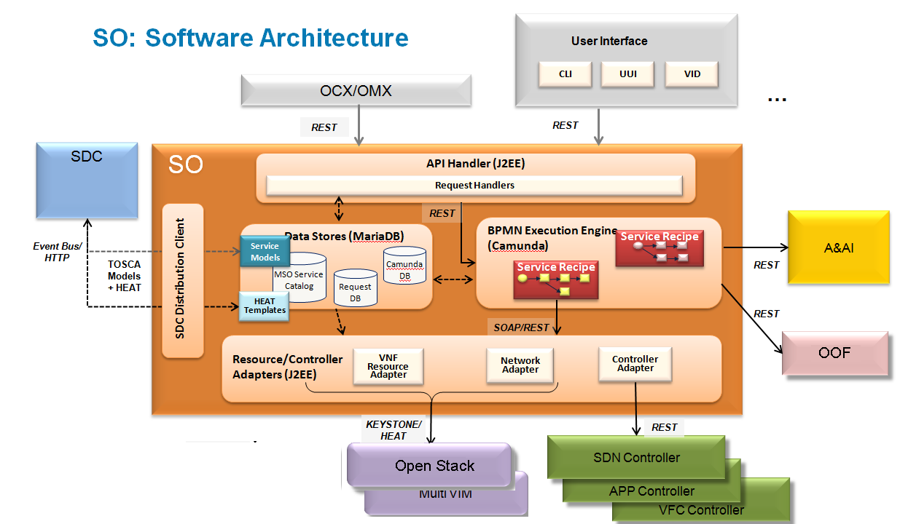

.. This work is licensed under a Creative Commons Attribution 4.0 International License.
.. http://creativecommons.org/licenses/by/4.0
.. Copyright 2018 Huawei Technologies Co., Ltd.
.. _architecture:

SO - Architecture
=================

SO Functional View
------------------

SO Deployment View
--------------------

.. image:: ../images/SO_Architecture_Internal.png

.. image:: ../images/so-architecture.png

SO Sub-Components
------------------

**API Handler**

  RESTful interface to northbound clients

* Handle service-level and infrastructure (VNF & network) requests

  Service-agnostic APIs
    * "Service Instantiation API"

  Model-driven recipe selection
    * Use SO Catalog to map input requests to BPMN flows
    * Dynamic lookup based on service-model + action
    * Input data forwarded to BPMN flow

  Track open and completed requests via SO Request DB

  Multiple API-H modules may support different APIs

**BPMN Execution Engine**

  Open-source Camunda platform
    * Support BPMN 2.0 service recipes

  Expose RESTful interface to API-H (unique path per recipe)

  Make use of common "building block" sub-flows

  Sequence orchestration steps for each Resource in the recipe
    * Request and configure network resources via SDN-C
    * Manage cloud resources via PO (OpenStack)
    * Update inventory via A&AI

  Perform error handling/rollback

**Resource Adapters**

  Interfaces to lower level controllers and other ONAP components
   * Platform Orchestrator, SDN-Controller, APP-Controller, VFC-Controllers, Multi-Cloud
   * Hides the details of complex interfaces (e.g. OpenStack APIs)
   * Expose interfaces to BPMN flows as SOAP or REST APIs
   * Support synchronous and asynchronous operations

  Provided as part of SO platform for use by all BPMN flows

  Use SO Catalog to map resource requests to a recipe/template

  Data-driven design
   * Catalog templates may be updated via self-service (outside of release cycles)
   * Merge input parameters with templates at run-time

**Data Stores**

  Request DB
   * Tracks open and completed requests

  SO Catalog
   * SO view of the SDC Catalog
      * service and resource models, recipes, and templates
   * Populated via SDC distribution service from TOSCA models

  Camunda DB
   * Maintain state for BPMN flows
   * Supports multiple active engines

**SDC Distribution Client**

  Receive updated service models from SDC
   * Event-bus notifications when new models available
   * HTTP retrieval of models (TOSCA) and artifacts (Heat)

  Receive distributions as TOSCA models

  Populate SO Catalog

  Support self-service updates to models and artifacts

**SO Monitoring**

  Monitor BPMN Workflow execution by providing
   * Service list search based on search criteria
   * Service statistic
   * Service Process Instance Rendering and Detail

**SO VNFM Adapter**

  Support external SVNFMs through SOL003 APIs
   * Create, Instantiate, Terminate and Delete VNF, including Granting, Subscription and Lifecycle Notifications
   * Tracking capability which VNFM instance has handled with which VNF instance
   * BPMN Building Block workflows and Java-based recipes for VNF LCM
   * VNFM Simulator for validating SO VNFM Adapter NBI and SBI for integration testing
   * The SO ETSI CSIT Tests and running them, https://wiki.onap.org/display/DW/SO+ETSI+CSIT
   * Testing the SO ETSI Alignment manually (Instantiate VNF using SVNFM), https://wiki.onap.org/pages/viewpage.action?pageId=68524128

Third Party and Open Source
---------------------------

**BPMN Engine**
  Camunda (open source)

**Other Open Source Components of Note:**
  Tomcat
  MySQL/MariaDB
  Openstack Java SDK ("woorea")
