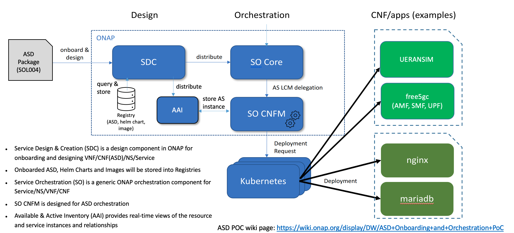

.. This work is licensed under a Creative Commons Attribution 4.0 International License.
.. http://creativecommons.org/licenses/by/4.0
.. Copyright 2017 Huawei Technologies Co., Ltd.

ASD Architecture
=======================

ASD Overview
-------------
Application Service Descriptor (ASD) is a deployment descriptor for cloud native application/functions. It seeks to provide deployment using the minimum information needed by the orchestrator.
The CSAR package adheres to ETSI SOL004.
ASD minimizes duplication whilst leveraging the management capabilities of the Kubernets platfor. It provides a clear separation between high level orchestration and cloud native application deployment.

ASD Architecture Overview
---------------------------

The following diagram depicts the ASD high-level architecture:

CreateVfModuleVolumeInfraV1 is a main process flow.

`ASD POC wiki page  <https://wiki.onap.org/display/DW/ASD+Onboarding+and+Orchestration+PoC>`_

ASD Onboarding
---------------------

The following diagram depicts the ASD onboarding to ONAP SDC:

ASD Orchestration by ONAP SO
---------------------------------

The following diagram depicts the ASD Orchestration by ONAP SO:

`AS LCM RESTful Protocols  <https://wiki.onap.org/display/DW/AS+LCM+RESTful+Protocols+for+SO+CNFM+Manager>`_

SO CNFM
-----------

The following diagram depicts the SO CNFM, an SO Plug-in component:

