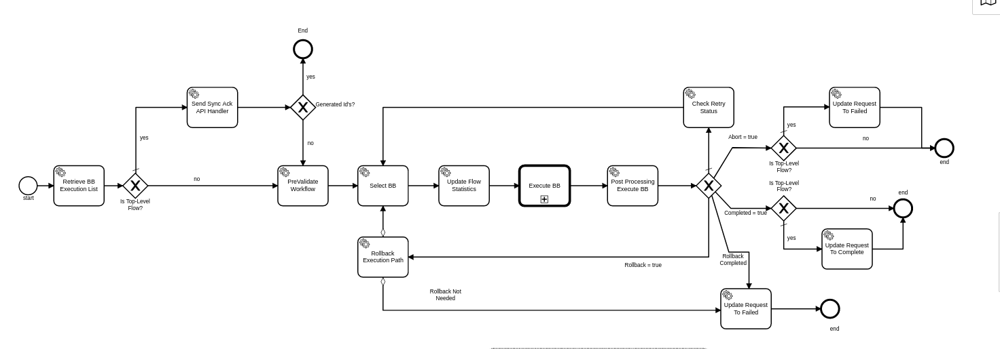
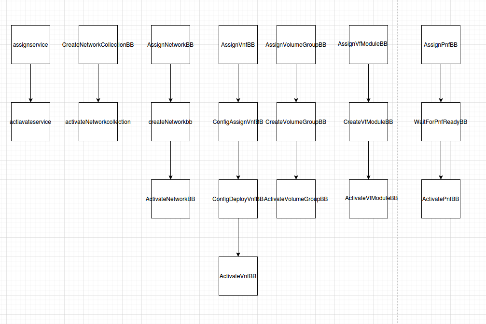
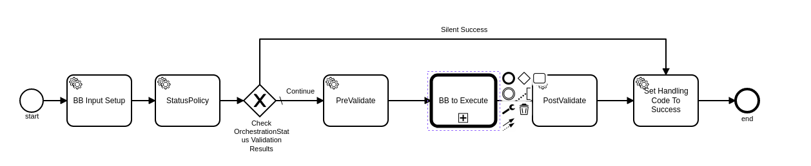
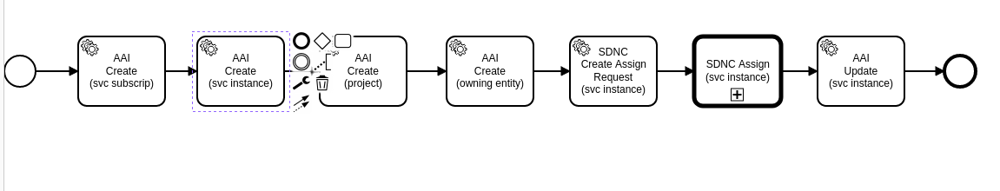

.. This work is licensed under a Creative Commons Attribution 4.0 International License.
.. http://creativecommons.org/licenses/by/4.0
.. Copyright 2018 Huawei Technologies Co., Ltd.

Building Block Understanding
============================

UNDERSTANDING BUILDING BLOCKS USING MACRO FLOW
----------------------------------------------

There are basically 2 flows - macro , a la carte.

In a la carte we manually will initiate each step for a process.

In macro , the whole flow happens at a single click - like if we want to create a service, the flow will itself look whether there are vnfs, pnfs or networks in the service and it will be created and activated in the flow also.

Thus these independent tasks like if vnf is present, then assign create and activate vnf are all taken up as individual building blocks and are only called on need basis.

Each and every request will reach to the api handler first.

API HANDLER( ServiceInstances.java )
------------------------------------

# 1. Rest call reaching SO Api handler with the input json - According to the below path it is mapped to the createServiceInstance function in ServiceInstances file.

curl -v -H "Content-Type: application/json" -X POST --data @serviceinstance.json -u mso_admin:password1$ http://localhost:8080/onap/so/infra/serviceInstantiation/v7/serviceInstances.

# 2. Herein a unique requestid is generated corresponding to every request, and is checked whether that particular requestid exists in request db (Happens in createServiceInstance in ServiceInstances).

 a. http://request-db-adapter:8083/infraActiveRequests/requestid (GET), which will return a 404 if not exists.

 b. CreateInstance is set to the action variable. Here the request scope is set to service from the inputjson - modelType.

# 3. Running local validations on input json.

# 4. create InfraActiveRequests, to store request details in request db adapter and as a payload to bpmn.

 a. A new InfraActiveRequests object is created. And all the necessary information from the input is set to it.

 b. Retrieving productFamilyName from the input json to put into requests db. http://aai/servicedesigncreation/services/service/{productfamilyid} (GET), which will return a 404 if not exists in aai. If service exists, then that service's serviceDescritiption is set as productfamilyName.

 c. http://aai/cloudinfrastructure/cloudregions/cloudregion/cloudowner/{lcpCloudRegionId}/tenants/tenant/{tenantId} (GET), checks for whether the particular cloud configuration exists in aai, if not exists returns 404.  If we are able to get, then the tenant's name derived from aai is set as tenantName.

 d. serviceInstanceNamee is derived from requestInfo.instanceName and is set.

 e. Request json is also set as RequestBody of InfraActiveRequests.

# 5. Checks fro whether duplicate name exists.

 a. version v[integer] is converted to the particular integer and stored.

 b. Checks whether instance name already exists in with a POST request in http://request-db-adapter:8083/infraActiveRequests/checkInstanceNameDuplicate, with the data { instanceIdmap = null, instanceName = {instanceName} , instanceservice = service } . It checks for the current progress and if in progress it throws the particular status.

# 6. Gets the orchestration url from the recipe table.

 a. Checks whether the service already exists in catalogdb http://catalog-db-adapter:8082/service/{modelNameVersionId} (GET).

 b. Checks the service recipe table with the modelNameVersionId and the action to be performed http://catalog-db-adapter:8082/serviceRecipe/search/findFirstByServiceModelUUIDAndAction?serviceModelUUID={modelNameVersionId}&action=createInstance . Returns a 404 if no recipe exists with the corresponding id.

 c. As recipe corresponding to this doesn't exist, we try to get with a default value. This flow comes under generic resource flow so the default value is GR-API-DEFAULT. First we get service with this value http://catalog-db-adapter:8082/service/search/findFirstByModelNameOrderByModelVersionDesc?modelName=GR-API-DEFAULT (GET). It returns a service with modelUUID as d88da85c-d9e8-4f73-b837-3a72a431622b, and further can be used to get the recipe.
 
 d. http://catalog-db-adapter:8082/serviceRecipe/search/findFirstByServiceModelUUIDAndAction?serviceModelUUID=d88da85c-d9e8-4f73-b837-3a72a431622b&action=createInstance (GET), gives a recipe which has a parameter "orchestrationUri" as "/mso/async/services/WorkflowActionBB". 

# 7. Updates the infraActiveRequests with the current request.
 a. http://request-db-adapter:8083/infraActiveRequests/ (POST) with the data formed. And a 201 created response is received.

# 8. Call the bpmn with a post call on orchestrationUri. The data to bpmn is prepared having parameters like 
 a. bpmnRequest - formed from input request.

 b. vfModuleId, pnfCorrelationId, networkId, configurationId, vfModuleType, serviceInstanceId , serviceType are updated if present in the input json or else set to empty string.

 c. apiVersion , requestId, aLaCarte = false (def), recipeTimeout = 180(def), requestAction= createInstance are all updated accordingly.

 d. requestUri - v7/serviceInstances ,which is formed from the request url.

# 9. A sync response is obtained on reaching bpmn like {"requestReferences":{"requestId":"c45702f7-3f08-4081-bc98-2f9f18b81607","instanceId":"cadca18f-9bff-44be-8910-ad29d342e91f","requestSelfLink":"http://159.138.57.166:30277/orchestrationRequests/v7/c45702f7-3f08-4081-bc98-2f9f18b81607"}}.

BPMN
-----

Hits WorkflowActionBB.bpmn
--------------------------

# 1. RetrieveBBExecutionList - implemented in selectExecutionList in WorkflowAction.java

a. resourcetype, resourceid are formed from matching the requestUri to a regex pattern matcher [pattern=[vV]\d+.*?(?:(?:/(?<type>vnfs|vfModules|networks|networkCollections|volumeGroups|serviceInstances|instanceGroups)(?:/(?<id>[^/]+))?)(?:/(?<action>[^/]+))?(?:/resume)?)] .

b. Checks whether there is a service subscription with service instance name as {instanceName} correspoding to the customer in aai https://aai.onap:8443/aai/v19/business/customers/customer/slice1/service-subscriptions/service-subscription/service/service-instances?depth=2&resultIndex=0&resultSize=1&service-instance-name={instanceName}. Returns 404 not found, if it doesnt exists then the id of that particular instance is taken and given as both the resourceid and serviceinstance id. If not present then a random value is generated, and is assigned same to both.

c. Checks whether there is a service of the particular serviceInstanceId exists in aai. https://aai.onap:8443/aai/v19/nodes/service-instances/service-instance/{serviceInstanceId} , returns not found if it doesnt exist. If service with corresponding instance name already exists , then flowsToExecute is got by quering the requestdbadapter with the earlier request id.  If not present, then only orchestrationflows are got, and later from that the flowsToExecute are found out.

d. Get the particular service from catalogdb . http://so-catalog-db-adapter.onap:8082/service/{modelNameVersionId}  (GET). Be sure that the service with this particular modelNameVersionId exists in catalogdb, because based on the services (like whether pnf, or vnf, or networkcollection) present in that particular service, which all bbs to execute are decided.

e. This being a service, "service" is added to the resource list. And is checked upon for other resources like vnf and   network, eg:

 http://so-catalog-db-adapter.onap:8082/service/{modelNameVersionId}/vnfCustomizations (GET)
 http://so-catalog-db-adapter.onap:8082/service/{modelNameVersionId}/collectionResourceCustomizations (GET)
 http://so-catalog-db-adapter.onap:8082/service/{modelNameVersionId}/networkCustomizations (GET)
 And depending on the reources in the service, the resources found is updated like
 Found :Service - 1    Vnf - 0    Pnf - 0    VfModule - 0    VolumeGroup - 0    Network - 0    VirtualLink - 0    NetworkCollection - 0    Configuration - 0    InstanceGroup - 0 

f. Then the orchestration flows are get from the orchestration_flow_table depending on the cloudowner and request scope: http://so-catalog-db-adapter.onap:8082/northbound_request_ref_lookup/search/findOneByActionAndRequestScopeAndIsAlacarteAndCloudOwnerAndServiceType action=createInstance&requestScope=Service&isALaCarte=false&cloudOwner={CloudOwner}&serviceType=%2A (GET) Here if present, then the orchestration flows are returned or else with default cloud owner, we try again

http://so-catalog-db-adapter.onap:8082/northbound_request_ref_lookup/search/findOneByActionAndRequestScopeAndIsAlacarteAndCloudOwnerAndServiceType?action=createInstance&requestScope=Service&isALaCarte=false&cloudOwner=DEFAULT&serviceType=%2A (GET)
Here in northBoundRequest is returned which has the parameter orchestrationFlowList, that contains the link that will return the orchestration flows.

"orchestrationFlowList" : { "href" : "http://so-catalog-db-adapter.onap:8082/northbound_request_ref_lookup/101/orchestrationFlowList"} 

Now we do a get on the orchestration flow link to get the set of orchestartion flows required
http://so-catalog-db-adapter.onap:8082/northbound_request_ref_lookup/101/orchestrationFlowList.
Here a set of 20 orchestration flows are returned under the action of Service-Macro-Create, each with a sequence no assigned sequentially in the given order
AssignServiceInstanceBB, 

CreateNetworkCollectionBB,

AssignNetworkBB,

AssignVnfBB, 

AssignVolumeGroupBB,

AssignVfModuleBB,

ConfigAssignVnfBB,

AssignPnfBB, 

WaitForPnfReadyBB,

ActivatePnfBB,

CreateNetworkBB,

ActivateNetworkBB,

CreateVolumeGroupBB, 

ActivateVolumeGroupBB, 

CreateVfModuleBB,

ActivateVfModuleBB, 

ConfigDeployVnfBB,

ActivateVnfBB, 

ActivateNetworkCollectionBB,

ActivateServiceInstanceBB.

g. Flows to execute is determined by iterating through all the orchestartion flows and matching it with the found resources. It is merely a contains matching. In this particular as service was the only resource : List of BuildingBlocks to execute:AssignServiceInstanceBB, ActivateServiceInstanceBB.

h. processing data is added to the requestdbadapter. Here the data is post to the requestdb as two different building blocks http://so-request-db-adapter.onap:8083/requestProcessingData.

i. The already stored request details in request db is ammended like "lastModifiedBy" : "CamundaBPMN" , and status to in_progress with a put request.

# 2. sendSyncAck -  This was used to give an acknowledgement , with status code as 200, and requestId and resourceId is sent as content.

# 3. Prevalidate the workflow

# 4. SelectBB - implemented in selectBBin WorkflowActionBBTasks
This is used to select the building block from the flows to execute depending on the sequence order.

 a. Depending on the current sequence , the building block is selected from the flows to execute.
 
 b. Execution variable, that is passed between the different building blocks as the payload is ammended as:

  execution.setVariable("buildingBlock", buildingblockselected).

 c. current sequence is incremented by 1, and updated in execution variable.

 d. Depending on whether currentSequence is greater than flowsToExecute.size(), COMPLETED variable is either set to true or false.

# 5. updateFlowStatistics - implemented in updateFlowStatistics in WorkflowActionBBTasks
a. Depending on the current sequence no, the completed bb and next bb is got from the flows to execute. And these are mentioned in a statusMessage.
b. Percentage progress is got from the total no of bbs
c. These are ammended to the already present request in the request db

# 6. Execute BB - calls the ExecuteBuildingBlock.bpmn

-------------------------------------------------------------------------------------------------------------------------------------------------------------------------------------------------------------------------------------------------

Hits ExecuteBuildingBlock.bpmn
------------------------------

# 1. BBInputSetup - implemented in execute in BBInputSetup
Here a generalbuildingblock is formed from executingbuildingblock after certain updations and validations.

 a. lookupKeyMap is formed from the input , and a map is formed with serviceInstanceId, networkID, vnfID, pnfID, vfmoduleID, volumegroupID, configurationID, instancegroupID as the keys.

 b. Depending on whether a la carte or macro , different flows are called. getGBBMacro is called in here.

 c. In getGBBMacro , a valid customer is got with service subscription.(getCustomerAndServiceSubscription)

  First a customer is got by get request on https://aai.onap:8443/aai/v19/business/customers/customer/{globalSubscriberId}

  After that ServiceSubscription is got by doing a get request
  https://aai.onap:8443/aai/v19/business/customers/customer/{globalSubscriberId}/service-subscriptions/service-subscription/service

  If, the above request doesnt give any , then ServiceSubscription is fetched by first creating uri keys
  https://aai.onap:8443/aai/v19/nodes/service-instances/service-instance/{resourceId}?format=pathed.
  Then ServiceSubscription is got from the globalSubscriberId and the uri keys

'Note': a valid customer and a corresponding ServiceSubscription must be present in the aai, for setting up the customer to gbuildingblock

 d. project and owningEntity is updated from the input

 e. service is got from the catalog db either by ModelVersionId or by ModelVersion and ModelInvariantId.

 f. ServiceInstance is created from the above parameters, and this ServiceInstance is used in the preparation of general building block.

 g. Depending on whether the current executing block name contains either of the network, or configuration, or network collection. A new instance of the corresponding type is created and is updated to the general building block (Happens in getGBBMacroNoUserParamsCreate)

 h. This general building block is set to the gBuildingBlockExecution and gBBInput parameter of execution.

# 2. StatusPolicy - implemented in validateOrchestrationStatus in OrchestrationStatusValidator. Input being gBuildingBlockExecution
 a. orchestrationStatus is obtained after checking the resource type. We had updated the orchestrationStatus in the above step when a new service instance was created.
 b. OrchestrationStatusStateTransitionDirective is got by doing a get call to the catlog db with the url as findOneByResourceTypeAndOrchestrationStatusAndTargetAction
http://so-catalog-db-adapter.onap:8082/orchestrationStatusStateTransitionDirective/search/findOneByResourceTypeAndOrchestrationStatusAndTargetAction?resourceType=SERVICE&orchestrationStatus=PRECREATED&targetAction=ASSIGN
 c. orchestrationStatusValidationResult parameter is set to execution variable from the OrchestrationStatusStateTransitionDirective.getFlowDirective() "flowDirective" : "CONTINUE"

# 3. Prevalidate the gBuildingBlockExecution

# 4. BB To Execute: Depending on which building block is to be executed, that particular bpmn is called .In this case, AssignServiceInstanceBB is called

-------------------------------------------------------------------------------------------------------------------------

Hits AssignServiceInstanceBB.bpmn
---------------------------------

# 1. AAI create service subscription - implemented in createServiceSubscription of createAAITasks
This method is used for creating and subscribing the service in A&AI

 a. Customer is got from the general building block that was updated above

 b. Here a serviceSubscriptionURI is formed by taking in the globalSubscriberId and the serviceType

 c. If a service subscription for the particular customer doesnt exist in AAI, then a new subscription is created by taking in the serviceSubscriptionURI

GET performed on uri:https://aai.onap:8443/aai/v19/business/customers/customer/slice1/service-subscriptions/service-subscription/service?
{"results":[{"service-subscription":1}]}

# 2. AAI create service instance - implemented in createServiceInstance of createAAITasks
This method is used for creating the service instance in A&AI

 a. Customer is got from the general building block that was updated above

 b. A serviceInstanceURI is formed by taking in the globalSubscriberId, the serviceType and the service instance id

 c. If the service instance in the particular path doesnt exist in AAI , then a new service instance is created by using the serviceInstanceURI

GET to:https://aai.onap:8443/aai/v19/business/customers/customer/slice1/service-subscriptions/service-subscription/service/service-instances/service-instance/2b955def-e536-40ee-84cb-3f06e3cc6d84?
response: {"requestError":{"serviceException":{"messageId":"SVC3001","text":"Resource not found for %1 using id %2 (msg=%3) (ec=%4)","variables":["GET","business/customers/customer/slice1/service-subscriptions/service-subscription/service/service-instances/service-instance/2b955def-e536-40ee-84cb-3f06e3cc6d84","Node Not Found:No Node of type service-instance found at: business/customers/customer/slice1/service-subscriptions/service-subscription/service/service-instances/service-instance/2b955def-e536-40ee-84cb-3f06e3cc6d84","ERR.5.4.6114"]}}}

Sending HTTP PUT to:https://aai.onap:8443/aai/v19/business/customers/customer/slice1/service-subscriptions/service-subscription/service/service-instances/service-instance/2b955def-e536-40ee-84cb-3f06e3cc6d84 
with req body : {"service-instance-id":"2b955def-e536-40ee-84cb-3f06e3cc6d84","service-instance-name":"DEMO_123456","model-invariant-id":"944862ae-bb65-4429-8330-a6c9170d6672","model-version-id":"d88da85c-d9e8-4f73-b837-3a72a431622b","orchestration-status":"Inventoried"}

# 3. AAI create project - implemented in createProject of createAAITasks
This method is used for creation of the project A&AI. Here too it checks whether a project with a  {projectName} exist in AAI . If not it creates one, and connects it to the service instance identified by the serviceInstanceId
Sending HTTP PUT to:https://aai.onap:8443/aai/v19/business/projects/project/name%20of%20proj/relationship-list/relationship
with req body: {"related-link":"/business/customers/customer/slice1/service-subscriptions/service-subscription/service/service-instances/service-instance/2b955def-e536-40ee-84cb-3f06e3cc6d84"}

# 4. AAI create owning entity -  implemented in createOwningEntity of createAAITasks

 a. OwningEntityId and OwningEntityName is extracted from the OwningEntity given in the input json

 b. If both of them are null, then an exception is raised.

 c. If only OwningEntityId is null, then whether the OwningEntityName is present in AAI is checked. If present then OwningEntityId is set by quering the OwningEntity from AAI. And then connect it to the service instance. If not present in the aai then a random id is generated and assigned to  OwningEntityId. Then Owning entity is first created and then connected to the service instance

 d. Depending on whether the owning entity is already present or not, either createOwningEntityandConnectServiceInstance is called, or connectOwningEntityandServiceInstanceis called.

Sending HTTP PUT to:https://aai.onap:8443/aai/v19/business/owning-entities/owning-entity/owningEntityIdof%20owningEntity/relationship-list/relationship
req body: {"related-link":"/business/customers/customer/slice1/service-subscriptions/service-subscription/service/service-instances/service-instance/2b955def-e536-40ee-84cb-3f06e3cc6d84"}

# 5. SDNC Create Assign Request - implemented in assignServiceInstance of SDNCAssignTasks

 a. Here first the requestContext, serviceInstance, customer are obtained from the general building block

 b. Then a payload for the assignServiceInstance of the sdnc is formed by passing in the above parameters to the assignServiceInstance in sdncSIResources.

 c. A new sdnc request is formed with the above thing as payload

 d. This sdnc request is assigned to the SDNCRequest parameter of the execution variable

.. code-block:: bash

 {"input":{
  "request-information" : {
    "request-action" : "CreateServiceInstance",
    "source" : "MSO",
    "request-id" : "139636cd-4b69-4c3a-9e67-fed2c283baee"

  },
  "sdnc-request-header" : {

    "svc-request-id" : "9bfe8cb0-bb8b-4dca-949d-2f2b51011b54",
    "svc-action" : "assign"

  },
  "service-information" : {

    "onap-model-information" : {
      "model-name" : "GR-API-DEFAULT",
      "model-version" : "1.0",
      "model-uuid" : "d88da85c-d9e8-4f73-b837-3a72a431622b",
      "model-invariant-uuid" : "944862ae-bb65-4429-8330-a6c9170d6672"

    },
    "subscription-service-type" : "service",
    "service-id" : "2b955def-e536-40ee-84cb-3f06e3cc6d84",
    "global-customer-id" : {global_customerid},
    "service-instance-id" : "2b955def-e536-40ee-84cb-3f06e3cc6d84"

  },
  "service-request-input" : {

    "service-input-parameters" : {
      "param" : [ {
        "name" : "some name",
        "value" : "some value"

      } ]

    },
    "service-instance-name" : {instance_name}
  }
 }}

# 6. It calls another bpmn file - SDNCHandler.bpmn

 a. Setup callback variables -  Here mainly the correlator variable and the sdnc timeout variable is set

 b. callSDNC -  Here post call to sdnc client is done with the above prepared payload. And then isSDNCCompleted is set to the execution variable

Both the above tasks are implemented in SDNCRequestTasks.
http://sdnc-oam.onap:8282/restconf/operations/GENERIC-RESOURCE-API:service-topology-operation/

# 7. AAI Update (svc instance)- implemented in th updateOrchestrationStatusAssignedService in AAIUpdateTasks
 BPMN access method to update the status of Service to Assigned in AAI.
 Here serviceInstance is obtained , then its orchestration status is changed to assigned  and is updated in the AAI

--------------------------------------------------------------------------------------------------------------------------------------------------------------------------------------------------------------------------------------------------

Reaches back to ExecuteBuildingBlock.bpmn

# 5. Post validate the generic building block

# 6. Set Handling Code To Success - implemented in setHandlingStatusSuccess in ExecuteBuildingBlockRainyDay
handling code is set to success for the execution variable

-------------------------------------------------------------------------------------------------------------------------------------------------------------------------------------------------------------------------------------------------

Reaches back to WorkflowActionBB.bpmn

# 7. postProcessingExecuteBB 
If the building block excuted is ActivateVfModuleBB, then a postProcessingExecuteBBActivateVfModule needs to be executed

Then again it is looped back to selectBB through a checkRetryStatus block.
This block comes into play only if the handlingCode is retry, and the retry count is lesser than the maximum allowed no of retries, then the current sequence is again reduced by 1 , so that the same block is executed again.Request in the requestdb is updated with a setRetryStatusMessage, keeping an eye on the no of retries executed.

And in this particular example ActivateServiceInstanceBB.bpmn is called next in the sequence.
Here updateOrchestrationStatusActiveService is called, which is BPMN access method to update status of Service to Active in AAI. Here orchestrationStatus is set to active for the particular service instance and is updated in the AAI .

# 8. updateRequestStatusToComplete is called if the "complete" flag is true
 a. Here first the request is got from the requestDbclient http://request-db-adapter:8083/infraActiveRequests/requestid 

 b. Then a status message is formed as "Macro-" + resourceName + "-" + action + " request was executed correctly."

   This status message is updated in the request as well as is set to finalStatusMessage of the execution variable

 c. Other request parameters are updated

  request.setEndTime(endTime);

  request.setFlowStatus("Successfully completed all Building Blocks");

  request.setProgress(Long.valueOf(100));

  request.setRequestStatus("COMPLETE");

  request.setLastModifiedBy("CamundaBPMN");

 d. This new request parameters are updated by a put request to the requestDbclient

Flow ends
----------

If there are other resources present along with the service : Eg :- Volumegroup.( These BBs wil be specifically called ) 

1) AssignVolumeGroupBB :
 
 a. genericvnfid and volumegroupid is obtained from the execution block.
 b. volumegroup orchestrationstatus is set to assigned
 c. a volume group of the above details is created in aai
 d. connect volumegroup to this genericvnf
 e. cloud configuration is got, and then the volumegroup is linked to tenant

2) createVolumeGroupBB :

 a. get the vf details according to Vf module id from sdnc.
 b. vfmodulequeriedfromsdnc is set to the executionvariable.
 c. createVolumeGroupRequest is formed with getCloudRegion, serviceinstance, genericVnf, volumegroup, sdncVfModuleQueryResponse.
 d. calls vnfadapter, which in turn calls openstackadaptertask.
 e. update heattask in the volumegroup and which is ammended in the aai.
 f. orchestrationstatus for the volume group is set to created.

3) ActivateVolumeGroupBB :

 orchestrationstatus for the volume group is ammended to active.

