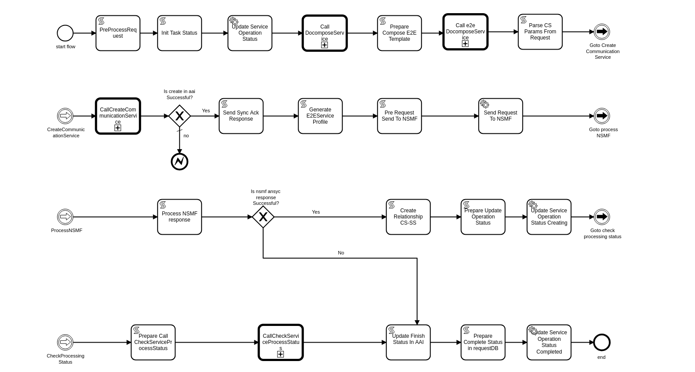

.. This work is licensed under a Creative Commons Attribution 4.0 International License.
.. http://creativecommons.org/licenses/by/4.0
.. Copyright 2017 Huawei Technologies Co., Ltd.

CODE FLOWS OF BPMN-INFRA
========================

API Handler is a SO Component. Every Rest API will first reach to the API Handler. Curl command which is mentioned below will directly hit to the E2EServiceInstances.java file of the API Handler component.

API HANDLER ( E2EServiceInstances.java )
----------------------------------------

curl -v -H "Content-Type: application/json" -X POST --data @request_body_file_name.json -u mso_admin:password1$ http://localhost:8080/onap/so/infra/e2eServiceInstances/v3

.. code-block:: bash

 Request Body:

 {
   "service":{
       "name":"SliceService",
       "description":"SliceService",
       "serviceInvariantUuid":"dfcd7471-16c7-444e-8268-d4c50d90593a",
       "serviceUuid":"dfcd7471-16c7-444e-8268-d4c50d90593a",
       "globalSubscriberId":"test_custormer",
       "serviceType":"embb",
       "parameters":{
           "locationConstraints":[
           ],
           "resources":[
               {
                   "resourceIndex":"1",
                   "resourceName":"allottedResource",
                   "resourceInvariantUuid":"eeefcd86-7b5b-41ae-9516-08acc5d59d92",
                   "resourceUuid":"265da937-76c7-4152-98e3-5f0d0a844b7f",
                   "resourceCustomizationUuid":"a4eda1d9-1af4-424b-997f-12c57b74c67a",
                   "parameters":{
                       "locationConstraints":[
                       ],
                       "resources":[
                       ],
                       "requestInputs":{
                   }
                   }
               }
           ],
           "requestInputs":{
			   "sST": "embb",
               "sNSSAI": "1-10101",
               "uEMobilityLevel": "stationary",
               "areaTrafficCapDL": 123,
               "maxNumberofUEs": 1000,
               "expDataRateUL": 2000,
               "plmnIdList": "39-00|39-01",
               "areaTrafficCapUL": 456,
               "latency": 300,
               "expDataRateDL": 400,
               "coverageAreaTAList": 101001,
               "activityFactor": 99,
               "resourceSharingLevel": "shared",
              "nstar0_allottedresource0_providing_service_uuid": "4e8d930b-7483-4b9b-8c82-4708638ade4a",
              "nstar0_allottedresource0_providing_service_invariant_uuid": "1899e5c1-df4e-43a8-a889-48c157dad7bc"
           }
       }
   }

.. code-block:: bash

 Response body:
 
  {
    "service": { 
        "serviceId": "ebe2d37f-f65b-43d8-8906-f81811ed8f22",
        "operationId": "ed9b4c84-17db-4874-8896-25324a0401fe"
    }
 }

Code flows:
-----------
1. It reaches to the E2EServiceInstances.java file of API-Handeler infra project and Input json is mapped to the createE2EServiceInstance method

2. A unique request id is generated corresponding to every request and checked if request Id already exists in requestdb 
   InfraActiveReqest table

 a. http://request-db-adapter:8083/infraActiveRequests/requestID (GET), which will return a 404 if not exists
 b. createInstance is set to the action variable

3. Running local validations on input json.

4. Gets the orchestration url from the recipe table

 a. Checks whether the service already exists in catalogdb http://catalog-db-adapter:8082/service/{modelNameVersionId} 
 (GET)

 b. Checks the service recipe table with the modelNameVersionId and the action to be perfomed http://catalog-db- 
 adapter:8082/serviceRecipe/search/findFirstByServiceModelUUIDAndAction?serviceModelUUID= 
 {modelNameVersionId}&action=createInstance . Returns a 404 if no recipe exists with the corresponding id.
 
 c. As recipe corresponding to this doesnt exist, we try to get with a default value. This flow comes under default flow 
 so the defaultvalue is UUI_DEFAULT. First we get service with this value
 http://catalog-db-adapter:8082/service/search/findFirstByModelNameOrderByModelVersionDesc?modelName=UUI_DEFAULT (GET) . 
 It returns a service with modelUUID as dfcd7471-16c7-444e-8268-d4c50d90593a, and further can be used to get the recipe 
 .
 
 d. http://so-catalog-db-adapter.onap:8082/serviceRecipe/search/findFirstByServiceModelUUIDAndAction? 
 serviceModelUUID=dfcd7471-16c7-444e-8268-d4c50d90593a&action=createInstance gives a recipe which has a parameter 
 "orchestrationUri" as "/mso/async/services/CreateCustomE2EServiceInstance" 

BPMN-INFRA
----------

Hits CreateCustomE2EServiceInstances

Address: http://bpmn-infra:8081/mso/async/services/CreateCustomE2EServiceInstance

Payload will be reaching to bpmn in the form of:

.. code-block:: bash

 {
   "variables": {
      "bpmnRequest": {
         "value": {
            "requestDetails": {
               "modelInfo": {
                  "modelInvariantId": "699dd37d-c82f-4bd5-adec-856900fc2796",
                  "modelType": "service",
                  "modelNameVersionId": "0692e0c9-8913-41ca-893a-58626f4afff2",
                  "modelName": "voLTE",
                  "modelVersion": "1.0",
                  "modelVersionId": "0692e0c9-8913-41ca-893a-58626f4afff2",
                  "modelUuid": "0692e0c9-8913-41ca-893a-58626f4afff2",
                  "modelInvariantUuid": "699dd37d-c82f-4bd5-adec-856900fc2796"
               },
               "requestInfo": {
                  "source": "UUI",
                  "instanceName": "SliceService",
                  "suppressRollback": true
               },
               "subscriberInfo": {
                  "globalSubscriberId": "test_custormer"
               },
               "requestParameters": {
                  "subscriptionServiceType": "MOG",
                  "userParams": [
                     {
                        "ServiceInstanceName": "SliceService",
                        "UUIRequest": {
                           "service": {
                              "name": "SliceService",
                              "description": "SliceService",
                              "serviceInvariantUuid": "699dd37d-c82f-4bd5-adec-856900fc2796",
                              "serviceUuid": "0692e0c9-8913-41ca-893a-58626f4afff2",
                              "globalSubscriberId": "test_custormer",
                              "serviceType": "embb",
                              "parameters": {
                                 "locationConstraints": [],
                                 "resources": [
                                    {
                                       "resourceIndex": "1",
                                       "resourceName": "allottedResource",
                                       "resourceInvariantUuid": "eeefcd86-7b5b-41ae-9516-08acc5d59d92",
                                       "resourceUuid": "265da937-76c7-4152-98e3-5f0d0a844b7f",
                                       "resourceCustomizationUuid": "a4eda1d9-1af4-424b-997f-12c57b74c67a",
                                       "parameters": {
                                          "locationConstraints": [],
                                          "resources": [],
                                          "requestInputs": {}
                                       }
                                    }
                                 ],
                                 "requestInputs": {
                                    "sST": "embb",
                                    "sNSSAI": "1-10101",
                                    "uEMobilityLevel": "stationary",
                                    "areaTrafficCapDL": 123,
                                    "maxNumberofUEs": 1000,
                                    "expDataRateUL": 2000,
                                    "plmnIdList": "39-00|39-01",
                                    "areaTrafficCapUL": 456,
                                    "latency": 300,
                                    "expDataRateDL": 400,
                                    "coverageAreaTAList": 101001,
                                    "activityFactor": 99,
                                    "resourceSharingLevel": "shared",
                                    "nstar0_allottedresource0_providing_service_uuid": "4e8d930b-7483-4b9b-8c82-4708638ade4a",
                                    "nstar0_allottedresource0_providing_service_invariant_uuid": "1899e5c1-df4e-43a8-a889-48c157dad7bc"
                                 }
                              }
                           }
                        }
                     }
                  ],
                  "aLaCarte": true,
                  "usePreload": true
               }
            },
            "serviceInstanceId": null,
            "vnfInstanceId": null,
            "pnfName": null,
            "networkInstanceId": null,
            "volumeGroupInstanceId": null,
            "vfModuleInstanceId": null,
            "configurationId": null,
            "instanceGroupId": null
         },
         "type": "String"
      },
      "requestId": {
         "value": "6fa42cd2-4f49-4e2c-92fb-fae133277e9e",
         "type": "String"
      },
      "mso-request-id": {
         "value": "6fa42cd2-4f49-4e2c-92fb-fae133277e9e",
         "type": "String"
      },
      "isBaseVfModule": {
         "value": false,
         "type": "Boolean"
      },
      "recipeTimeout": {
         "value": 180,
         "type": "Integer"
      },
      "requestAction": {
         "value": "createInstance",
         "type": "String"
      },
      "serviceInstanceId": {
         "value": "",
         "type": "String"
      },
      "pnfCorrelationId": {
         "value": "",
         "type": "String"
      },
      "vnfId": {
         "value": "",
         "type": "String"
      },
      "vfModuleId": {
         "value": "",
         "type": "String"
      },
      "volumeGroupId": {
         "value": "",
         "type": "String"
      },
      "networkId": {
         "value": "",
         "type": "String"
      },
      "configurationId": {
         "value": "",
         "type": "String"
      },
      "serviceType": {
         "value": "embb",
         "type": "String"
      },
      "vnfType": {
         "value": "",
         "type": "String"
      },
      "vfModuleType": {
         "value": "",
         "type": "String"
      },
      "networkType": {
         "value": "",
         "type": "String"
      },
      "recipeParams": {
         "value": null,
         "type": "String"
      },
      "host": {
         "value": null,
         "type": "String"
      },
      "operationType": {
         "value": "",
         "type": "String"
      },
      "apiVersion": {
         "value": "v3",
         "type": "String"
      },
      "aLaCarte": {
         "value": false,
         "type": "Boolean"
      },
      "requestUri": {
         "value": "",
         "type": "String"
      },
      "instanceGroupId": {
         "value": "",
         "type": "String"
      },
      "generateIdsOnly": {
         "value": false,
         "type": "Boolean"
      }
   }
 }

Based on the serviceUuid which is mentioned in the request body it will call the the CreateCommunicationService.bpmn file and This CreateCommunicationService.bpmn is taken as a example to this workflow Understanding which then call the subprocess of this flow and so on.

1. CreateCommunicationService -> preProcessRequest()

 a. Get Input Request will be logged as shown above
 b. Get Request ID
 c. Here ServiceInstanceId is null so serviceInstanceId is generated randomly.
 d. Input productFamilyId is null
 e. Now it will get the user input parameter from the request json.

2. CreateCommunicationService--> prepareInitOperationStatus

 a. Generate a new operation based on serviceInstanceId and operationId
 b. call to prepareUpdateOperationStatus() method

3. RequestDBUtil--> prepareUpdateOperationStatus()

 a. This method will be called to update the operation status in the requestDB
 b. Exit prepareUpdateOperationStatus()
 c. Exit prepareInitOperationStatus()

4. Based on the bpmn structure DecomposeService class is called 

 a. This class takes input as 

  - msoRequestId
  - isDebugLogEnabled
  - serviceInstanceId
  - serviceModelInfo
  - requestParameters
 
 b. Sent GET request to catalogdb to fetch the data based on serviceModelInvariantId and modelVersion
    http://so-catalog-db-adapter.onap:8082/ecomp/mso/catalog/v2/{serviceModelUuid}
 
 c. Response from catalogdb will be looking like:

.. code-block:: bash

 {
   "serviceResources": {
      "modelInfo": {
         "modelName": "CST",
         "modelUuid": "bfc2775b-64ad-41e5-95fe-d3bc57df6c73",
         "modelInvariantUuid": "d4df55ca-c985-46c9-8088-f952181f553e",
         "modelVersion": "1.0"
      },
      "serviceType": "embb",
      "serviceRole": "",
      "environmentContext": "General_Revenue-Bearing",
      "resourceOrder": "ServiceProfile Service Proxy",
      "workloadContext": "Production",
      "serviceVnfs": [],
      "serviceNetworks": [],
      "serviceInfo": {
         "id": 11,
         "serviceInput": [
            {
               "default": true,
               "name": "skip_post_instantiation_configuration",
               "type": "boolean",
               "required": false
            },
            {
               "default": "",
               "name": "useInterval",
               "type": "string",
               "required": false
            },
            {
               "default": "SO-REF-DATA",
               "name": "controller_actor",
               "type": "string",
               "required": false
            },
            {
               "default": "",
               "name": "maxNumberofUEs",
               "type": "integer",
               "required": false
            },
            {
               "default": "",
               "name": "latency",
               "type": "integer",
               "required": false
            },
            {
               "default": "",
               "name": "cds_model_version",
               "type": "string",
               "required": false
            },
            {
               "default": "",
               "name": "uEMobilityLevel",
               "type": "string",
               "required": false
            },
            {
               "default": "",
               "name": "cds_model_name",
               "type": "string",
               "required": false
            },
            {
               "default": "",
               "name": "expDataRateUL",
               "type": "integer",
               "required": false
            },
            {
               "default": "",
               "name": "expDataRateDL",
               "type": "integer",
               "required": false
            },
            {
               "default": "",
               "name": "coverageAreaList",
               "type": "string",
               "required": false
            },
            {
               "default": "",
               "name": "resourceSharingLevel",
               "type": "string",
               "required": false
            }
         ],
         "serviceProperties": [
            {
               "default": true,
               "name": "skip_post_instantiation_configuration",
               "type": "boolean",
               "constraints": [
                  {
                     "valid_values": [
                        true,
                        false
                     ]
                  }
               ]
            },
            {
               "default": "SO-REF-DATA",
               "name": "controller_actor",
               "type": "string",
               "constraints": [
                  {
                     "valid_values": [
                        "SO-REF-DATA",
                        "CDS",
                        "SDNC",
                        "APPC"
                     ]
                  }
               ]
            },
            {
               "name": "maxNumberofUEs",
               "type": "integer",
               "required": false
            },
            {
               "name": "latency",
               "type": "integer",
               "required": false
            },
            {
               "name": "expDataRateUL",
               "type": "integer",
               "required": false
            },
            {
               "name": "sNSSAI",
               "type": "string",
               "required": false
            },
            {
               "name": "useInterval",
               "type": "string",
               "required": false
            },
            {
               "default": "39-00",
               "name": "plmnIdList",
               "type": "string",
               "required": false
            },
            {
               "name": "cds_model_version",
               "type": "string"
            },
            {
               "name": "uEMobilityLevel",
               "type": "string",
               "required": false
            },
            {
               "name": "cds_model_name",
               "type": "string"
            },
            {
               "name": "expDataRateDL",
               "type": "integer",
               "required": false
            },
            {
               "name": "coverageAreaList",
               "type": "string",
               "required": false
            },
            {
               "name": "resourceSharingLevel",
               "type": "string",
               "required": false
            }
         ],
         "serviceArtifact": []
      },
      "serviceProxy": [
         {
            "modelInfo": {
               "modelName": "ServiceProfile Service Proxy",
               "modelUuid": "ed00301c-51ec-46a4-b766-e3af50c210d2",
               "modelInvariantUuid": "071d426c-3f9b-44a9-9757-422043d80fc1",
               "modelVersion": "1.0",
               "modelCustomizationUuid": "81c5a468-37d3-4d8d-95f5-e72b0933d3d4",
               "modelInstanceName": "serviceprofile_proxy 0"
            },
            "toscaNodeType": "org.openecomp.nodes.serviceprofile_proxy",
            "description": "A Proxy for Service ServiceProfile",
            "sourceModelUuid": "94553b32-e075-4cb0-b309-dd318ebbf670"
         }
      ],
      "serviceAllottedResources": []
   }
 }

5. CreateCommunicationService--> prepareDoComposeE2E()

 a. To decompose the service based on serviceModelUuid

6. CreateCommunicationService--> parseCSParamsFromReq()

 a. To parse the CreateCommunication parameter Request from the Request json

7. Now sending PUT request to AAI based on globalSubscriberId and serviceType

 a. https://aai.onap:8443/aai/v19/business/customers/customer/{globalSubscriberId}/service-subscriptions/service- 
    subscription/{seviceType}/service-instances/service-instance/{serviceInstanceId}

 b. Customer can be got by GET request with  
    https://aai.onap:8443/aai/v19/business/customers/customer/{globalSubscriberId}

 c. Service-Subscription can be got by GET request with 
    https://aai.onap:8443/aai/v19/business/customers/customer/{globalSubscriberId}/service-subscriptions/service- 
    subscription/{seviceType}
 
 d. Request body for PUT request to the AAI from bpmn:

{
   "service-instance-name": "SliceService",
   "service-role": "communication-service",
   "environment-context": "01-70CAA6B",
   "created-at": "2020-06-23 05:02:56",
   "model-invariant-id": "d4df55ca-c985-46c9-8088-f952181f553e",
   "model-version-id": "bfc2775b-64ad-41e5-95fe-d3bc57df6c73",
   "orchestration-status": "processing",
   "input-parameters": "{   \"service\":{       \"name\":\"SliceService\",       \"description\":\"SliceService\",       \"serviceInvariantUuid\":\"d4df55ca-c985-46c9-8088-f952181f553e\",       \"serviceUuid\":\"bfc2775b-64ad-41e5-95fe-d3bc57df6c73\",       \"globalSubscriberId\":\"5GCustomer\",       \"serviceType\":\"5G\",       \"parameters\":{           \"locationConstraints\":[           ],           \"resources\":[               {                   \"resourceIndex\":\"1\",                   \"resourceName\":\"allottedResource\",                   \"resourceInvariantUuid\":\"eeefcd86-7b5b-41ae-9516-08acc5d59d92\",                   \"resourceUuid\":\"265da937-76c7-4152-98e3-5f0d0a844b7f\",                   \"resourceCustomizationUuid\":\"a4eda1d9-1af4-424b-997f-12c57b74c67a\",                   \"parameters\":{                       \"locationConstraints\":[                       ],                       \"resources\":[                       ],                       \"requestInputs\":{                       }                   }               }           ],           \"requestInputs\":{\t\t\t   \"sST\": \"embb\",               \"sNSSAI\": \"1-10101\",               \"uEMobilityLevel\": \"stationary\",               \"areaTrafficCapDL\": 123,               \"maxNumberofUEs\": 1000,               \"expDataRateUL\": 2000,               \"plmnIdList\": \"39-00|39-01\",               \"areaTrafficCapUL\": 456,               \"latency\": 300,               \"expDataRateDL\": 400,               \"coverageAreaTAList\": 101001,               \"activityFactor\": 99,               \"resourceSharingLevel\": \"shared\",              \"nstar0_allottedresource0_providing_service_uuid\": \"4e8d930b-7483-4b9b-8c82-4708638ade4a\",              \"nstar0_allottedresource0_providing_service_invariant_uuid\": \"1899e5c1-df4e-43a8-a889-48c157dad7bc\"           }       }   }}"

}

Response: Response is returned with an empty entity

 e. Sending PUT request to the AAI for communication service profile  

https://aai.onap:8443/aai/v19/business/customers/customer/5GCustomer/service-subscriptions/service-subscription/5G/service-instances/service-instance/8a95e3ac-32cd-4ffb-b9e3-5366b393a7a2/communication-service-profiles/communication-service-profile/202a5e9a-d1d7-4afd-922f-3e7a709c780c

payload:

{"profile-id":"202a5e9a-d1d7-4afd-922f-3e7a709c780c","max-number-of-UEs":1000,"latency":300,"exp-data-rate-UL":2000,"exp-data-rate-DL":400,"ue-mobility-level":"stationary","resource-sharing-level":"shared"}

Response: Response is returned with an empty entity

8. CreateCommunicationService--> sendSyncResponse()

 a. Send a response to the API-Handler

 b. Response Body:

   {
    "service":
     {
     "serviceId":"8a95e3ac-32cd-4ffb-b9e3-5366b393a7a2",
     "operationId":"a970a804-7ac5-4de9-b6db-17352afbc6fa"

   }

9. CreateCommunicationService--> generateE2EServiceProfile()

 a. It gets the E2E service templete Id and change communication profile to E2E service profile
 b. Basically it generates the E2E service profile

10. CreateCommunicationService--> preRequestSend2NSMF()

 a. It sets the payload to send to the other bpmn file 

11. Here based on the CreateCommunicationService bpmn structure required bpmn file will be called and corresponding to
 
    this bpmn, groovy file will be called. For example, Here CreateSliceService.groovy is being called.

12. CreateCommunicationService--> processNSMFResponse()

 a. It processes the NSMF response code which was returned from other groovy file

13. CreateCommunicationService--> createCSAndSSRelationship()

 a. It will create relationship between communication service and e2e service

14. CreateCommunicationService--> createRelationShipInAAI()

 a. Sending a PUT request to make a relationship between two services 
    https://aai.onap:8443/aai/v19/business/customers/customer/5GCustomer/service-subscriptions/service- 
    subscription/5G/service-instances/service-instance/8a95e3ac-32cd-4ffb-b9e3-5366b393a7a2/relationship- 
    list/relationship

b. Request body:
    
   {
    "related-link":"aai/v16/business/customers/customer/5GCustomer/service-subscriptions/service- 
    subscription/5G/service-instances/service-instance/2e6c2d7f-85c0-4b1f-b7fd-5f2364c27ea7"
   
   }

15. CreateCommunicationService--> prepareUpdateOperationStatus()

 a. prepare update operation status after create relationship in aai

16. RequestDBUtil--> prepareUpdateOperationStatus()

 a. update operation status in requestDB

 b. DB Adapter Endpoint is: http://so-request-db-adapter.onap:8083/services/RequestsDbAdapter
