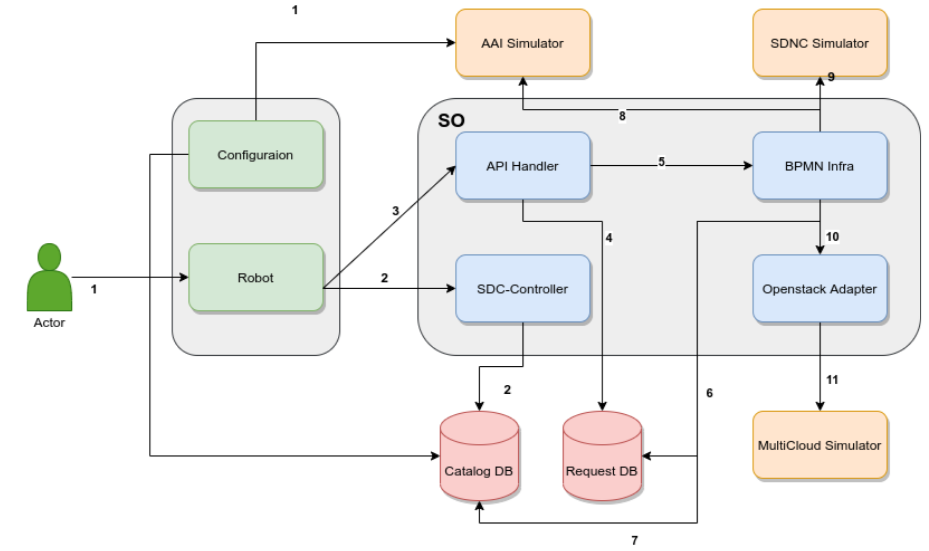

.. This work is licensed under a Creative Commons Attribution 4.0 International License.
.. http://creativecommons.org/licenses/by/4.0
.. Copyright 2022 Huawei Technologies Co., Ltd.

SO CSIT (Macroflow)
========================

Ensure you have a healthy ONAP Deployment running. The following components will be required/used as part of this guide:

- SO
- SDC
- AAI
- DMAAP
- SDNC
- MultiCloud

What is Macroflow?
------------------

The SO building blocks are a set of database-driven, configurable and generic process steps to be leveraged through several actions defined as 'Macro' flows. For each of the macro flows, there are a set of actions to be performed which are implemented as building blocks - which then implement generic logic to handle the orchestration of services and various type of resources orchestrated by ONAP, as well as their corresponding actions.

**Macroflow** method allows the user to build and send only one request to instantiate all objects : Service, VNFs, VFModules and Networks.

How to run CSIT Macroflow?
--------------------------

The follow steps are to be installed and run on an Ubuntu 18.04 (desktop) installation.
Later versions of Ubuntu and Java may work for the tests.

**Prerequisite:**
Install Java 11, Maven, docker, docker-compose

Following steps need to be followed to run the CSIT Macroflow:

First pull the CSIT repo from Gerrit, either with or without the hooks

… code-block::

    git clone "https://gerrit.onap.org/r/integration/csit"

or

.. code-block::

    git clone "https://gerrit.onap.org/r/integration/csit" && (cd "csit" && mkdir -p .git/hooks && curl -Lo `git rev-parse --git-dir`/hooks/commit-msg https://gerrit.onap.org/r/tools/hooks/commit-msg; chmod +x `git rev-parse --git-dir`/hooks/commit-msg)
    
Once this is downloaded a few more installations are required.

Install pip (if required)

.. code-block::

    sudo apt install python-pip

Install Robot Framework through pip

.. code-block::

    pip install robotframework

Run Script

Once all of this is done, then the tests should be run by calling the run-csit.sh script and giving it the location of our test folder (csit/plans/so/macroflow).

From the csit projects root folder run the following command:

.. code-block::
    
    ./run-csit.sh plans/so/macroflow
    
This should successfully run the CSIT Macroflow

The run-csit.sh will automatically set up a Robot environment for you, and execute the test plan defined in the plans/so/macroflow directory.

If you look at the contents of the plans/so/macroflow you will see the following:

**setup.sh:** the shell script that starts all the necessary docker containers required by this test plan, as well as passing the necessary environment variables to Robot.
**testplan.txt:** the text file listing, in order, the test suites that should be executed by Robot for this particular test plan. This allows you to refactor test suites to be reused by multiple test plans as necessary.
**teardown.sh:** the shell script that kills all the docker containers that were started by this test plan.
**docker-compose.yml:** This lists all the requrired docker.

How to run tests against specific SO versions
---------------------------------------------
It is possible to run the CSIT Macroflow suite against local docker images although it is not the default. Through this method specific versions of SO can be tested.

There are two changes required to make this work.

1. The env file, located at [containing folder]/csit/plans/so/macroflow/config/env, first needs to be changed. The DOCKER_ENVIROMENT needs to be changed from "remote" to "local". Also the TAG value might need to be changed. This Tag relates to the version of images being used. Make sure the cnf-adapter image version also need to be changed here.

2. Secondly all of the required docker images must be present on system.

This should be enough to run the CSIT Macroflow test suite locally.

CSIT Macroflow Tests High Level Scenarios
-----------------------------------------

**Step 1:**

Perform Configuration / Setup Steps prior to running tests

**Step 2:**

Onoboard the Macroflow Csar Package to complete the distribution from sdc-controller. This will be done by RoboFramework itlself. ASDC saves both heat and helm info into mso catalogdb.

**Step 3:**

Once the distribution done, next Instantiation will be executed for Macrolfow. RoboFramework is used to trigger the Instantiation flow. In this case, API handler receives the call and fetches required information from mso catalogdb.

**Step 4:**

Bpmn-Infra is called and fetches required information from mso catalogdb and executes all the selected building blocks which will call cnf-adapter or openstack adapter on the basis of usecase whether it is Macroflow Heat or Macroflow Helm.

**Step 5:**

Bpmn-Infra also fetches and updates Action infromation to the AAI-Simulator and SDNC-Simulator

**Step 6:**

Cnf-Adapter will then call to Multicloud (Multicloud-Simulator) and complete the Execution of Macroflow.

Follow the diagram in the image below to understand the step

What are the tests doing?
-------------------------
There are three tests currently being run "Distribute Service Template", "Invoke Service Instantiation".

**Distribute Service Template**

As the name would suggest the aim for the "Distribute Service Template" test is to distribute a service template within the SDC controller pod. Once a http session of the SDC controller is created a post request can be made to it. This post requests sends binary data from "serviceBasicVfCnfnotification.json" for Macroflow heat and "serviceBasicVfCnfWithHelm.json" for Macroflow helm. These json files contain the information of resources and artifacts required to distribute a service. These json file gather information from the Csar package which resides in the plans/so/macroflow/config/distribution-test-zip directory. Once this post request is sent, the response status code is checked to see if it is 200. If the code is not equal to 200 then the test is thought to be a failure.

**Invoke Service Instantiation**

The aim of the "Invoke Service Instantiation" test is to invoke the service distributed to the sdc controller in the previous test. A http session of the api handler pod is created. This session is sent a post request containing "macroflow.json" for Macroflow heat and "MacroflowWithHelm.json" for Macroflow helm. Once these request are made the response is checked if it a valid code is returned.  A for loop is used to continually make calls to check the orchestration request for both the request, to check the status of service instantiation. Only once this orchestration returns either a fail or success, will we break out of the for loop. Once outside the for loop a final statement is used to check if service has been successfully instantiated.

Troubleshooting
---------------
There are a number of simple issues relating from Python and its libraries

A correct installation of the robot framework to run our tests requiring python and the following pip libraries.

- robotframework
- robotframework-extendedselenium2library
- robotframework-httplibrary
- robotframework-onap
- robotframework-requests
- robotframework-selenium2library

To make sure each of the previous libraries is installed run the following command

.. code-block::

    pip -list
