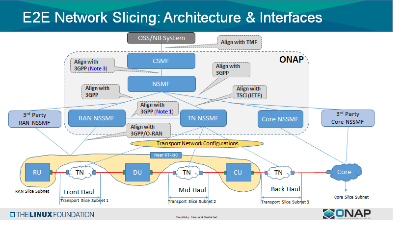
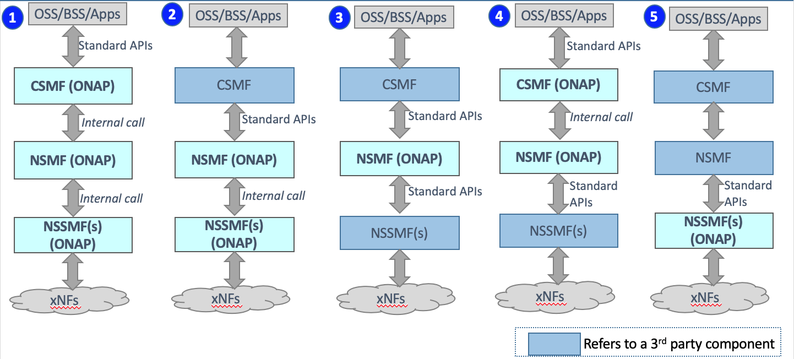
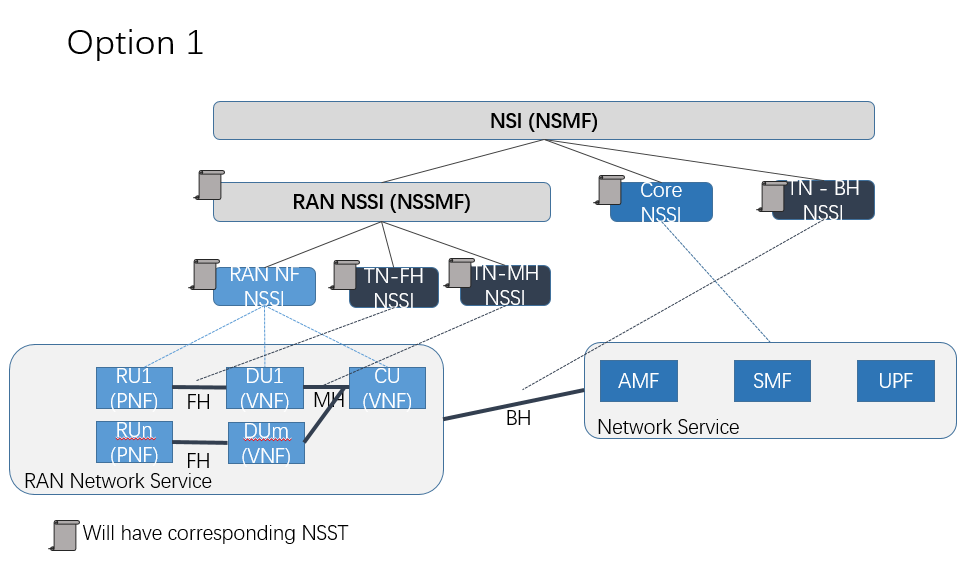
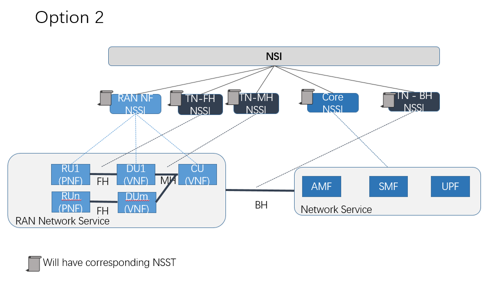

.. This work is licensed under a Creative Commons Attribution 4.0 International License.
.. http://creativecommons.org/licenses/by/4.0
.. Copyright 2021 Wipro Ltd.

E2E Network Slicing
===================
The objective of this use case is to realize **End-to-End 5G Network
Slicing** using ONAP. An End-to-End Network Slice consists of RAN (Radio
Access Network), Transport Network (TN) and Core Network (CN) slice
sub-nets. This use case intends to demonstrate the modeling,
orchestration (life cycle and resources) and assurance of a network
slice which are implemented in alignment with relevant standards.

Overall High level view for ONAP-based Slice Management
=======================================================

Architecture Choice
-------------------

3GPP(TS 28.801) defines three layer slice management functions which include:

CSMF(Communication Service Management Function):

- Responsible for translating the communication service related requirement to network slice related requirements.

- Communicate with Network Slice Management Function (NSMF).

NSMF(Network Slice Management Function):

- Responsible for management and orchestration of NSI.

- Derive network slice subnet related requirements from network slice related requirements.

- Communicate with the Network Slice Subnet Management Function (NSSMF) and Communication Service Management Function.

NSSMF(Network Slice Subnet Management Function):

- Responsible for management and orchestration of NSSI.

- Communicate with the NSMF.

To realize the three layers of the slice management function, we need to decide whether to implement CSMF, NSMF or NSMF within ONAP, or use the external CSMF, NSMF or NSSMF. This implies that for ONAP-based network slice management, we have different choices from an architectural perspective:

1. Implement CSMF, NSMF, NSSMF all within ONAP;

2. Connect an external CSMF from the Northbound, Implement NSMF and NSSMF within ONAP;

3. Connect an external CSMF from the Northbound, Implement NSMF within ONAP, Connect a 3rd party NSSMF from the Southbound;

4. Implement CSMF, NSMF within ONAP, Connect a 3rd party NSSMF from then Southbound.

5. Use external CSMF and NSMF, only implement NSSMF within ONAP.

Slice Management Functions - Realization in SO
----------------------------------------------

- CSMF and NSMF is realized within ONAP (enhancement in Frankfurt functionality), and the NB interfaces is standardized using ExtAPI.

- All 3 NSSMFs shall be realized within ONAP (From Guilin).

- ONAP acting as NSMF shall also interact with external RAN and Transport NSSMF using 3GPP APIs

- CSMF reliazed within SO receives service requirements from EXT-API, which translates service requirements to slice profile(NST selection) and sends request to NSMF for slice allocation.

- NSMF reliazed within SO receives request for slice allocation (slice profile, S-NSSAI, NST) and determines slice instantiation/modification (with OOF) to fulfil the slice allocation request.

- NSSMF reliazed within SO receive information from NSMF & trigger RAN/Core/Transport NSSMF for orchestration actions.

Network Slice Instance (NSI) Life Cycle View
--------------------------------------------

Design and pre-provision: Creation of necessary slice/slice sub-net templates. Creation, activation, deactivation and termination of NSI, including its constituent slice sub-nets (RAN, Core   and Transport)

3GPP Specification (3GPP TS 28.530) describes management aspects of a Network Slice Instance, which can be described by the four phases:

Preparation: The preparation phase includes network slice design, network slice capacity planning, on-boarding and evaluation of the network functions, preparing the network environment and   other necessary preparations required to be done before the creation of an NSI

Commisioning: NSI provisioning in the commissioning phase includes creation of the NSI. During NSI creation all needed resources are allocated and configured to satisfy the network slice      requirements. The creation of an NSI can include creation and/or modification of the NSI constituents

Operation: The Operation phase includes the activation, supervision, performance reporting (e.g. for KPI monitoring), resource capacity planning, modification,and de-activation of an NSI.

Decommissioning: Network slice instance provisioning in the decommissioning phase includes decommissioning of non-shared constituents if required and removing the NSI specific configuration   from the shared constituents. After the decommissioning phase, the NSI is terminated and does not exist anymore. The ONAP-based NSI lifecycle management will finally provide the demonstration of all these phases.

The ONAP-based NSI lifecycle management will finally provide the demonstration of all these phases.

Support for Option1 &Option2 in E2E Network Slicing
---------------------------------------------------

ONAP E2E Network Slicing option 1 and 2 differs on the RAN and FH/BH relationship.

- In option 1, RAN NSSMF will decide FH/MH requirements and send to TN side, so RAN NSST will nest FH/MH NSST, and slice profile requirements will contain not only RAN side requirements but also FH/MH.

Template design for option 1: https://wiki.onap.org/display/DW/Template+Design+for+Option+1

- In option 2, FH and MH are independent requirments when doing E2E requirements decomposition. Detailed background of option 1 and 2, please see  E2E Network Slicing Use Case in R7 Guilin.

Template design for option 2: https://wiki.onap.org/display/DW/Template+Design+for+Option2

3 domain combination solution -Endpoint
---------------------------------------
In order to enable 3 subnet connectivity, making end-to-end forwarding and control plane interacting, in slicing services, we need slicing interworking identifier and information to tell how  RAN and Core connect with TN. Slicing interworking identifier(in ONAP is vlan Id, allocated by NSMF) is used to isolate differerent service datas, and identify the unique slicing service      across RAN, TN and Core, 1 S-NSSAI will need to be assigned with 1 slicing interworking identifier(vlan Id). The slicing interworking information is used as bridges to connect RAN/Core and TN,it should be RAN/Core side outgress and TN ingress, like port, ipAddress, next hops and etc.
