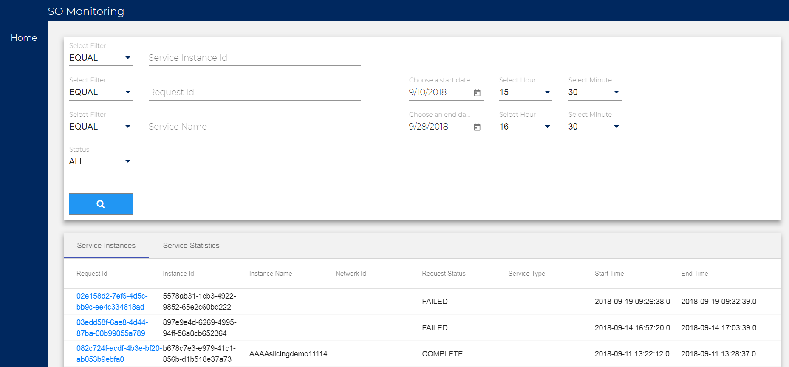
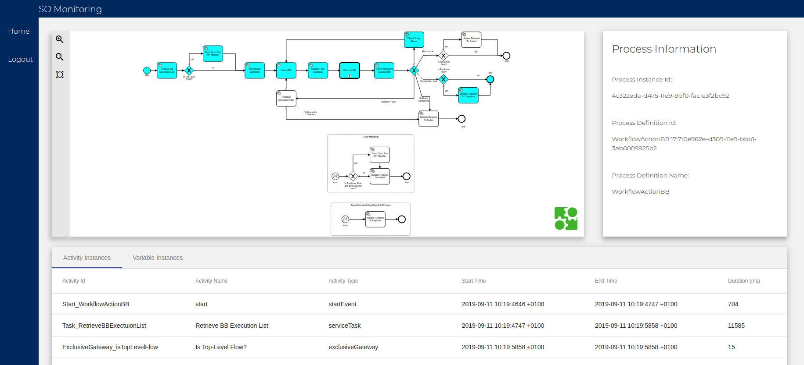
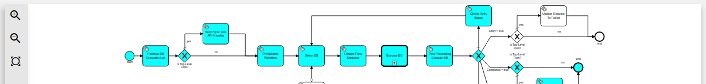
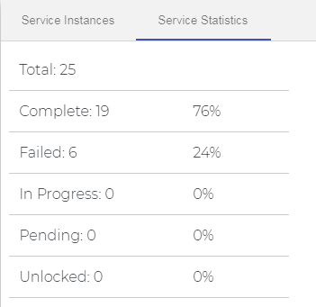
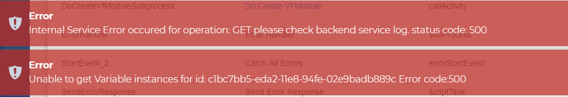

SO Admin Cockpit User Guide
===========================

Introduction
------------

The SO-Admin-Cockpit component allows a user to have a detailed monitoring view of the Camunda BPMN workflows that have run, or are running, in SO. It provides a frontend UI that allows users to easily go through a workflow’s different calls and drill up/down through the call activities within the workflow. It also provides a search page for filtering specific results. It allows you to filter by start/end time/date, instance id, request id, service name or by the status of a workflow. The component is extremely useful for debugging and testing workflows of any kind, as it delivers an understandable and simple UI which is much easier to follow than large, cumbersome debug log files. Additionally the UI provides a statistics page, based on your current search parameters, that provides the percentages of complete, failed, in progress, pending and unlocked workflows.

(Previous to the Honolulu release of ONAP SO-Admin-Cockpit was named SO-Monitoring, an additional change in the controller is required to change the Host name to SO-Admin-Cockpit, as it remains as SO-Monitoring currently)

Using SO-Admin-Cockpit
----------------------

In order to make use of SO-Admin-Cockpit currently, you will need to onboard the application in the ONAP portal or access the SO-Admin-Cockpit UI directly. This can be done using the host name “so-admin-cockpit", and the port number, which by default is “30224”. First you need to make sure you can access the ONAP portal, this is done by adding the following to your "hosts" file:

.. code-block:: bash

 <onapVmIp> portal.api.simpledemo.onap.org

Replacing <onapVmIp> with the IP of your device hosting your Portal pod within ONAP. Add this to a blank line in your hosts file, usually found in “C:\Windows\System32\drivers\etc” on Windows. Ensure you open the host file as an administrator in order to edit it.

Alternatively you can access SO-Admin-Cockpit directly by simply adding the following line to your "hosts" file:

.. code-block:: bash

 <soAdminCockpitVmIp> so-monitoring

Where <soAdminCockpitVmIp> is replaced with the IP of the device hosting your SO-Admin-Cockpit pod.
Then accessing the following link through your browser:

.. code-block:: bash

 https://so-monitoring:30224/

Steps to add SO-Admin-Cockpit to the Portal
-------------------------------------------

In Pre-Casablanca releases you will need to expose the so-monitoring service using a Loadbalancer in order to access it, this is simple until there is a NodePort assigned to SO-Monitoring. Use this command to expose the service:

.. code-block:: bash

 kubectl expose services so-monitoring --type=LoadBalancer --port 9091 --target-port=9091 --name=so-monitoring-external -n onap

Log into your ONAP Portal as the super user

- Login: demo
- Password: demo123456!

Click “Application Onboarding”, then “Add App” in the top right.
Fill out the required Application Details (Name, URL, REST API URL, Username, Password) as shown here:

-        Application Name: SO-Admin-Cockpit
-        URL: https://so-monitoring:30224
-        Rest API URL: https://so-monitoring:30224
-        Username: demo
-        Password: <PASSWORD>
-        Namespace: SO-Admin-Cockpit

Please note, the <PASSWORD> can be retrieved by logging into the SO-Admin-Cockpit pod and retrieving the environment variables using the following command:

.. code-block:: bash

 env | grep SO_COCKPIT

Now simply go to the “Application Catalog” tab on the left of the page, then tick your Monitoring app to enable it. (Whatever you set Application Name as should show up here.) Click the “Home” tab and you should be able to access the Admin Cockpit now.

Searching/Viewing BPMN Workflows
--------------------------------

In order to find the workflow that you are attempting to monitor you will need at least one of the following values of the service instance: Service Instance ID, Request ID, Service Name or the time/date range in which the workflow started/ended. You can use the filter drop-down boxes to the left of the parameter boxes, i.e. “EQUAL”, “NOT EQUAL” and “LIKE”. Also, you can filter by the status of a workflow, with the status drop-down box, to further filter your results. Simply enter any of these pieces of information into the search page, ensure the start and end date range includes when the workflow would have run and press the search button. Once your results list has been returned you can click on a result to see the workflow in the graphical BPMN viewer.

From here you can inspect the different calls and variables throughout the workflow, by using the "Activity Instances" and "Variable Instances" tabs. Clicking on one of the sub process call, within the diagram, to open them in the graphical BPMN viewer (The boxes with a + at the bottom of them are call activities to sub processes. This is how you drill down through a workflow, you can also safely traverse back “up” through the flows with your browser’s back button. The cyan highlighting shows the flow of the path taken by the workflow, and this will go down through each of the sub processes as well.

In the BPMN viewer, manipulation of the returned illustrated flow is possible by using the following methods. On the left side of the viewer window there are three symbols for Zooming in/out and fitting the flow to the full window. Along with these controls, the user can left-click and drag to move the flow within the canvas to the user desired position.

SO-Monitoring Service Statistics
--------------------------------

You can see a summary of the status of all of the workflows from one of your search results by clicking on the "Service Statistics" tab, found just above your list of results. Here you can find a percentile breakdown of each workflow's, in the list of results you received, statuses.

Troubleshooting SO-Admin-Cockpit
--------------------------------

The log files for SO-Admin-Cockpit can be found within the SO-Admin-Cockpit pod. They will be located in the “/app/logs/so-admin-cockpit" directory. You will find a debug, error, metric and audit log file here. They each contain differing information, except the debug log file which will contain all of the logging information. Alternatively you can get the logs from the SO-Admin-Cockpit pod itself when using Kubernetes. Using the following command:

.. code-block:: bash

 kubectl -n <namespace> logs <soAdminCockpitPodName>

Replacing <namespace> with your environments namespace and <soAdminCockpitPodName> with the full name of your SO-Admin-Cockpit pod. This command will give you some detailed information from the execution of the pod.

CORS (Cross-Origin Resource Sharing) Error
------------------------------------------

Pre-Dublin SO-Monitoring Components may experience CORS issues.

To check for this error open up the console of the browser you are using. In Mozilla Firefox do this by pressing CTRL + SHIFT + C and then selecting the console. In Google Chrome this is done by CTRL + SHIFT + I and then selecting the console. If an exception relating to CORS is displayed, then this issue must be addressed.

This can be dealt with in two ways. Either using an extension or by disabling CORS in the browser.

- If using Firefox then the CORS Everywhere extension should be used. While if using Chrome the Allow-Control-Allow-Origin should be used.
- To disable the CORS in Chrome, follow this thread (https://stackoverflow.com/questions/3102819/disable-same-origin-policy-in-chrome).

Internal Service Error occurred for operation : GET please check backend  service log. status code: 500
-------------------------------------------------------------------------------------------------------

This can be checked by following the below steps:

- Open the developers mode in your browser
- Click on Console
- Check to see if an error occurs similar to the following:

.. code-block:: bash

 Error : No serializer found for class org.onap.so.bpmn.core.RollbackData and no properties discovered to create BeanSerializer

This issue could be associated with any one of the objects being used in the BPMN flows, when it's declared as a java object but attempted to be serialized without marking/declaring it as serializable. So the issue must be fixed at the Object level, by ensuring any objects used by the particular BPMN Flow are made serializable.

SO Admin Cockpit App creates a Blank Tab
----------------------------------------

If when selecting SO Admin Cockpit from the portal a blank tab labeled “SO Admin Cockpit" is returned, then the issue may relate the URL you are using in portal by default.

A fix for this issue is to change “https” to “http” and change the port from “30224” to “30215”, within the browser URL.

For example, using this URL:

.. code-block:: bash

 http://portal.api.simpledemo.onap.org:30215/ONAPPORTAL/applicationsHome

Instead of the default URL:

.. code-block:: bash

 https://portal.api.simpledemo.onap.org:30225/ONAPPORTAL/applicationsHome

