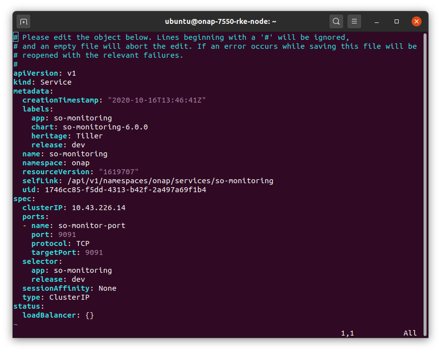
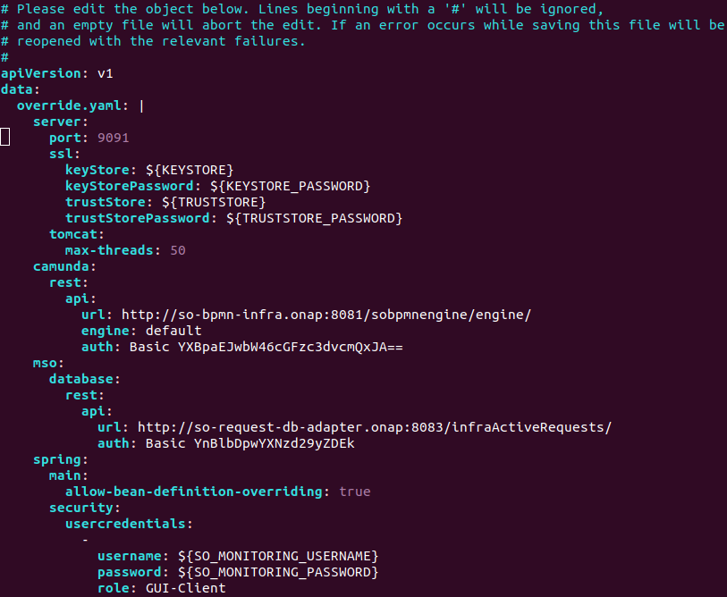
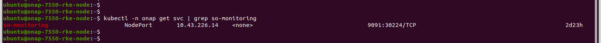
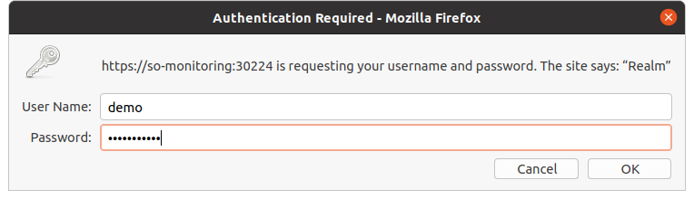

.. This work is licensed under a Creative Commons Attribution 4.0 International License.
.. http://creativecommons.org/licenses/by/4.0
.. Copyright 2017 Huawei Technologies Co., Ltd.

Working with SO Monitoring
==========================

After the SO code is fully deployed, certain changes needs to be made in order to access the so-monitoring ui.

1. Change the service type to NodePort
---------------------------------------

By default, the type of the so monitoring service is ClusterIP, which makes the Service only reachable from within the cluster.
This is changed to NodePort, which is used to expose the service at a static port . Hence we will be able to contact the NodePort Service, from outside the cluster, by requesting <NodeIP>:<NodePort>.

Command used to get the service configuration of so monitoring is:

**sudo kubectl edit svc so-monitoring -n onap**

2. Add the credentials to login
--------------------------------

The override.yaml needs to be added with the login credentials, that is the username and the password in encrypted form.

.. code-block:: bash

 spring:
   main:
     allow-bean-definition-overriding: true
   security:
     usercredentials:
     -                                         
       username: gui
       password: '$2a$10$Fh9ffgPw2vnmsghsRD3ZauBL1aKXebigbq3BB1RPWtE62UDILsjke'
       role: GUI-Client

This override.yaml can be directly edited in case of local setup using docker.

When deploying in any environment  using OOM, then after deployment the configmap needs to be edited. As configmap is the one reading the override.yaml.

**Note** : Before deployment , if we add these changes in override.yaml ,then it may give parsing error in configmap while deployment. And after deployment the permissions on override.yaml don't allow us to edit it. So the best option is to edit the configmap using the below command and restart the pod. 

**kubectl -n onap edit configmap dev-so-monitoring-app-configmap**

Special care needs to be given to the indentation. spring needs to be inline with the mso already present and others added accordingly.

3. Login to SO Monitoring
-------------------------

We need to first identify the external port which its mapped to using the following command : 

**sudo kubectl -n onap get svc | grep so-monitoring**

Then access the UI of so monitoring , for example by  http://<IP>:30224/ 

username : gui,
password: password1$

