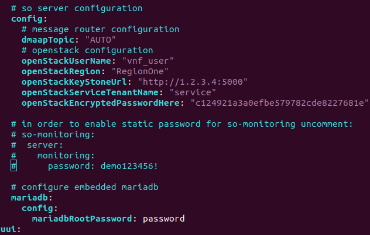
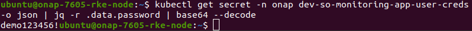
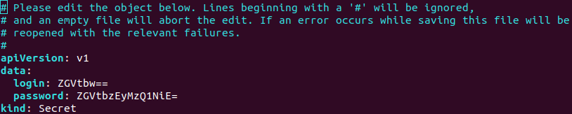

.. This work is licensed under a Creative Commons Attribution 4.0 International License.
.. http://creativecommons.org/licenses/by/4.0
.. Copyright 2017 Huawei Technologies Co., Ltd.
.. Modifications Copyright (c) 2020 Nokia

Working with SO Monitoring
==========================

Starting from Guilin release SO Monitoring uses https and NodePort service during communication with operator.
Certificates used for communication are generated automatically using AAF and certInitializer, when SO Monitoring 
is deployed using OOM. For that reason, no additional tasks are needed in order to access the SO Monitoring ui, 
when the SO is fully deployed. 

SO Monitoring contains also pre-installed certs which can be used in local development environment. **They are 
for development purpose only!**

1. Credentials to login and initial setup
---------------------------------------------

Defalut credentials and certs of SO Monitoring, if you want to develop SO Monitoring out of ONAP cluster,
are stored in the app. Credentials are as follows:

.. code-block:: bash

 spring:
   main:
     allow-bean-definition-overriding: true
   security:
     usercredentials:
     -                                         
       username: demo
       password: '$2a$10$ndkDhATUid4a3g0JJVRv2esX4rtB.vzCn7iBhKyR1qZ/wDdvNzjTS'
       role: GUI-Client

Username - demo. Password (**demo123456!**) is bcrypted.

This setup is overridden by the override.yaml file which is stored in the OOM project.
Override.yaml file can be edited directly in case of local ONAP setup. This file is loaded into
container through configmap.

.. note::
 If you want to change config stored in override.yaml on working deployment, you have to edit k8s
 configmap. Due to insufficient permissions it is not possible directly in the container. After that pod have 
 to be restarted.

.. code-block:: bash
 kubectl -n onap edit configmap dev-so-monitoring-app-configmap

.. image:: ../images/configmap.png

Special care needs to be given to the indentation. Spring needs to be inline with the mso already present and others
added accordingly.

.. warning::
Attention! The default setup of the OOM makes SO Monitoring password is being automatically generated during ONAP
deployment and injected through k8s secret

2. Setup, retrieve and edit default SO Monitoring password
----------------------------------------------------------

Automatic generation of password for SO Monitoring during ONAP deployment can be overriden. In result, password 
can be set up manually. Such case requires to edit ONAP config file, template of which is stored in  
**oom/kubernetes/onap/values.yaml** file. 

Following lines presented in fig. has to be uncommented.

If customized file is used, following code has to be paste under the SO config (be aware of indentation):

.. code-block:: bash

 so:
   ...
   so-monitoring:
     server:
       monitoring:
         password: demo123456!
   ...

Alternative way (**not recommended**) is to add password entry in the **oom/kubernetes/so/components/so-monitoring/values.yaml**

.. code-block:: bash

 ...
 server:
   monitoring:
     password: demo123456!
 ...

To retrieve actual password for SO Monitoring on existing ONAP install, run the following command:

.. code-block:: bash

 kubectl get secret -n onap dev-so-monitoring-app-user-creds -o json | jq -r .data.password | base64 --decode

To change actual password on existing ONAP install, **dev-so-monitoring-app-user-creds** secret has to be modified.

.. code-block:: bash

 kubectl edit secret -n onap dev-so-monitoring-app-user-creds

Edit password entry, which has to be given in base64 form. Base64 form of password can be obtained by running:

.. code-block:: bash
 
 echo 'YOUR_PASSWORD' | base64

.. image:: ../images/so-monitorring-base64-password.png

Once, password was edited, pod has to be restarted.

3. Login to SO Monitoring
-------------------------

Identify the external port which is mapped to SO Monitoring using the following command. The default port is 30224 :

.. code-block:: bash

 sudo kubectl -n onap get svc | grep so-monitoring

.. image:: ../images/nodemap.png

Then access the UI of SO Monitoring, by default https://<k8s-worker-ip>:30224/

.. image:: ../images/ui.png

4. Hiding the SO Monitoring service (ClusterIP)
---------------------------------------

The SO Monitoring service is set to the NodePort type. It is used to expose the service at a static port.
Hence there is possibility to contact the NodePort Service, from outside cluster, by requesting <NodeIP>:<NodePort>.

In order to make the service only reachable from within the cluster, ClusterIP service has to be set.

Command used to edit the service configuration of SO Monitoring is:

.. code-block:: bash

 sudo kubectl edit svc so-monitoring -n onap

.. image:: ../images/nodeport.png
