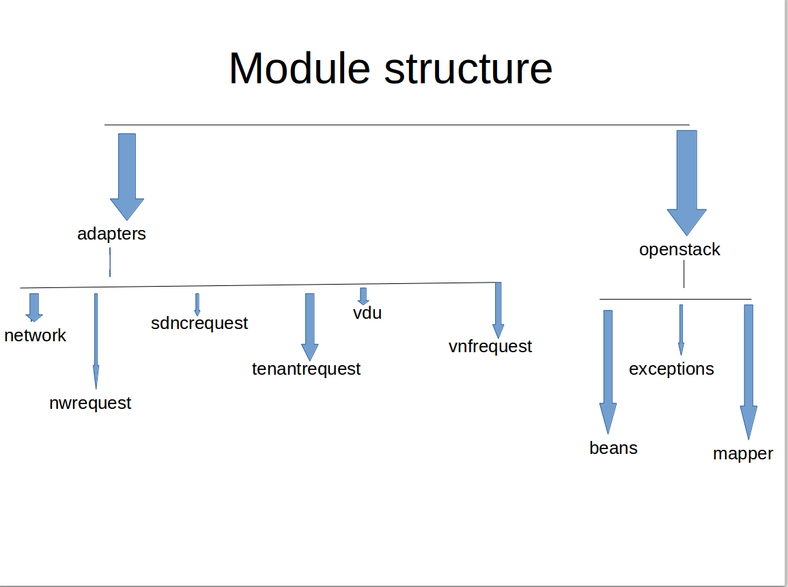
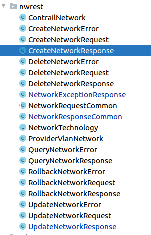
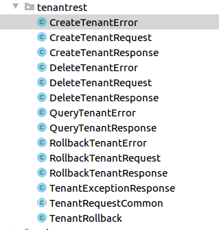
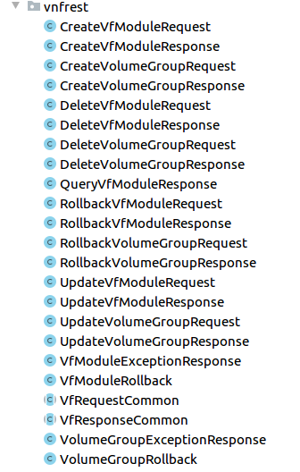
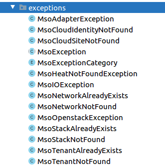

Mso-adapters-rest-interface
---------------------------

It mainly contains the payload that is provided to different rest calls in SO

Network
--------
# 1. Network contain beans( classes with multiple attributes and thier setters and getters) and their corresponding mappers which will be used by the network adapter of  SO. Contrail networking is used for cloud network automation

Beans
-----
 # a. ContrailPolicyRef : this class has following attribute 	
       private ContrailPolicyRefSeq seq;

       Usage: adapters/mso-openstack-adapters/src/main/java/org/onap/so/adapters/network/MsoNetworkAdapterImpl.java- while creating network in openstack,  network stack is created depending on stackParams. So if pFqdns(FQDN address object is used in order to use DNS names in firewall policies) are there in the inputrequest to createNetwork, then mergePolicyRefs method is called, where for each input pFqdns, a new ContrailPolicyRef is created and appended to a list. Then this is added as value to stackParams with policy_refsdata as key.

 # b. ContrailPolicyRefSeq : Attributes are
   private String major;

   private String minor ;

   Usage: adapters/mso-openstack-adapters/src/main/java/org/onap/so/adapters/network/MsoNetworkAdapterImpl.java- As this is an attribute to the ContrailPolicyRef explained above. So when a new ContrailPolicyRef() is created in mergePolicyRefs method, correspondingly a new ContrailPolicyRefSeq should be created.

 # c. ContrailSubnet – Its a subnetwork having attributes 
    private ContrailSubnetIp subnet = new ContrailSubnetIp();

    private String defaultGateway;

    private String subnetName;

    private Boolean enableDhcp(dynamic host config);

    private Boolean addrFromStart = true;

    private List<ContrailSubnetPool> allocationPools = new ArrayList<>();

    private ContrailSubnetHostRoutes hostRoutes = new ContrailSubnetHostRoutes();

    Usage : adapters/mso-openstack-adapters/src/main/java/org/onap/so/adapters/network/MsoNetworkAdapterImpl.java- While creating network mergeSubnetsAIC3 is called if a list of subnets are present. The subnets are mapped to ContrailSubnet using ContrailSubnetMapper, and then are added to the heat template and stackparams which are used for network creation in openstack.

 # d. ContrailSubnetHostRoute : This is an attribute defined in contrailsubnet and has following attributes
    private String prefix;

    private String nextHop; 

    Usage : This is an attribute of ContrailSubnetHostRoutes , which is used within the contrailSubnet and thus is used in network creation and updation.

 # e. ContrailSubnetHostRoutes : This class is used to store an list of ContrailSubnetHostRoute 

    private List<ContrailSubnetHostRoute> hostRoutes = new ArrayList<>();

    Usage : attribute of contrailSubnet

 # f. ContrailSubnetIp : attributes are
     private String ipPrefix;

     private String ipPrefixLen; 
 
     This class is used to store the cidr value , which is used as a interrouting table, taking as ipaddress/total no . Eg : 10.0.0.0/24 means starting ip is 10.0.0.0, and total no of ip address possible here is 256 (2^(32-24)), the last address being 10.0.0.255.

     Usage : important attribute of contrailSubnet

 # g. ContrailSubnetPool : attributes are starting and ending ip address of the subnet
    private String start;

    private String end;

    Usage: a list of ContrailSubnetPool forms an important attribute of contrailSubnet

Mappers
-------

 # a. ContrailSubnetMapper : It is used to map the inputsubnet to a contrailSubnet
   public ContrailSubnetMapper(Subnet inputSubnet) {
        this.inputSubnet = inputSubnet;

    }

   The map method within is used for the mapping. Here first a contrailSubnet is created, and depending on whether the subnet has name or id, the contrailSubnet’s name is initialized, then if it has cidr , then a contrailSubnetIp is created, and is added into it, which is then added to contrailSubnet created before. Depending on whether input has allocationpool or hostroutes, these are casted into ContrailSubnetPool and ContrailSubnetHostRoute using ContrailSubnetPoolMapper and ContrailSubnetPoolMapper respectively.

   Usage: adapters/mso-openstack-adapters/src/main/java/org/onap/so/adapters/network/MsoNetworkAdapterImpl.java :The subnets are mapped to ContrailSubnet using ContrailSubnetMapper, and then are added to the heat template and stackparams which are used for network creation

 # b. ContrailSubnetPoolMapper : It is used to map the pool within the subnets to contrailSubnetPool. Used within contrailSubnetMapper. Here, the particular pool is added only if it has both the start and end ip address. 

 # c. ContrailSubnetHostRoute : It is used to map the host routes within the subnets to contrailSubnetHostRoute. Used within contrailSubnetMapper. Here, the particular host route is added if either of the next hop or ip prefix is defined.

Network request
---------------

#2. Network request : It contains the payloads for different types of network requests

 # a. ContrailNetwork :
    private String shared = "false";

    private String external = "false";

    private List<RouteTarget> routeTargets;

    private List<String> policyFqdns;

    private List<String> routeTableFqdns;

    Usage: contrailNetwork is an important attribute of CreateNetworkRequest, So is to be used where all the request to createNetwork is required.

  # 1. adapters/mso-openstack-adapters/src/main/java/org/onap/so/adapters/tasks/orchestration/StackService.java : Here the input to createNetwork requires contrailNetwork parameter, so here it checks whether  contrailNetwork is already present, if not a new is created.

  # 2.bpmn/so-bpmn-tasks/src/main/java/org/onap/so/client/adapter/network/mapper/NetworkAdapterObjectMapper.java : Here in createNetworkRequestMapper, createNetworkRequest is formed where in buildContrailNetwork, a new contrailNetwork is created and initialized. This request is used to create a network and set the corresponding execution variable   

 # b. CreateNetworkError: It extends NetworkExceptionResponse. And is used when an error occurs during network creation

 # c. NetworkExceptionResponse : it extends NetworkResponseCommon. Attributes are 
    private String message;

    private MsoExceptionCategory category;

    private Boolean rolledBack; 

 # d. NetworkResponseCommon: Attribute is 
    private String messageId; 

 # e. CreateNetworkRequest: extends NetworkRequestCommon
    private String cloudSiteId;

    private String tenantId;

    private String networkId;

    private String networkName;

    private String networkType;

    private String networkTypeVersion;

    private String modelCustomizationUuid;

    private String networkTechnology = "NEUTRON";

    private List<Subnet> subnets;

    private ProviderVlanNetwork providerVlanNetwork;

    private ContrailNetwork contrailNetwork;

    private Boolean failIfExists = false;

    private Boolean backout = true;

    private Map<String, String> networkParams = new HashMap<>();

    private MsoRequest msoRequest = new MsoRequest();

    private boolean contrailRequest;

    Usage :
    #1) bpmn/so-bpmn-tasks/src/main/java/org/onap/so/bpmn/infrastructure/aai/tasks/AAIQueryTasks.java:  Here in getNetworkVpnBinding, where VPN Binding data from AAI result is extracted. There in routeTargets is got, and is updated in the execution variable(“createNetworkRequest”).

    #2)bpmn/so-bpmn-tasks/src/main/java/org/onap/so/bpmn/infrastructure/adapter/network/tasks/NetworkAdapterCreateTasks.java – Here in createnetwork returns a CreateNetworkRequest which is updated in execution variable(“networkAdapterRequest”)

    #3)bpmn/so-bpmn-tasks/src/main/java/org/onap/so/bpmn/infrastructure/flowspecific/tasks/CreateNetwork.java - 
    Here in createnetwork returns a CreateNetworkRequest which is updated in execution variable(“createNetworkRequest”)

    #4) bpmn/so-bpmn-tasks/src/main/java/org/onap/so/client/adapter/network/NetworkAdapterClientImpl.java -Here createNetwork request is processed as a restclient post process with CreateNetworkRequest as input.

 # f. CreateNetworkResponse : extends NetworkResponseCommon
    private String networkId;

    private String neutronNetworkId;

    private String networkStackId;

    private String networkFqdn;

    private Boolean networkCreated;

    private Map<String, String> subnetMap;

    private NetworkRollback rollback = new NetworkRollback();

    Usage:
    #1)bpmn/so-bpmn-tasks/src/main/java/org/onap/so/bpmn/infrastructure/aai/tasks/AAIUpdateTasks.java :here after the network is created, the l3 network is updated with those parameters which come from execution variable("createNetworkResponse")

    #2)bpmn/so-bpmn-tasks/src/main/java/org/onap/so/bpmn/infrastructure/adapter/network/tasks/NetworkAdapterCreateTasks.java – depending on variable networkCreated of response, networkAdapterCreateRollback is set to true. 

    #3)bpmn/so-bpmn-tasks/src/main/java/org/onap/so/client/adapter/network/NetworkAdapterClientImpl.java -Here createNetwork request is processed as a restclient post process with CreateNetworkRequest as input and CreateNetworkResponse as output 

 # g.DeleteNetworkError : extends NetworkExceptionResponse

 # h. DeleteNetworkRequest:extends NetworkRequestCommon
    private String cloudSiteId;

    private String tenantId;

    private String networkId;

    private String networkStackId;

    private String networkType;

    private String modelCustomizationUuid;

    private MsoRequest msoRequest = new MsoRequest();

    Usage: 
    #1)bpmn/so-bpmn-tasks/src/main/java/org/onap/so/bpmn/infrastructure/adapter/network/tasks/NetworkAdapterDeleteTasks.java – deleteNetworkRequestMapper returns a DeleteNetworkRequest, which is set to the execution variable(“networkAdapterRequest”)

    #2)bpmn/so-bpmn-tasks/src/main/java/org/onap/so/client/adapter/network/NetworkAdapterClientImpl.java - Here deleteNetwork request is processed as a restclient delete process with DeleteNetworkRequest as input.

    #3)bpmn/so-bpmn-tasks/src/main/java/org/onap/so/client/adapter/network/mapper/NetworkAdapterObjectMapper.java – Here the deleteNetworkRequestMapper forms DeleteNetworkRequest object 

  Similarly others are also implemented and used
 

Sdnc request
------------

#3. Sdnc request -These are required by the mso-sdnc-adapter

 # a. RequestInformation – This is an important parameter of SDNCServiceRequest. Thud is used during the conversion of SDNCServiceRequest to XMLstring.

 # b. ServiceInformation – This stores the important information like serviceId, servicetype and SubscriberName. Its parameter of SDNCServiceRequest.

 # c. SDNCErrorCommon – it extends SDNCResponseCommon . 
 
  Usage : adapters/mso-sdnc-adapter/src/main/java/org/onap/so/adapters/sdnc/sdncrest/SDNCServiceRequestConnector.java – catching exception if any happens during request creation and a new SDNCErrorCommon is created.

 # d. SDNCRequestCommon – SDNCServiceRequest extends SDNCRequestCommon. It has some attributes like bpNotificationUrl(Endpoint on which BPMN can receive notifications from the SDNC adapter), bpTimeout ans sdncrequestId.

 # e. SDNCServiceRequest
  Usage: adapters/mso-sdnc-adapter/src/main/java/org/onap/so/adapters/sdnc/sdncrest/SDNCServiceRequestTask.java – Here the runRequest is happening, where we are posting this request using a restclient call with SDNCServiceRequest as input.

 # f. SDNCServiceResponse and SDNCServiceError 
  Usage:adapters/mso-sdnc-adapter/src/main/java/org/onap/so/adapters/sdnc/sdncrest/SDNCServiceRequestTask.java – Here if the above runRequest returns a 2xx response code then a corresponding SDNCServiceResponse is created and returned or else SDNCServiceError is created and returned

Tenant request
---------------

#4. These provide classes to be used by the so-adapters.tenant.

The operator of a cloud can present unchangeable networks to the users, or give users the option to create, delete, connect and generally manipulate networks. The latter type of networks is called “tenant networks”.

Used in adapters/mso-openstack-adapters/src/main/java/org/onap/so/adapters/tenant/TenantAdapterRest.java

The implementation and usage is similiar to the above classes

VDU
---

#5. Vdu – these are used for the deployment and management of (cloud-agnostic) VDU . The abstract classes for instantiation of vdu, query vdu, delete vdu, update vdu are defined in here.

These are implemented in adapters/mso-adapter-utils/src/main/java/org/onap/so/cloudify/utils/MsoCloudifyUtils.java and adapters/mso-adapter-utils/src/main/java/org/onap/so/openstack/utils/MsoHeatUtils.java

Vnfrest
-------

#6. Vnfrest – These are used to manage vnfs and vgs.
These are used in the project similiar to networkrest
Foreg : Usage of DeleteVfModuleRequest: 

1)bpmn/so-bpmn-tasks/src/main/java/org/onap/so/bpmn/infrastructure/adapter/vnf/tasks/VnfAdapterDeleteTasks.java – Here in deleteVfModuleRequestMapper creates a new DeleteVfModuleRequest, and is set to the execution variable(“VNFREST_REQUEST” ) and “deleteVfModuleRequest” execution variable is set true

2)bpmn/so-bpmn-tasks/src/main/java/org/onap/so/client/adapter/vnf/VnfAdapterClientImpl.java -  Here a delete rest request is send

OPENSTACK
---------
Openstack is classified into beans, exceptions, and mappers

MAPPERS
-------
 # 1) JAXBContext: It is used to convert a object to xml(marshalling) and to convert xml to object (unmarshalling) . These marshalling and unmarshalling are overriden in the map adapters in mappers.

 # 2)NetworkInfoMapper – used to Capture the data from a Neutron Network object and cast it into a networkInfo( present in beans of openstack). Here in vlan information is located depending on network.getProviderNetworkType() , and if not then the segments within the network is iterated and is checked for the same.
  Usage: It is used in adapters/mso-adapter-utils/src/main/java/org/onap/so/openstack/utils/MsoNeutronUtils.java , where on createNetwork, queryNetwork and updateNetwork , the network is mapped by  NetworkInfoMapper into networkInfo and returned.

 # 3) StackInfoMapper – used to Capture the data from a Stack object and cast it into a stackInfo( present in beans of openstack). 
  Usage: It is used in adapters/mso-adapter-utils/src/main/java/org/onap/so/openstack/utils , where all createStack, queryStack, updateStack, deleteStack is done, a new instance of stackInfo is returned

Exceptions
----------
These are set of msoexceptions provided, and would be used depending on what exception needs to be handled

