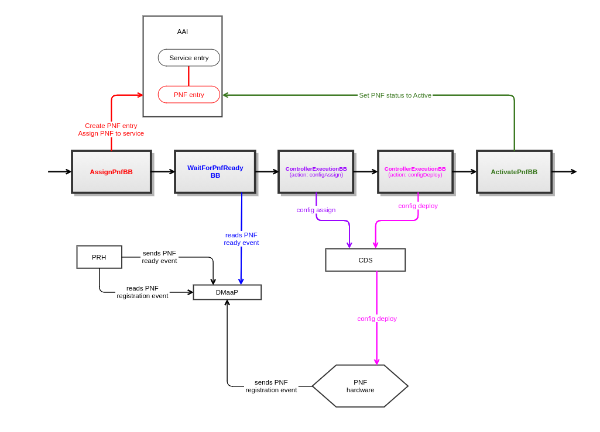

.. This work is licensed under a Creative Commons Attribution 4.0 International License.
.. http://creativecommons.org/licenses/by/4.0
.. Copyright 2021 NOKIA, Ltd.

Proposed building blocks
========================

AssignPnfBB
-----------

* Responsibility:

  * Creates PNF entry in AAI (with PNF name chosen by user)

  * Additionally stores PNF model-related parameters in AAI:
    * model-customization-id
    * model-invariant-id
    * model-version-id

  * Makes a link in AAI between Service entry and PNF entry

  * Sets PNF orchestration status in AAI to Assigned

* Currently implemented in CreateAndActivatePnfResource.bpmn

WaitForPnfReadyBB
-----------------

* Responsibility:

  * Waits for "PNF ready" event sent from PRH to DMaaP
    * pnfCorrelationId from the event must match PNF instance name provided by the user during service instantiation

  * Sets PNF orchestration status in AAI to:
    * Register - when starting to wait for PNF ready event
    * Registered - when PNF ready event is successfully received

  * Currently implemented in CreateAndActivatePnfResource.bpmn

Support for config assign (ControllerExecutionBB, action: configAssign)
-----------------------------------------------------------------------

* Responsibility:
  * Runs config assign via CDS

* Currently implemented in ConfigurePnfResource.bpmn

* We will reuse generic BPMN for calling CDS (ControllerExecutionBB)

* Things to consider:
  * SkipPostInstantiationConfiguration should be taken into account

Support for config deploy (ControllerExecutionBB, action: configDeploy)
-----------------------------------------------------------------------

* Responsibility:
  * Runs config deploy via CDS

* Currently implemented in ConfigurePnfResource.bpmn

* We will reuse generic BPMN for calling CDS (ControllerExecutionBB)

* Things to consider:
  * SkipPostInstantiationConfiguration should be taken into account

ActivatePnfBB
-------------

* Responsibility:
  * Sets PNF orchestration status in AAI as Active
